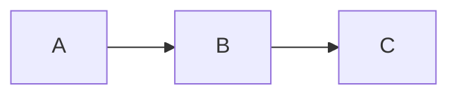

# Contributing to AI Search

Thank you for your interest in contributing! This project is an open educational resource for the **AI Search** course at IIT Madras. Whether you're fixing a typo, adding a new algorithm, or creating interactive visualizations, your contributions help students learn.

## Project Overview

AIFU is a **Next.js 16** static site that hosts course content in two forms:

- **Lectures** (`src/content/lectures/`) — week-by-week lecture notes in MDX
- **Concepts** (`src/content/concepts/`) — algorithm-focused study pages organized by week, with interactive visualizations

The goal: **a student who hasn't attended classes can open this the night before the exam and pass.** Every piece of content should be explainable in the simplest possible terms.

## Tech Stack

| Layer | Technology |
|-------|-----------|
| Framework | Next.js 16 (App Router, static export) |
| Content | MDX with frontmatter |
| Math | KaTeX (via `remark-math` + `rehype-katex`) — use `$...$` for inline, `$$...$$` for display |
| Diagrams | Mermaid (embedded in code fences with `language-mermaid`) |
| Interactive Graphs | Cytoscape.js (`src/components/ui/cytoscape.tsx`) |
| Styling | Tailwind CSS v4 |
| Package Manager | pnpm |

## Content Structure

### Lectures

```
src/content/lectures/
  week-1.mdx
  week-2.mdx
  ...
```

Each lecture MDX has frontmatter:

```yaml
---
title: "Week 2: State Space Search and Blind Search Algorithms"
week: 2
lectures:
  - "L21 - State Space Search"
  - "L22 - General Search Algorithms"
---
```

### Concepts (Organized by Week)

```
src/content/concepts/
  week-02-blind-search/
    01-depth-first-search.mdx
    02-breadth-first-search.mdx
  week-03-heuristic-search/
    01-a-star-search.mdx
  week-04-population-methods/
    01-genetic-algorithms.mdx
```

Each concept MDX has frontmatter:

```yaml
---
title: "A* Search Algorithm"
order: 1
category: "Week 3 — Heuristic Search"
categoryOrder: 3
description: "Short description shown in listings"
tags: [a-star, heuristics, informed-search]
week: 3
difficulty: intermediate  # beginner | intermediate | advanced
---
```

The `category` field **must match the folder name** (with a display name). The `categoryOrder` determines sidebar ordering. The `week` field links the concept to its lecture week. The `difficulty` field helps students gauge effort.

### Adding a New Week

1. Create a folder: `src/content/concepts/week-NN-topic-name/`
2. Add MDX files inside with proper frontmatter
3. The site auto-generates routes from the folder structure

### Adding a New Concept to an Existing Week

1. Add a new MDX file to the appropriate week folder
2. Set `order` to control positioning within the week
3. Include `week` and `difficulty` in frontmatter

## Writing Guidelines

### Tone

- **Simple first, rigorous second.** Start with the most intuitive explanation possible — something you could remember even if you forgot every formula. Then build up to the formal version.
- **Assume zero prerequisites.** The reader may be opening this the night before the exam. Don't assume they attended lectures or read the textbook.
- **Conversational but precise.** Write like you're explaining to a friend, but don't sacrifice accuracy.

### Structure for Algorithm Pages

Every algorithm page should follow this structure:

1. **The Simplest Explanation** — one paragraph that captures the essence, memorable enough to derive everything from
2. **Why It Works (Intuition)** — connect to things the reader already knows
3. **The Algorithm (Step by Step)** — numbered steps, no code yet
4. **Key Properties** — completeness, optimality, complexity (table format)
5. **Worked Example** — with interactive step-by-step visualization
6. **Exam Practice** — a harder question (Stanford/IIT level) the student tries first, then reveals the solution
7. **Quizzes** — quick conceptual checks
8. **Common Pitfalls** — accordion with mistakes students make

### Math

- Inline math: `$f(n) = g(n) + h(n)$`
- Display math: `$$f(n) = g(n) + h(n)$$`
- Use `\text{}` for text inside math: `$h_{\text{misplaced}}(n)$`

### Diagrams

Use Mermaid for static diagrams:

````

````

### Interactive Visualizations

Use Cytoscape for interactive graph visualizations (search algorithm traces, etc.):

1. Create a `"use client"` component in `src/components/mdx/`
2. Use `CytoscapeGraph` from `@/components/ui/cytoscape`
3. Register it in `mdx-components.tsx`
4. Use it in your MDX file: `<ComponentName />`

**Cytoscape guidelines:**
- Use `layout={{ name: "preset" }}` with hardcoded positions so the graph doesn't move between steps
- Set `nodeWidth`, `nodeHeight`, and `nodeFontSize` for readability
- Use **dark saturated backgrounds** with **white text** — never light backgrounds with light text
- Disable pan/zoom by default (the component does this automatically when `interactive` is not set)
- Include a color legend below the graph
- Include step info panels (Current, Open List, Closed List)

## Custom MDX Components

| Component | Usage | Description |
|-----------|-------|-------------|
| `<Callout>` | `<Callout type="tip" title="...">` | Colored info box. Types: `tip`, `important`, `warning`, `info` |
| `<Quiz>` | `<Quiz question="..." options={[...]} correctAnswer="B" explanation="..." />` | Interactive multiple-choice quiz |
| `<Accordion>` | `<Accordion title="...">` | Collapsible section |
| `<AStarViz>` | `<AStarViz />` | A* step-by-step interactive trace |
| `<AStarExamQuestion>` | `<AStarExamQuestion />` | Exam practice question with hidden solution |
| `<LectureVideos>` | `<LectureVideos videos={{...}} />` | Embedded lecture video links |

## Development

```bash
# Install dependencies
pnpm install

# Run dev server
pnpm dev

# Build for production
pnpm build

# Lint
pnpm lint
```

## Commit Convention

Use conventional commits:

- `feat: add A* search algorithm page`
- `fix: correct A* heuristic values in exam question`
- `docs: update contributing guidelines`
- `style: improve cytoscape node colors for contrast`

## Questions?

Open an issue on GitHub or reach out to the maintainers.
