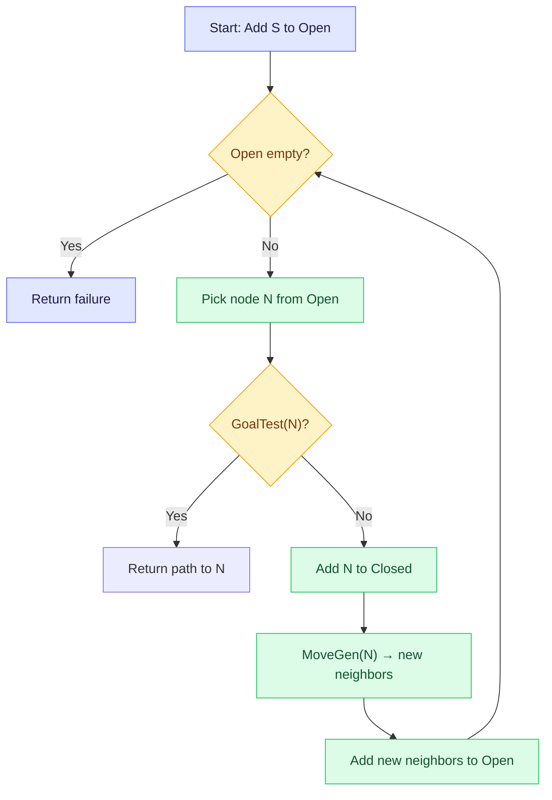
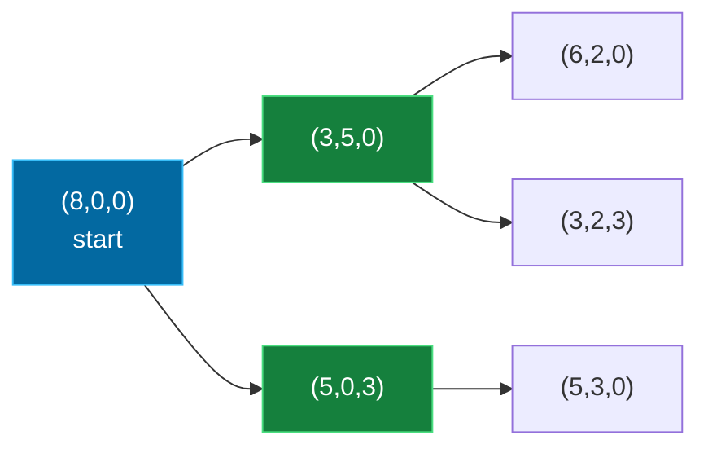

## The Simplest Explanation

Every search algorithm is a tourist in an unfamiliar city. It does **not** get a map. All it can do is stand on one street corner, look at the signposts, and pick a direction. Two functions make this possible:

1. **MoveGen(n)** — "what are my options from here?" Given a state, it returns the neighbors reachable by one move.
2. **GoalTest(n)** — "am I there yet?" Given a state, it returns true or false.

That's the whole interface. DFS, BFS, DFID, A* — they are all just different strategies for deciding *which neighbor to try next*. The problems (water jugs, mazes, Rubik's Cube) only have to supply these two functions.

<Callout type="tip" title="Remember This">
The state space is **implicit**. Nobody hands you the full graph — you only get a start state, MoveGen, and GoalTest. The graph is generated on the fly, one node's neighborhood at a time.
</Callout>

## The General Search Framework

Instead of writing a custom program per problem, we write **domain-independent algorithms** into which individual problems plug in:

- Describe the given **state**
- Devise **operators** (moves) that work in any state
- Navigate from the start state toward a state that passes GoalTest

### The Core Loop: Generate and Test

Two lists drive every search algorithm:

- **Open**: nodes generated but not yet inspected ("candidates")
- **Closed**: nodes already visited and goal-tested

The single question separating all search algorithms: **which node do you pick from Open, and where do new nodes go?**

### Helper Functions

The course notation for writing algorithms uses list operations:

- `X : List` — add X at the head (cons)
- `head(List)` / `tail(List)` — first element / everything else
- `List1 ++ List2` — append

For paths we store **node pairs** `(node, parent)`, accessed with `first(pair)` and `second(pair)` (and `third()` for depth triples). Two standard helpers:

- **MakePairs(neighbors, parent)** — turns a list of nodes into `(node, parent)` pairs so paths can be reconstructed
- **RemoveSeen(neighbors, Open ∪ Closed)** — filters out nodes we've already encountered

## Worked Examples of MoveGen

### The Water Jugs Problem

Three jugs with capacities **8, 5, and 3 liters**. The 8-liter jug starts full; the others empty. Goal: measure exactly 4 liters.

**State representation**: a triple like `(8, 0, 0)` = contents of each jug.

**MoveGen**: pour water from jug $i$ to jug $j$ until either the source empties or the destination fills. From `(8,0,0)` you can reach `(3,5,0)` and `(5,0,3)` — just two neighbors.

**GoalTest**: any jug contains exactly 4 liters — this accepts multiple states: `(4,4,0)`, `(1,4,3)`, ...

Some moves are reversible (pour back between jugs), some are not. Reversibility shapes whether the state-space graph is a tree or has cycles.

### The Eight Puzzle

A 3×3 grid with tiles 1–8 and one blank. Slide a tile into the blank.

- **State**: the arrangement of the 9 cells
- **MoveGen**: slide up/down/left/right for the blank — only **2–4** moves exist per state
- **GoalTest**: tiles in order

Key fact: the eight puzzle's state space is split into **two disjoint sub-graphs** — no sequence of moves connects them (swapping any two tiles flips you to the other partition). The Rubik's Cube similarly has 12 partitions.

### River Crossing (Man, Goat, Lion, Cabbage)

Transport a lion, goat, and cabbage across a river. Lion eats goat if left alone; goat eats cabbage. Boat holds the man plus at most one item.

- **State**: who is on which bank (or even simpler: what is on the same side as the boat)
- **MoveGen**: man crosses alone or with one item, but never leaves dangerous pairs together
- **GoalTest**: everyone on the far bank

<Callout type="important" title="Representation Matters">
The same problem admits several state representations, each producing a **different MoveGen and GoalTest** — but describing the same underlying problem. Choosing a compact representation (e.g., only track items on the boat side) makes MoveGen smaller and search faster.
</Callout>

### Other Classic Problems

| Problem | State | Move | Path matters? |
|---------|-------|------|---------------|
| Maze | current cell | move N/S/E/W through open walls | Yes |
| N-Queens | partial board | place a non-attacking queen | No — configuration |
| Map Coloring | partial assignment | color next region | No — configuration |
| TSP | set of visited cities | visit next city | Yes + cost |

### Exam-Style Worked Example (Water Jugs, Paper Format)

Papers give you a move notation and ask for the **shortest path** between two states. Here is the real pattern:

> Three jugs **a, b, c** with capacities **5L, 3L, 2L**. A state is a digit string `ABC` = volumes in a, b, c. Moves:
> - `xETy` — empty jug x into y, topping y up completely
> - `xEy` — empty x into y without topping y up
> - `xTy` — top up jug y using x, without emptying x
>
> Example: $\text{MoveGen}(212) = \{032, 302, 410, 230\}$

**Task**: find the shortest path from `320` to `401`, and the corresponding move sequence.

**Solution by hand** — work forward from `320`, one BFS layer at a time, but guided by the goal `401` (= 4 liters in a):

| Step | State | Move applied | Result | Reasoning |
|------|-------|--------------|--------|-----------|
| 1 | 320 | `aTc` — fill c (cap 2) from a | **122** | a gives away 2 → a=1, c=2 |
| 2 | 122 | `cTb` — top up b (needs 1 more) | **131** | b takes 1 from c → b=3, c=1 |
| 3 | 131 | `bEa` — empty all of b into a | **401** | a absorbs 3 → a=4 ✓ GOAL |

**Shortest path**: `320,122,131,401` — **move sequence**: `aTc,cTb,bEa`

How to attack these fast in an exam:
1. Write the goal's digits and ask "**which final move could produce it?**" (here only pouring b into a yields a=4)
2. Ask what must be true just BEFORE that move (a=1, c=1, b full-ish)
3. Work backward/forward until the chains meet — then verify each move against the notation rules
4. Sanity-check every intermediate state respects capacities

## Configuration vs Planning Problems

- **Configuration problems**: you want a final *state* satisfying a description (N-Queens, Sudoku, SAT). The path is irrelevant.
- **Planning problems**: the *path itself* is the answer (route finding, river crossing). Store `(node, parent)` pairs so the path can be traced back through Closed when the goal pops out.

## Three Levels of Pruning

When adding MoveGen's output to Open, three policies exist:

| Policy | Loops? | Tree size | Tradeoff |
|--------|--------|-----------|----------|
| No Closed list | Can loop forever | Infinite on cyclic spaces | Fastest per node, unsafe |
| Remove nodes on Closed | Safe | Node may sit on Open multiple times | May re-expand later via shorter paths |
| Only brand-new nodes (not on Open **or** Closed) | Safe, smallest tree | Each node appears once | A shorter path found later is lost |

<Quiz
  question="What does MoveGen(n) return?"
  options={[
    { label: "A", text: "The shortest path from n to the goal" },
    { label: "B", text: "The set of states reachable from n in one move" },
    { label: "C", text: "True if n is a goal state" },
    { label: "D", text: "The entire implicit graph" },
  ]}
  correctAnswer="B"
  explanation="MoveGen generates n's immediate neighbors — one move away. Finding paths is the search algorithm's job; testing goals is GoalTest's job."
/>

<Quiz
  question="Why store (node, parent) pairs instead of bare nodes?"
  options={[
    { label: "A", text: "To make MoveGen faster" },
    { label: "B", text: "To avoid infinite loops" },
    { label: "C", text: "So the solution path can be reconstructed by tracing parents back from the goal" },
    { label: "D", text: "To reduce memory usage" },
  ]}
  correctAnswer="C"
  explanation="Parent pointers let us walk backward from the goal to the start once GoalTest succeeds. This is essential for planning problems where the path IS the answer."
/>

<Quiz
  question="In the 'only new nodes' pruning policy, what is lost compared to allowing duplicates on Open?"
  options={[
    { label: "A", text: "Completeness — some goals become unreachable" },
    { label: "B", text: "A shorter path to a node discovered later is discarded" },
    { label: "C", text: "MoveGen returns fewer neighbors" },
    { label: "D", text: "Nothing — it is strictly better" },
  ]}
  correctAnswer="B"
  explanation="If node X was first reached by a long path and put on Open/Closed, a later cheaper route to X is ignored. For unweighted BFS this never hurts (first find is always shortest), but for cost-based searches it can."
/>

<Accordion title="Common Exam Pitfalls">
1. **Confusing MoveGen with the search strategy**: MoveGen just lists neighbors. DFS/BFS/DFID decide the *order* of exploration. Exam questions often ask you to write MoveGen for a new problem — describe the legal moves precisely.

2. **Forgetting illegal states in MoveGen**: In river crossing, MoveGen must not generate states where the lion and goat (or goat and cabbage) are left alone. Illegal-move filtering lives inside MoveGen.

3. **Multiple goal states**: GoalTest need not match a single state. In water jugs, "any jug holds 4 liters" matches several triples. Write GoalTest as a predicate, not an equality check against one state.

4. **Assuming the whole graph is available**: Every algorithm here works with an *implicit* graph. You can never ask "how many nodes does the space have?" without generating them.
</Accordion>
