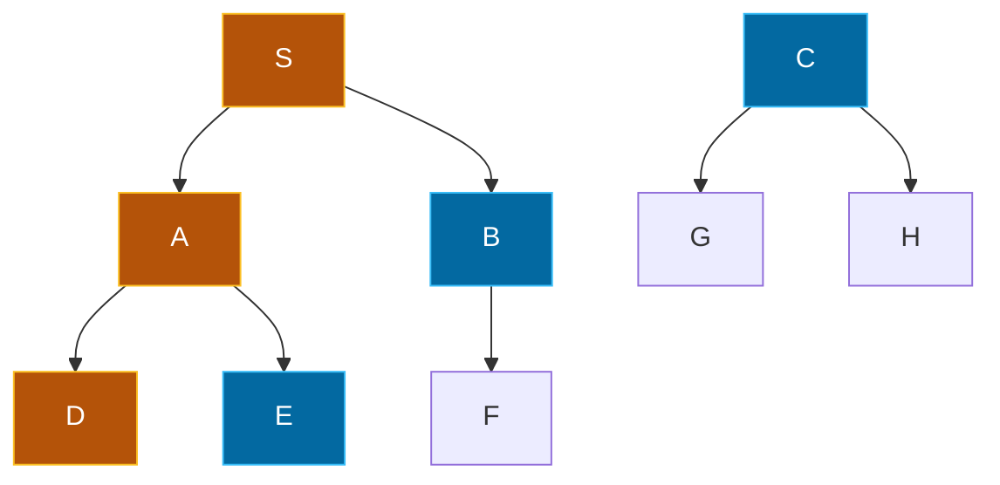
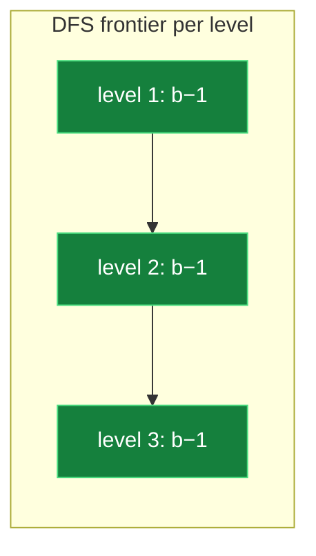

## The Simplest Explanation

DFS is the **impetuous** tourist. It sees a street and immediately walks down it, as far as it can go. Only when it hits a dead end does it back up one step and try the next street.

The entire algorithm is the general generate-and-test loop with **one line** deciding its personality:

> Add new nodes at the **head** of Open → Open behaves like a **stack** (LIFO) → always explore the *newest* node first.

<Callout type="tip" title="Remember This">
DFS = add to head = LIFO = go deep first. Everything else about DFS follows from this single choice.
</Callout>

## The Algorithm

Open starts as `[(S, nil)]`, Closed as `[]`. Repeat while Open is not empty:

1. Pick the **first** pair `(n, parent)` from Open
2. If GoalTest(n) passes → trace parents and return the path
3. Move n to Closed
4. `neighbors = RemoveSeen(MoveGen(n), Closed)`
5. `newPairs = MakePairs(neighbors, n)`
6. **Prepend** newPairs to Open (`newPairs ++ Open`)

Step 6 is the only difference from BFS.

In this snapshot DFS has visited S → A → D. The frontier nodes (E, B, C) wait on Open while DFS keeps diving. It returns to them only after the deep branch is exhausted.

## Interactive Trace

Watch DFS run on a graph where the goal hides behind two routes — a long one through A-C and a short one through D:

<DFSBFSViz />

### Key Observations

1. **DFS dives**: from S it commits to A, then C, never glancing at D until forced.
2. **It finds a longer path**: S → A → C → G (length 3), even though S → D → G (length 2) exists. DFS has no sense of direction.
3. **Open stays thin**: at every moment Open holds just a handful of nodes — one or two per level of depth.

## Analysis

Assume constant branching factor $b$ and goal at depth $d$.

### Time Complexity

| Scenario | Nodes inspected |
|----------|----------------|
| Best case (goal on leftmost path) | $O(d)$ |
| Worst case (goal on rightmost path) | $O(b^d)$ |
| Average | $\approx O(b^{d/2})$ |

On average DFS inspects about half the tree's depth before hitting the goal — if you're lucky enough for the goal to be on an early-explored branch.

### Space Complexity — DFS's Superpower

At each level, DFS generates $b$ children, picks one, and parks the other $b-1$ on Open. Over depth $d$:

$$|\text{Open}| = (b-1)\cdot d = O(bd) \quad \text{— linear!}$$

BFS by contrast holds $O(b^d)$ nodes on Open. For large problems, BFS runs out of memory long before time becomes the issue; DFS never does.

### Solution Quality and Completeness

| Property | Value |
|----------|-------|
| Shortest path guaranteed? | **No** — may find a longer path down an early branch |
| Complete on finite spaces? | Yes — will eventually explore everything |
| Complete on infinite spaces? | **No** — can dive forever down one infinite branch |
| Optimal? | No |

## The Cycle Danger

Without pruning, DFS can loop forever: S → A → S → A → ... Open never empties. This is why loop checking matters more for DFS than for any other algorithm:

- **With Closed list**: safe, each node expanded once
- **Without any pruning**: infinite loops on cyclic spaces

<Callout type="warning" title="When NOT to Use DFS">
Never use plain DFS when (a) the space has cycles and you have no memory for a Closed list, or (b) you need the *shortest* path. Use DFID instead — it fixes both problems for only ~11% extra work.
</Callout>

<Quiz
  question="What is the ONLY line that differs between the DFS and BFS pseudocode?"
  options={[
    { label: "A", text: "How neighbors are generated" },
    { label: "B", text: "Where new pairs are added to Open (head vs tail)" },
    { label: "C", text: "Whether a Closed list is kept" },
    { label: "D", text: "How GoalTest works" },
  ]}
  correctAnswer="B"
  explanation="Both use identical MoveGen, GoalTest, and Closed-list logic. DFS prepends new pairs to Open (stack); BFS appends them (queue). One word of difference, completely different behavior."
/>

<Quiz
  question="DFS inspects how many nodes in the worst case (branching factor b, goal at depth d)?"
  options={[
    { label: "A", text: "$O(d)$" },
    { label: "B", text: "$O(bd)$" },
    { label: "C", text: "$O(b^d)$" },
    { label: "D", text: "$O(2^b)$" },
  ]}
  correctAnswer="C"
  explanation="$O(b^d)$ — exponential, exactly like BFS. Time is not where DFS wins; space is."
/>

<Quiz
  question="Why does DFS use only O(bd) space?"
  options={[
    { label: "A", text: "It deletes nodes from Closed aggressively" },
    { label: "B", text: "At each of d levels it stores only b−1 unexplored siblings" },
    { label: "C", text: "MoveGen returns at most one neighbor" },
    { label: "D", text: "It never revisits nodes so the tree is small" },
  ]}
  correctAnswer="B"
  explanation="When DFS expands a node it takes one child and leaves b−1 siblings parked on Open at that level. Total parked siblings across d levels: (b−1)d — linear."
/>

<Accordion title="Common Exam Pitfalls">
1. **Claiming DFS finds the shortest path**: It doesn't, ever. If an exam trace shows two paths, DFS returns whichever it stumbles into first along its diving order.

2. **Forgetting DFS can be incomplete**: On infinite-depth spaces DFS may never terminate even though a solution exists three levels away. This is THE motivation for DFID.

3. **Confusing stack direction**: New pairs go at the **head** of Open, so the most recently generated children are picked next. Writing "append to tail" turns your DFS answer into BFS.

4. **Space complexity confusion**: $O(bd)$ is the size of **Open**, not total nodes visited. Total visited is still up to $O(b^d)$.
</Accordion>
