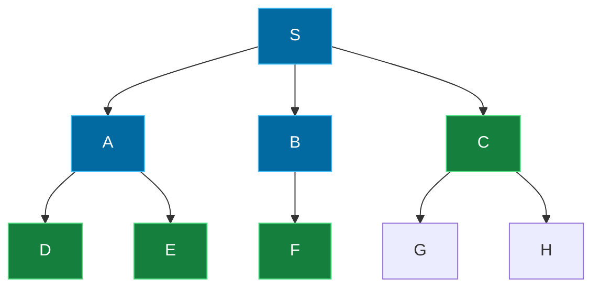

## The Simplest Explanation

BFS is the **conservative** tourist. Before walking any street two blocks away, it finishes inspecting every corner within one block. It expands outward from the start in perfect rings.

The entire algorithm is the general generate-and-test loop with **one line** deciding its personality:

> Add new nodes at the **tail** of Open → Open behaves like a **queue** (FIFO) → explore nodes in the order they were generated.

<Callout type="tip" title="Remember This">
BFS = add to tail = FIFO = level by level = first time you touch the goal, the path IS shortest.
</Callout>

## The Algorithm

Identical to DFS except for step 6:

1. Pick the first pair `(n, parent)` from Open
2. If GoalTest(n) passes → return path
3. Move n to Closed
4. `neighbors = RemoveSeen(MoveGen(n), Closed)`
5. `newPairs = MakePairs(neighbors, n)`
6. **Append** newPairs to Open (`Open ++ newPairs`)

Because children enter the queue after all older candidates, BFS processes every node at distance $k$ before any node at distance $k+1$.

Here BFS has finished levels 0–1 (S, A, B) and is sweeping level 2 (D, E, F on Open). It will not look at anything deeper until this ring is done.

## Interactive Trace

Same graph as the DFS page — switch between DFS and BFS and watch how differently they treat the same Open list:

<DFSBFSViz />

### Key Observations

1. **BFS sweeps**: S, then A/B/D, then C/E/G — never diving until a full ring is done.
2. **It finds the shortest path**: S → D → G (length 2), where DFS found length 3.
3. **Duplicates appear on Open**: with Closed-only pruning, B and D sit on Open multiple times via different parents. Only the "no duplicates" policy prevents this.
4. **Open grows explosively**: by step 5, Open holds most of the graph.

## Analysis

Assume constant branching factor $b$ and goal at depth $d$.

### Time Complexity

| Scenario | Nodes inspected |
|----------|----------------|
| Best case (goal at depth d, last of its level) | $O(b^{d})$ |
| Worst case | $O(b^{d})$ |
| Average | $\approx O(b^d)\cdot\frac{b+1}{2(b-1)}$ |

Compared with DFS's average $\approx O(b^{d/2})$, the ratio is roughly $\frac{b+1}{b-1}$: for $b = 10$, BFS inspects only about $\frac{11}{9} \approx 1.2\times$ more nodes. **Time is comparable — space is not.**

### Space Complexity — BFS's Weakness

Every node at the current level sits on Open simultaneously:

$$|\text{Open}| = O(b^d) \quad \text{— exponential!}$$

At depth 12 with $b = 10$, that's a trillion nodes in memory. BFS dies of memory exhaustion long before it dies of time.

### Why BFS Guarantees Shortest Paths

Nodes leave Open in non-decreasing distance from start (each level is fully queued before the next). So the **first** goal node dequeued has minimal distance. No extra bookkeeping needed — it's free.

| Property | Value |
|----------|-------|
| Shortest path guaranteed? | **Yes** (unweighted edges) |
| Complete? | **Yes** — if any finite-length path exists, BFS finds it |
| Optimal with edge costs? | No — use Dijkstra / A* instead |
| Space | $O(b^d)$ — usually the killer |

## Robustness Against Cycles

In the lecture's tiny example, when *all* pruning was removed (even the Closed list):

- **DFS looped forever** (S → A → C → B → S → ...)
- **BFS still found the goal** — because it processes level by level, cycles only add duplicate entries; the frontier keeps advancing outward

This makes BFS more forgiving when loop checking is imperfect.

<Quiz
  question="Why is BFS guaranteed to find a shortest path?"
  options={[
    { label: "A", text: "It keeps a Closed list" },
    { label: "B", text: "It uses a priority queue" },
    { label: "C", text: "It dequeues nodes in non-decreasing distance order, so the first goal reached has minimal distance" },
    { label: "D", text: "It explores all paths simultaneously" },
  ]}
  correctAnswer="C"
  explanation="The FIFO queue drains level k entirely before level k+1. When the first goal pops out, no shorter route can exist — all closer nodes were already processed."
/>

<Quiz
  question="DFS and BFS both take O(b^d) time. What is their practical ratio?"
  options={[
    { label: "A", text: "BFS inspects exponentially more nodes than DFS" },
    { label: "B", text: "Roughly (b+1)/(b−1), about 1.2× for b=10" },
    { label: "C", text: "DFS always inspects more" },
    { label: "D", text: "They inspect exactly the same nodes" },
  ]}
  correctAnswer="B"
  explanation="Their average-case node counts differ by about (b+1)/(b−1) ≈ 11/9 for b=10 — negligible. The dramatic difference is SPACE: O(bd) vs O(b^d)."
/>

<Quiz
  question="Without ANY pruning (no Closed list), which algorithm survives a cyclic state space?"
  options={[
    { label: "A", text: "Both fail" },
    { label: "B", text: "DFS fails, BFS still finds the goal" },
    { label: "C", text: "DFS finds it, BFS loops" },
    { label: "D", text: "Both find it instantly" },
  ]}
  correctAnswer="B"
  explanation="DFS can chase its tail around a cycle forever. BFS's level-order processing advances outward regardless of duplicate entries — cycles just waste queue space."
/>

<Accordion title="Common Exam Pitfalls">
1. **Writing 'append' in your DFS answer or 'prepend' in your BFS answer**: The single-word mistake flips the entire algorithm. Examiners love catching this.

2. **Assuming BFS handles weighted edges optimally**: BFS minimizes the number of *hops*. With edge costs, a 3-hop route can be cheaper than a 2-hop one. You need Dijkstra/A* (Week 5).

3. **Forgetting why Open explodes**: It holds an entire level ($b^d$ nodes), not a path. This is the standard exam question on "why DFID?"

4. **Removing nodes already on Open**: With the strictest pruning ("only brand-new nodes") the tree is smallest, but remember: if a shorter way to a node appears later, it's discarded. For unweighted BFS this never causes suboptimality — first discovery is always at minimal distance.
</Accordion>
