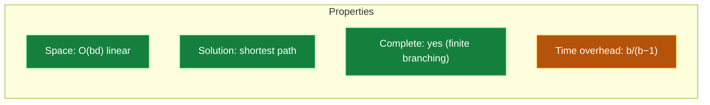

## The Simplest Explanation

DFS has linear space but finds bad paths. BFS finds shortest paths but explodes in memory. DFID asks a cheeky question:

> **What if we just... run DFS many times, each time allowing one more level of depth?**

Iteration 1 searches to depth 0. Iteration 2 restarts from scratch, searching to depth 1. Iteration 3 restarts again, depth 2. Each run is plain depth-bounded DFS (linear space!), but the *sequence* mimics BFS — the goal is found at its shortest depth.

<Callout type="tip" title="Remember This">
DFID = repeated depth-bounded DFS with growing bounds. Space like DFS ($O(bd)$), solution quality like BFS (shortest path). The wasted re-exploration costs only a factor of $b/(b-1)$.
</Callout>

## The Algorithm

Each iteration runs **depth-bounded DFS**: nodes carry triples `(node, parent, depth)`. A child's depth is parent's depth + 1. If depth = bound, don't generate children.

```
for bound = 0, 1, 2, ... :
    result = DepthBoundedDFS(S, bound)
    if result found a goal: return it
    if node count didn't grow vs previous iteration: report failure
```

The node-count check handles termination on finite spaces: if two consecutive iterations visit the same number of nodes, no deeper nodes exist.

## Interactive Trace

Goal G sits at depth 2. Watch three restarts find it — and count the cost:

<DFIDViz />

### Key Observations

1. **Restarts are total**: iteration 2 re-visits S, A, B, C even though they were seen in iteration 1.
2. **The answer is optimal**: G pops out at depth 2 — same as BFS would give.
3. **Memory stays linear**: during any single moment, Open holds at most one path plus siblings — never an entire level.
4. **The overhead is real but small**: this tree needed 13 visits vs 8 for one full search. In big uniform trees the ratio shrinks toward $\frac{b}{b-1}$.

## Does DFID Always Return the Shortest Path?

**Subtle point — it depends on pruning.**

Because depth-bounded DFS uses the Closed list, it can lock in a longer path: node D might be closed via S→A→C→D first; when iteration 2 later tries S→B→D (shorter!), D is already closed and skipped.

**The fix**: do NOT use Closed to prune in DFID. Keep parent pairs on Closed purely for path reconstruction, but let Open accept duplicates. Store the whole path inside each node representation — when the goal appears, the path comes free.

For **configuration problems** (N-Queens, SAT, Map Coloring) paths don't matter, so this subtlety is irrelevant.

## The Overhead Analysis

"Re-explore everything every iteration? Wasteful!" — surprisingly, no.

Consider a tree where the final iteration reaches $L$ leaves at depth $d$. Every iteration before it only re-visits **internal** nodes. Total visits:

$$L + I \quad \text{vs} \quad L \text{ for BFS}$$

$$\frac{\text{DFID work}}{\text{BFS work}} = \frac{b}{b-1}$$

| Branching factor $b$ | Extra work |
|---|---|
| 2 | 100% |
| 3 | 50% |
| 10 | ~11% |
| 100 | ~1% |

In an exponentially growing tree, leaves vastly outnumber internal nodes — so revisiting internals is pocket change. For realistic branching factors, DFID is nearly free insurance against BFS's memory blowup.



## Why Blind Search Still Loses

DFS, BFS, DFID all share one fatal flaw: they are **oblivious to the goal**. DFS explores identically whether the goal is one step right or a million steps left. Against combinatorial explosion — level $d$ holding $b^d$ nodes, the Hydra that grows heads faster than you cut them — blind strategies eventually drown.

The escape: give the algorithm a **sense of direction** with a heuristic function. That leads to Best-First Search, Branch & Bound, and ultimately A* (Weeks 3–5).

<Quiz
  question="DFID re-explores shallow nodes repeatedly. What is the asymptotic overhead over BFS?"
  options={[
    { label: "A", text: "$O(b^d)$ — it does exponentially more work" },
    { label: "B", text: "$O(bd / b^d)$ — actually less work than BFS" },
    { label: "C", text: "A factor of b/(b−1) — e.g., ~11% extra at b=10" },
    { label: "D", text: "Exactly zero — DFID visits what BFS visits" },
  ]}
  correctAnswer="C"
  explanation="Only internal nodes get re-visited, and leaves outnumber internals geometrically. Total work is (L+I) vs L, giving ratio b/(b−1)."
/>

<Quiz
  question="Why might DFID WITH a pruning Closed list fail to return the shortest path?"
  options={[
    { label: "A", text: "The Closed list corrupts MoveGen" },
    { label: "B", text: "An early deep iteration may close a node via a long path; later iterations can't reopen it via a shorter one" },
    { label: "C", text: "Depth bounds make GoalTest unreliable" },
    { label: "D", text: "It can't — DFID is always optimal regardless" },
  ]}
  correctAnswer="B"
  explanation="If D was reached as S→A→C→D in one iteration, it's closed. A later attempt along S→B→D gets pruned, losing the shorter route. Fix: don't filter Open by Closed in DFID."
/>

<Quiz
  question="When does DFID know to stop and report failure?"
  options={[
    { label: "A", text: "When Open becomes empty" },
    { label: "B", text: "When two consecutive iterations visit the same number of nodes" },
    { label: "C", text: "After 2^d iterations" },
    { label: "D", text: "It never terminates on failure" },
  ]}
  correctAnswer="B"
  explanation="Tracking per-iteration node counts lets DFID detect saturation: if the count stops growing, no unexplored nodes remain at any depth."
/>

<Accordion title="Common Exam Pitfalls">
1. **Saying DFID 'is BFS with less memory' mechanically**: It's *repeated DFS*. In traces you must show separate iterations with fresh Open/Closed lists — not one continuous queue.

2. **Using Closed-list pruning in your trace**: Standard exam trap. Unless stated otherwise, DFID should allow duplicates on Open so shorter paths survive.

3. **Wrong overhead numbers**: Memorize $b/(b-1)$, and be ready to compute node counts by hand: iteration $k$ visits all nodes up to depth $k$. Sum them.

4. **Confusing DFID with bidirectional search orIDA***: IDA* (iterative deepening A*) is the Week-5+ analogue that deepens on f-values instead of depths. Same skeleton, different bound.
</Accordion>
