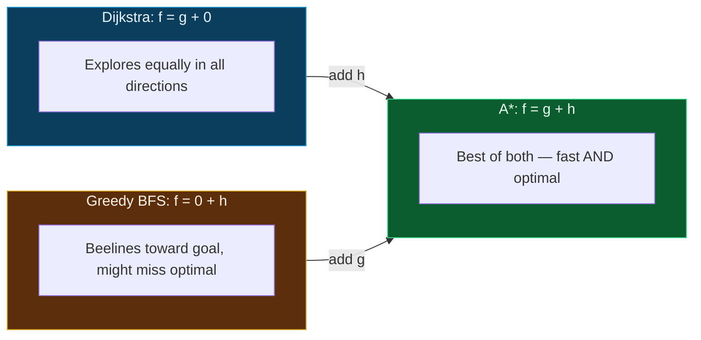
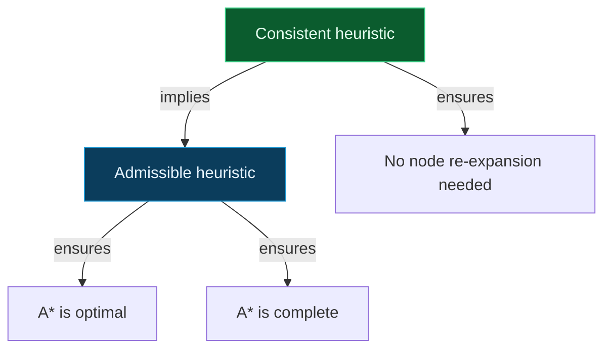

## The Simplest Explanation

Imagine you're lost in a city and want to reach your hotel. You have two pieces of information:

1. **How far you've already walked** (you know this exactly)
2. **How far the hotel looks from where you are** (you can see the skyline and estimate)

A* says: **always pick the next move that minimizes (distance walked so far) + (estimated distance remaining)**.

That's it. If you remember nothing else, remember this: **pick the node with the smallest "cost so far + guess to goal"**.

$$f(n) = g(n) + h(n)$$

- $g(n)$ = exact cost from start to $n$ (this is known, no guessing)
- $h(n)$ = estimated cost from $n$ to goal (this is the guess/heuristic)
- $f(n)$ = total estimated cost of the best path through $n$

<Callout type="tip" title="The One Rule For The Guess">
Your guess $h(n)$ must **never overestimate** the real remaining distance. If the hotel is 5 km away, you can guess 3 km (underestimate = fine) or 5 km (exact = fine), but never 7 km (overestimate = breaks optimality). This is called **admissibility**.
</Callout>

## Why A* Works (Intuition)

Think of it this way:

- If you **only** use $g(n)$ (ignore the guess), you get Dijkstra's algorithm — it explores in every direction equally, like flood fill. It works but is slow because it wastes time going the wrong way.
- If you **only** use $h(n)$ (ignore the cost so far), you get Greedy Best-First Search — it beelines toward the goal but might find a suboptimal path because it doesn't account for how expensive its route has been.
- **A* combines both** — it heads toward the goal (thanks to $h$) but doesn't take unnecessarily expensive routes (thanks to $g$).

## The Algorithm (Step by Step)

1. Put the start node in the **open list** with $g = 0$, $f = 0 + h(\text{start})$
2. While the open list is not empty:
   - Pick the node with the **lowest $f(n)$** from the open list — call it `current`
   - If `current` is the goal → **done!** Reconstruct path
   - Move `current` to the **closed list**
   - For each neighbor of `current`:
     - Calculate $g(\text{neighbor}) = g(\text{current}) + \text{edge cost}$
     - Calculate $f(\text{neighbor}) = g(\text{neighbor}) + h(\text{neighbor})$
     - If neighbor is in closed list with a lower $g$ → skip
     - If neighbor is in open list with a lower $g$ → skip
     - Otherwise → add (or update) neighbor in the open list
3. If open list is empty and goal not found → no path exists

<Callout type="important" title="The Tie-Breaking Rule">
When multiple nodes have the same $f$-value, you can break ties by:
- Preferring the node with **higher $g$** (i.e., closer to the goal — this prefers depth-first exploration and is the standard approach)
- Preferring the node with **lower $g$** (closer to start — shallower exploration)
- Alphabetical order (for exam questions where you need a deterministic answer — always check the question's convention)
</Callout>

## Admissibility and Consistency

### Admissibility

A heuristic $h$ is **admissible** if it never overestimates the true cost to the goal:

$$0 \leq h(n) \leq h^*(n) \quad \text{for all } n$$

where $h^*(n)$ is the actual optimal cost from $n$ to the goal.

**Why it matters**: If $h$ is admissible, A* is guaranteed to find the **optimal** solution. If $h$ overestimates even once, A* might skip the optimal path.

### Consistency (Monotonicity)

A heuristic is **consistent** if for every node $n$ and its successor $n'$ reached by action $a$:

$$h(n) \leq c(n, a, n') + h(n')$$

This means: the heuristic drop from $n$ to $n'$ is never more than the actual step cost.

**Consistency implies admissibility** (but not vice versa). Consistency also guarantees that A* never needs to re-open nodes from the closed list.

## Properties Summary

| Property | Value | Condition |
|----------|-------|-----------|
| Complete? | Yes | Finite branching factor |
| Optimal? | Yes | $h(n)$ admissible |
| Time complexity | $O(b^d)$ worst case | Same as BFS in worst case |
| Space complexity | $O(b^d)$ | Keeps all nodes in memory |

Where $b$ = branching factor, $d$ = depth of the shallowest goal.

<Callout type="info" title="Worst Case vs Typical Case">
In the worst case (e.g., $h(n) = 0$), A* degenerates to Dijkstra's and explores everything. But with a good heuristic, A* can be exponentially faster — it only explores nodes where $f(n) \leq C^*$ (optimal cost), pruning the rest.
</Callout>

## How to Design Good Heuristics

### Method 1: Relaxed Problems

Remove constraints from the original problem. The optimal cost in the relaxed problem is an admissible heuristic for the original.

**Example**: In the 8-puzzle, if you relax "only one tile can move into the blank" to "tiles can move anywhere", you get the **Misplaced Tiles** heuristic. If you further relax "tiles move one step at a time" to "tiles teleport", you get the **Manhattan Distance** heuristic.

$$h_{\text{misplaced}}(n) \leq h_{\text{manhattan}}(n) \leq h^*(n)$$

A **more informed** heuristic (higher but still $\leq h^*$) dominates a less informed one and leads to fewer node expansions.

### Method 2: Pattern Databases

Precompute optimal solution costs for sub-problems and store in a lookup table. The maximum of multiple pattern database heuristics is also admissible and more informed.

### Dominance

If $h_2(n) \geq h_1(n)$ for all $n$ and both are admissible, then $h_2$ **dominates** $h_1$. A* with $h_2$ will never expand more nodes than with $h_1$.

$$h_1(n) \leq h_2(n) \leq h^*(n) \implies h_2 \text{ dominates } h_1$$

## Worked Example: Step-by-Step Trace

Start at **S**, goal is **G**. Each node shows its heuristic value $h(n)$ and the edge costs are labeled on the graph. Click through each step to see how A* expands nodes:

<AStarViz />

### Key Observations from This Trace

1. **Tie at step 1**: After expanding S, nodes A, B, C all have $f = 10$. We break ties by preferring lower $g$ (closer to start → more progress made), so A is expanded first.
2. **Path update at step 3**: When B is expanded, node E already has $g = 9$ (via A), but the path S→B→E gives $g = 8$ (cheaper). A* updates E's $g$-value. This is why we check the open list before skipping.
3. **Suboptimal path rejection**: The path S→A→E→G costs $3 + 6 + 4 = 13$, but A* finds S→A→D→G costs $3 + 4 + 5 = 12$. Both are explored but only the optimal one is returned.
4. **Goal not expanded immediately**: Even after G enters the open list, A* continues expanding nodes with $f < f(G) = 12$ (like E with $f = 10$). Only when G has the lowest $f$ is it selected — guaranteeing optimality.

## Exam Practice: Harder Question

This is a Stanford/IIT-level question. The graph has a non-trivial structure where the "obvious" greedy path is **not** optimal. Try to solve it yourself before clicking "Show Solution".

**Given**: Find the shortest path from **P** to **Z** using A* search. Heuristic values:

| Node | $h(n)$ |
|------|--------|
| P | 9 |
| Q | 6 |
| R | 7 |
| T | 4 |
| U | 3 |
| V | 2 |
| W | 5 |
| Z | 0 |

<AStarExamQuestion />

### Why This Question Is Tricky

1. **The greedy trap**: Going P→Q seems attractive because $h(Q) = 6$ is lower than $h(R) = 7$, but the optimal path goes through R first.
2. **Multiple paths to same node**: Both Q and R can reach U. A* must correctly determine that R→U is cheaper than Q→T→U.
3. **Path cost verification**: P→Q→T→V→Z = 4+3+3+3 = 13 vs P→R→U→V→Z = 2+5+2+3 = 12. The first path looks "more direct" in the graph but is 1 unit more expensive.

<Quiz
  question="If h(n) = 0 for all nodes, what does A* reduce to?"
  options={[
    { label: "A", text: "Breadth-First Search" },
    { label: "B", text: "Dijkstra's algorithm" },
    { label: "C", text: "Greedy Best-First Search" },
    { label: "D", text: "Depth-First Search" },
  ]}
  correctAnswer="B"
  explanation="When h(n) = 0, f(n) = g(n) + 0 = g(n), so A* selects the node with the lowest g-value — exactly Dijkstra's algorithm."
/>

<Quiz
  question="If h(n) = h*(n) (the true optimal cost) for all n, how many nodes does A* expand on the optimal path?"
  options={[
    { label: "A", text: "All nodes in the graph" },
    { label: "B", text: "Only the nodes on the optimal path" },
    { label: "C", text: "All nodes with f ≤ C*" },
    { label: "D", text: "It depends on the tie-breaking" },
  ]}
  correctAnswer="B"
  explanation="With h(n) = h*(n), only the nodes on the optimal path have f = g + h* = C* (the optimal cost). All other nodes have f = g + h* > C* because their g is already too large. So A* expands only the nodes on the optimal path — the minimum possible."
/>

<Quiz
  question="A heuristic h₁(n) = 2 and h₂(n) = 5 are both admissible. Which is more informed?"
  options={[
    { label: "A", text: "h₁ because it's smaller" },
    { label: "B", text: "h₂ because it's larger but still ≤ h*" },
    { label: "C", text: "Neither — both are admissible" },
    { label: "D", text: "It depends on the graph" },
  ]}
  correctAnswer="B"
  explanation="A larger admissible heuristic is more informed because it gives a tighter lower bound on the true cost, causing A* to prune more nodes. h₂ dominates h₁."
/>

<Accordion title="Common Exam Pitfalls">
1. **Forgetting to check the open list for updates**: When you expand a node, its neighbor might already be in the open list with a higher g-value. You must update it with the lower g-value. This is the #1 mistake students make.

2. **Confusing admissibility with consistency**: Every consistent heuristic is admissible, but not every admissible heuristic is consistent. Consistency requires $h(n) \leq c(n,n') + h(n')$; admissibility only requires $h(n) \leq h^*(n)$.

3. **Putting the goal in the closed list immediately**: Don't do this. When you pop the goal from the open list, you're done. You don't need to expand it or add it to the closed list.

4. **Forgetting tie-breaking**: When multiple nodes have the same f-value, you MUST have a tie-breaking rule. Common choices: prefer higher g (closer to goal), prefer lower g (closer to start), or alphabetical. Check the exam question.

5. **Thinking A* always finds the shortest path in terms of edges**: No! A* minimizes total **cost**, not number of edges. A path with 2 expensive edges may cost more than a path with 5 cheap edges.
</Accordion>

<Accordion title="A* vs Other Algorithms — Quick Comparison">
| Algorithm | f(n) | Optimal? | Strategy |
|-----------|-------|----------|----------|
| BFS | depth | Only if equal costs | Explore shallowest first |
| DFS | — | No | Explore deepest first |
| UCS (Dijkstra's) | g(n) | Yes | Cheapest g first |
| Greedy BFS | h(n) | No | Most promising h first |
| A* | g(n) + h(n) | Yes (if h admissible) | Cheapest total estimate first |

When $h = 0$: A* = UCS. When $g = 0$: A* = Greedy BFS. A* is the sweet spot.
</Accordion>
