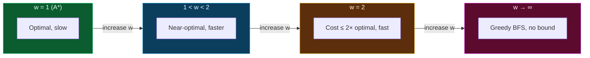
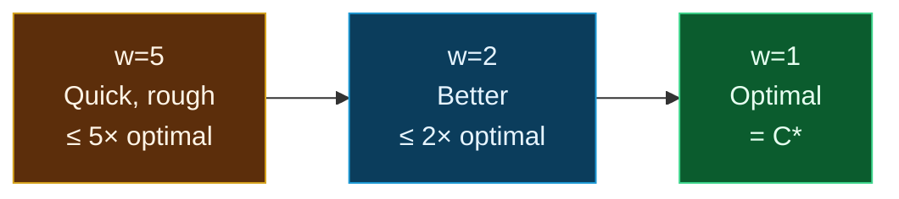

## The Simplest Explanation

A* is optimal but slow. What if you're willing to accept a solution that's **a little bit worse** than optimal, as long as you get it **much faster**?

WA* says: **inflate the heuristic by a weight $w > 1$**. This makes the algorithm greedier — it rushes toward the goal more aggressively, exploring fewer nodes. The tradeoff: the solution may not be optimal, but its cost is **bounded** by $w \times \text{optimal cost}$.

$$f(n) = g(n) + w \cdot h(n), \quad w \geq 1$$

- $w = 1$: standard A* (optimal, slow)
- $w > 1$: WA* (faster, suboptimal but bounded)
- $w = \infty$: Greedy Best-First Search (fastest, no guarantee)

<Callout type="tip" title="The Bounded Suboptimality Guarantee">
If the heuristic $h$ is admissible, then WA* with weight $w$ finds a solution with cost $\leq w \times C^*$, where $C^*$ is the optimal cost. For example, with $w = 2$, the solution cost is at most **twice** the optimal. You always know the worst-case error.
</Callout>

## Why WA* Works (Intuition)

Think of $w$ as a **dial** that controls how much you trust the heuristic vs. the actual cost:

- **Low $w$ (close to 1)**: you trust $g(n)$ more, explore carefully, find near-optimal solutions
- **High $w$**: you trust $h(n)$ more, rush toward the goal, find solutions fast but they may be costly
- The **error bound** grows linearly with $w$, so you always know the worst case

## The Algorithm

WA* is **identical** to A* except for the evaluation function:

1. Put the start node in the **open list** with $g = 0$, $f = 0 + w \cdot h(\text{start})$
2. While the open list is not empty:
   - Pick the node with the **lowest $f(n) = g(n) + w \cdot h(n)$** from the open list
   - If it's the goal → **done!**
   - Move it to the **closed list**
   - For each neighbor:
     - Calculate $g(\text{neighbor}) = g(\text{current}) + \text{edge cost}$
     - Calculate $f(\text{neighbor}) = g(\text{neighbor}) + w \cdot h(\text{neighbor})$
     - Standard open/closed list checks (same as A*)
3. If open list is empty → no path exists

<Callout type="important" title="What Changes vs A*?">
Only one thing changes: $f(n) = g(n) + h(n)$ becomes $f(n) = g(n) + w \cdot h(n)$. The entire algorithm is the same. The weight $w$ simply makes the heuristic "count more" when deciding which node to expand next.
</Callout>

## Bounded Suboptimality

The key theorem for WA*:

$$\text{If } h \text{ is admissible, then WA* with weight } w \text{ finds a path with cost} \leq w \times C^*$$

where $C^*$ is the optimal (cheapest possible) path cost.

### Why the Bound Holds (Sketch)

With $w > 1$, WA* may expand nodes in a different order than A*. But it will never expand a node with $f(n) > w \cdot C^*$ before finding a solution, because the goal node has $f = g(\text{goal}) + 0 = g(\text{goal})$, and the first goal found satisfies $g(\text{goal}) \leq w \cdot C^*$.

### The Weight-Error Tradeoff

| Weight $w$ | Max Error | Speed | Use Case |
|------------|-----------|-------|----------|
| 1.0 | 0% (optimal) | Slowest | When optimality is required |
| 1.5 | ≤ 50% over optimal | Faster | Near-optimal solutions |
| 2.0 | ≤ 100% over optimal | Fast | When speed matters more |
| 3.0 | ≤ 200% over optimal | Very fast | Real-time systems |
| $\to \infty$ | No bound | Fastest | When any solution will do |

## Properties Summary

| Property | Value | Condition |
|----------|-------|-----------|
| Complete? | Yes | Finite branching factor |
| Optimal? | No (bounded) | Cost $\leq w \cdot C^*$ if $h$ admissible |
| Time complexity | Better than A* | Fewer nodes expanded |
| Space complexity | Same as A* | Still keeps all nodes in memory |

<Callout type="info" title="WA* vs A*: The Node Count Difference">
WA* with $w = 2$ typically expands **far fewer** nodes than A*. In practice, the reduction can be exponential — especially when the heuristic is good. The price is a solution that's at most twice the optimal cost, which is often acceptable in real-time applications like video game pathfinding or robotics.
</Callout>

## Anytime A*

A powerful pattern: run WA* with decreasing weights.

1. Start with $w = 5$ → get a quick but rough solution (cost ≤ 5 × C*)
2. Lower to $w = 2$ → get a better solution (cost ≤ 2 × C*)
3. Lower to $w = 1$ → get the optimal solution (cost = C*)

Each iteration reuses the search from the previous one. You can **stop at any time** and still have a valid solution with a known error bound. This is called **Anytime A*** — it gives you the best solution found so far, with improving quality over time.

## Worked Example: WA* with w=2

Here's the same 8-node graph. Start at **S**, goal is **G**. We use weight $w = 2$.

| Node | $h(n)$ |
|------|--------|
| S | 6 |
| A | 4 |
| B | 2 |
| C | 2 |
| D | 3 |
| E | 1 |
| F | 1 |
| G | 0 |

Compare WA* (w=2) with A* (w=1) — notice how WA* rushes toward B because its low h=2 gets inflated to 4:

<WAStarViz />

### WA* vs A* on This Graph

| | A* (w=1) | WA* (w=2) |
|---|---|---|
| Path found | S→A→D→F→G | S→B→E→G |
| Cost | **5** (optimal) | **6** (suboptimal) |
| Nodes expanded | 4 | **3** |
| Within bound? | — | 6 ≤ 2×5 = 10 ✓ |

WA* found a solution **25% worse** than optimal, but expanded **25% fewer nodes**. In larger graphs, the node savings are far more dramatic.

## Exam Practice: WA* vs A* Comparison

This question tests whether you can trace WA* and identify when it finds a different (suboptimal) path compared to A*. The graph is designed so that WA* with w=2 takes a completely different route.

**Given**: Find the shortest path from **P** to **Z** using WA* with w=2. Heuristic values:

| Node | $h(n)$ |
|------|--------|
| P | 7 |
| Q | 5 |
| R | 6 |
| T | 3 |
| S | 2 |
| U | 1 |
| Z | 0 |

<WAStarExamQuestion />

### Key Observation

A* (w=1) would expand P → R → S → U → Z (cost 6). WA* (w=2) expands P → Q → T → Z (cost 8). The **entire path is different** because the inflated heuristic makes Q (h=5, inflated to 10) look better than R (h=6, inflated to 12), even though R is on the optimal path.

Error bound verification: 8 ≤ 2 × 6 = 12 ✓

<Quiz
  question="If w = 1.5 and A* finds an optimal path of cost 10, what is the maximum cost WA* could return?"
  options={[
    { label: "A", text: "10 (same as optimal)" },
    { label: "B", text: "15" },
    { label: "C", text: "11.5" },
    { label: "D", text: "It depends on the graph" },
  ]}
  correctAnswer="B"
  explanation="The bounded suboptimality guarantee says cost ≤ w × C* = 1.5 × 10 = 15. WA* might find the optimal path (cost 10) or a worse one, but never worse than 15."
/>

<Quiz
  question="What happens to WA* as w → ∞?"
  options={[
    { label: "A", text: "It becomes Dijkstra's algorithm" },
    { label: "B", text: "It becomes A*" },
    { label: "C", text: "It becomes Greedy Best-First Search" },
    { label: "D", text: "It runs forever" },
  ]}
  correctAnswer="C"
  explanation="As w → ∞, g(n) becomes negligible compared to w·h(n), so f(n) ≈ w·h(n). WA* picks the node with lowest h — exactly Greedy Best-First Search."
/>

<Quiz
  question="WA* with w=2 finds a path of cost 14. A* with w=1 finds cost 12 on the same graph. Is the WA* result valid according to the error bound?"
  options={[
    { label: "A", text: "Yes, because 14 ≤ 2 × 12 = 24" },
    { label: "B", text: "No, because 14 > 12" },
    { label: "C", text: "Cannot determine without knowing h" },
    { label: "D", text: "Only if h is consistent" },
  ]}
  correctAnswer="A"
  explanation="The error bound guarantees cost_WA* ≤ w × C* = 2 × 12 = 24. Since 14 ≤ 24, the result is valid. Suboptimality is expected with w > 1."
/>

<Accordion title="Common Exam Pitfalls">
1. **Forgetting the error bound is w × C*, NOT w × cost_WA***: The bound says the WA* solution cost ≤ w × optimal cost. It does NOT say cost_WA* ≤ w × cost_WA* (that would be trivially true).

2. **Assuming WA* always finds a suboptimal path**: WA* may find the optimal path even with w > 1, especially if the heuristic is very accurate. The bound is a worst-case guarantee, not a prediction.

3. **Confusing the weight w with the heuristic**: The weight multiplies the heuristic value. f(n) = g(n) + w·h(n), NOT f(n) = w·g(n) + h(n) or f(n) = w·(g(n) + h(n)).

4. **Not verifying the error bound**: In exam questions, always verify that cost_found ≤ w × C*. If it doesn't hold, either your trace has an error or the heuristic isn't admissible.

5. **Thinking WA* explores MORE nodes than A***: WA* always explores fewer or equal nodes compared to A* on the same graph with the same heuristic. The inflated heuristic prunes more aggressively.
</Accordion>

<Accordion title="WA* vs A* — Quick Comparison">
| Property | A* (w=1) | WA* (w>1) |
|----------|----------|------------|
| Evaluation | $f = g + h$ | $f = g + w \cdot h$ |
| Optimal? | Yes | No, but bounded ($\leq w \cdot C^*$) |
| Nodes expanded | More | Fewer |
| Speed | Slower | Faster |
| Use case | Offline planning | Real-time, any-solution-needed |

WA* is A* with a speed dial. Turn up $w$ to go faster at the cost of solution quality.
</Accordion>
