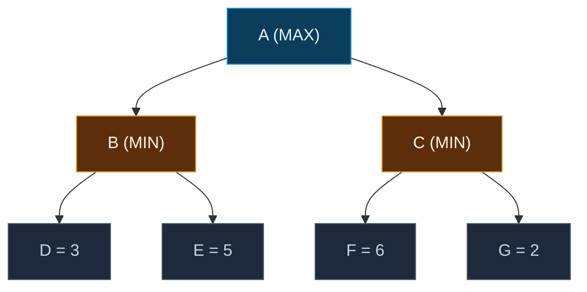

## The Simplest Explanation

Alpha-beta pruning searches a game tree depth-first — it goes down one branch fully, then backtracks. SSS* says: **what if we searched the game tree best-first instead?** Pick the most promising branch at every step, like A* does for pathfinding.

The result: SSS* **never evaluates more nodes than alpha-beta**, and sometimes evaluates fewer. But it uses more memory and is harder to implement.

<Callout type="tip" title="Remember This">
Alpha-beta = depth-first (like DFS). SSS* = best-first (like A*). Both solve the same minimax tree. SSS* is theoretically superior but practically less used because it's more complex and memory-hungry.
</Callout>

## How Game Trees Work

A two-player game (like chess) is modeled as a **minimax tree**:

- **MAX nodes** (your turn): you pick the move that **maximizes** the value
- **MIN nodes** (opponent's turn): they pick the move that **minimizes** your value
- **Leaf nodes**: evaluated by a static evaluation function

$$\text{minimax}(n) = \begin{cases} \text{eval}(n) & \text{if leaf} \\ \max_{c \in \text{children}} \text{minimax}(c) & \text{if MAX node} \\ \min_{c \in \text{children}} \text{minimax}(c) & \text{if MIN node} \end{cases}$$

Minimax value of A: max(min(3, 5), min(6, 2)) = max(3, 2) = **3**. Optimal move: A→B.

## The SSS* Algorithm

SSS* maintains an **OPEN list** of nodes with states and merit values (upper bounds). It processes nodes in order of **highest merit first** (most promising).

### Node States

- **LIVE**: not yet expanded — children haven't been generated
- **SOLVED**: value has been determined

### The Algorithm

1. OPEN = [(root, LIVE, +∞)]
2. While OPEN not empty:
   - Pick node with **highest merit** from OPEN
   - If root is SOLVED: return its value
   - If state is **LIVE**:
     - If **leaf**: insert (node, SOLVED, value(node))
     - If **MAX**: insert **all** children as (child, LIVE, merit)
     - If **MIN**: insert **first** child only as (child, LIVE, merit)
   - If state is **SOLVED**:
     - If parent is **MAX**: mark parent SOLVED with this value, **purge all siblings** from OPEN
     - If parent is **MIN**: update parent merit. If all children solved, mark parent SOLVED. Else insert **next sibling** as LIVE

<Callout type="important" title="Key Difference from Alpha-Beta">
Alpha-beta explores depth-first (like DFS) and uses a **single window** [α, β] to prune. SSS* explores best-first (like A*) and uses the OPEN list to prioritize branches. When SSS* finds a solution through one branch, it can **purge entire subtrees** that can't improve on it.
</Callout>

## Worked Example

Let's trace SSS* on the game tree above. OPEN is sorted by merit (highest first):

<SSSStarViz />

### Step-by-Step Summary

| Step | Pick from OPEN | Action | OPEN (after) |
|------|---------------|--------|-------------|
| 1 | (A, LIVE, ∞) | MAX → expand all children | (B, LIVE, ∞), (C, LIVE, ∞) |
| 2 | (C, LIVE, ∞) | MIN → expand first child | (B, LIVE, ∞), (F, LIVE, ∞) |
| 3 | (F, LIVE, ∞) | Leaf → SOLVED=6 | (B, LIVE, ∞), (F, SOLVED, 6) |
| 4 | (B, LIVE, ∞) | MIN → expand first child | (D, LIVE, ∞), (G, LIVE, 6) |
| 5 | (D, LIVE, ∞) | Leaf → SOLVED=3 | (D, SOLVED, 3), (G, LIVE, 6) |
| 6 | (G, LIVE, 6) | Leaf → SOLVED=2, C SOLVED=2 | (D, SOLVED, 3), (C, SOLVED, 2) |
| 7 | (D, SOLVED, 3) | B's merit=3, insert E | (E, LIVE, 3), (C, SOLVED, 2) |
| 8 | — | A SOLVED=3 via C, purge B | Done! |

Result: minimax value = 3, optimal move A→B.

## SSS* vs Alpha-Beta

| Property | Alpha-Beta | SSS* |
|----------|-----------|------|
| Search order | Depth-first | Best-first |
| Memory | O(bd) stack | O(b^d) OPEN list |
| Nodes evaluated | ≤ SSS* (never fewer) | ≤ Alpha-beta (never more) |
| Implementation | Simple | Complex |
| Practical use | Standard | Rare (theoretical interest) |
| Pruning | Window [α, β] | Merit-based purging |

<Callout type="info" title="Why Isn't SSS* Used More?">
SSS* uses an OPEN list that can grow exponentially, while alpha-beta only needs a stack proportional to the tree depth. In practice, with good move ordering, alpha-beta performs nearly as well as SSS* with far less memory overhead. This is why SSS* remains mostly of theoretical interest.
</Callout>

## Properties Summary

| Property | Value |
|----------|-------|
| Optimal? | Yes — finds the minimax value |
| Complete? | Yes — for finite game trees |
| Nodes evaluated | ≤ Alpha-beta (never more) |
| Space complexity | O(b^d) — exponential, stores entire OPEN list |
| Time complexity | O(b^(d/2)) best case with perfect ordering |

<Quiz
  question="How does SSS* differ from alpha-beta pruning in its search strategy?"
  options={[
    { label: "A", text: "SSS* uses minimax, alpha-beta doesn't" },
    { label: "B", text: "SSS* is depth-first, alpha-beta is best-first" },
    { label: "C", text: "SSS* is best-first, alpha-beta is depth-first" },
    { label: "D", text: "They use the same search strategy" },
  ]}
  correctAnswer="C"
  explanation="SSS* processes nodes in best-first order (highest merit first), while alpha-beta uses depth-first search with a pruning window."
/>

<Quiz
  question="Why is SSS* rarely used in practice despite being theoretically superior?"
  options={[
    { label: "A", text: "It doesn't find the optimal solution" },
    { label: "B", text: "It requires exponentially more memory than alpha-beta" },
    { label: "C", text: "It's slower than alpha-beta on all inputs" },
    { label: "D", text: "It only works for two-player games" },
  ]}
  correctAnswer="B"
  explanation="SSS* stores an OPEN list that can grow to O(b^d), while alpha-beta only needs O(bd) stack space. With good move ordering, alpha-beta performs nearly as well with far less memory."
/>

<Accordion title="Common Exam Pitfalls">
1. **Confusing SSS* with A***: SSS* is for game trees (two-player, minimax), A* is for pathfinding. They share the best-first strategy but solve different problems.

2. **Thinking SSS* always evaluates fewer nodes**: SSS* never evaluates MORE nodes than alpha-beta, but it may evaluate the SAME number. The advantage depends on the tree structure.

3. **Forgetting that MIN nodes expand one child at a time**: MAX nodes expand all children at once. MIN nodes expand only the first child, then wait for it to be solved before expanding the next.

4. **Not understanding the merit value**: Merit is an UPPER BOUND on what the node can contribute. When a node is SOLVED, its merit becomes exact. Lower merit → less promising → explored later.

5. **Purging rule for MAX parents**: When one child of a MAX node is SOLVED, ALL siblings are purged from OPEN. This is because MAX will choose the best solved child and doesn't need to explore alternatives.
</Accordion>
