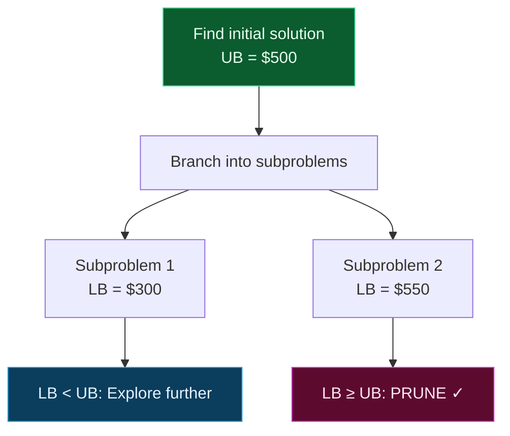

## The Simplest Explanation

You're searching for the best solution in a huge space. Instead of checking every possibility, **branch** (split the problem into subproblems) and **bound** (compute a lower bound for each). If a subproblem's lower bound is already worse than the best solution you've found, **prune it** — skip it entirely.

BnB = **systematic enumeration + smart pruning**. It's exact (always finds the optimal) but uses bounds to avoid exploring branches that can't possibly be optimal.

<Callout type="tip" title="The Key Insight">
The bound is everything. A tight lower bound prunes more branches. A loose bound barely helps. The art of BnB is designing **tight, cheap-to-compute bounds**.
</Callout>

## How BnB Works (Intuition)

Imagine searching for the cheapest flight route. You've found one for $500. Now you're considering a different route, and the cheapest connecting flights alone cost $600. You can **stop exploring** this route — it can't possibly beat $500.

BnB does this systematically:

1. Find an initial solution (any valid solution) → gives an **upper bound** (UB)
2. Branch: split the problem into subproblems
3. For each subproblem, compute a **lower bound** (LB) — the best this branch could possibly achieve
4. If LB ≥ UB → **prune** this branch (it can't improve on what we already have)
5. If the subproblem is fully solved and its cost < UB → update UB
6. Repeat until all branches explored or pruned

## The Three Components

### 1. Branching

Divide the problem into smaller subproblems. Each subproblem fixes one more decision variable.

For TSP: at each level, choose which city to visit next. Branching creates a tree where each path from root to leaf is a potential tour.

### 2. Bounding

Compute a **lower bound** for each subproblem — the minimum possible cost for any solution in this branch.

Common methods for TSP lower bounds:

- **Reduced cost matrix**: subtract the minimum from each row and column. The total reduction is a lower bound.
- **Minimum spanning tree (MST)**: the MST of unvisited cities is a lower bound on the remaining cost.
- **1-tree bound**: an MST plus the two cheapest edges from the partial tour to unvisited cities.

### 3. Pruning

If $\text{LB} \geq \text{UB}$, prune the branch. No solution in this subtree can beat the current best.

## The Algorithm

1. Compute initial UB using a heuristic (e.g., nearest neighbor)
2. Initialize active node set with the root (empty partial solution, LB = 0)
3. While active nodes exist:
   - Pick the node with the **lowest LB** (most promising)
   - If LB ≥ UB → prune (remove from active set)
   - Branch: generate children by extending the partial solution
   - For each child:
     - Compute LB
     - If LB ≥ UB → prune
     - If complete solution with cost < UB → update UB
     - Else → add to active set
4. Return the best solution found

## Lower Bound: Reduced Cost Matrix

The most common bounding method for TSP.

### How It Works

1. Start with the distance matrix
2. **Row reduction**: subtract the minimum from each row. Add all row minima to the lower bound.
3. **Column reduction**: subtract the minimum from each column. Add all column minima to the lower bound.
4. The total reduction = lower bound on any tour through these cities

### Example with 4 Cities

Original distance matrix:

| | A | B | C | D |
|---|---|---|---|---|
| **A** | — | 5 | 8 | 6 |
| **B** | 5 | — | 3 | 2 |
| **C** | 8 | 3 | — | 4 |
| **D** | 6 | 2 | 4 | — |

Row minima: A=5, B=2, C=3, D=2 → Row reduction = 12

After row reduction:

| | A | B | C | D |
|---|---|---|---|---|
| **A** | — | 0 | 3 | 1 |
| **B** | 3 | — | 1 | 0 |
| **C** | 5 | 0 | — | 1 |
| **D** | 4 | 0 | 2 | — |

Column minima: A=3, B=0, C=1, D=0 → Column reduction = 4

**Total lower bound = 12 + 4 = 16**

Since we know a tour costing 18 exists (A→B→C→D→A), the gap between LB=16 and UB=18 is only 2. This tight bound is why BnB can be effective.

## Worked Example: BnB on 4-City TSP

Using the 4-city TSP from above. Nearest neighbor from A gives A→B→D→C→A = 5+2+4+8 = 19. So UB = 19.

<BnBViz />

### BnB Trace Summary

| Step | Node | LB | Action | UB |
|------|------|----|--------|-----|
| 1 | Root | 10 | Branch: A→B(5), A→C(8), A→D(6) | 19 |
| 2 | A→C | 8 | Branch: A→C→B(11) | 19 |
| 3 | A→C→B | 11 | Complete: cost=19. UB stays 19 | 19 |
| 4 | A→B | 5 | Branch: A→B→C(8) | 19 |
| 5 | A→B→C | 8 | Complete: cost=18. **UB = 18** | 18 |
| 6 | A→D | 6 | Branch: A→D→B(8) | 18 |
| 7 | A→D→B | 8 | Complete: cost=19 > 18. **Pruned!** | 18 |

**Optimal tour: A→B→C→D→A = 18**

BnB evaluated 7 nodes instead of 6 possible tours (6 permutations for 4 cities). The savings are small here but become enormous for larger instances.

## BnB Variants

### Best-First Search (Most Common)

Always expand the node with the **lowest LB**. This finds the optimal solution fastest because the most promising branches are explored first.

### Depth-First BnB

Explore one branch to completion first (like DFS). Use the completed solution to update UB, then backtrack. Memory-efficient but may explore more nodes.

### Breadth-First BnB

Explore all nodes at one level before going deeper. Uses more memory but gives a clearer picture of the search space.

## Properties Summary

| Property | Value |
|----------|-------|
| Optimal? | Yes — always finds the best solution |
| Complete? | Yes — given enough time |
| Time complexity (worst) | $O(n!)$ — no better than brute force |
| Time complexity (typical) | Much better with tight bounds |
| Space complexity | $O(n \cdot b^d)$ — stores the branching tree |
| Key factor | Quality of the lower bound |

<Callout type="info" title="Why BnB Works in Practice">
Despite exponential worst-case complexity, BnB often solves problems with 50-100 cities in reasonable time. The key is a **tight lower bound** — the closer LB is to the true optimal, the more branches get pruned. The reduced cost matrix bound is often very tight.
</Callout>

## BnB for Other Problems

Branch and Bound isn't just for TSP. It applies to any optimization problem where you can:

- **Branch**: divide into subproblems
- **Bound**: compute optimistic estimates (lower bounds for minimization)

| Problem | Branching Strategy | Lower Bound |
|---------|-------------------|-------------|
| TSP | Fix next city in tour | Reduced cost matrix |
| Integer Programming | Fix variable to 0 or 1 | LP relaxation |
| Job Scheduling | Assign next job to machine | Minimum remaining processing time |
| Knapsack | Include/exclude next item | Fractional knapsack bound |

<Quiz
  question="When does BnB prune a branch?"
  options={[
    { label: "A", text: "When the branch has no children" },
    { label: "B", text: "When LB ≥ UB" },
    { label: "C", text: "When LB < UB" },
    { label: "D", text: "When the branch is fully explored" },
  ]}
  correctAnswer="B"
  explanation="If the lower bound (best possible in this branch) is already ≥ the upper bound (best known solution), no solution in this branch can improve on what we have. Prune it."
/>

<Quiz
  question="What makes BnB effective in practice despite exponential worst-case complexity?"
  options={[
    { label: "A", text: "It always runs in polynomial time" },
    { label: "B", text: "Tight lower bounds allow aggressive pruning" },
    { label: "C", text: "It doesn't need an initial solution" },
    { label: "D", text: "It uses dynamic programming" },
  ]}
  correctAnswer="B"
  explanation="A tight lower bound means LB is close to the true optimal, so most branches have LB ≥ UB early and get pruned. This dramatically reduces the search space in practice."
/>

<Quiz
  question="For TSP, what is the reduced cost matrix method?"
  options={[
    { label: "A", text: "Removing the most expensive edges from the tour" },
    { label: "B", text: "Subtracting row and column minima to compute a lower bound" },
    { label: "C", text: "A way to find the optimal tour directly" },
    { label: "D", text: "A heuristic for constructing tours" },
  ]}
  correctAnswer="B"
  explanation="Subtract the minimum from each row (add to LB), then from each column (add to LB). The total reduction is a valid lower bound on any tour through those cities."
/>

<Accordion title="Common Exam Pitfalls">
1. **Confusing BnB with brute force**: BnB is NOT brute force. Brute force checks every possibility. BnB uses bounds to skip entire subtrees. The pruning is what makes BnB different.

2. **Forgetting that BnB needs an initial UB**: Without an upper bound, BnB can't prune anything. Always start with a heuristic solution to get a good UB. The better the initial UB, the more pruning occurs early.

3. **Lower bound vs upper bound confusion**: For minimization (like TSP), LB is optimistic (best case), UB is the best known solution. You prune when LB ≥ UB. For maximization, flip the signs.

4. **Thinking BnB always outperforms brute force**: In the worst case, BnB explores every node (no pruning possible). This happens when the lower bound is very loose.

5. **Not understanding the reduced cost matrix**: The row/column reduction gives a lower bound because subtracting the same value from a row doesn't change which tour is optimal — it just shifts all tour costs down by the same amount. The reduction total is therefore a valid lower bound.
</Accordion>
