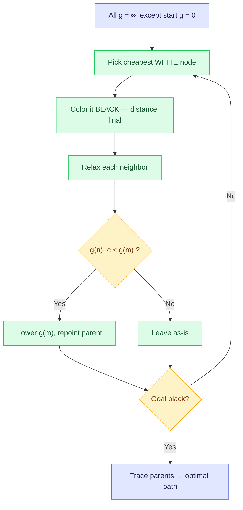

## The Simplest Explanation

Dijkstra is **Branch & Bound with better bookkeeping** — or equivalently, **A\* with no sense of direction** ($h = 0$ everywhere).

The idea in one sentence: *always extend the cheapest path you have so far*. It looks only **backward** at actual cost incurred ($g$), never forward. Like water flooding outward from the source, it reaches nodes in order of their true cheapest distance.

$$f(n) = g(n) + \underbrace{h(n)}_{=\,0} = g(n)$$

<Callout type="tip" title="Remember This">
Dijkstra = pick the unvisited node with the smallest $g$. Once a node is visited ("colored black"), its shortest distance is final — because all edge costs are positive, no detour can ever improve it.
</Callout>

## From Branch & Bound to Dijkstra

**Branch & Bound** extends the cheapest partial path each step. It works: always refining the cheapest partial solution guarantees that when a complete solution beats all remaining estimates, it's optimal. But it keeps *every partial path* as a separate node in a search tree — the same city appears in dozens of partial paths.

**Dijkstra (1959)** cleans this up:

- Keep **one copy** of each node in a single graph
- Store one $g$-value and one parent pointer per node
- When a cheaper route to a node is found, just **update its $g$ and re-point its parent**

Same algorithmic heart, dramatically less memory.

## The Algorithm

1. Assign $g = 0$ to start, $g = \infty$ to every other node; all nodes white (unvisited)
2. While unvisited nodes remain:
   - Pick the **cheapest white node** $n$
   - Color it black (visited) — its distance is now final
   - For each white neighbor $m$: **relax** edge $(n,m)$:
     - if $g(n) + c(n,m) < g(m)$, set $g(m) = g(n) + c(n,m)$ and parent$(m) = n$
3. Stop when the goal turns black; reconstruct the path via parent pointers

<Callout type="important" title="Why 'Black Means Final' Works">
When node $n$ is chosen as cheapest among all white nodes, any alternative route to $n$ must pass through some other white node $w$ with $g(w) \geq g(n)$ — and since edges cost $\geq 0$, that route costs $\geq g(n)$. No improvement possible. This argument **requires non-negative edge costs**; negative edges break Dijkstra.
</Callout>

## Interactive Trace

Watch Dijkstra flood outward from S to goal D, updating parents whenever a cheaper route appears:

<DijkstraViz />

### Key Observations

1. **Cheapest-first ordering**: after visiting S, node A ($g=2$) beats B ($g=5$) even though B was generated first.
2. **Parent repointing**: B's parent changes from S to A when $2+1 = 3$ undercuts $5$. Dijkstra handles this gracefully because each node exists once.
3. **No Case-3 problem**: once black, a node's $g$ is never revised again — unlike A*, which may need to reopen closed nodes.

## Where Dijkstra Sits in the Family

| Algorithm | Picks by | Direction | Optimal? |
|-----------|----------|-----------|----------|
| BFS | fewest hops | backward (hops) | Yes, unweighted only |
| Branch & Bound / UCS | cheapest partial path $g$ | backward ($g$) | Yes |
| **Dijkstra** | cheapest single node $g$ | backward ($g$) | **Yes** |
| Best-First Search | smallest $h$ | forward ($h$) | No |
| A* | smallest $f = g + h$ | both | Yes, admissible $h$ |

Dijkstra explores blindly in all directions like flood fill. On a map going south from Chennai, it will explore half of Chennai before heading toward Mahabalipuram. Adding a heuristic $h$ converts it into **A*** — same skeleton, plus direction.

## Complexity

| Property | Value |
|----------|-------|
| Complete? | Yes (finite graph) |
| Optimal? | **Yes**, for non-negative edge costs |
| Time | $O((V + E)\log V)$ with binary heap |
| Space | $O(V)$ — one entry per node |

Compare BFS's $O(b^d)$ tree explosion: Dijkstra's single-copy trick caps memory at one slot per distinct node.

<Quiz
  question="Dijkstra's algorithm is a special case of A* with which heuristic?"
  options={[
    { label: "A", text: "$h(n) = h^*(n)$ — the perfect oracle" },
    { label: "B", text: "$h(n) = 0$ for all n" },
    { label: "C", text: "$g(n) = 0$ for all n" },
    { label: "D", text: "$h(n) = \\infty$ for all n" },
  ]}
  correctAnswer="B"
  explanation="With h ≡ 0, f(n) = g(n): pick lowest actual-cost-so-far. That's exactly Dijkstra (and Branch & Bound)."
/>

<Quiz
  question="Why can Dijkstra finalize a node (color it black) without ever revisiting it?"
  options={[
    { label: "A", text: "Because MoveGen never returns duplicate neighbors" },
    { label: "B", text: "Any cheaper route would need to pass through another unvisited node whose g is already ≥ this node's g, and edges are non-negative" },
    { label: "C", text: "Because it uses a Closed list that forbids reopening" },
    { label: "D", text: "It can't — Dijkstra does revisit closed nodes like A*" },
  ]}
  correctAnswer="B"
  explanation="This is the core invariant. Non-negative edge costs mean paths only get more expensive as they lengthen, so the globally-cheapest white node cannot be improved later."
/>

<Quiz
  question="What happens if some edges have NEGATIVE cost?"
  options={[
    { label: "A", text: "Nothing — Dijkstra handles negative edges fine" },
    { label: "B", text: "It may finalize a node before its true cheapest path is found, giving wrong answers" },
    { label: "C", text: "It returns the longest path instead" },
    { label: "D", text: "It fails to terminate on any input" },
  ]}
  correctAnswer="B"
  explanation="The black-means-final proof relies on non-negative costs. With negative edges a later path through an expensive-looking region can turn out cheaper — use Bellman-Ford instead."
/>

<Accordion title="Common Exam Pitfalls">
1. **Confusing Dijkstra with BFS**: BFS counts hops and breaks with weighted edges. Dijkstra counts total cost. An exam graph where the 3-hop path costs less than the 2-hop path is designed to catch this.

2. **Forgetting to update parents during relaxation**: When B's g improves from 5 to 3 via A, B's parent must become A. Tracing the path through stale pointers gives a valid-but-suboptimal answer — a classic trace-table error.

3. **Marking the goal done too early**: You may only stop when the goal is *selected* (turned black), not merely discovered/relaxed. Its tentative g can still drop afterward.

4. **Mixing up Dijkstra vs A* closed-node behavior**: In Dijkstra, closing a node is permanent. In A*, a closed node CAN be reopened (Case 3) because imperfect h means the first path found isn't necessarily best. If an exam question says "a closed node got a cheaper path," you're looking at A*, not Dijkstra.
</Accordion>

<Accordion title="Dijkstra vs A* — Quick Comparison">
| Aspect | Dijkstra | A* |
|--------|----------|----|
| Evaluation | $f = g$ | $f = g + h$ |
| Sense of direction | None | Heuristic lookahead |
| Nodes explored | All within cost ≤ C* of start | Only nodes with $f \leq C^*$ |
| Reopens closed nodes? | Never | Possibly (Case 3 propagation) |
| Optimal? | Yes (non-negative costs) | Yes (admissible h) |
| Special case of A*? | $h = 0$ | — |

A* prunes everything Dijkstra prunes, **plus** whatever the heuristic rules out — so A* never expands more nodes than Dijkstra (with consistent h).
</Accordion>
