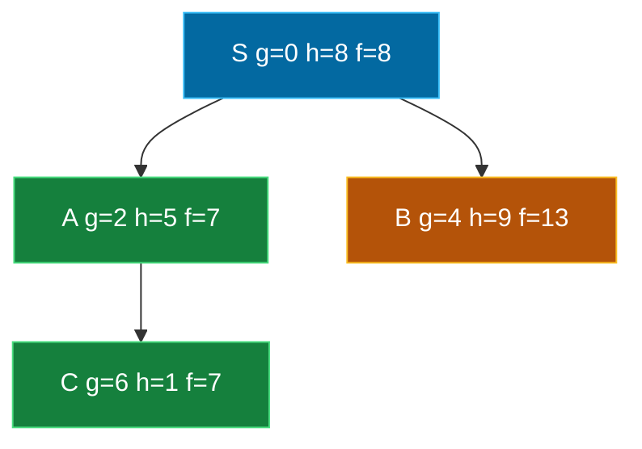

## The Simplest Explanation

A\*'s Achilles heel is memory: Open grows as $O(b^d)$, and real machines run out. SMA\* asks:

> **What if A\* simply worked within a fixed memory budget?**

When memory fills up, SMA\* **deletes the worst leaf** — the one with the highest $f$-value (least promising) — to make room. But it doesn't throw the information away blindly: it backs the deleted node's $f$-value up into its parent, so the family *remembers* there was a promising-but-forgotten branch down there.

<Callout type="tip" title="Remember This">
SMA\* = A\* + a memory cap. Full memory → drop the worst leaf → write its $f$ into its parent. If all alternatives are proven worse than the forgotten branch, SMA\* regenerates it.
</Callout>

## Why Not Just Cap A\*'s Open List?

Naive fixes fail in instructive ways:

| Naive approach | Failure mode |
|----------------|--------------|
| Drop highest-$f$ nodes permanently | May discard the **only** solution path when the optimal route initially looks expensive |
| Switch to DFS when full | Loses optimality guarantees; dives down rabbit holes |
| Restart with a bigger bound (IDA\*-style) | Re-expands everything from scratch each round |

SMA\*'s trick is **graceful forgetting**: dropped branches leave a "tombstone value" on their ancestors, so nothing good is lost forever.

## The Algorithm

Each node stores: $g(n)$, $h(n)$, $f(n) = g + h$, and whether it's fully expanded.

1. Expand the best leaf (lowest $f$), as in A\*
2. If memory is full, drop the **worst leaf** (highest $f$) and remove it from its parent's successors
3. Back up values: a fully expanded parent whose children are gone gets
   $$f(\text{parent}) = \min_{\text{forgotten children } c} f(c)$$
   This makes the parent look like a leaf again — eligible for re-expansion
4. When the parent is later re-expanded, regenerate its children; a child whose remembered $f$ matches the backup can inherit it instead of recomputing $g+h$

### Termination

- **Success**: goal dequeued (with admissible $h$, cost is optimal if the goal was reached within memory)
- **Failure**: the root's $f$ = ∞ and memory is full → no solution exists within this space
- **In-between**: SMA\* may return the best solution found so far — the most complete algorithm in this sense

## Worked Example (Mini Trace)

Memory holds **3 nodes**, tree below. Edge costs in gray, $h$ in parentheses.

| Step | Action | Memory | Notes |
|------|--------|--------|-------|
| 1 | Expand S | `{S}` | children A($f{=}7$), B($f{=}13$) enter Open |
| 2 | Expand A (lowest $f$) | full at 3 nodes | dropping worst leaf **B** ($f{=}13$); back up $f(B)=13$ onto S |
| 3 | Expand C ($f{=}7$) | must drop something | worst leaf now has $f=7$... but S's backup says a forgotten branch costs 13 > 7, so B stays forgotten |
| 4 | Continue toward goal via C | ≤ 3 nodes | optimal path S→A→C found without ever holding more than 3 nodes |

The key moment is step 2–3: SMA\* preferred expanding $f=7$ nodes over regenerating the forgotten $f=13$ branch. Only if every live alternative exceeded 13 would it re-create B.

## Properties

| Property | Value | Condition |
|----------|-------|-----------|
| Complete? | **Yes** — if memory ≥ depth of shallowest solution | finite $b$, $\epsilon > 0$ edge costs |
| Optimal? | **Yes** — if memory can hold the shallowest solution path | admissible $h$ |
| Optimal with tight memory? | Returns the **best found so far** — never gives up early like A* does (OOM crash) | — |
| Time | Can re-expand nodes many times when memory is very small | degrades gracefully to repeated work |
| Space | $O(m)$ where $m$ = memory bound | by construction |

<Callout type="info" title="SMA* vs IDA*">
Both fight A*'s memory hunger. IDA* deepens iteratively on an f-cost threshold using only a DFS stack (no Closed list, no duplicates). SMA* keeps an explicit bounded Open list and uses its whole budget intelligently. IDA* is simpler and great when memory is tiny; SMA* uses available memory more effectively.
</Callout>

## The Family Portrait

Every algorithm in this course is one idea away from A*:

| Algorithm | Change from A* | Cost paid |
|-----------|---------------|-----------|
| Dijkstra / Branch & Bound | $h = 0$ | explores blindly |
| Greedy Best-First | $g = 0$ | loses optimality |
| Weighted A* | $f = g + W{\cdot}h$, $W>1$ | bounded suboptimality |
| IDA* | iterative deepening on $f$-threshold | repeated expansions, no duplicate detection |
| **SMA*** | hard memory ceiling | possible re-expansion of forgotten nodes |

<Quiz
  question="When SMA*'s memory becomes full, which node does it delete?"
  options={[
    { label: "A", text: "The deepest leaf" },
    { label: "B", text: "The leaf with the LOWEST f-value" },
    { label: "C", text: "The leaf with the HIGHEST f-value (least promising)" },
    { label: "D", text: "A random leaf, chosen uniformly" },
  ]}
  correctAnswer="C"
  explanation="Keep hope alive: preserve the best frontier, sacrifice the worst. The deleted node's f is backed up to its parent before removal."
/>

<Quiz
  question="What happens to the f-value of a deleted node?"
  options={[
    { label: "A", text: "It is lost forever" },
    { label: "B", text: "It is backed up: its fully-expanded ancestor gets the min over its forgotten children's f-values" },
    { label: "C", text: "It is added to the goal test" },
    { label: "D", text: "It doubles every time a node is deleted" },
  ]}
  correctAnswer="B"
  explanation="The backup makes the ancestor look like a leaf again with the forgotten branch's price tag — so SMA* can regenerate exactly that branch if everything else proves worse."
/>

<Quiz
  question="SMA* is guaranteed to find the OPTIMAL solution whenever..."
  options={[
    { label: "A", text: "h is admissible, regardless of memory" },
    { label: "B", text: "the available memory is at least enough to hold the shallowest solution path" },
    { label: "C", text: "the branching factor is 2" },
    { label: "D", text: "memory exceeds b^d nodes" },
  ]}
  correctAnswer="B"
  explanation="If memory suffices for the actual solution path, SMA* behaves like A* along that path and returns it optimal. With less memory, it still returns the best solution found — but may miss the optimum."
/>

<Accordion title="Common Exam Pitfalls">
1. **Forgetting the backup step**: Deleting the worst leaf without writing its $f$ into the parent turns SMA* into lossy A*, breaking completeness. Exams specifically probe the min-backup rule.

2. **Assuming SMA* is always optimal**: Optimality needs enough memory for the shallowest goal path plus admissible h. State BOTH conditions.

3. **Confusing SMA* with MA***: MA* is the older, more complicated memory-bounded A*. SMA* ("Simplified") achieves the same guarantees with cleaner rules — cite Russell (1992).

4. **Thinking re-expansion is a bug**: Regenerating forgotten nodes is SMA*'s designed mechanism. Time complexity can exceed A*'s precisely because of it — that's the trade for bounded space.
</Accordion>
