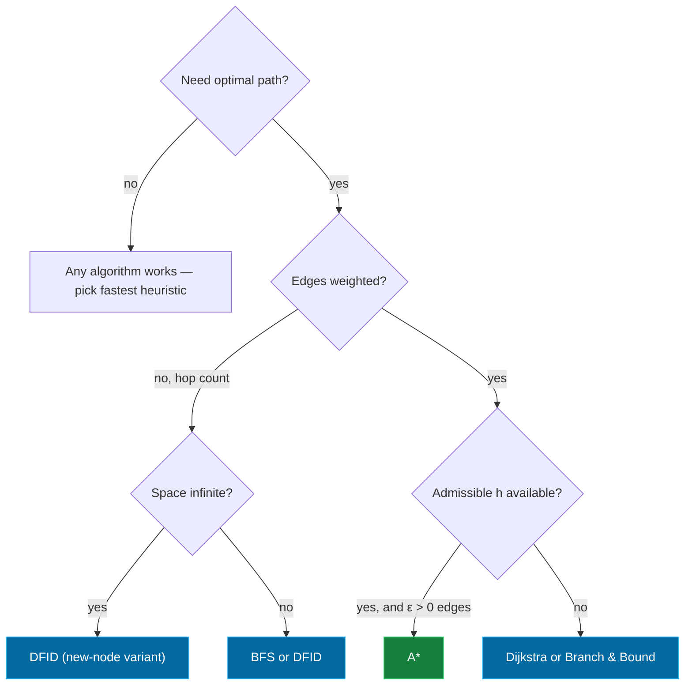

## The Question That Keeps Coming Back

Papers reuse this exact format:

> *"Given a state space with edge costs, which of the following can find the optimal path?
> (A) DFS  (B) BFS  (C) Dijkstra  (D) Branch & Bound  (E) A\*  (F) WA\* for some w  (G) SMGS"*

One table answers every variant of this question.

## The Master Table

| Algorithm | Finds optimal path? | Condition | Why |
|-----------|--------------------|-----------|-----|
| **DFS** | ✗ | — | dives into whatever branch is first; ignores costs |
| **BFS** | only in **unweighted** graphs (fewest hops) | all edges equal | level-order = fewest edges, not cheapest cost |
| **Dijkstra / UCS** | ✓ | non-negative edge costs | expands nodes in true-cost order; black means final |
| **Branch & Bound** | ✓ | lower-bound estimates are valid; loop checking ok | always extends the cheapest partial path |
| **A\*** | ✓ | $h$ admissible ($h \leq h^*$), finite branching, edge costs $\geq \epsilon > 0$ | Lemma-based proof (Week 5): Open always holds a node with $f \leq C^*$ |
| **WA\*** ($w>1$) | ✗ (in general) | only if $h$ never overestimates even after weighting... practically no | inflates h → may chase a suboptimal goal before verifying cheaper ones |
| **SMGS** (Sparse/Simple Memory Graph Search) | ✓ | memory suffices for its bounded duplicate-detection | memory-bounded variant that keeps optimality where plain SMA*-style forgetting would lose it |
| Greedy Best-First | ✗ | — | follows $h$ blindly, ignores $g$ entirely |

<Callout type="tip" title="The Exam Answer Pattern">
For weighted graphs with unknown heuristic properties: safe picks = <strong>Dijkstra, Branch &amp; Bound</strong>. BFS only when the question says unweighted. A* only when admissibility is stated. WA* and greedy are traps. This exact combination appeared verbatim in multiple papers.
</Callout>

## The Special Cases Exams Love

### $w = 0$ in Weighted A*

$$f(n) = g(n) + w \cdot h(n)\Big|_{w=0} = g(n) \implies \text{behaves like Dijkstra}$$

So **w = 0 ⇒ optimal** (given non-negative costs). And as $w \to \infty$, WA* approaches Greedy Best-First — fast but suboptimal. Memorize both endpoints.

### $h = 0$ in A*

Same collapse: $f = g$ ⇒ Dijkstra/Branch-&-Bound behavior, still optimal but explores blindly.

### BFS on unweighted graphs

BFS *is* optimal when cost = number of edges. The trap: papers say "edge costs may or may not be equal" — then BFS loses its guarantee.

### DFID

Optimal in unweighted spaces **if it doesn't prune via Closed** (the new/open-nodes variant); the closed-node-pruning variant can miss shortest paths. See the [DFID page](/concepts/week-02-blind-search/04-dfid).

## Decision Flowchart

## A*'s Fine Print (when the question adds conditions)

A* is guaranteed optimal iff ALL three hold (Week 5 lecture):

1. **Finite branching factor**
2. **Edge costs bounded below by some $\epsilon > 0$** — merely positive isn't enough! Costs like $1, \frac{1}{2}, \frac{1}{4}, \ldots$ sum finite while giving infinitely many steps, trapping the search.
3. **$h(n) \leq h^*(n)$ everywhere** (never overestimates)

If a paper's option list includes A* but the stem says *"heuristic properties not known"* — you cannot select A*. That phrase exists precisely to eliminate it.

## One-Line Summaries to Memorize

| If asked about… | Answer with… |
|------------------|--------------|
| "cheapest-first, no heuristic" | Dijkstra — optimal, non-negative costs |
| "extend cheapest partial path" | Branch & Bound — optimal |
| "$f = g + Wh$, large W" | fast, bounded-suboptimal, NOT optimal |
| "memory-bounded but still complete/optimal given room" | SMA*/SMGS family |
| "shortest in hops, infinite tree" | DFID without closed pruning |
| "follows h only" | greedy — never optimal in general |

<Quiz
  question="A weighted graph, heuristic properties unknown. Which selections are SAFE for finding an optimal path?"
  options={[
    { label: "A", text: "A* and WA*" },
    { label: "B", text: "Dijkstra and Branch & Bound" },
    { label: "C", text: "BFS and DFS" },
    { label: "D", text: "Greedy Best-First and SMGS" },
  ]}
  correctAnswer="B"
  explanation="Without knowing h is admissible, only algorithms that ignore h entirely carry guarantees: Dijkstra and B&B. 'Heuristic properties not known' eliminates A*, WA*, greedy."
/>

<Quiz
  question="Setting w = 0 in Weighted A* makes the algorithm..."
  options={[
    { label: "A", text: "behave like Greedy Best-First Search" },
    { label: "B", text: "behave like Dijkstra's algorithm — and find optimal paths" },
    { label: "C", text: "incomplete" },
    { label: "D", text: "equivalent to DFS" },
  ]}
  correctAnswer="B"
  explanation="f = g + 0·h = g: pure backward-looking cost ordering, i.e., Dijkstra/B&B — optimal for non-negative edge costs."
/>

<Quiz
  question="Why does the A* optimality proof require edge costs ≥ ε > 0 rather than just > 0?"
  options={[
    { label: "A", text: "To make MoveGen deterministic" },
    { label: "B", text: "Paths like 1 + 1/2 + 1/4 + … have finitely many... actually INFINITELY many edges with finite cost, letting A* extend paths forever without f exceeding C*" },
    { label: "C", text: "Because zero-cost edges break the priority queue" },
    { label: "D", text: "It doesn't — any positive costs suffice" },
  ]}
  correctAnswer="B"
  explanation="With merely-positive costs there can be infinitely many partial paths whose total stays under C*, so termination (Lemma 3) fails. An ε floor bounds the number of edges per path."
/>

<Accordion title="Rapid-Fire Property Table (all algorithms)">
| Algorithm | Complete? | Optimal? | Time | Space |
|-----------|----------|----------|------|-------|
| DFS | no (infinite spaces) | no | $O(b^d)$ | $O(bd)$ |
| BFS | yes (finite path length) | unweighted only | $O(b^d)$ | $O(b^d)$ |
| DFID (no closed pruning) | yes | unweighted yes | $O(b^d) \cdot \frac{b}{b-1}$ | $O(bd)$ |
| Dijkstra | yes | yes ($c \geq 0$) | $O((V{+}E)\log V)$ | $O(V)$ |
| Branch & Bound | yes | yes | exponential | exponential |
| A* | yes | yes (admissible h, ε-edges) | $O(b^d)$ worst | $O(b^d)$ |
| WA* | yes | no (bounded error ≤ w·C*) | better than A* typically | like A* |
| IDA* | yes | yes (admissible h) | like DFID on f | $O(bd)$ |
| Greedy | no (loops possible) | no | $O(bm)$ | $O(bm)$ |
| SMA* | yes if memory ≥ solution depth | yes if memory suffices | varies | $O(m)$ |
</Accordion>
