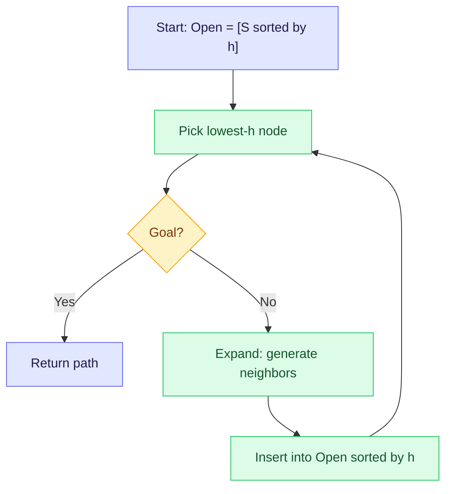
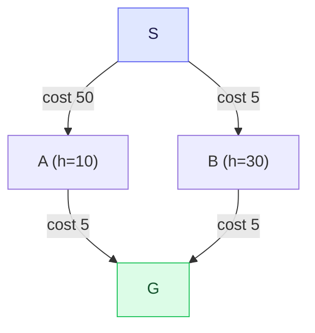

## The Simplest Explanation

Best First Search = **always expand the node that looks closest to the goal**.

You have a heuristic $h(n)$ that guesses distance to goal. At each step, pick the unvisited node with smallest $h$. That's it. No $g$ (cost so far), no $f$. Just $h$.

<Callout type="tip" title="Remember This">
Best First = sort Open by $h$ alone. It's Dijkstra's mirror: Dijkstra looks only backward ($g$), Best First looks only forward ($h$). A* does both.
</Callout>

## The Algorithm (from Lecture 31)

Same skeleton as DFS/BFS, one change: Open is a **priority queue ordered by $h$**.

1. `Open = [(S, nil, h(S))]` sorted by $h$; `Closed = []`
2. While Open not empty:
   - Pick lowest-$h$ node $N$ from Open
   - If GoalTest($N$) → return path
   - Move $N$ to Closed
   - For each neighbor $M$ of $N$:
     - Compute $h(M)$
     - If $M$ not on Open/Closed → insert sorted by $h$

Node representation upgrades from pairs to **triples** `(node, parent, h)`.

## Heuristics for Route Finding (Lecture 31)

**Manhattan distance** (grid): `|x1-x2| + |y1-y2|` steps. Integer, counts grid moves.
**Euclidean distance**: `sqrt((dx)^2 + (dy)^2)` straight line. Real-valued.

On a map where edge cost is constant (e.g., 5 per move), **Manhattan is admissible** if it never exceeds true shortest-path cost. In exams, a tile is 10×10 and edge cost is 5 — Manhattan with unit 10 can **overestimate** when diagonal shortcuts exist via edge costs smaller than grid steps. The 2023 papers ask exactly this.

## Comparison Table

| Property | Best First | Dijkstra ($g$) | A* ($f=g+h$) | BFS (hops) |
|---|---|---|---|---|
| Orders Open by | $h$ | $g$ | $g+h$ | depth |
| Looks forward? | Yes | No | Yes | No |
| Looks backward? | No | Yes | Yes | No |
| Guarantees shortest? | **No** | Yes (if $c≥0$) | Yes (if $h≤h^*$) | Only if uniform cost |
| Space | $O(b^d)$ | $O(b^d)$ | $O(b^d)$ | $O(b^d)$ |

### Why Not Optimal?

Best First chases the heuristic downhill and may find a non-optimal path that *looked* close:

Best First picks A (h=10 < 30), finds path cost 55. The optimal is via B, cost 10. It ignored $g$.

## Exam Trace: 23T2 AN Pattern

Map with 10×10 grid, S(0,20), A(20,0), B(20,20), C(40,0), D(10,40), E(30,40), F(30,60), G(50,40). Alphabetical tie-break.

| Algorithm | Path Found | Reasoning |
|---|---|---|
| DFS | S,A,C,G | Goes deep via alphabetical order |
| **Best First** | **S,D,F,G** | Picks smallest $h$ at each step (D closest to G by Manhattan) |
| A* | S,B,E,G | Balances $g+h$ |
| B&B | S,A,C,G | Cheapest partial path (like Dijkstra with pruning) |

Best First finds S-D-F-G because $h(D)$ is smallest from S, then $h(F)$ from D, etc. — purely heuristic-driven.

## Hill Climbing vs Best First (Lecture 32)

| | Hill Climbing | Best First |
|---|---|---|
| Memory | $O(1)$ — only current node + neighbors | $O(b^d)$ — full Open |
| Backtracking? | **No** — if stuck, terminates (local optimum) | Yes — via Open |
| Complete? | No | Yes (finite space) |
| When stuck | Local max, even if global far away | Eventually explores whole space |

<Quiz
  question="Best First Search orders Open by..."
  options={[
    { label: "A", text: "g(n) — cost from start" },
    { label: "B", text: "h(n) — heuristic estimate to goal" },
    { label: "C", text: "f(n) = g(n)+h(n)" },
    { label: "D", text: "Depth from start" },
  ]}
  correctAnswer="B"
  explanation="Best First is pure h-ordering. Add g to get A*, remove h to get Dijkstra, sort by depth to get BFS."
/>

<Quiz
  question="Why does Best First NOT guarantee optimality?"
  options={[
    { label: "A", text: "It prunes too aggressively" },
    { label: "B", text: "It ignores g, so a heuristically-close node may lie down an expensive path" },
    { label: "C", text: "It requires infinite memory" },
    { label: "D", text: "It only works on grids" },
  ]}
  correctAnswer="B"
  explanation="h estimates remaining cost but says nothing about cost already incurred. A node with tiny h may be reached via a huge g detour."
/>

<Accordion title="Common Exam Pitfalls">
1. **Confusing Best First with A***: Best First uses $h$, A* uses $f=g+h$. Papers often give both and expect different paths.
2. **Manhattan admissibility trap**: Compare Manhattan (×10 per tile) to edge costs. If edge cost < 10 per grid step, Manhattan overestimates → inadmissible.
3. **Tie-breaker matters**: "Alphabetical order" changes expansion sequence — follow it exactly in traces.
4. **Hill Climbing ≠ Best First**: Hill climbing has no Open list, no backtracking. If exam says "Hill Climbing gets stuck", answer is local optimum.
</Accordion>
