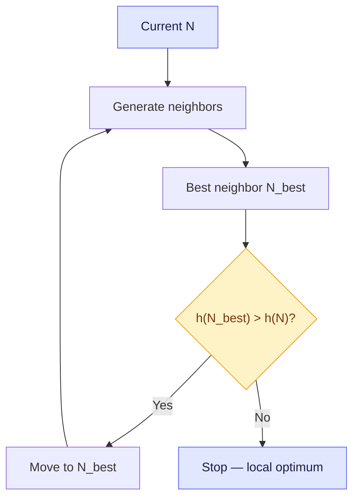
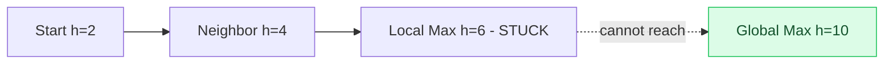

## The Simplest Explanation

Hill Climbing = **keep only the current node, move to the best neighbor if it's better, else stop**.

No Open, no Closed. $O(1)$ memory. But it gets **stuck at local optima**.

<Callout type="tip" title="Remember This">
Hill climbing = Best First with beam width 1 and no backtracking. It stops when no neighbor beats the current node — not when it hits the goal. It solves optimization, not path-finding.
</Callout>

## Algorithm (Lecture 32)

```
current = start
loop:
  neighbors = MoveGen(current)
  best = argmax h(neighbor)  // or argmin for minimization
  if h(best) <= h(current): break // local optimum
  current = best
return current
```



## Why It Gets Stuck

A landscape with peaks (heuristic values):



No neighbor of B is better, so HC stops at $h=6$ while global is $h=10$. **No backtracking** — Open was discarded.

### Blocks World Example (Lecture 32)

Heuristic $h_1$ (add 1 per correct block, subtract 1 per wrong): HC from start moves A onto E, reaches a state where every move worsens $h_1$ — stuck at local max. Heuristic $h_2$ (weighted by correct tower height) gives a smooth slope and HC succeeds. **Lesson: heuristic defines terrain; good heuristic = smooth terrain.**

## Escapes: Beam, Tabu, Variable Neighborhood

| Method | Idea | Space | Effect |
|---|---|---|---|
| **Beam Search** | Keep $B$ best candidates each level (B=1 is HC) | $O(B)$ | Wider beam = less likely stuck, more memory |
| **Variable Neighborhood Descent** | Try sparse neighborhood $N_1$ (flip 1 bit); if stuck, try $N_2$ (flip 2 bits), etc. | $O(1)$ per level | Cheap most steps, dense only when needed |
| **Tabu Search** | Forbid reversing recent moves for $T$ steps (tabu tenure) + aspiration if better than best seen | $O(T)$ | Prevents bouncing back to local max |

## Stochastic Variants (Week 4)

**Stochastic Hill Climbing**: pick a random neighbor, accept with probability `sigmoid(delta / T)`. High $T$ = random walk, low $T$ = greedy.

**Simulated Annealing**: gradually reduce $T$ (cooling schedule). Early exploration, late exploitation. Can escape shallow local optima with probability related to depth of valley.

| | Iterative Hill Climbing | Simulated Annealing |
|---|---|---|
| Randomness | Random restarts only | Every move probabilistic |
| Convergence | Needs large basins | Handles narrow basins better |

## Properties

| Property | Hill Climbing | Best First | Beam (width B) |
|---|---|---|---|
| Space | $O(1)$ | $O(b^d)$ | $O(B)$ |
| Complete | No | Yes | No (unless B large) |
| Optimal | No | No | No |

<Quiz
  question="Hill Climbing fails because..."
  options={[
    { label: "A", text: "Open grows exponentially" },
    { label: "B", text: "It discards Open, so it cannot backtrack from local optima" },
    { label: "C", text: "It requires admissible heuristics" },
    { label: "D", text: "It always prunes the optimal path" },
  ]}
  correctAnswer="B"
  explanation="Without Open there is no frontier to return to. Local max = termination, even though better peaks may exist elsewhere."
/>

<Quiz
  question="Beam width 1 in Beam Search equals..."
  options={[
    { label: "A", text: "BFS" },
    { label: "B", text: "Hill Climbing" },
    { label: "C", text: "A*" },
    { label: "D", text: "DFS" },
  ]}
  correctAnswer="B"
  explanation="B=1 keeps only the single best candidate each level — exactly hill climbing's behavior. Larger B trades memory for robustness."
/>

<Accordion title="Common Exam Pitfalls">
1. **Hill Climbing termination**: It stops when no neighbor beats current — NOT when GoalTest passes. Optimization vs decision confusion loses marks.
2. **Heuristic as terrain**: Exam asks why HC fails with h1 but succeeds with h2 — answer is landscape shape, not algorithm bug.
3. **Tabu tenure confusion**: Don't confuse tabu list (forbidden moves) with Open list (candidates). Tabu prevents cycling, Open enables backtracking.
</Accordion>
