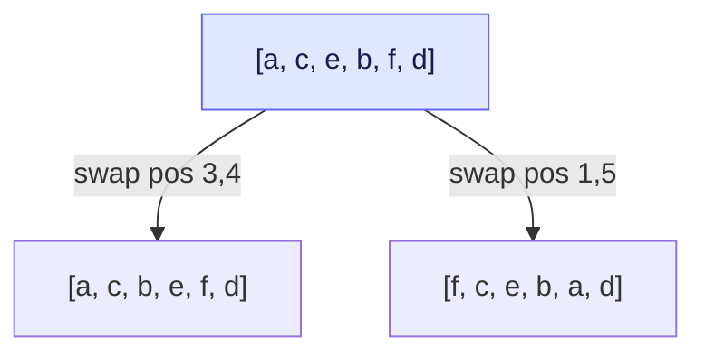
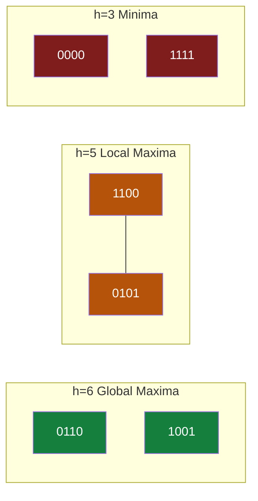

## The Simplest Explanation

Until now we searched **state spaces**: start from an initial state, apply operators, hunt for the goal, reconstruct a path. **Solution space search** flips the object:

> Every node IS a complete candidate solution. Find one that satisfies the goal description → done. No path to reconstruct.

Configuration problems (N-Queens, Sudoku, SAT) fit this naturally — the answer is a final assignment, not a route.

<Callout type="tip" title="Remember This">
State space asks "how do I get there?" Solution space asks "is this arrangement good enough?" For configuration problems you only ever need the second question.
</Callout>

## Two Ways to Navigate: Synthesis vs Perturbation

| | Synthesis | Perturbation |
|---|---|---|
| Start from | scratch / empty partial solution | a complete but flawed candidate |
| Move | add one more piece | swap/flip parts of the whole |
| Example | place queens row by row | swap two columns of a full board |
| Used by | DFS/BFS state-space search | local search |

For N-Queens encoded as an array (index = row, value = column), any permutation is a candidate; swapping two values generates a neighbor.

## The SAT Problem

Given a boolean formula over $n$ variables, find an assignment making it true. Formulas come in **CNF** (Conjunctive Normal Form):

$$F = \underbrace{(l_1 \lor l_2)}_{\text{clause}} \land \underbrace{(\neg l_3 \lor l_4 \lor l_5)}_{\text{clause}} \land \cdots$$

A satisfying assignment must make **every** clause true.

- Solution space size: $2^n$ candidates (each variable is a bit)
- Natural neighborhood: **flip one bit** → exactly $n$ neighbors per candidate
- Heuristic: number of satisfied clauses (maximize)

### Phase Transition

| Class | Complexity |
|-------|-----------|
| 2-SAT (≤2 literals/clause) | Polynomial |
| 3-SAT (≤3 literals/clause) | NP-complete |

Random 3-SAT satisfiability collapses sharply when clauses/variables ratio $m/n$ reaches ≈ **4.3** — the phase transition, also where deterministic algorithms struggle most.

## The SAT Landscape (Visual)

4 variables, 6 clauses → 16 candidates, heuristic h = satisfied clauses (ranges 3–6). Edges join one-bit-flip neighbors:

Three edge types appear:

- **Unique best neighbor**: hill climbing follows deterministically
- **Multiple best neighbors**: HC picks arbitrarily
- **Ridge edges** (same h on both ends): HC never crosses — no improvement!

From local maximum `1100`, plain HC is stuck. Tabu search can step *along* the ridge (same h, different node), then reach a global max at h=6 — the tabu ban prevents bouncing back.

## Properties

| Property | Value |
|----------|-------|
| Space searched | $2^n$ candidates (SAT) — but locally, not exhaustively |
| Neighborhood | flip-k bits; denser = harder to get stuck, costlier per step |
| Path reconstruction | Not needed — configuration problem |

<Quiz
  question="In solution space search for N-Queens as an array, a 'neighbor' is generated by..."
  options={[
    { label: "A", text: "adding one more queen" },
    { label: "B", text: "swapping values between two positions (perturbation)" },
    { label: "C", text: "backtracking to the previous row" },
    { label: "D", text: "restarting from empty board" },
  ]}
  correctAnswer="B"
  explanation="Perturbation modifies a COMPLETE candidate via swaps/flips. Adding queens row-by-row would be synthesis (state-space style)."
/>

<Quiz
  question="Random 3-SAT hits its hard phase transition around m/n = ..."
  options={[
    { label: "A", text: "1.0" },
    { label: "B", text: "2.7" },
    { label: "C", text: "≈4.3" },
    { label: "D", text: "10" },
  ]}
  correctAnswer="C"
  explanation="Below ~4.3 formulas are almost always satisfiable; above they're almost always unsatisfiable. Right at the cliff, algorithms struggle most."
/>

<Accordion title="Common Exam Pitfalls">
1. **Confusing the two search formulations**: state space = paths through operator applications; solution space = candidate arrangements. Configuration problems need only the latter.
2. **Ridge edges are not 'moves uphill'**: both endpoints have equal h — that's exactly why gradient-following can't take them, and why tabu's memory helps.
3. **2-SAT vs 3-SAT**: adding ONE literal per clause jumps polynomial → NP-complete. Classic MCQ.
</Accordion>
