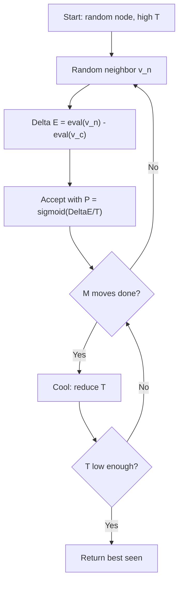
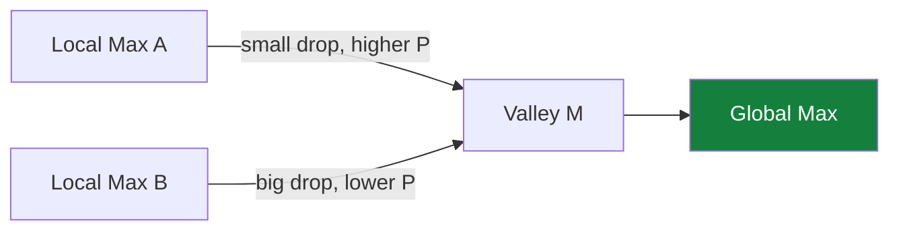

## The Simplest Explanation

Hill climbing is pure **exploitation**; a random walk is pure **exploration**. Simulated annealing sits between them with one dial:

> Pick a random neighbor. If better, usually move. If worse, move anyway **with probability** $P = \dfrac{1}{1 + e^{-\Delta E / T}}$ — high when the temperature T is hot, near zero when cold.

Then cool T slowly. Early = wander widely; late = greedy descent. Like metallurgy: heat metal so atoms roam, cool slowly so they settle into a low-energy crystal.

<Callout type="tip" title="Remember This">
ΔE &gt; 0 (better) → P above 0.5. ΔE &lt; 0 → P below 0.5. High T flattens everything toward 0.5 (random walk); low T sharpens into hill climbing.
</Callout>

## The Algorithm

Mechanics of accepting: draw a random number in [0,1]; move if it falls below P.

## The Temperature Dial

**Vary ΔE, fix T = 10** (current value 107):

| Neighbor | ΔE | P(accept) |
|---|---|---|
| 150 | +43 | 0.99 |
| 120 | +13 | 0.79 |
| 107 | 0 | 0.50 |
| 100 | −7 | 0.33 |
| 80 | −27 | 0.06 |

Better neighbors accepted almost surely; terrible ones almost never.

**Vary T, fix ΔE = +13:**

| T | e^(−13/T) | P |
|---|-----------|---|
| 1 | ≈0 | ≈1.00 |
| 5 | 0.074 | 0.93 |
| 10 | 0.27 | 0.79 |
| 50 | 0.77 | 0.56 |
| 100 | 0.88 | 0.53 |

Hot T compresses every probability toward 0.5 — even good moves are coin flips.

## Why It Escapes Local Optima

Two local maxima A and B with valley M between:

Descending from A to M costs a small ΔE drop → decent acceptance probability. Descending from B would need a huge drop → rarely accepted. So SA hops out of **shallow** local optima easily and deep ones rarely — exactly the right bias.

## Properties

| Property | Value |
|----------|-------|
| Space | O(1) — current node only |
| Complete? | Not guaranteed in finite time; converges to global optimum as T→0 slowly enough (theoretical result) |
| vs Iterated HC | IHC randomizes *starts*; SA randomizes *every move* within one run |

<Quiz
  question="As T approaches infinity, simulated annealing behaves like..."
  options={[
    { label: "A", text: "pure hill climbing" },
    { label: "B", text: "a random walk — every move accepted with P≈0.5" },
    { label: "C", text: "BFS" },
    { label: "D", text: "tabu search" },
  ]}
  correctAnswer="B"
  explanation="sigmoid(ΔE/∞) → sigmoid(0) = 0.5 for any ΔE: all moves equally likely."
/>

<Quiz
  question="A WORSE neighbor (ΔE < 0) is accepted when..."
  options={[
    { label: "A", text: "never — worse is always rejected" },
    { label: "B", text: "with probability below 0.5, higher when T is large" },
    { label: "C", text: "with probability above 0.5" },
    { label: "D", text: "only if it's a global optimum" },
  ]}
  correctAnswer="B"
  explanation="That's the whole point: controlled acceptance of bad moves lets the walk escape local optima, more readily at high temperature and for shallow descents."
/>

<Accordion title="Common Exam Pitfalls">
1. **Sign convention**: here ΔE = eval(new) − eval(current), maximizing h. For minimization formulations flip signs — read the question's eval direction.
2. **Temperature schedule**: SA reduces T after every M moves, not continuously per move. Exams show the loop: M moves at fixed T, then cool.
3. **Best seen vs current**: return the BEST node ever visited, not where you happen to end up — the walk may accept a bad move at freeze time.
</Accordion>
