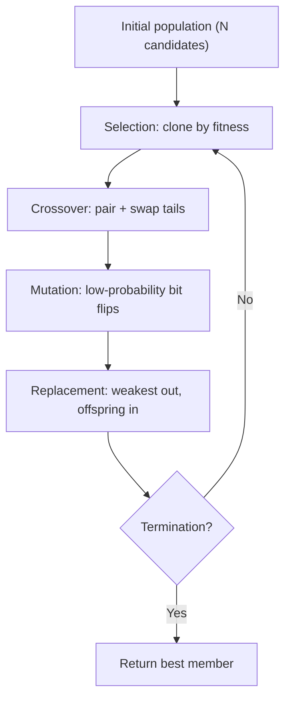

## The Simplest Explanation

Simulated annealing carries **one** candidate. Genetic algorithms (Holland, 1975) carry a **population**:

> Keep N candidate solutions. Let the fittest clone themselves most, mix two parents' genes via crossover, mutate occasionally, repeat. Evolution does the search.

Two vocabulary distinctions:
- **Genotype**: the chromosome (the bits) — what crossover acts on
- **Phenotype**: the expressed solution — what fitness/selection acts on

<Callout type="tip" title="Remember This">
Selection clones by fitness (roulette wheel), crossover mixes pairs at a cut point, mutation flips rare bits. Average fitness ratchets upward.
</Callout>

## The Algorithm

1. **Selection**: each candidate occupies a roulette sector proportional to its fitness; spin N times
2. **Crossover**: pair randomly, pick a random cut point, swap tails → two children
3. **Mutation**: flip each gene with tiny probability
4. **Replacement**: weakest K originals replaced by strongest K offspring

## Worked Example: Single-Point Crossover on SAT

Parents (6 variables, h = satisfied clauses):
- P1: `0 1 0 | 1 1 0` (h=4)
- P2: `1 1 1 | 0 1 0` (h=4)

Crossover after position 3:
- Child 1: `0 1 0` + `0 1 0`... precisely: head of P1 + tail of P2 = `0 1 0 0 1 0`
- Child 2: `1 1 1` + tail of P1 = `1 1 1 1 1 0`

The mixing can assemble clauses satisfied by different parents into a fitter child than either.

## Goldberg's Tiny Example

5-bit chromosomes, fitness = (decimal value)², population 4:

| Candidate | Bits | Value | Fitness |
|---|---|---|---|
| 1 | 01101 | 13 | 169 |
| 2 | 11000 | 24 | 576 |
| 3 | 01000 | 8 | 64 |
| 4 | 10011 | 19 | 361 |

Total = 1170, average = 293. Selection probabilities: cand 2 gets p=0.49, cand 3 only p=0.05. After a spin: copies `[1×1, 2×2, 3×0, 4×1]`. Crossover produces e.g. values `[12, 25, 27, 16]` → average fitness jumps to 433. Second cycle pushes further.

### The Danger: Lost Diversity

By cycle 2 only two unique candidates remain, and gene position 3 is now identical across the pool — that allele is gone forever; no crossover can resurrect it. Optimal `11111` becomes unreachable. Like cheetahs: over-specialized gene pool, unable to adapt.

<Callout type="warning" title="Moral">
A large, diverse population is essential. Small populations converge prematurely — mutation is the only remaining source of lost genes, and it's deliberately rare.
</Callout>

## Properties

| Property | Value |
|----------|-------|
| Population | N candidates maintained explicitly |
| Exploitation | via fitness-proportional selection |
| Exploration | via mutation + crossover recombination |
| Failure mode | premature convergence / gene loss |

<Quiz
  question="In GA selection, an individual's chance of being cloned is..."
  options={[
    { label: "A", text: "equal for all" },
    { label: "B", text: "proportional to its fitness (roulette wheel sector)" },
    { label: "C", text: "inversely proportional to fitness" },
    { label: "D", text: "decided by mutation" },
  ]}
  correctAnswer="B"
  explanation="Fitness-proportional (roulette wheel) selection: fitter candidates occupy larger sectors and expect more copies."
/>

<Quiz
  question="After convergence, a critical gene value vanishes from the whole population. The ONLY operator that can restore it is..."
  options={[
    { label: "A", text: "crossover" },
    { label: "B", text: "selection" },
    { label: "C", text: "mutation" },
    { label: "D", text: "replacement" },
  ]}
  correctAnswer="C"
  explanation="Crossover reshuffles existing genes; it cannot invent missing alleles. Mutation is the sole source of new genetic material."
/>

<Accordion title="Common Exam Pitfalls">
1. **Genotype vs phenotype**: crossover manipulates genotypes (bits); selection ranks phenotypes (fitness). Mixing these up breaks every explanation you write.
2. **Mutation rate**: deliberately LOW. High mutation destroys inherited structure and degenerates GA into random search.
3. **Average vs best fitness**: GA runs typically track AVERAGE population fitness rising per cycle — Goldberg's example goes 293 → 433.
</Accordion>
