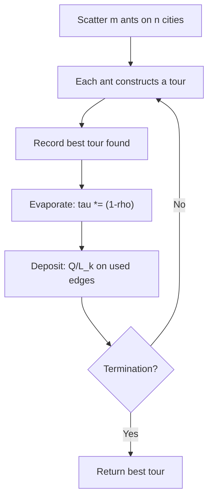

## The Simplest Explanation

Real ants find food with two tiny rules: **deposit pheromone where you walk** and **prefer stronger trails**. Shorter paths get round-tripped faster → more pheromone per minute → attract more ants → even more pheromone. The colony as a whole converges on the short route though **no individual ant knows anything about it**.

Ant Colony Optimization (Dorigo, 1992) ports this to graph problems like TSP.

<Callout type="tip" title="Remember This">
Each ant builds a tour greedily-but-stochastically using pheromone τ (collective memory) × visibility η = 1/distance (greedy pull). Shorter tours deposit more pheromone; unused trails evaporate.
</Callout>

## Emergence Context

ACO is a **swarm intelligence** method — complex collective behavior from simple local rules. Sibling phenomena: Conway's Game of Life (gliders from four trivial rules), flocks, termite mounds, brains. No central controller; the pattern *emerges*.

## The ACO Algorithm for TSP

Place m ants on n cities at random. Each ant constructs a full tour in n steps. Ant k at city i picks next city j with probability:

$$P_{ij}^k(t) = \frac{[\tau_{ij}(t)]^\alpha \cdot [\eta_{ij}]^\beta}{\sum_{l \in \text{allowed}} [\tau_{il}(t)]^\alpha \cdot [\eta_{il}]^\beta}$$

- $\tau_{ij}$ = pheromone on edge (i,j) — collective memory
- $\eta_{ij} = 1/d_{ij}$ = visibility — greedy pull toward near cities
- α, β weight trail vs visibility
- "allowed" excludes already-visited cities (no premature cycles)

Greedy stochastic construction: prefers near AND well-traveled, but never deterministic.

## Pheromone Update

After all m ants complete tours, in two steps:

**Evaporation** (trails fade):

$$\tau_{ij}(t+n) = (1-\rho)\,\tau_{ij}(t)$$

**Deposition** (each ant k reinforces every edge of its own tour):

$$\Delta\tau_{ij}^k = \frac{Q}{L_k}, \qquad \tau_{ij}(t+n) = (1-\rho)\tau_{ij}(t) + \sum_{k=1}^{m}\Delta\tau_{ij}^k$$

where $L_k$ = length of ant k's tour. **Shorter tours deposit MORE per edge** — reward inversely proportional to cost.

### Why Shorter Paths Win

If an obstacle splits an ant column into a short and long detour, both sides get traffic initially. But ants on the short side complete round trips faster, depositing pheromone at a higher rate. Positive feedback amplifies the advantage until nearly all traffic takes the short path.

## Properties

| Property | Value |
|----------|-------|
| Problem class | Any graph-search/optimization problem (TSP canonically) |
| Knowledge per agent | Local only — no ant sees the global tour |
| Key parameters | α (trail weight), β (visibility), ρ (evaporation), Q (deposit constant) |
| Failure mode | Premature convergence if ρ too low / exploration too weak |

<Quiz
  question="In ACO, visibility η_ij equals..."
  options={[
    { label: "A", text: "the pheromone on edge (i,j)" },
    { label: "B", text: "1 / distance(i,j) — a greedy pull toward nearby cities" },
    { label: "C", text: "the number of ants on the edge" },
    { label: "D", text: "the evaporation rate" },
  ]}
  correctAnswer="B"
  explanation="η encodes static desirability (closeness); τ encodes learned desirability (trail strength). Both raised to powers α and β."
/>

<Quiz
  question="Why does the shorter of two detours eventually win in ant trails?"
  options={[
    { label: "A", text: "Ants can see the destination" },
    { label: "B", text: "Faster round trips deposit pheromone faster; positive feedback amplifies the gap" },
    { label: "C", text: "Long paths evaporate instantly" },
    { label: "D", text: "A leader ant decides" },
  ]}
  correctAnswer="B"
  explanation="Deposition rate per unit time scales with trip frequency. The differential reinforcement is the entire mechanism — no individual knowledge required."
/>

<Accordion title="Common Exam Pitfalls">
1. **τ vs η roles**: τ is learned/collective and evolves; η is fixed geometry. Swapping them in the probability formula is a classic error.
2. **Evaporation purpose**: without ρ decay, early random trails would dominate forever and the algorithm couldn't forget bad regions.
3. **Q/L_k direction**: shorter tour L → LARGER deposit. Don't invert.
</Accordion>
