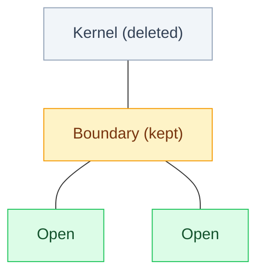

## The Simplest Explanation

A* is optimal but stores everything ($O(b^d)$). When the state space won't fit in RAM:

- **Frontier Search (Korf & Zhang)** keeps only the **boundary** between Open and Closed
- **SMGS (Sparse Memory Graph Search, Zhou & Hansen)** adds relay layers only when needed
- **IDA*** keeps nothing beyond the current path (DFS)

The exam's trick question: "State space too large for memory, Euclidean costs, best admissible heuristics — which algorithm for optimal path?" **Answer: SMGS (G).**

<Callout type="tip" title="Remember This">
Large space + need optimal + best heuristics → SMGS. Small space → A*. No heuristic knowledge → Dijkstra/B&B.
</Callout>

## Why A* Explodes

For sequence alignment (Week 6 Lecture 65): grid $(n+1) × (m+1)$, Open grows $O(n)$, but **Closed grows $O(n×m)$** — quadratically! Deleting Closed is where big savings lie.

## Frontier Search

**Idea**: Partition Closed into **Kernel** (all neighbors Closed — interior) and **Boundary** (neighbors Open — edge). Delete Kernel, keep Boundary + Open.

How to prevent leaking back into deleted territory? Store a **taboo list** on each Open node's neighbors.

**Path reconstruction**: Without full Closed, you lost parent pointers. Solution: **relay nodes** — save a middle layer where $g≈h$ (halfway). When goal found, recursively solve start→relay and relay→goal (divide & conquer). Cost: $O(d·T(d))$ time for $O$ space savings.

## SMGS (Adoptive Relay)

Frontier Search always creates relays at midpoints. SMGS is lazier: **monitor memory, only create a relay layer when RAM is low**. If problem fits, it's just A*.

- Start as A*
- When memory pressure → convert current Boundary → relay layer, delete Kernel
- Continue; may create multiple relays
- Maintains three sets: Open, Boundary, Kernel

This adaptivity makes SMGS the practical choice — it uses all available memory before paying relay overhead.

## Comparison: Memory-Bounded Optimal Algorithms

| Algorithm | Space | Optimal? | Key Idea |
|---|---|---|---|
| A* | $O(b^d)$ | Yes | Keep everything |
| IDA* (Korf 1985) | $O(d)$ | Yes | DFS with $f$-cutoff iteratively deepened |
| RBFS (Korf 1991) | $O(d)$ | Yes | Best-first with backtracking & thrashing |
| Frontier Search | $O(bd)$ frontier | Yes | Delete Kernel, taboo lists |
| **SMGS** | Adaptive $O$ | **Yes** | **Frontier + on-demand relays** |
| SMA* | $O(m)$ bounded | Only if $m$ ≥ solution depth | Forget worst leaf, backup $f$ |
| Beam Search | $O(Wd)$ | **No** | Keep $W$ best per level |

## IDA* vs RBFS (Quick)

**IDA***: cutoff = $f(start)$, DFS pruning $f>$cutoff, next cutoff = min pruned $f$. Linear space, admissible, but **repeated search** hurts when many nodes share same $f$ (cutoff grows slowly).

**RBFS**: Explore best child, remember second-best $f$; if all children exceed second-best, rollback and backup best child $f$ to parent. Also linear space but **thrashing** when branches tie.

## Exam Patterns

- Q: "Too large for memory, Euclidean, best admissible heuristics" → **SMGS**
- Q: "Unit costs, heuristic unknown, want optimal" → **BFS, Dijkstra, B&B** (not A*/SMGS because unknown h)
- Q: "Euclidean + best admissible" → **Dijkstra, B&B, A*, SMGS** (all optimal)
- Q: "Weighted A* w large → behaves like?" → **Best First** (not optimal even if $h$ admissible)

<Quiz
  question="When would you choose SMGS over A*?"
  options={[
    { label: "A", text: "When heuristic is inadmissible" },
    { label: "B", text: "When state space exceeds available memory but optimality is still required" },
    { label: "C", text: "When you want fastest non-optimal solution" },
    { label: "D", text: "When edge costs are negative" },
  ]}
  correctAnswer="B"
  explanation="SMGS trades time (relay reconstruction) for space. If memory suffices, A* is faster. If not and you still need optimal, SMGS is the exam's answer."
/>

<Quiz
  question="Frontier Search deletes Kernel nodes. How does it prevent returning to deleted space?"
  options={[
    { label: "A", text: "It hashes deleted nodes" },
    { label: "B", text: "Open nodes carry taboo lists of forbidden predecessors" },
    { label: "C", text: "It never deletes anything" },
    { label: "D", text: "It uses IDA* cutoffs" },
  ]}
  correctAnswer="B"
  explanation="Each Open node's taboo list blocks generation of its deleted Closed neighbors, sealing the frontier without storing the interior."
/>

<Quiz
  question="IDA*'s main downside vs A* is..."
  options={[
    { label: "A", text: "It is not admissible" },
    { label: "B", text: "Repeated re-exploration of shallow nodes, especially when many f-values cluster" },
    { label: "C", text: "It needs exponential memory" },
    { label: "D", text: "It cannot use heuristics" },
  ]}
  correctAnswer="B"
  explanation="Unlike SMGS which deletes selectively, IDA* restarts DFS from scratch each iteration. Small f-increments mean many iterations re-doing same work."
/>

<Accordion title="Common Exam Pitfalls">
1. **SMGS vs SMA* confusion**: SMGS is optimal (graph search with relay). SMA* is bounded-memory best-first that *forgets* worst leaf. Exam lists both; SMGS is the optimal large-space answer.
2. **Unit costs → BFS is optimal**: Students forget that BFS is optimal only when edge costs are uniform. If question says unit costs + unknown heuristic → BFS qualifies.
3. **Admissibility vs feasibility**: A* needs admissible $h$ for optimality; SMGS inherits same. Don't pick A*/SMGS when question says heuristic properties unknown.
4. **Monotone (consistent) condition**: Lecture 64 says monotone → f non-decreasing and Case 3 never happens (no closed re-expansion). This simplifies A* to Dijkstra-like closed handling.
</Accordion>
