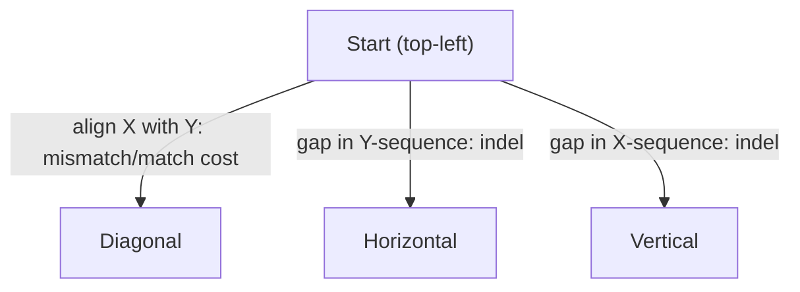

## The Simplest Explanation

Given two strings (DNA letters A/C/G/T), align them by sliding in **gaps** to minimize total cost:

- **Mismatch cost**: two different characters aligned against each other
- **Indel cost**: a gap inserted in either string

This is exactly **shortest-path search on an (n+1)×(m+1) grid** where each cell is a partial alignment.

<Callout type="tip" title="Remember This">
Three moves from every cell: diagonal = match/mismatch, right = gap in vertical string, down = gap in horizontal string. Path from top-left to bottom-right = one complete alignment.
</Callout>

## The Grid Model

Start node = top-left corner; goal = bottom-right. Every monotone path through the grid corresponds to exactly one alignment; its cost = sum of edge costs along the way.

### Why Costs Matter

If indel penalty = 3 and mismatch penalty = 7, inserting **two gaps** (cost 6) beats one mismatch (cost 7). If the mismatch penalty drops to 5, accepting the mismatch wins. The optimal alignment depends entirely on this ratio — same strings, different answers.

## The Scale Problem

Strings of length n and m give $(n{+}1)(m{+}1)$ cells:

| Move set | Number of paths |
|----------|----------------|
| Horizontal + Vertical only | $\binom{m+n}{n}$ |
| + Diagonal | combinatorially larger |

Real biological sequences run hundreds of thousands of characters → astronomically many paths. Search algorithms (A*, Dijkstra) are needed, not naive enumeration.

## Open vs Closed Growth — Why This Problem Matters

On the alignment grid:

- **Open grows linearly** — the frontier is at most about twice the grid width
- **Closed grows quadratically** ≈ area of explored region

For huge sequences, Closed dominates memory completely. This asymmetry is precisely why **Frontier Search / SMGS** (which delete Kernel Closed nodes) were invented — sequence alignment is their showcase application.

## Properties

| Property | Value |
|----------|-------|
| Solution | Minimum-cost path = optimal alignment |
| Edge costs | 3 kinds: diagonal (match/mismatch), horizontal indel, vertical indel |
| Monotone heuristic? | Manhattan-style distance to bottom-right works and satisfies consistency when costs ≥ per-step minimum |
| Memory bottleneck | Closed, not Open |

<Quiz
  question="In the alignment grid, a horizontal move represents..."
  options={[
    { label: "A", text: "aligning two characters (mismatch)" },
    { label: "B", text: "inserting a gap in the vertical string (indel)" },
    { label: "C", text: "finishing the alignment" },
    { label: "D", text: "a mutation" },
  ]}
  correctAnswer="B"
  explanation="Moving right consumes a character of the horizontal string while skipping the vertical one — that's a gap in the vertical sequence."
/>

<Quiz
  question="Why is sequence alignment THE motivating problem for pruning CLOSED?"
  options={[
    { label: "A", text: "Open grows quadratically there" },
    { label: "B", text: "Open stays linear (frontier width) but Closed grows quadratically with grid area" },
    { label: "C", text: "It has no goal state" },
    { label: "D", text: "Edges have negative costs" },
  ]}
  correctAnswer="B"
  explanation="The frontier hugs the anti-diagonal, but every visited cell sits in Closed. For long strings, deleting interior Closed nodes is the only way to fit in memory."
/>

<Accordion title="Common Exam Pitfalls">
1. **Direction naming**: 'horizontal' consumes the TOP string's next character while inserting a gap below — draw the grid before answering which gap goes where.
2. **Cost-ratio reasoning**: exam questions change indel vs mismatch penalties and expect you to re-decide gaps-vs-mismatch. Recompute, don't memorize.
3. **Path counting**: without diagonals it's simply binomial(m+n, n); don't overcomplicate unless diagonals are allowed.
</Accordion>
