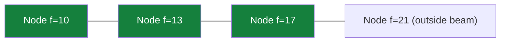

## The Simplest Explanation

Frontier Search pruned **Closed** (which grows quadratically on grids). But in tree-shaped spaces **Open** is the fat one — exponential per level. This family prunes Open:

> Keep only the W best nodes per level (by f-value), but add machinery so you don't lose the ability to backtrack.

<Callout type="tip" title="Remember This">
Beam-with-f keeps W best regardless of 'better than parent' (f increases with depth, so the old criterion would fail instantly). Upper-bound pruning then discards everything with f above a known feasible solution cost.
</Callout>

## Step 1: Beam Search with F Values

Keep the $W$ best nodes at each level, sorted by $f(n) = g + h$. Space: $O(W \cdot d)$.

Not admissible — a pruned node might have been on the optimal path. But fast and simple.

## Step 2: Upper Bound Pruning

1. Run plain beam search first → it finds *some* path to the goal with cost U
2. U is an **upper bound** on the optimal cost
3. Any node with $f(n) > U$ cannot lie on a better path → prune globally

This single number shrinks the searchable region dramatically around the optimal corridor.

## Step 3: Breadth-First Heuristic Search (BFHS)

Do BFS level-by-level, but expand only nodes with $f(n) \leq U$.

- Admissible ✓ (finds the optimal path within the bound)
- Frontier bounded by the U-corridor — often smaller than A*'s frontier empirically
- Still needs Closed for loop-checking

## Step 4: Beam Stack Search — Backtracking Beams

Plain beam discards nodes forever. Beam Stack Search keeps, at each level, two numbers:

| Value | Meaning |
|-------|---------|
| $f_{\min}$ | lowest f inside the current beam |
| $f_{\max}$ | lowest f OUTSIDE the beam (first backup candidate) |

When the beam dead-ends (all beam nodes exceed U), pop the stack, slide the beam window to include the next-best nodes (those between old $f_{\max}$ and next threshold), and continue. The stack records exactly which slices of each level were already tried — systematic exploration of everything under U, with only $O(W \cdot d)$ memory plus the stack.

Not admissible in general (the very first beam may exclude optimal-path members), but explores strictly more than plain beam.

## Step 5: Divide & Conquer Beam Stack Search

The extreme: keep only **three layers** of width W — Open, Boundary, Relay — deleting everything else.

Backtracking needs regeneration: re-run from the start, using the stored beam stack as a guide for which nodes to select at each level, until reaching the deletion point.

Space: $O(W)$ constant (ignoring the guide stack). Sacrifices admissibility entirely, solves problems far beyond A*'s reach.

## The Space–Optimality Ladder

| Algorithm | Space | Admissible? |
|-----------|-------|-------------|
| A* | exponential | Yes |
| IDA* / RBFS | linear | Yes |
| SMGS / Frontier | adaptive / reduced-Closed | Yes |
| BFHS | bounded by U | Yes |
| Beam (f) | $O(Wd)$ | No |
| Beam Stack | $O(Wd)$ + stack | No (explores more than beam) |
| D&C Beam Stack | $O(W)$ | No |

Each rung trades one resource for another: space down, optimality or time given up stepwise.

<Quiz
  question="Why does beam search switch from h-based to f-based ranking when moving to tree spaces?"
  options={[
    { label: "A", text: "h is unavailable" },
    { label: "B", text: "f values increase with depth, so the old 'only if better than current' h-criterion would reject every child" },
    { label: "C", text: "f makes it admissible" },
    { label: "D", text: "g equals zero there" },
  ]}
  correctAnswer="B"
  explanation="On trees g always grows along a path, so children's f usually exceeds parents'. Keeping 'W best by f' is the meaningful criterion."
/>

<Quiz
  question="What makes Beam Stack Search able to backtrack where plain beam cannot?"
  options={[
    { label: "A", text: "It stores all deleted nodes" },
    { label: "B", text: "The beam stack remembers f-min/f-max windows per level, so later passes slide the beam onto previously-excluded slices" },
    { label: "C", text: "It uses a priority queue" },
    { label: "D", text: "It restarts with larger W" },
  ]}
  correctAnswer="B"
  explanation="f_max recorded which nodes just missed the beam; backtracking shifts the window to include them, enabling systematic coverage."
/>

<Accordion title="Common Exam Pitfalls">
1. **Admissibility ladder**: BFHS IS admissible (bound U comes from a complete solution); beam/beam-stack are NOT unless the optimal path survives the beam.
2. **Where U comes from**: never assume an oracle — U is produced by running plain beam search first. Two-phase design.
3. **D&C regeneration cost**: constant space doesn't mean cheap — regenerating from scratch per backtrack multiplies time. State the tradeoff explicitly.
</Accordion>
