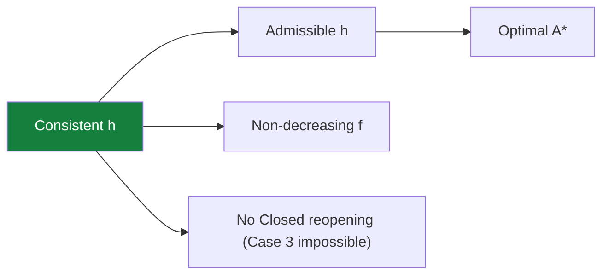

## The Simplest Explanation

A heuristic $h$ is **monotone** (consistent) if across every edge from node m to node n:

$$h(m) - h(n) \;\leq\; c(m, n)$$

In words: *the heuristic never drops faster than real cost accrues*. Equivalently, h never overestimates the cost of any single edge.

<Callout type="tip" title="Remember This">
Monotone ⇒ admissible (chain the inequality along any path to goal). The reverse is false. Manhattan distance on a grid is monotone whenever edge costs ≥ grid-step differences.
</Callout>

## Consequence 1 — f Never Decreases Along a Path

For successor n of m:

$$h(m) \leq h(n) + c(m,n)$$

Add $g(m)$ to both sides:

$$g(m) + h(m) \leq \underbrace{g(m) + c(m,n)}_{=\,g(n)} + h(n) = f(n)$$

So $f(m) \leq f(n)$: **f values are non-decreasing along every path A\* explores**. This matches observed A* traces where f creeps upward toward the goal.

## Consequence 2 — First Path Found to Any Node Is Optimal

When A* selects node n from Open, $g(n) = g^*(n)$ exactly.

Proof sketch by contradiction: if $g(n) > g^*(n)$, some node on the true optimal path to n would still be on Open with $f \leq g^*(n) + h(n) \leq f(n)$, contradicting that n was the minimum choice. Hence no cheaper route to n exists.

### The Payoff: Case 3 Vanishes

Recall A*'s three cases for neighbors:

1. New → add to Open
2. On Open with cheaper g → update
3. **On Closed with cheaper g → update + propagate improvement to descendants**

Under monotonicity, Case 3 **never arises**. Once a node moves to Closed, it stays put — no reopening, no propagation. A* degenerates into Dijkstra-style bookkeeping: close once, done.

## Why This Unlocks Memory Pruning

If Closed nodes are final, they can be safely deleted or compressed (Frontier Search / SMGS rely on this). With an inconsistent heuristic you must keep Closed around — a reopened node might need its old parent chain.

| Heuristic | Reopenings | Closed pruning safe? |
|-----------|-----------|---------------------|
| Monotone | none | Yes |
| Merely admissible | possible (Case 3) | No |
| Inadmissible | frequent; optimality lost anyway | moot |

<Quiz
  question="Monotone condition on edge (m,n) states..."
  options={[
    { label: "A", text: "h(m) + h(n) ≤ c(m,n)" },
    { label: "B", text: "h(m) − h(n) ≤ c(m,n)" },
    { label: "C", text: "h(n) − h(m) ≥ c(m,n)" },
    { label: "D", text: "h(m) ≤ h*(n)" },
  ]}
  correctAnswer="B"
  explanation="The heuristic drop across an edge never exceeds that edge's cost — triangle-inequality-flavored consistency."
/>

<Quiz
  question="Under a consistent heuristic, when A* expands n, g(n) equals..."
  options={[
    { label: "A", text: "an upper bound on g*(n)" },
    { label: "B", text: "exactly g*(n), the optimal cost — first find is final" },
    { label: "C", text: "zero" },
    { label: "D", text: "undefined until the goal pops" },
  ]}
  correctAnswer="B"
  explanation="Consequence 2: no cheaper route can appear later, so expansions finalize distances — precisely Dijkstra's invariant, which is why no Case 3 propagation exists."
/>

<Accordion title="Common Exam Pitfalls">
1. **Consistent ⊂ admissible**: every consistent h is admissible (sum inequalities along the path); an admissible h need not be consistent. Direction matters in MCQs.
2. **Case numbering**: Case 3 is the CLOSED-node-cheaper-path case. Under monotonicity it's not merely rare — it's impossible.
3. **Manhattan check**: verify per-edge: if adjacent cells differ by one step in Manhattan but the connecting road costs less than that difference, consistency breaks — the standard 'is it monotone?' exam trap.
</Accordion>
