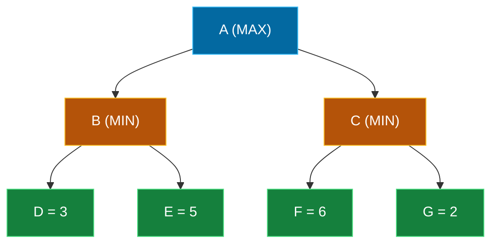

## The Simplest Explanation

You and an opponent take turns. You want the score **high**; they want it **low**. Minimax answers one question:

> *"If both of us play perfectly, what outcome can I guarantee?"*

The answer comes from working **backwards** from the end of the game:

- **Your** turn (MAX node): assume you pick your **best** option → take the **max** of children
- **Opponent's** turn (MIN node): assume they pick **your worst** option → take the **min** of children

That's the whole algorithm. Back up values from leaves to root, alternating max and min.

<Callout type="tip" title="Remember This">
MAX takes the max, MIN takes the min, leaves use their static value. The value at the root = the best achievable score against a perfect opponent.
</Callout>

## Game Trees in One Minute

A two-player, zero-sum, perfect-information game is modeled as a tree:

- Root = current position; it's MAX's turn
- Each level alternates between **MAX nodes** (your move) and **MIN nodes** (opponent's move)
- **Leaves** carry a value from a **static evaluation function**: positive favors you, negative favors the opponent

## Interactive Demo: The Backup Rule

Click through the trace and watch values bubble up from leaves to root:

<MinimaxViz />

### Reading the Result

$$\text{value}(A) = \max\big(\underbrace{\min(3,5)}_{=3},\ \underbrace{\min(6,2)}_{=2}\big) = \max(3, 2) = 3$$

- **Minimax value = 3**
- **Optimal first move: A → B**

Why is B's backed-up value only 3 when its best leaf is 5? Because after you move to B, a **perfect opponent** chooses D (value 3) — their best is your worst. Minimax assumes no mercy.

## Worked Exam-Style Example (by hand)

Given this tree, compute the minimax value:

| Step | Node | Rule | Value |
|------|------|------|-------|
| 1 | Left MIN (children 12, 8) | min | 8 |
| 2 | Right MIN (children 4, 9) | min | 4 |
| 3 | Root MAX | max(8, 4) | **8** |

Exam tips for hand traces:
1. Label every node MAX or MIN **first** — most errors come from mixing levels
2. Leaves are already "computed" — never apply min/max to them
3. Write backed-up values next to internal nodes as you go; the examiner gives partial credit for correct backups
4. The answer format usually wants just the root value and/or the optimal move

## Properties

| Property | Value |
|----------|-------|
| Complete? | Yes (finite tree) |
| Optimal? | Yes — against a *perfect* opponent |
| Time | $O(b^m)$ — visits the whole tree ($b$ = branching, $m$ = depth) |
| Space | $O(bm)$ — depth-first, like DFS |

Time is exponential, which is why alpha-beta pruning (next page) exists — same answer, far fewer nodes.

<Quiz
  question="At a MIN node with children having backed-up values 7, 2, and 5, what value does the MIN node return?"
  options={[
    { label: "A", text: "7" },
    { label: "B", text: "5" },
    { label: "C", text: "2" },
    { label: "D", text: "14/3 ≈ 4.67" },
  ]}
  correctAnswer="C"
  explanation="MIN assumes the opponent picks YOUR worst outcome — so it returns the minimum child value: 2."
/>

<Quiz
  question="The minimax value of a node computed on a game tree is..."
  options={[
    { label: "A", text: "The expected value if moves are random" },
    { label: "B", text: "The best achievable value assuming the opponent also plays optimally" },
    { label: "C", text: "Always the maximum leaf reachable" },
    { label: "D", text: "The average over all leaves" },
  ]}
  correctAnswer="B"
  explanation="Minimax is a guarantee under adversarial play. If the opponent errs, you may do better than the minimax value — but never worse."
/>

<Quiz
  question="Why does minimax explore depth-first rather than breadth-first?"
  options={[
    { label: "A", text: "Depth-first finds better moves" },
    { label: "B", text: "Leaf evaluations are needed before any parent can be decided, and DFS needs only O(bm) memory vs BFS's exponential frontier" },
    { label: "C", text: "BFS cannot handle MAX/MIN alternation" },
    { label: "D", text: "It doesn't — minimax is breadth-first" },
  ]}
  correctAnswer="B"
  explanation="Backups need complete child information either way, but DFS keeps only the current path plus siblings in memory. This is also exactly what enables alpha-beta pruning."
/>

<Accordion title="Common Exam Pitfalls">
1. **Applying max at MIN levels**: The #1 error. Before touching any numbers, write MAX/MIN beside every internal node.

2. **Evaluating leaves twice or 'backing up' leaf values through extra mins**: Leaf values are final. Only internal nodes get min/max applied.

3. **Confusing the minimax VALUE with the best MOVE**: Exams often ask for both. The value is a number at the root; the move is which child achieves it.

4. **Assuming minimax predicts the opponent's actual play**: It assumes *perfect* play. A real opponent may blunder into a branch whose minimax value is worse for them.

5. **Forgetting the evaluation function's range**: In this course $e(n) \in [-1, +1]$ (Shannon-style chess functions scale differently). Positive = good for MAX.
</Accordion>
