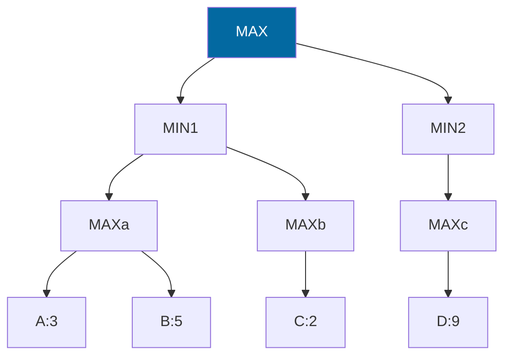

## The Simplest Explanation

A **strategy for MAX** = a **complete plan** that says what MAX will do at every one of its decision points, **and** accounts for every possible MIN reply.

Think of it as a **subtree**, not a single path:

- At each **MAX** node: pick **exactly one** child (your choice)
- At each **MIN** node: include **all** children (you must handle every opponent reply)

<Callout type="tip" title="Remember This">
MAX chooses, MIN branches. Strategy = one child per MAX, all children per MIN.
</Callout>

## Formal Definition (Lecture 77)

Given a game tree with horizon evals:

- **Cluster** of a node = horizon nodes under it (grouped by MAX-strategy)
- **Strategy** = union of clusters corresponding to MAX's choices

If MAX commits S1→A and S2→C, the strategy's horizon leaves are exactly A and C — one leaf per committed MAX node. MIN's freedom is already baked in: S1 vs S2 was MIN's choice, so both branches stay in the set.

## What Papers Actually Ask

Papers ask two things every year:

### Q1: "Which of the following is a strategy for MAX?"

**The validity test**: for every MAX node in the tree, all set-leaves descending from it must come from **one single child** of that MAX node. If leaves split across two children of any MAX node → invalid.

**Worked example (22T3 FN Q7)** — 4-ply tree, Root(MAX) → N1,N2 (MIN) → M1–M4 (MAX) → C1–C8 (MIN) → leaves A–P:

| Option | Split check | Verdict |
|--------|------------|---------|
| `C,D,E,F` | Root: all under N1 ✓. M1: C,D both under C2 ✓. M2: E,F both under C3 ✓ | **Valid** |
| `C,D,G,H` | Root ✓ N1. M1 → C2 ✓. M2 → C4 ✓ | **Valid** |
| `A,C,I,J` | M1 has A (via C1) and C (via C2) — two children! | Invalid |
| `B,D,J,L` | M1 splits across C1/C2 again | Invalid |

### Q2: "List the horizon nodes in the best strategy"

**Key insight**: once MAX fixes its commitments, the opponent (MIN) can steer play to *any* leaf in the resulting set. So:

$$\text{value(strategy)} = \min(\text{evals of all horizon leaves in the set})$$

**Best strategy = the valid strategy maximizing this minimum** — it equals the minimax value of the root.

**Worked example (22T3 FN)**: back up the full tree: C1=49, C2=21, M1=49; C3=86, C4=23, M2=86; N1=49; C5=14, C6=13, M3=14; C7=17, C8=80, M4=80; N2=14; Root = max(49,14) = **49 via N1**.

Candidates under N1 (root→N1 forced):
- `A,B,E,F`: guarantee = min(99,49,88,86) = **49** ← best
- `C,D,E,F`: min(21,62,88,86) = 21
- `A,B,G,H`: min(99,49,23,83) = 23

Under N2 nothing beats 14 (best: M3→C5 gives 14). So best strategy horizon = **`A,B,E,F`**, matching the exam answer.

**Smaller example (23T1 FN Q4)**: Root(MAX) → 3 MINs → 6 MAX nodes → leaves A–L in pairs. Back up: N1 = min(max(18,69), max(30,53)) = min(69,53) = 53. Best strategy: root→N1, first MAX commits to B (69), second to D (53) → horizon `B,D`, guarantee min(69,53)=53 ✓ exam answer.

## Clusters (SSS* Prep)

A **cluster** = all horizon nodes that share the same MAX-choice pattern up to that point. SSS* refines clusters by merit. If you understand strategies, you understand what SSS* is searching over.

## "Leaves Not Affecting the Game Value" (24T3 variant)

A related ask: *"List the horizon nodes that do not affect the game value under perfect play."*

These are leaves that could never influence the root's minimax value — they sit in branches that optimal play never reaches **or** that α-β proves irrelevant:

1. Back up the tree; find the root value and the optimal strategy
2. Any leaf **outside** every branch MIN would steer into (given MAX's strategy) cannot change the value
3. Concretely: leaves in subtrees whose backed-up value loses at some MIN node above them are dead — even huge eval changes there leave the root untouched

**24T3 example** (answer `D,E,G,H`): those four leaves live under branches whose MIN parents already lose to a sibling — no single eval change among them alters the root.

Distinguish from Alpha-Beta pruned sets: "not affecting game value" is a *game-theoretic* property (about perfect play), while pruning is an *algorithmic* property (about what α-β happens to skip). They usually overlap but need not be identical.

<Quiz
  question="A strategy for MAX includes..."
  options={[
    { label: "A", text: "One leaf only — the best one" },
    { label: "B", text: "All horizon leaves" },
    { label: "C", text: "Exactly one child per MAX node, all children per MIN node" },
    { label: "D", text: "Random leaves" },
  ]}
  correctAnswer="C"
  explanation="Definition: MAX commits to a choice at its nodes; MIN's replies must all be handled, so include all MIN branches."
/>

<Quiz
  question="Best strategy tie-breaker in papers is..."
  options={[
    { label: "A", text: "Rightmost, shallowest" },
    { label: "B", text: "Leftmost, then deepest among leftmost" },
    { label: "C", text: "Alphabetical only" },
    { label: "D", text: "Random" },
  ]}
  correctAnswer="B"
  explanation="Exactly as printed in the papers: 'select the left most node, if tie persists then select the deepest node among the left most nodes.'"
/>

<Accordion title="Common Exam Pitfalls">
1. **Single path ≠ strategy**: Strategy is not a root-to-leaf path; it's a subtree that fans out at MIN nodes.
2. **Horizon set size varies**: Depending on tree shape, best strategy may have 2, 4, or more leaves. Don't assume fixed size.
3. **Alphabetical output**: Q7.2 asks "in ascending label order" — sort your answer or it will be marked wrong even if set correct.
4. **Confusing strategy with pruned nodes**: Strategy lists what MAX plans to achieve; pruned nodes are what Alpha-Beta skips. Different questions, different sets.
</Accordion>
