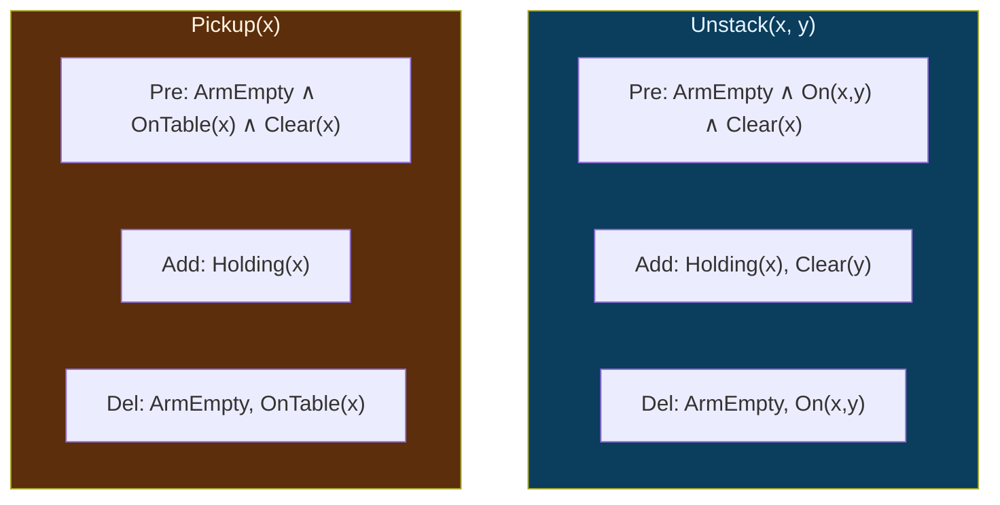
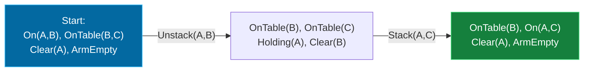

## The Simplest Explanation

Planning means finding a **sequence of actions** that transforms a start state into a goal state. STRIPS is the classic language for describing actions. Each operator is just three lists:

| Part | Question it answers |
|------|---------------------|
| **Preconditions** | What must be true to even try this action? |
| **Add list** | What becomes true after the action? |
| **Delete list** | What stops being true after the action? |

A **state** is the *set of all currently-true predicates*. If a predicate isn't listed, it's false (closed-world assumption).

<Callout type="tip" title="Remember This">
Applicable = preconditions ⊆ current state (can I do it NOW?). Relevant = add/delete lists interact with the goal (does it help reach the GOAL?). Exams love asking you to distinguish these two.
</Callout>

## The Blocks World Domain

Table, one robot arm, blocks A/B/C/D... Predicates:

- $\text{On}(x, y)$ — block $x$ sits on block $y$
- $\text{OnTable}(x)$ — $x$ rests on the table
- $\text{Clear}(x)$ — nothing on top of $x$
- $\text{Holding}(x)$ — the arm holds $x$
- $\text{ArmEmpty}$ — self-explanatory

### The Four Operators

| Operator | Preconditions | Add | Delete |
|----------|--------------|-----|--------|
| **Unstack(x, y)** | ArmEmpty ∧ On(x,y) ∧ Clear(x) | Holding(x), Clear(y) | ArmEmpty, On(x,y) |
| **Pickup(x)** | ArmEmpty ∧ OnTable(x) ∧ Clear(x) | Holding(x) | ArmEmpty, OnTable(x) |
| **Putdown(x)** | Holding(x) | OnTable(x), ArmEmpty | Holding(x) |
| **Stack(x, y)** | Holding(x) ∧ Clear(y) | On(x,y), ArmEmpty, Clear(x)... see note | Holding(x), Clear(y) |

<Callout type="important" title="Watch the Clear(x) Subtlety">
When you Stack(x,y): x goes onto y, so x becomes Clear again (nothing on it) and y loses Clear. When you Unstack or Pickup, some versions delete Clear(x), others don't — exam questions exploit exactly this choice for multi-arm domains, because deleting Clear(x) creates causal dependencies that force ordering constraints.
</Callout>

## Applicable Actions — Worked Example

**State**: On(A, B), OnTable(B), OnTable(C), Clear(A), Clear(C), ArmEmpty.

Check every operator against the preconditions:

| Operator | Precondition check | Applicable? |
|----------|-------------------|-------------|
| Unstack(A, B) | ArmEmpty ✓, On(A,B) ✓, Clear(A) ✓ | **YES** |
| Pickup(A) | OnTable(A)? ✗ | no |
| Pickup(B) | Clear(B)? ✗ (A is on B) | no |
| Pickup(C) | all hold ✓ | **YES** |
| Putdown(any) | Holding(any)? ✗ | no |
| Stack(x, y) | Holding(x)? ✗ | no |

So exactly two actions are applicable: `Unstack(A,B)` and `Pickup(C)`.

### Applying an Action (the state update recipe)

Apply `Unstack(A, B)`:
1. **Delete** `{ArmEmpty, On(A,B)}`
2. **Add** `{Holding(A), Clear(B)}`

New state: OnTable(B), OnTable(C), Clear(A), Clear(C), Holding(A), Clear(B).

That's it — exams award full marks for mechanically correct delete-then-add updates. Always delete first, then add.

## Relevant Actions — Worked Example

**Goal**: On(A, B). Ask of each operator: could this action *produce* something the goal needs?

| Operator | Interacts with goal On(A,B)? | Relevant? |
|----------|------------------------------|-----------|
| Stack(A, y) | adds On(A, y) → yes if y = B | **YES** |
| Unstack(x, y) | deletes On(x,y) — only destroys | no (unless goal needs Clear effects) |
| Pickup / Putdown | touch Holding/OnTable only | no |

`Stack(A, B)` is the relevant operator. Its **preconditions** — Holding(A) ∧ Clear(B) — become the new subgoals. Regressing goals through relevant operators is the heart of backward planning.

## From Domain to Search Problem

This domain plugs straight into Week 2's framework:

- **MoveGen(n)** = apply every applicable operator to state n, each yielding one successor
- **GoalTest(n)** = check goal predicates ⊆ state n
- BFS/DFID then find shortest plans automatically!

## Multi-Arm Robots (exam favorite)

Give each arm its own predicates ($\text{Holding}_1$, $\text{AE}_1$...) and duplicate operators per arm ($\text{Unstack}_1$, $\text{Unstack}_2$, or generic $\text{Holding}(n,x)$, $\text{AE}(n)$). Two arms act **in parallel**, shrinking plan length (**makespan**).

Example: D-on-A, C-on-B → goal On(C,A), On(D,C):
- One arm: 6 steps
- Two arms: step 1 = both unstacks in parallel; step 2 = Stack₂(C,A); step 3 = Stack₁(D,C). **Makespan 3.**

### The delete-Clear(x) Decision

Should Unstack/Pickup delete Clear(x) for the lifted block x?

| Domain | Does it matter? | Why |
|--------|----------------|-----|
| One arm | No | after lifting x, only Putdown/Stack apply, both restore Clear(x) before anything else touches x |
| Multi-arm | **Yes** | parallel actions interact through Clear |

With delete-Clear: after `Unstack₂(C,B)`, C is NOT clear — so `Stack₁(D,C)` must wait until `Stack₂(C,A)` restores Clear(C). That causal dependency forces the ordering → makespan 3.

Without delete-Clear: both blocks stay "clear" while held → `Stack₁(D,C)` could run in parallel with `Stack₂(C,A)` → apparent makespan 2 — but that's **wrong for this domain**: you cannot stack onto a block that's still held mid-air. The delete-Clear version captures the true constraint.

Exam questions hand you both variants and ask which makespan is correct — answer via the delete-list semantics, not by intuition.

<Quiz
  question="An operator is APPLICABLE in state s when..."
  options={[
    { label: "A", text: "its add list overlaps the goal" },
    { label: "B", text: "all its preconditions are true in s" },
    { label: "C", text: "it appears in the plan" },
    { label: "D", text: "its delete list is empty" },
  ]}
  correctAnswer="B"
  explanation="Applicability is purely about the present state: every precondition predicate must be in s. Relevance (helping the goal) is a separate concept."
/>

<Quiz
  question="In state OnTable(A), OnTable(B), Clear(A), Clear(B), ArmEmpty — which actions are applicable?"
  options={[
    { label: "A", text: "Only Pickup(A)" },
    { label: "B", text: "Pickup(A) and Pickup(B)" },
    { label: "C", text: "All four operators" },
    { label: "D", text: "None — nothing is stacked" },
  ]}
  correctAnswer="B"
  explanation="Both blocks are on the table, clear, and the arm is empty — so both Pickups pass their preconditions. Unstack needs On(x,y); Putdown/Stack need Holding."
/>

<Quiz
  question="After applying Stack(A, B) from a valid state, which predicates are DELETED?"
  options={[
    { label: "A", text: "On(A,B) and Clear(B)" },
    { label: "B", text: "Holding(A) and Clear(B)" },
    { label: "C", text: "ArmEmpty and OnTable(B)" },
    { label: "D", text: "Nothing is deleted by Stack" },
  ]}
  correctAnswer="B"
  explanation="Stack consumes Holding(A) (arm puts block down) and Clear(B) (B now has A on it). It ADDS On(A,B), ArmEmpty, and Clear(A)."
/>

<Accordion title="Common Exam Pitfalls">
1. **Adding before deleting**: if a predicate is in both the delete and add list, the net effect is it ends TRUE. Apply delete first, then add, always.

2. **Forgetting implicit falsity**: students look for explicit ¬On(A,B). In STRIPS states, absence from the set = false. No negative literals exist in basic STRIPS.

3. **Confusing applicable with relevant**: applicable = executable NOW; relevant = moves you toward THIS goal. An exam answer listing only one when asked for both loses half the marks.

4. **Forgetting Clear propagation**: every block under a lifted block gains Clear; every landing site loses Clear. Forgetting one of these cascades into wrong subsequent applicability checks.

5. **Assuming order doesn't matter for makespan**: with multiple arms, actions are parallel ONLY if neither deletes what the other's preconditions need — that's why delete-Clear matters (Week 9).
</Accordion>
