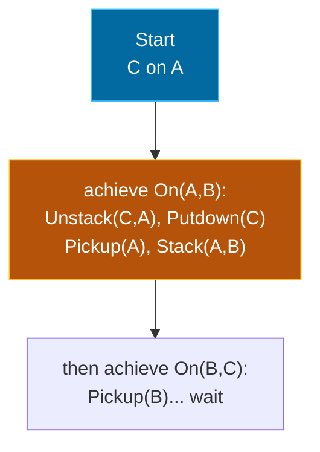

## The Simplest Explanation

Goal Stack Planning (GSP) is **backward planning with a to-do stack**:

1. Push the goal onto a stack
2. Pop the top item:
   - If it's a **predicate** not yet true → find the operator that adds it, push the operator AND its preconditions back on the stack
   - If it's an **operator** whose preconditions are all true → **execute it** (update state)
3. Repeat until the stack is empty

The plan is simply the list of executed operators in order.

<Callout type="tip" title="Remember This">
GSP handles ONE subgoal at a time, in a fixed order. That simplicity works beautifully — until subgoals interact. The Sussman Anomaly shows exactly how it breaks.
</Callout>

## The Algorithm in Detail

```
Stack ← [full goal]
Plan  ← []
while Stack not empty:
    x = pop(Stack)
    if x is an operator and Pre(x) ⊆ State:
        State ← apply(x, State); Plan.append(x)
    else if x is a predicate true in State:
        continue                      // satisfied, do nothing
    else if x is a predicate:
        choose operator O with predicate ∈ Add(O)
        push O                        // executed later, after its preconditions
        push each precondition of O   // achieved first
```

Key mechanics:

- **Push order matters**: preconditions go on TOP of their operator so they're achieved first ("push-set" operation)
- A satisfied predicate pops off harmlessly
- The current state evolves only when operators execute

## Worked Example: Stack A on B

**State**: OnTable(A), OnTable(B), Clear(A), Clear(B), ArmEmpty. **Goal**: On(A, B).

| Step | Pop | What happens | Stack after |
|------|-----|--------------|-------------|
| 1 | Goal On(A,B) | Not true. Relevant op: Stack(A,B). Push it + preconditions | Holding(A), Clear(B), **Stack(A,B)** |
| 2 | Holding(A) | False. Op: Pickup(A). Push + pres | ArmEmpty, OnTable(A), Clear(A), **Pickup(A)**, Clear(B), Stack(A,B) |
| 3 | ArmEmpty | True in state ✓ | pop |
| 4 | OnTable(A) | True ✓ | pop |
| 5 | Clear(A) | True ✓ | pop |
| 6 | Pickup(A) | Preconditions hold → EXECUTE | state now has Holding(A), ArmEmpty gone |
| 7 | Clear(B) | True (never touched) ✓ | pop |
| 8 | Stack(A,B) | Preconditions Holding(A), Clear(B) hold → EXECUTE | empty |

**Final plan**: `Pickup(A), Stack(A,B)` ✓ — GSP nails serializable goals like this.

## The Sussman Anomaly

**Start**: C on A; A on table; B on table.
**Goal**: On(A,B) ∧ On(B,C) — all three stacked A-B-C.

Try GSP with goal order [On(A,B), then On(B,C)]:



1. Achieve **On(A,B)** first: Unstack(C,A) → Putdown(C) → Pickup(A) → Stack(A,B).
2. Now try **On(B,C)**... but B has A sitting on it! You must unstack A again, put it down, then stack B on C, then pick A up AGAIN and stack it on B.

The plan becomes ~7 steps when 3 suffice. Worse, the other order [On(B,C) first] destroys progress symmetrically.

<Callout type="warning" title="Why It Breaks">
On(A,B) and On(B,C) are **non-serializable subgoals**: no fixed order lets you achieve them one-at-a-time without undoing earlier work. Achieving either one *clobbers* the other's preconditions. The fix isn't a better ordering — it's planning for both simultaneously (partial-order / plan-space planning) or using Graphplan-style analysis.
</Callout>

## Forward vs Backward State-Space Planning (context)

GSP sits between two pure search strategies:

| Aspect | Forward (FSSP) | Backward (BSSP) | Goal Stack |
|--------|---------------|-----------------|------------|
| Direction | start → goal | goal → start | interleaved, stack-driven |
| Branching | high (many applicable ops) | low (few relevant ops) | low |
| Problem | generates irrelevant states | goals may be unreachable-in-reverse | clobbers interacting goals |
| Uses | MoveGen-style search | regression of goal sets | single-goal focus |

Backward planning asks "**which operators are RELEVANT?**" (their add-lists intersect the goal) instead of "which are applicable?" — remember this contrast; exams test both terms.

## Properties

| Property | Value |
|----------|-------|
| Complete? | Yes, given a fair operator-choice rule |
| Optimal? | **No** — Sussman anomaly produces bloated plans |
| Sound? | Yes — every executed action had its preconditions checked |
| Handles interacting goals? | **No** — the defining weakness |

<Quiz
  question="In goal stack planning, why are an operator's preconditions pushed ABOVE the operator itself?"
  options={[
    { label: "A", text: "To save memory" },
    { label: "B", text: "So the preconditions are achieved BEFORE the operator executes" },
    { label: "C", text: "Because stacks are LIFO for operators only" },
    { label: "D", text: "It doesn't matter — any order works" },
  ]}
  correctAnswer="B"
  explanation="LIFO means top-of-stack executes first. Preconditions on top get satisfied before the operator below them is reached."
/>

<Quiz
  question="The Sussman anomaly demonstrates that..."
  options={[
    { label: "A", text: "STRIPS cannot express stacking problems" },
    { label: "B", text: "linear (one-subgoal-at-a-time) planning fails on non-serializable subgoals" },
    { label: "C", text: "goal stack plans are always optimal" },
    { label: "D", text: "backward planning is impossible" },
  ]}
  correctAnswer="B"
  explanation="Either goal ordering forces undoing prior work, because On(A,B) and On(B,C) interact. Non-linear planners resolve this."
/>

<Quiz
  question="Which pair of subgoals in Blocks World is most likely NON-serializable?"
  options={[
    { label: "A", text: "OnTable(A) and Clear(C), where C is already clear" },
    { label: "B", text: "On(A,B) and On(B,C) forming a tower" },
    { label: "C", text: "ArmEmpty and OnTable(D)" },
    { label: "D", text: "Any two predicates are always serializable" },
  ]}
  correctAnswer="B"
  explanation="A tower couples every block to every other: finishing the bottom link (B on C) blocks the top link until you redo work — exactly the Sussman structure."
/>

<Accordion title="Common Exam Pitfalls">
1. **Executing operators out of stack order**: an operator may ONLY fire when its own preconditions are currently true. If they aren't, you must push more sub-goals rather than force execution.

2. **Forgetting the state changes as you go**: a predicate 'true' at push time may be false by the time it's popped (another action deleted it). Always re-check against the CURRENT state at pop time.

3. **Blaming the goal ORDERING**: no reordering fixes the Sussman anomaly — that's what makes it an anomaly. The lesson is that linear planning itself is inadequate for interacting goals.

4. **Mixing up FSSP/BSSP terminology**: applicable actions belong to FORWARD planning; relevant operators belong to BACKWARD planning. GSP borrows backward reasoning (relevant ops) inside a stack discipline.
</Accordion>
