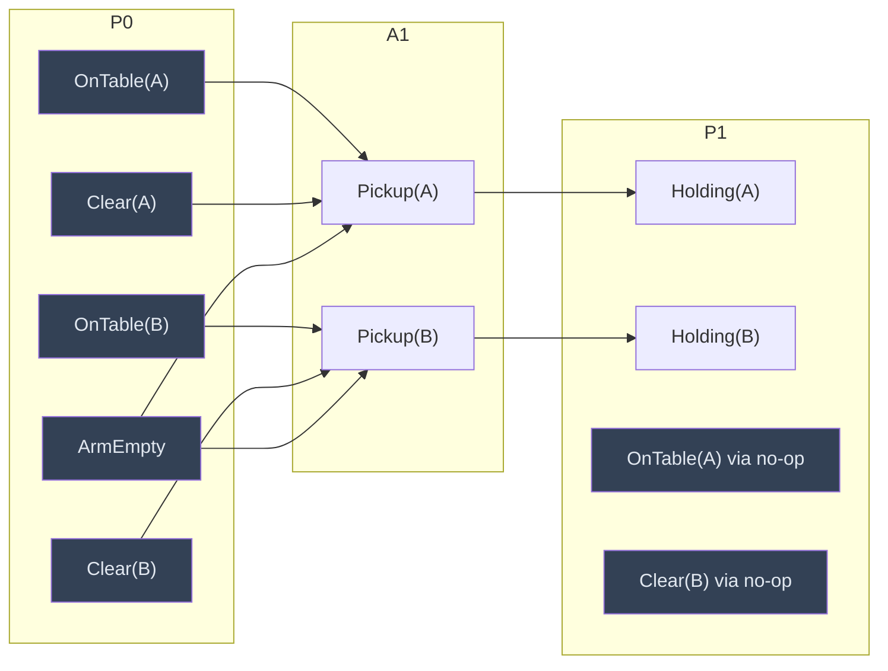

## The Simplest Explanation

Earlier planners searched for ONE plan at a time. Graphplan (Blum & Furst, 1995) does something cleverer:

> **Stage 1**: build a "planning graph" — a compact summary of EVERYTHING that could possibly happen at each time step.
> **Stage 2**: search inside it for a real plan.

The magic ingredient is **mutex** (mutual exclusion): pairs of actions or facts that *cannot both be true at the same step*. Mutex reasoning prunes impossible combinations before search ever touches them. Result: solvable plan lengths jumped from ~15 steps to ~200.

<Callout type="tip" title="Remember This">
Planning graph layers alternate: P₀ → A₁ → P₁ → A₂ → P₂ … Facts live in P layers, actions in A layers, and every fact has an invisible no-op action keeping it alive into later layers.
</Callout>

## Building the Planning Graph

Start with $P_0$ = start state's propositions. Then repeat:

- $A_i$ = all actions whose preconditions all appear in $P_{i-1}$ (plus no-ops)
- $P_i$ = union of all effects (adds) of actions in $A_i$

Three kinds of edges connect action→proposition layers:

| Edge | Meaning |
|------|---------|
| Precondition links | action ← facts it needs |
| Positive effect links (+) | facts it adds |
| Negative effect links (−) | facts it deletes |

### Example: Blocks World

Start: OnTable(A), OnTable(B), Clear(A), Clear(B), ArmEmpty.

Note $a_1$ and $a_2$: both need ArmEmpty and each deletes it — they are **mutex**, so Holding(A) and Holding(B) will be mutex in $P_1$. The one-armed robot can't hold two blocks!

## Mutex Rules (the exam's favorite table)

Two **actions** in the same layer are mutex if ANY holds:

| Condition | Intuition |
|-----------|-----------|
| **Inconsistent effects** | one adds $p$, the other deletes $p$ |
| **Interference** | one deletes a precondition of the other |
| **Competing needs** | their preconditions include propositions that are mutex |
| **Inconsistent support / same resource** | both consume the same required resource (e.g., both need ArmEmpty) |

Two **propositions** in the same layer are mutex if **ALL** pairs of actions producing them are mutex.

<Callout type="important" title="Direction Matters">
Action mutex is an ANY-condition test; proposition mutex is an ALL-producers test. Mixing these up is the most common exam mistake.
</Callout>

<Callout type="warning" title="NOP-Action Distractors (2024 papers)">
Papers include no-op actions as answer options in Layer-1 action-mutex questions. Remember: every proposition carries a nop, and a nop can absolutely participate in mutexes — e.g., `Stack(C,D)` and the *nop for holding(C)* are mutex (Stack deletes/uses holding(C); inconsistent effects + interference). Don't dismiss an option just because it says "nop". Judge it by the same four conditions.
</Callout>

## Monotonicity, Leveling Off, Termination

- Proposition layers grow **monotonically** (facts only get added, never removed — thanks to no-ops)
- Action layers likewise
- Mutex relations first increase, then shrink as more supportive actions appear in later layers
- When layer $k$ and $k+1$ have identical facts AND identical mutexes → **leveled off**

Termination logic:

1. All goal facts present in some $P_i$ and pairwise non-mutex → try **solution extraction** (backward search picking non-mutex actions)
2. Graph leveled off without goal facts appearing → provably **no solution exists**
3. Extraction fails? Grow one more layer and retry — the first successful extraction gives a **minimum-makespan** (shortest parallel) plan

## Worked Exam-Style Check

Q: In the graph above, is the pair ⟨Pickup(A), Pickup(B)⟩ mutex at $A_1$?

Check each condition:
1. Inconsistent effects? Pickup(A) adds Holding(A); neither deletes the other's add... no direct conflict.
2. Interference? Does either delete a precondition of the other? Pickup(B)'s preconditions: OnTable(B), Clear(B), ArmEmpty. Neither pickup deletes those... wait — actually neither deletes the other's preconditions directly.
3. Competing needs? Their shared precondition ArmEmpty is trivially non-mutex with itself...
4. Same resource? Both require AND delete **ArmEmpty** ✓

⟨Pickup(A), Pickup(B)⟩ = **mutex** by inconsistent-support/resource consumption. Consequently Holding(A) ⊕ Holding(B) are mutex at $P_1$ (their only producers are mutually exclusive).

Exam answers should cite the specific condition name, not just "yes".

## Properties

| Property | Value |
|----------|-------|
| Complete? | Yes — levels off in finite domains; absence of goal then proves unsolvability |
| Optimal? | Yes w.r.t. **makespan** (number of parallel time steps), NOT number of actions |
| Planning-graph size | Polynomial in problem size (vs exponential state space) |
| Key weakness | Solution extraction can fail spuriously (mutexes are conservative), forcing extra layers |

<Quiz
  question="Why does every proposition get a 'no-op' action in the planning graph?"
  options={[
    { label: "A", text: "To make actions easier to draw" },
    { label: "B", text: "So facts persist across layers, making layers monotonically growing" },
    { label: "C", text: "Because STRIPS requires null actions" },
    { label: "D", text: "To reduce the number of mutex checks" },
  ]}
  correctAnswer="B"
  explanation="No-ops carry each true fact forward unchanged, guaranteeing P_i ⊆ P_{i+1} — the monotonicity that powers leveling-off termination."
/>

<Quiz
  question="Propositions p and q in the SAME layer are mutex when..."
  options={[
    { label: "A", text: "at least one pair of their producer actions is mutex" },
    { label: "B", text: "ALL pairs of actions producing them (across the two) are mutex" },
    { label: "C", text: "they never co-occur in any reachable state" },
    { label: "D", text: "both have no-ops" },
  ]}
  correctAnswer="B"
  explanation="Proposition mutex needs universal agreement among ALL producer pairs — any single non-mutex production route lets p,q potentially coexist."
/>

<Quiz
  question="If the planning graph levels off and some goal proposition never appeared, we may conclude..."
  options={[
    { label: "A", text: "grow 10 more layers just in case" },
    { label: "B", text: "no valid plan exists — proven" },
    { label: "C", text: "restart with different operators" },
    { label: "D", text: "nothing; leveling off carries no information" },
  ]}
  correctAnswer="B"
  explanation="Leveling off means nothing new can EVER appear (monotone growth stabilized). Missing goals are therefore unreachable — a completeness proof, not a heuristic."
/>

<Accordion title="Common Exam Pitfalls">
1. **Using ANY for propositions and ALL for actions** — exactly backwards. Actions: any condition suffices. Propositions: all producer-pairs must be mutex.

2. **Forgetting competing-needs transitivity**: mutexes between ACTIONS propagate through shared preconditions, letting mutex spread deeper than naive inspection suggests. Always check precondition mutex recursively.

3. **Assuming non-mutex guarantees reachability**: absence of mutex is necessary but not sufficient; solution extraction can still fail, and Graphplan then grows another layer rather than declaring success.

4. **Confusing makespan-optimal with action-optimal**: Graphplan minimizes PARALLEL STEPS. A 3-step plan using 6 actions beats a 5-step plan using 4 actions under this metric — exams love this distinction.

5. **Drawing negative-effect edges wrong**: deletions point to the NEXT proposition layer (the fact is absent there), typically drawn red/circled per the course convention.
</Accordion>
