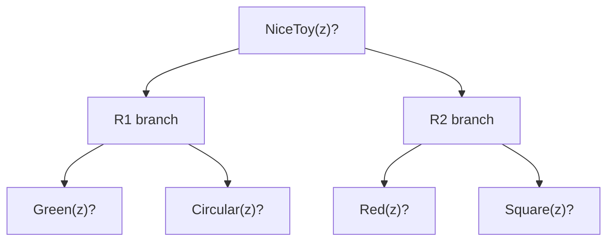

## The Simplest Explanation

Searching for a proof is searching in an **AND-OR graph**:

- To prove $P \land Q$ → prove P **and** prove Q (AND node)
- To prove P when several rules each conclude P → try any one rule (OR node)

So the same AO\*/goal-tree machinery from planning solves theorem proving.

<Callout type="tip" title="Remember This">
Entailment ($KB \models \alpha$) is about truth in every model; provability ($KB \vdash \alpha$) is about derivation by inference rules. Soundness: provable ⇒ entailed. Completeness: entailed ⇒ provable.
</Callout>

## Foundations

Given a knowledge base $KB$ (sentences assumed true) and a query $\alpha$:

| Notion | Symbol | Meaning |
|--------|--------|---------|
| Entailment | $KB \models \alpha$ | semantic — true whenever KB is true |
| Provability | $KB \vdash \alpha$ | syntactic — derivable via inference rules |

The canonical inference rule, **modus ponens**: from $\alpha$ and $\alpha \Rightarrow \beta$, derive $\beta$. Content-independent — swap Man/City, Socrates/Chennai and the syllogism still works.

## Forward Chaining (data-driven)

Start from KB; repeatedly apply inference rules; add conclusions; stop when $\alpha$ appears (or nothing new derives). Natural-deduction style — derives *everything it can*, useful when many queries are expected.

## Backward Chaining (goal-driven)

Start from the goal α; find rules whose consequent matches α; recurse on their antecedents. Produces an AND-OR tree — deductive retrieval. Efficient when only one query matters.

### With Variables (existential goals)

"Is someone mortal?" = prove $\exists z.\,\text{Mortal}(z)$:

1. Match goal Mortal(z) against rule $\text{Man}(x) \Rightarrow \text{Mortal}(x)$
2. **Unify**: substitute x = z → subgoal Man(z)
3. Match against facts: z = Socrates? Plato? …
4. Each successful full substitution yields a **witness**

## Conjunctive Antecedents = AND Nodes

Rule: $\text{Green}(x) \land \text{Circular}(x) \Rightarrow \text{NiceToy}(x)$.

Proving NiceToy(z) requires proving Green(z) **and** Circular(z) — an AND node. Multiple rules concluding the same predicate are OR alternatives.

## Worked Example: Nice Toys

Rules:
- R1: Green(x) ∧ Circular(x) ⇒ NiceToy(x)
- R2: Red(x) ∧ Square(x) ⇒ NiceToy(x)

Facts: Green(A), Green(B), Circular(C), Red(C), Red(D), Square(D), Circular(E)

Backward chain NiceToy(z):

- Via R1: z=A has Green(A) ✓ but Circular(A)? ✗. z=C: Circular ✓ but Green(C)? ✗. No solution via R1.
- Via R2: z=D: Red(D) ✓ and Square(D) ✓ → **D is a nice toy**.

This AND-OR exploration — descend promising branches, back up failures — is precisely what AO\* automates with costs attached.

## Properties

| Property | Value |
|----------|-------|
| Forward chaining | data-driven; derives all consequences |
| Backward chaining | goal-driven; builds AND-OR proof tree |
| With variables | existential queries return witnesses via unification |
| Connection to planning | identical structure to goal-tree/AO* search |

<Quiz
  question="Backward chaining from a conjunctive rule antecedent creates..."
  options={[
    { label: "A", text: "an OR node over the conjuncts" },
    { label: "B", text: "an AND node — all conjuncts must be proved" },
    { label: "C", text: "a leaf" },
    { label: "D", text: "a cycle" },
  ]}
  correctAnswer="B"
  explanation="P ∧ Q ⇒ R forces both P and Q before R fires. Multiple RULES concluding R are what create OR alternatives."
/>

<Quiz
  question="Soundness of an inference system means..."
  options={[
    { label: "A", text: "every true sentence is derivable" },
    { label: "B", text: "every derivable sentence is actually entailed (no false proofs)" },
    { label: "C", text: "proofs are short" },
    { label: "D", text: "KB must be consistent" },
  ]}
  correctAnswer="B"
  explanation="Soundness = provable ⇒ entailed. Completeness is the converse: entailed ⇒ provable."
/>

<Accordion title="Common Exam Pitfalls">
1. **Entails ⊢ vs ⊨ symbols**: double turnstile = semantic entailment; single turnstile = syntactic provability. Mixing them in MCQs loses the mark instantly.
2. **Witness answers 'is there' questions**: with variables, one successful substitution suffices to answer an existential — you don't enumerate all proofs unless asked.
3. **Failed branch ≠ failure**: R1 finding no witness just prunes that OR alternative; the R2 branch still succeeds. Track per-branch status carefully.
</Accordion>
