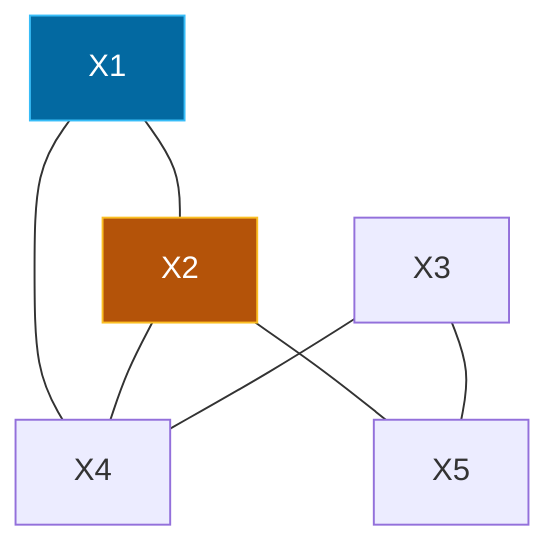

## The Simplest Explanation

A CSP has variables, domains, and constraints. **Forward Checking (FC)** after each assignment:

- Remove values from **unassigned neighbors** that conflict with the new assignment
- If any domain empties → **backtrack immediately** (don't wait to assign it)

<Callout type="tip" title="Remember This">
FC = assign one variable → prune neighbors' domains → if empty, backtrack. Process variables and values in **alphabetical order** (exam convention).
</Callout>

## Constraint Graph Example (from 22T3 Papers)

When no edge exists, assume **universal relation** (all tuples allowed).

## Algorithm Trace Pattern

FC begins with `X1 = a`. What are the **next four values assigned** (in order)?

| Step | Variable (alphabetical) | Domain after pruning | Assigned |
|---|---|---|---|
| 1 | X1 | — | a |
| 2 | X2 | pruned by X1=a → remaining e,... | e |
| 3 | X3 | ... | 2 |
| 4 | X4 | ... | 5 |
| ... | X5 | ... | p |

Exams ask two things:
1. **Next N assignments** in order (not just which variables)
2. **First solution** found (full assignment when no domain empties)

### 22T3 AN Example

- Variables X1-X5, alphabet order, start X1=a
- Next four values: `e,2,5,p` (Answer: `a,e,2,5,p` is first solution)
- Each step FC prunes incompatible values from all future variables' domains

### 22T3 FN Example (different graph)

- Graph: X1-X2, X2-X5, X5-X3, X3-X4, X4-X1 (5-cycle)
- Next four after X1=a: `d,1,2,3` → first solution `a,d,3,4,q`

## FC vs Plain Backtracking

| | Plain Backtracking | Forward Checking |
|---|---|---|
| Prunes | Only at assignment time | Immediately forward to neighbors |
| Fails early? | No — detects failure at next variable | Yes — empty domain detected instantly |
| Cost per node | Cheap | Higher (domain filtering) |
| Search tree | Larger | Smaller (prunes earlier) |

<Quiz
  question="After assigning X1=a, Forward Checking..."
  options={[
    { label: "A", text: "Checks only X1's domain" },
    { label: "B", text: "Removes from unassigned neighbors' domains any values incompatible with X1=a" },
    { label: "C", text: "Assigns all remaining variables at once" },
    { label: "D", text: "Does nothing until a failure" },
  ]}
  correctAnswer="B"
  explanation="FC looks ahead one step: every future neighbor loses values that would conflict with the new assignment. Empty domain = immediate backtrack."
/>

<Quiz
  question="Exam convention for Forward Checking order is..."
  options={[
    { label: "A", text: "Random order" },
    { label: "B", text: "Alphabetical order for variables and values" },
    { label: "C", text: "Highest domain first" },
    { label: "D", text: "Most constrained first" },
  ]}
  correctAnswer="B"
  explanation="All papers explicitly say 'Process variables and values in ALPHABETIC order.' Follow it exactly or your trace will diverge."
/>

<Accordion title="Common Exam Pitfalls">
1. **Universal relation assumption**: No edge = all tuples allowed. Students incorrectly prune those pairs — don't.
2. **Order matters**: Alphabetical, not MRV or degree heuristic. The exam's next four values answer depends on this.
3. **Next assignments vs first solution**: First question asks next 4 assignments attempted (including failed branches before backtrack). Second asks first complete consistent assignment. They differ.
4. **Not resetting after backtrack**: When backtracking, restore pruned domains.
</Accordion>
