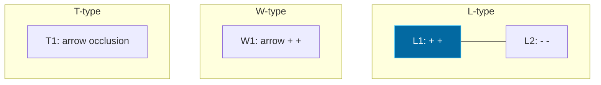

## The Simplest Explanation

A 2D line drawing of **trihedral objects** (every vertex where 3 faces meet, like cubes) is valid **iff** every edge can be labeled consistently:

- `+` **convex** (outer edge)
- `-` **concave** (inner fold)
- `→` **arrow** (occluding edge)

Constraints come from **junctions** — points where edges meet. Only certain label combinations are physically possible at each junction type.

<Callout type="tip" title="Remember This">
Valid drawing = all junctions assigned one of their legal label patterns and adjacent junctions agree on shared edges. If any junction has empty domain → whole drawing is NIL.
</Callout>

## Junction Catalog

Each junction carries a **unique label** you must output (L1, W1, Y3, T4 etc.):

| Type | Shape | Legal patterns |
|---|---|---|
| **L** | 2 edges (corner) | `+ +`, `- -`, `+ -` variants |
| **W** | 3 edges (one 180° gap) | Specific +/arrow combos |
| **Y** | 3 edges (120° each) | All + or arrow patterns |
| **T** | 3 edges (T-junction = occlusion) | Arrow must point along stem |

In-plane rotations are also valid.

## Waltz Filtering

1. **Initialize**: For each junction, domain = all legal labelings for its type
2. **Pick a junction/edge** (any order)
3. **Constrain**: Remove labelings that conflict with already-labeled neighbors on shared edges
4. If any domain empties → **NIL** (inconsistent) — reset all to NIL per papers
5. Repeat until stable or all labeled

This is arc consistency on junctions.

## Exam Questions

**Valid vs NIL**:

- 23T1 FN: Drawing with junctions 1-4 → answer `Y3,L5,L4,T3` for valid, `NIL` for impossible
- 23T2 AN Q7.1: Valid → `Y1,W1,L5,T4`, invalid → `NIL`

**How to solve by hand**:

1. List each dot's degree → deduce type (2=L, 3 wide=W, 120/120/120=Y, T-shape=T)
2. Write possible label sets for each type
3. Propagate: shared edge must have same label (+/-/arrow) at both ends
4. If empty → output `NIL`

<Quiz
  question="A 2D line drawing is valid iff..."
  options={[
    { label: "A", text: "At least one junction can be labeled" },
    { label: "B", text: "Every edge and junction can be assigned mutually consistent labels from the catalog" },
    { label: "C", text: "It contains a T-junction" },
    { label: "D", text: "All edges are convex" },
  ]}
  correctAnswer="B"
  explanation="Waltz's insight: validity is global consistency. One inconsistent junction makes the whole drawing NIL."
/>

<Quiz
  question="If a Waltz drawing is inconsistent, the correct answer format is..."
  options={[
    { label: "A", text: "List whatever labels were possible before failure" },
    { label: "B", text: "NIL (all labels reset to NIL per instructions)" },
    { label: "C", text: "Empty string" },
    { label: "D", text: "L1,W1,Y1,T1" },
  ]}
  correctAnswer="B"
  explanation="Papers explicitly: 'otherwise the drawing is inconsistent and all labels are reset to NIL' — output single token NIL."
/>

<Accordion title="Common Exam Pitfalls">
1. **Output format**: Valid → `Y3,L5,L4,T3` (junctions 1,2,3,4 order). Invalid → exactly `NIL`.
2. **Degree → type mismatch**: Count edges at dot before picking W vs Y vs T.
3. **Shared edge agreement**: Both junctions must assign same label to common edge.
</Accordion>
