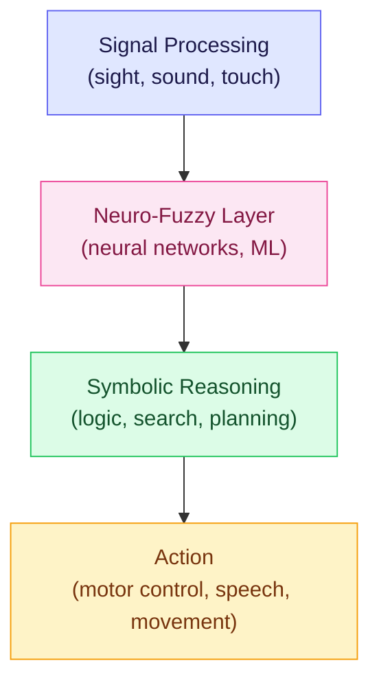
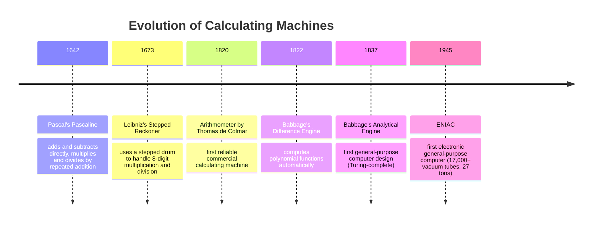
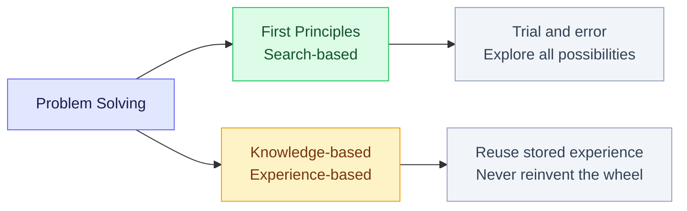

Before we write a single algorithm, we need to understand what we are trying to do and why. This week covers what AI actually means, how people have tried to define intelligence, the centuries-long quest to build thinking machines, and what "problem solving using search" even means. The math and code start next week.

<LectureVideos
  videos={{
    "Lecture 1": "https://www.youtube.com/watch?v=gu3dZL3KdH0",
    "Lecture 2": "https://www.youtube.com/watch?v=pfBXSOUnOtU",
    "Lecture 3": "https://www.youtube.com/watch?v=rtrAbWwr1zc",
    "Lecture 4": "https://www.youtube.com/watch?v=80ysw77BpFU",
    "Lecture 5": "https://www.youtube.com/watch?v=2J-WI7HlAac",
    "Lecture 6": "https://www.youtube.com/watch?v=HDMVs63fzEw",
    "Lecture 7": "https://www.youtube.com/watch?v=LKKFvUwNRnA",
  }}
/>

---

## The Course and What It Covers [Lecture 1]

This is a 12-week course on **search methods for problem solving**. Week 1 is history and philosophy; after that, it is mostly algorithms. Here is the syllabus at a glance:

- **State space search**: depth-first, breadth-first, iterative deepening
- **Heuristic search**: the core of AI search methods; includes local search and stochastic local search
- **Population-based methods**: genetic algorithms, ant colony optimization
- **A\* algorithm**: finding optimal solutions, plus space-saving variants
- **Sequence alignment**: from bioinformatics
- **Game playing**: board games like chess; often the most exciting part of the course
- **Planning**: how an agent arrives at a sequence of actions to achieve a goal
- **AO\* algorithm**: backward search, reasoning from the goal toward the current state
- **Rule-based / pattern-directed inference systems**: expert systems; the Rete algorithm
- **Constraint processing**: called by some the "holy grail of AI"; combines different problem-solving approaches and subsumes search

One theme runs through the entire course: **combinatorial explosion** is the greatest adversary. Search trees grow exponentially, so both time and space blow up. Much of the course is about fighting this explosion.

The textbook is *A First Course in Artificial Intelligence* by the instructor (~950 pages, but only the first ~7 chapters are covered). Other references include books by Patrick Winston, Richard Knight, Elaine Rich, and Charniak & McDermott.

---

## What Is an Intelligent Agent? [Lecture 1]

An **intelligent agent** is a program that is:

- **Persistent**: it is always running
- **Autonomous**: it acts on its own
- **Proactive**: it can decide what goals to pursue next
- **Goal-directed**: once it has goals, it works toward them

Human beings satisfy all these properties too, so in a sense we are agents as well.

The very first thing an intelligent agent needs is a **model of the world** inside its head. It reasons over this model to decide what to do. This model is always an abstraction: you cannot represent reality perfectly, you keep some features and drop others. A self-aware agent would also include **itself** in its world model.

### The Three Layers of an Intelligent System

An intelligent agent can be thought of as having three layers:

1. **Outermost, Signal Processing**: The agent receives signals from the world (light, sound, etc.). These are converted into internal representations.
2. **Middle, Neuro-Fuzzy / Neural Networks**: This is where deep learning and ML sit. It transforms signals into symbols.
3. **Innermost, Symbolic Reasoning**: This is where logic, search, planning, and reasoning happen. The agent works with symbols that stand for things in the world.

The agent then acts on the world through signals again (speech, movement, etc.). The relative sizes of these layers matter: when we talk about search and reasoning, a large part of intelligence is captured in that innermost layer.

### The Building Blocks of an Intelligent Agent

An intelligent agent is not one monolithic algorithm. It is made up of many components working together (Marvin Minsky called this the "society of mind"). The key building blocks include:

- **Sensing**: vision, speech, touch, smell
- **Neural/ML layer**: deep neural networks, reinforcement learning, pattern recognition
- **Symbolic layer**: natural language understanding, knowledge representation, reasoning, logic, deduction, search, planning, adversarial reasoning (game playing), constraints
- **Memory**: the agent must remember things
- **Acting**: speech synthesis, graphics generation, robot control

This course focuses on the parts in the symbolic layer: **search, planning, game playing, and constraint processing**.

---

## Three Pillars of Intelligence [Lecture 1]

Think about what makes someone "smart." It boils down to three abilities:

1. **Remember the past**: memory and experience. This is handled by *case-based reasoning* (storing and reusing past cases) and *machine learning* (learning patterns from experience). Being able to recognize objects, faces, and patterns is a consequence of remembering.

2. **Understand the present**: be aware of the world, create a model of it. This is *knowledge representation* (what does the agent know?) and *logic and reasoning* (what else can the agent infer from what it knows?).

3. **Imagine the future**: work toward goals. If I take certain actions, what are the consequences? Choose a sequence of actions to achieve a goal. This is *goals, plans, actions, and automated planning*, and it is the thrust of this course.

---

## The Decade of Machine Learning [Lecture 2]

If you have heard of AI only through the news, you would think AI and machine learning are the same thing. They are not. The last decade did see an explosion of interest in ML, driven by three forces: massive amounts of data (thanks to the internet), growing computing power, and advances in neural network training algorithms. But this is only one part of what AI covers. Let us understand what ML does, what it does not do, and where the rest of AI fits in.

### Neural Networks: From Perceptrons to Deep Learning

The core idea behind neural networks is simple: **collections of simple processing elements can do complex things**. A single neuron computes a function of its inputs, typically a non-linear function like a sigmoid. Put billions of such neurons together and you get something like the human brain.

Here is how neural networks evolved:

- **Perceptron (1943)**: invented by McCulloch and Pitts. A single-layer neural network that acts as a binary classifier (it can distinguish between two classes). But Minsky and Papert showed in 1958 that it could only classify **linearly separable** data. If you cannot draw a single straight line between the two classes, the perceptron fails.

- **Multi-layer Perceptron**: Rumelhart, Hinton, and Williams showed that adding a hidden layer allows the network to learn any non-linear classifier. They also popularized the **backpropagation algorithm**: show the network an input, compare its output to the desired output, compute the difference, and propagate that error back through the network to adjust the weights. Everything a neural network "knows" is stored in the weights of its connections.

- **Deep Neural Networks**: Hinton persevered with neural networks and showed around 2012 that networks with many hidden layers are extremely effective, especially in computer vision. They could recognize thousands of object categories. Hinton, LeCun, and Bengio were awarded the **Turing Award in 2018** for this work.

### How Deep Learning Works (In Brief)

You show an image (or speech, or any data) at the input layer, and one of the nodes at the output layer "lights up" to indicate which class the input belongs to. The network learns this mapping through **supervised training**: you show it thousands of labeled examples, and backpropagation gradually adjusts the weights until the network gets it right.

Important nuance: the network does not "understand" what a horse is. It has simply learned the mapping between input patterns and output labels. The label "horse" is something we assign. To the network, it is just "class 3." The output is a **symbol**, and a symbol has no intrinsic meaning. It only stands for something because we agree it does.

### Deep Learning in Practice

Deep learning has had real impact, especially in medical diagnosis. For example, the app **Face2Gene** allows doctors to take a photo of a child and identify genetic syndromes (like Down syndrome or Mohawk-Wilson syndrome), conditions that many doctors might miss. Because the network can learn from the labeled experience of thousands of doctors, it sometimes outperforms individual specialists.

But here is the key question this course asks: **you identified something, now what?** Identifying a disease is not the same as reasoning about treatment, planning, or understanding the world.

### Performance vs. Competence

Rodney Brooks drew an important distinction. If a person tells you "this photo shows people playing frisbee in the park," you naturally assume they can answer questions like "what shape is a frisbee?" or "can a person eat a frisbee?" They have general world knowledge. A neural network that labels the same image has **no idea** what a person is, that parks are outdoors, or that people age. It has **performance** (it can label correctly) but lacks **competence** (it does not understand what it is labeling).

Marvin Minsky called "learning" a **suitcase word**: it packs many different meanings. When we hear about machines doing great ML, we instinctively imagine they learn like we do. But ML is brittle. It requires special-purpose architectures, curated training data, and custom engineering for each new domain. It is not the same as human learning.

### The Game of Go and AlphaGo

For a long time, people thought Go (played on a 19x19 board) would be much harder for computers than chess. Chess was "solved" by IBM's Deep Blue beating Kasparov in 1997, but Go's search space was enormous. Then in 2016, DeepMind's **AlphaGo** defeated the world champion, a triumph of reinforcement learning. Later, **AlphaGo Zero** learned without human examples, and **AlphaZero** could learn multiple games simultaneously. We will revisit game playing later in the course.

---

## AI vs Machine Learning: What's the Difference? [Lecture 3]

ML has dominated the headlines, but it is important to draw a line between AI and ML:

- **AI** (in the symbolic / classical sense) is concerned with **symbolic knowledge representation and problem solving**. The agent models the world, represents what it knows explicitly, and reasons with that knowledge.
- **Machine Learning** is more focused on **making sense of data**: extracting information from big data, building recommender systems, predictive analytics, classification of images or language.

The core of human cognitive abilities is not classification. It is the ability to **model the world and reason with it**.

### Knowledge and Its Types

When we say an agent "knows" something, we are talking about **declarative knowledge**: explicit knowledge that can be expressed as a collection of sentences in some language. This is different from:

- **Procedural knowledge**: knowing *how* to do something (like riding a bicycle or tying your shoelaces) without being able to articulate it
- **Tacit knowledge**: things you kind of know without being fully conscious of knowing them (like sensing office politics)

This course focuses on declarative knowledge, the kind you can write down and reason with.

### Inference: What Else Do You Know?

If an agent has some knowledge, what else can it figure out? Inferences come in different flavors:

- **Deductive inference**: conclusions that are necessarily true. The classic example: "All men are mortal. Socrates is a man. Therefore, Socrates is mortal." The conclusion follows with certainty.
- **Plausible inference**: conclusions that are likely but not guaranteed. "There are clouds in the sky, so it will probably rain." This is where probabilistic reasoning lives.

Being able to represent the world and make inferences from what you know is the fundamental ability needed for intelligence.

### What Is a Symbol?

A **symbol** is something that stands for something else. The meaning of a symbol is a **socially agreed-upon concept**: there is nothing intrinsic about it. Consider the number 7: we can write it as "7" (Hindu-Arabic), "seven" (English word), "VII" (Roman), or "111" (binary). These are all different symbols representing the same abstract concept. The symbol itself does not carry the meaning. We agree on what it means.

Road signs work the same way. A curved arrow, a pedestrian icon, a "U-turn" symbol: they all stand for something because society has agreed on their meaning. Shakespeare captured this idea: "A rose by any other name would smell as sweet." The name "rose" does not create the sweetness, it just labels it.

All languages (spoken and written) are **semiotic systems**, systems of symbols. The science of symbols is called **semiotics**. A related field, **biosemiotics**, studies how complex behavior emerges when simple systems interact through signs. Think of neurons in the brain, or pheromone trails left by ants (which we will revisit when we study ant colony optimization).

### What Is Reasoning?

Reasoning is the **formal manipulation of symbols in a meaningful manner**. We already do this routinely. When you multiply two multi-digit numbers, you follow a procedure: multiply by the units digit, write the result, then multiply by the tens digit but shift one position to the left. That shift happens because the "2" in "29" really stands for 20, not 2. Not everyone conceptualizes what they are doing. They just follow the procedure. But the procedure is symbol manipulation, and it is meaningful.

### Automation vs AI

There is overlap between automation and AI, but they are not the same. Self-driving cars use AI (computer vision, speech processing, classification), so there is overlap. But things like train reservation systems or the basic mechanics of online shopping have little to do with AI. ML is one component of AI, and there is some confusion around where data science, statistics, and AI overlap. For this course, the key distinction is that AI involves **modeling and reasoning**, not just processing data.

---

## Defining AI [Lecture 4]

There is no single agreed-upon definition of AI. Here are some of the most notable ones, each emphasizing something different:

- **Herbert Simon**: "We call programs intelligent if they exhibit behaviors that would be regarded as intelligent if they were exhibited by human beings." A behavioral definition: if it acts smart, it is smart.

- **Barr & Feigenbaum**: "Physicists ask what kind of place the universe is. Biologists ask what it means to be living. We in AI wonder what kind of information processing system can ask such questions." Places AI as a quest to understand the nature of intelligence itself.

- **Elaine Rich**: "AI is the study of techniques for solving exponentially hard problems in polynomial time by exploiting knowledge about the problem domain." The key caveat: you cannot actually solve exponential problems in polynomial time without trading off solution quality. AI often aims for **good** solutions, not necessarily the **optimal** one. The Traveling Salesman Problem is a classic example.

- **Charniak & McDermott**: "AI is the study of mental faculties through the use of computational models." More cognitive in nature, focused on understanding thinking.

- **John Haugeland** (from *AI: The Very Idea*): "The fundamental goal of AI research is not merely to mimic intelligence or produce some clever fake. AI wants a genuine article, machines with minds, in the full and literal sense of the word." The boldest definition. He argues that thinking and computing are radically the same, and since we are (at root) computers ourselves, we can build other machines that think.

Two books worth knowing for the historical and philosophical perspective: *AI: The Very Idea* by John Haugeland and *Machines Who Think* by Pamela McCorduck. Notice McCorduck used "who think" instead of "which think." Already equating machines with humans through language.

### The Fundamental Questions

Two questions sit at the heart of AI: **What is intelligence / thinking?** and **What is a machine?** The first question receives many answers: language, reasoning, learning, self-awareness. The second is more subtle. A machine is anything that operates by a set of rules in a repeatable fashion. A computer is certainly a machine, but it is a **general-purpose** (universal) machine: its behavior changes based on the program you load into it. From here on, when we say "machine," we mean a programmable computer system.

The question that has been debated for over 80 years: **Can a machine think?** And if yes, are we also machines? (One argument: we grow from simple cellular organisms following instructions in our DNA code, which is itself a kind of program.)

### Arguments Against Machine Intelligence

- **Hubert Dreyfus** argued that intelligence depends on unconscious instincts that can never be captured in formal rules.

- **John Searle's Chinese Room Argument**: imagine an English-speaking person sitting in a room full of slips of paper with rules that map Chinese questions to Chinese answers. Someone slides in a question in Chinese; the person looks up the rules, finds the matching answer, and slides it back out. From the outside, it looks like the room "understands" Chinese, but the person inside does not understand a single character. Searle says computers are like this: they do pattern matching, not understanding. The counter-argument: such a room with enough rules to handle every possible question is not actually feasible, so the thought experiment is flawed.

- **Roger Penrose** argued that there is something quantum-mechanical happening in our brains that current physics cannot explain, and therefore machines cannot replicate human thinking.

- Other objections cite **emotion, intuition, consciousness, self-awareness, and ethics** as things machines cannot possess.

---

## The Turing Test [Lecture 4]

Alan Turing said the question "Can machines think?" is itself too meaningless to deserve discussion. Instead, he proposed a behavioral test, the **Imitation Game**, now known as the **Turing Test**.

The setup: a human judge is chatting (via text, originally teletype) with an entity. The judge does not know whether the entity is a human or a machine. If the machine can convince the judge that it is human a significant number of times, then the machine must be called intelligent. Turing published this in his 1950 paper *Computing Machinery and Intelligence*.

The test is not trying to define intelligence. It is a **behavioral evaluation**. If it talks like an intelligent being, treat it as one.

### Problems with the Turing Test

- A judge could ask "What is 73948510293 x 48271946538?" The machine would answer instantly and correctly, which no human could do. So the machine would give itself away. (Unless it deliberately makes mistakes to appear human.)

- The **Loebner Prize** is an ongoing competition that runs a version of the Turing Test. Programs like "Aisa" have competed, generating plausible-sounding conversation.

- In 1966, Joseph Weizenbaum at MIT wrote **ELIZA**, a simple program that manipulated the user's input to generate responses. A popular version called "Doctor" mimicked a Rogerian psychotherapist. If you said "I'm feeling tired," it would respond "Why do you think you're feeling tired?" or "Tell me more about your family." Weizenbaum's own secretaries started confiding personal problems to the program. He was so disturbed by this that he wrote *Computer Power and Human Reason* to highlight the limitations of such systems.

### The Winograd Schema Challenge

Hector Levesque argued that the Turing Test is too easy to game with clever distraction techniques. He proposed a harder test: **Winograd Schemas**, named after Terry Winograd (who built a natural language program called SHRDLU in 1972).

A Winograd Schema works like this:

1. A sentence contains **two noun phrases** of the same class and an **ambiguous pronoun** that could refer to either.
2. There is a **special word** and an **alternate word**. Swapping one for the other changes which noun the pronoun refers to.
3. A multiple-choice question asks: what does the pronoun refer to?
4. The answer requires **world knowledge**, not just language processing. It is designed to be Google-proof.

**Example 1:**
> "The city council refused the demonstrators a permit because **they feared** violence." -> "they" = the city council.
>
> "The city council refused the demonstrators a permit because **they advocated** violence." -> "they" = the demonstrators.

One word changes ("feared" to "advocated"), and the referent flips. To get this right, you need to know that councils fear disorder and demonstrators advocate causes.

**Example 2:**
> "John took the water bottle out of the backpack so that it would be **lighter**." -> "it" = the backpack.
>
> "John took the water bottle out of the backpack so that it would be **handier**." -> "it" = the water bottle.

**Example 3:**
> "The trophy would not fit into the brown suitcase because it was too **small**." -> "it" = the trophy.
>
> "The trophy would not fit into the brown suitcase because it was too **big**." -> "it" = the suitcase.

**Example 4:**
> "The lawyer asked the witness a question but he was reluctant to **repeat** it." -> "he" = the lawyer.
>
> "The lawyer asked the witness a question but he was reluctant to **answer** it." -> "he" = the witness.

If a machine can consistently resolve these pronouns, it must actually understand what is going on. It needs world knowledge, not just statistical patterns.

---

## Minds and Machines: The Historical Roots [Lecture 5]

People have been trying to build intelligent machines for centuries. The philosophical foundations for AI were being laid long before computers existed, and understanding this history helps you see why AI thinks about problems the way it does.

### Galileo Galilei (1623)

Galileo argued that qualities like taste, odor, and color are not properties of objects. They reside in our consciousness. The sweetness of a rose is not a property of the rose; it is how we perceive it. If living creatures were removed, these qualities would cease to exist. He also said that the universe is written in the language of mathematics, with characters being triangles, circles, and geometric figures. At that time, symbolic algebra did not exist. Galileo used geometry to represent and reason about motion (for instance, the area of a triangle on a velocity-time graph represents distance traveled).

### Thomas Hobbes: The Grandfather of AI

Haugeland calls Hobbes the grandfather of AI because he was one of the first to propose that **thinking is the manipulation of symbols**. Influenced by Galileo's idea that geometry could represent motion, Hobbes argued that thought was expressed in mental symbols which the thinker manipulated. His famous statement: "By reasoning I understand computation." In his time, "computation" meant arithmetic, done by people called "computers" who were good at math and did accounting. So for Hobbes, to reason was to add and subtract ideas, just as one adds and subtracts numbers. (Fun fact: Bill Watterson named the character Hobbes in *Calvin and Hobbes* after Thomas Hobbes.)

### Rene Descartes

Descartes extended the idea that thought equals symbol manipulation. He showed that geometry could be represented by algebra (the Cartesian coordinate system is named after him), and argued that everything, even thought, is applied math. For Descartes, a symbol and what it symbolizes are two different things: the symbol is what the mind manipulates, and what it symbolizes is the subject of thought in the real world. This led to **mind-body dualism**: the mind operates on symbols, the body operates in the physical world. But how do they interact? If I think about raising my hand, how does that mental symbol cause my physical hand to rise? This paradox, how can symbol manipulation be both mechanical and meaningful, is one Descartes could never resolve.

### The Homunculus Problem

Critics of Descartes asked: if reasoning is the mechanical manipulation of symbols by rational rules, then who is doing the manipulating? Is there a little man (a *homunculus*) sitting inside the head, moving the symbols around? And if so, who is inside that little man's head? This infinite regress was a serious philosophical problem.

### From Minds to Bodies: Artificial Beings in Mythology

The desire to create artificial beings is ancient and crosses many cultures:

- **Talos**: In Homer's Iliad, Hephaestus creates a man of bronze to patrol the beaches of Crete.
- **Pandora**: Also created by Hephaestus, commissioned by Zeus to punish mankind. She opens the infamous casket (or box) out of curiosity.
- **Daedalus**: Credited with creating life-like statues that could move and blink. Also known for trying to fly by attaching wings to his shoulders.
- **Pope Sylvester II**: Said to have built a statue with a talking head that could predict the future (yes/no answers).
- **Paracelsus**: A physician who proposed creating a *homunculus* (a little man), declaring "we shall duplicate God's greatest miracle, the creation of man."
- **The Golem**: In Jewish folklore, a Golem is an animated being made entirely from inanimate matter (clay). A rabbi is said to have sculpted one.

### Real Mechanisms Through History

These are actual built machines, not just stories:

- **Al-Jazari's clock (~1200 AD)**: Emperor Haroon al-Rashid is said to have gifted an elaborate clock to the Emperor of France that sent out a dozen horsemen from a dozen windows each noon.
- **The Jaazari**: A group of Arab astrologers is credited with constructing a thinking machine called the Jaazari, designed to generate ideas by mechanical means using a technique called *al-jabr* (from which we get the word "algebra"). Concentric circles could be rotated to combine values and generate new insights.
- **Raymond Lull**: A Catalan missionary who built a Christian version of the Jaazari called the **Ars Magna**. His goal was to "bring reason to bear on all subjects and arrive at the truth without the trouble of thinking or fact-finding."
- **Vaucanson's Duck (18th century)**: A French inventor created several mechanical automata; his most famous was a duck that ate, drank, quacked, splashed about, and appeared to digest food (though it could not actually digest).
- **Kempelen's Mechanical Turk (1770)**: A chess-playing "robot" that could play strong chess and perform the knight's tour. It defeated people like Napoleon and Benjamin Franklin. But it turned out a diminutive man was hidden inside the box, controlling the moves. (The name lives on in Amazon's "Mechanical Turk" for crowdsourced work.)

### The Calculating Machines

The drive to build machines that compute also has a long history:

- **Blaise Pascal (1642)**: Invented the Pascaline using lantern gears. It could add and subtract directly, and multiply/divide by repeated operations. He sold about 20 machines but had to stop due to cost and complexity.

- **Gottfried Wilhelm Leibniz (1673)**: Invented the stepped drum (a drum with teeth of different lengths). By sliding a rod along the drum, you could engage different numbers of teeth, allowing the mechanism to count different values. The **Stepped Reckoner** could multiply (by repeated addition) and divide (by repeated subtraction) with 8-digit numbers. Leibniz also believed that much of human reasoning could be reduced to calculation, echoing Hobbes, and that logic could resolve disputes: "Let us calculate, without further ado, and see who is right."

- **Charles Babbage**: As a child, he was fascinated by automata. He designed the **Difference Engine** to compute polynomial functions automatically (it was huge: ~8 feet tall, 25,000 parts, ~13,000 kg). His son later built a working version from parts found in Babbage's lab, and it is on display in the London Science Museum.

- **The Analytical Engine**: Babbage's truly revolutionary design. It was the first general-purpose computer: it had an arithmetic/logic unit, control flow (conditional branching and loops), and integrated memory. It was Turing-complete. He never actually built one, but a trial model exists. The design used punched cards (borrowed from the Jacquard loom, where cards controlled weaving patterns) for input, the same punched cards that were used for programming well into the 20th century.

- **Ada Lovelace**: Daughter of Lord Byron, she worked closely with Babbage. Her notes on the Analytical Engine include what is recognized as the **first algorithm intended to be processed by a machine**, making her the world's first programmer. The programming language Ada is named after her. Crucially, she realized that machines could go **beyond number-crunching**: "The Analytical Engine might act upon other things besides number... the engine might compose elaborate and scientific pieces of music of any degree of complexity." She understood that symbols could represent anything, not just numbers, and that a machine could manipulate them.

---

## The Birth of AI as a Field [Lecture 6]

The characters from the previous lecture go back to the 1300s. Now we arrive at the moment AI got its name.

### The Dartmouth Conference (1956)

**John McCarthy**, along with **Marvin Minsky** and **Claude Shannon**, organized the Dartmouth Conference at Dartmouth College in 1956. The idea was a "two-month, ten-man study of artificial intelligence" based on the conjecture that "every aspect of learning or any other feature of intelligence can in principle be so precisely described that a machine can be made to simulate it." McCarthy is credited with choosing the name "Artificial Intelligence." Not everyone liked it. Some preferred "computational intelligence," "heuristic programming," or "smart machines." But the name stuck.

(Fifty years later, they held another conference at Dartmouth to review what had happened since.)

### The Key Figures

- **John McCarthy**: The driving force behind the conference. He also designed the **Lisp** programming language, which for many years was considered *the* language for AI. He worked on logic and common-sense reasoning.

- **Marvin Minsky**: A junior fellow at Harvard at the time, later a professor at MIT. He co-founded the MIT AI Lab with McCarthy. He is known for **frame systems** (the foundation of object-oriented programming), and wrote *The Society of Mind* and *The Emotional Machine*. He was one of the most influential figures in AI until his death in 2016.

- **Nathaniel Rochester**: A young engineer at IBM who designed the IBM 701 and wrote the first assembler. He supervised **Arthur Samuel**, who wrote a checkers-playing program that could learn and eventually beat Samuel himself. This created a "Frankenstein" image in the public mind. IBM's marketing people reported that people were frightened of "electronic brains," and IBM stopped work on AI as a result.

- **Claude Shannon**: Known as the father of information theory (entropy, etc.). A mathematician at Bell Labs who had earlier hired McCarthy and Minsky as graduate students.

### The Show Stealers: Simon and Newell

McCarthy and Minsky organized the conference, but according to McCorduck's account, the real show stealers were **Herbert Simon** and **Allen Newell** from Carnegie Tech (now Carnegie Mellon University), along with **J.C. Shaw**. They had already developed the **Logic Theorist (LT)**, the first program deliberately engineered to mimic human problem-solving. It proved theorems from Russell and Whitehead's *Principia Mathematica*, sometimes finding shorter and more elegant proofs than the originals. (There is a story that the *Journal of Symbolic Logic* refused to accept a proof co-authored by a computer, though this may be apocryphal.)

- **Herbert Simon**: A remarkably interdisciplinary thinker (political science, economics, psychology, computer science, philosophy of science) who won a **Nobel Prize in Economics**. He championed the **information processing view of AI**.
- **Allen Newell**: Simon's PhD student and long-term collaborator. He designed **IPL (Information Processing Language)**, in which the Logic Theorist was implemented.

Simon and Newell later built the **General Problem Solver (GPS)**, a pioneering program that used **heuristics** in search and adopted a human-like approach called **means-ends analysis**. They also created **SOAR**, a cognitive architecture still in use today (developed by John Laird).

### The Physical Symbol System Hypothesis

Simon and Newell formulated a foundational claim for AI:

> **A physical symbol system has the necessary and sufficient means for general intelligent action.**

Breaking this down: a **symbol** is a perceptible pattern that stands for something else (letters, numerals, road signs, musical notation). A **symbol system** is a collection or pattern of symbols (words, arrays, lists, musical tunes). "Physical" means it obeys laws of some formal system, just as the physical world obeys laws of physics, a symbol system obeys the rules of its formal system (long division, an abacus, an algorithm).

The hypothesis says that if you can build a system that manipulates symbols according to formal rules, that is all you need for intelligence. Programming is enough. This is the basis of **symbolic AI** (also called **classical AI** or, as Haugeland calls it, **Good Old-Fashioned AI / GOFAI**). This stands in contrast to machine learning, where information is stored as sub-symbolic weights in connections rather than as explicit symbols.

### Our Perceived World and Ontologies

Copernicus put the first wedge between thought and reality: we see the sun moving across the sky, but it is actually the Earth rotating. What we see is not what is really out there. The physical world is made of fundamental particles, and in principle physics explains everything, but there are 10^27 atoms in a human body, all interacting with trillions of surrounding atoms and photons. Writing equations for all of that is impossible, and even if we could solve them, what would a prediction of particle positions actually tell us?

We do not see the world as particles. We see trees, chairs, people, clouds. **We create our own levels of representation**, our own worlds in our own minds. This is an extension of what Galileo said: qualities reside in our consciousness.

Every domain of study defines its own **ontology**, its own vocabulary and level of representation. A cell biologist talks about molecules and organelles; an economist talks about markets and incentives; a geographer talks about rivers and mountains. These are all abstractions at different scales, and they are all in our minds. When we want machines to reason about the world, we must choose the right level of representation for the domain they operate in.

The film *Powers of Ten* illustrates this beautifully: zoom out from 1 meter to 10^26 meters (the visible universe) and you see random collections of particles. Zoom in from 1 meter to 10^-15 meters (quarks) and you see the same thing. But in between, at the scales we perceive, we have meaningful concepts: doors, trees, cities, planets. Our perceptible universe spans roughly 10^-4 meters (a pollen grain) to about 10^4 meters (a mountain range). Everything beyond that range, we know only through science.

---

## Problem Solving [Lecture 7]

This is the lecture that connects everything to the actual content of the course. What do we mean by "problem solving using search"?

### What Is Problem Solving?

An **autonomous agent** exists in some world and has a **goal** (a desired state of affairs) and a **set of actions** to choose from. The task of the problem solver is to **decide which actions to take** to achieve the goal.

Think of a striker on a football field. At every instant, the player must make a decision: pass, dribble, shoot, while opponents close in. An intelligent player would pass to a free teammate with a better chance of scoring. Coaches train players for these decisions via "set pieces." This is problem solving in a multi-agent, dynamic environment.

But the real world is messy:

- **Knowledge is always incomplete**: you cannot perceive everything
- **Actions can fail**: rushing to catch a train does not guarantee you will catch it; throwing a basketball does not always go in
- **Other agents are acting**: a shopkeeper may open or close their shop
- **External events** happen: it might start raining

### Simplifying Assumptions for This Course

To make progress, we start with simplified worlds. "One must learn to walk before one can run."

| Assumption | What It Means |
|---|---|
| World is static | Only the problem solver changes the world; nothing else happens |
| World is completely known | The agent knows everything it needs to know |
| Only one agent | There is only one problem solver acting (exception: chess, a two-player game) |
| Actions never fail | Whatever action the agent chooses will work as intended |
| Representation is handled | We do not deal with the complexity of representing the real world; we use simple, clean problems |

None of these are true in the real world, but they give us a starting point. This is also why **chess** is popular in AI: the board state and moves are easy to represent. Football, by contrast, is much harder.

### Two Approaches to Problem Solving

There are two broad approaches an agent can use:

1. **First Principles (Search-based)**: Treat every problem as new. Explore possibilities through trial and error. This is the focus of **this course**. The guiding motto: *"You never step into the same river twice."*

2. **Knowledge-based (Experience-based)**: Reuse what you already know. If you know how to make coffee, you do not re-derive the process from scratch each morning. The guiding motto: *"Never reinvent the wheel."* This approach is covered in a companion course on Knowledge Representation and Reasoning.

A third approach, **memory-based reasoning** (storing cases and reusing them directly), also exists but is not covered in this course.

### The Rubik's Cube

**Erno Rubik**, an architect and designer, invented the Rubik's Cube in **1974**. He himself took **a month** to find the first algorithm to solve it. Designing the cube did not give him insight into solving it. Today, a kid can solve it in minutes using **knowledge-based** pattern matching (recognizing patterns and applying known moves). From a first-principles approach without prior knowledge, you would have to search through possibilities.

A deep reinforcement learning algorithm has been developed that solves a Rubik's Cube from scratch by itself. It learns through trial and reward, with no human guidance. This is different from supervised/deep learning, which uses labeled examples.

### Sudoku and Constraint Satisfaction

Sudoku has 81 squares with digits 1-9, where each digit appears only once per row, column, and 3x3 sub-square. Given a partially filled grid, how do you solve it?

- **Pure search**: Try all combinations. "If I put 1 here, if I put 2 here..." Brute force.
- **Reasoning (deduction)**: "5 is already in row 1 and row 2, so in the top-right sub-square, 5 can only go in row 3." This narrows the domain: "This square must be 2 or 3."

The second approach is a **combination of search and reasoning**. You still search over the narrowed domain, but you have used logical deduction to eliminate impossible options. This combined approach is captured by the field of **constraint satisfaction** (also called **constraint processing**), which we will study toward the end of the course.

### Map Coloring and the Four Color Theorem

Consider a set of regions (A, B, C, D, E) on a map where each region has a preferred set of colors and no two adjacent regions may share the same color. This can be represented as a **constraint graph**: nodes are regions (labeled with their preferred colors), edges are adjacencies, and edge labels specify the constraint ("value of A is not equal to value of B").

The **Four Color Theorem** states that any planar map can be colored with only four colors, regardless of region shapes. This was a long-standing conjecture in mathematics that was eventually **proved by a computer program**. Constraint processing provides general-purpose algorithms to solve any constraint graph.

### What Comes Next

The course moves into search methods, starting with **Depth-First Search (DFS)** and **Breadth-First Search (BFS)**, then analyzing them and exploring more efficient methods. Later, constraint satisfaction, and possibly logical deduction as search.

