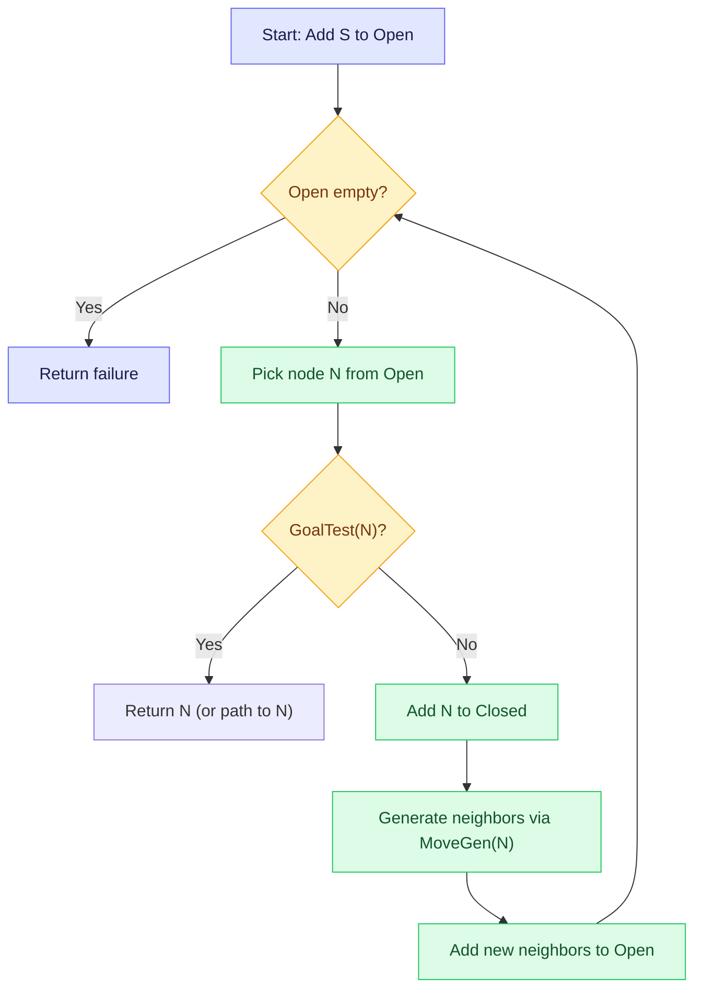
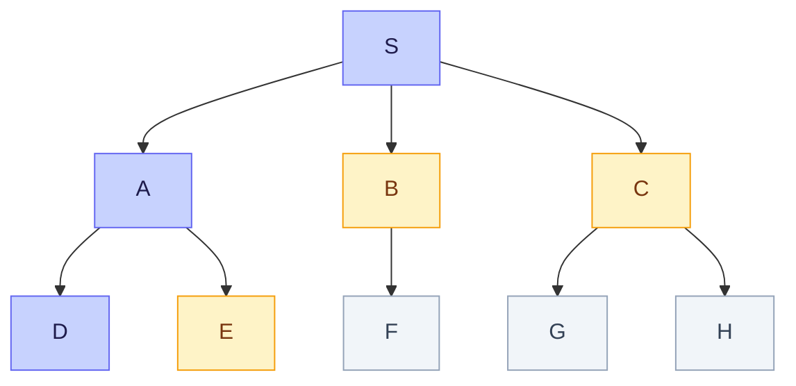
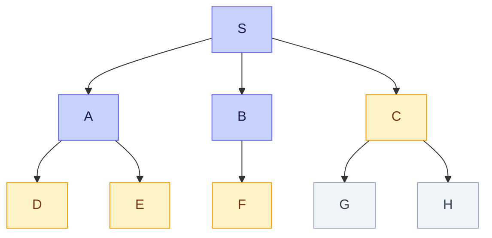
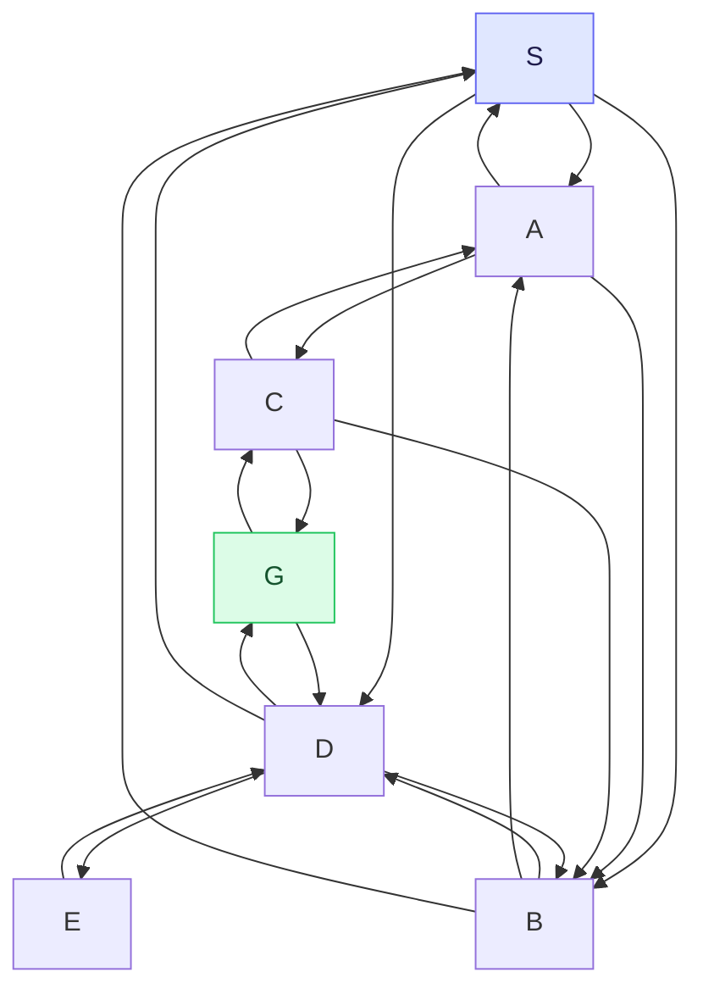
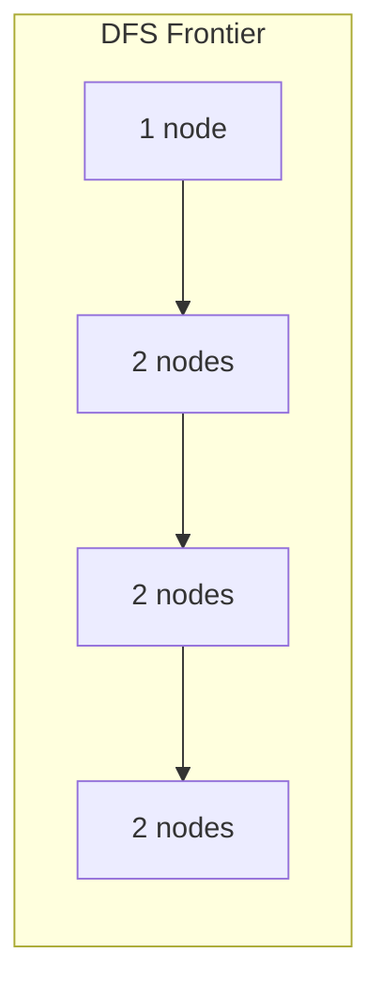
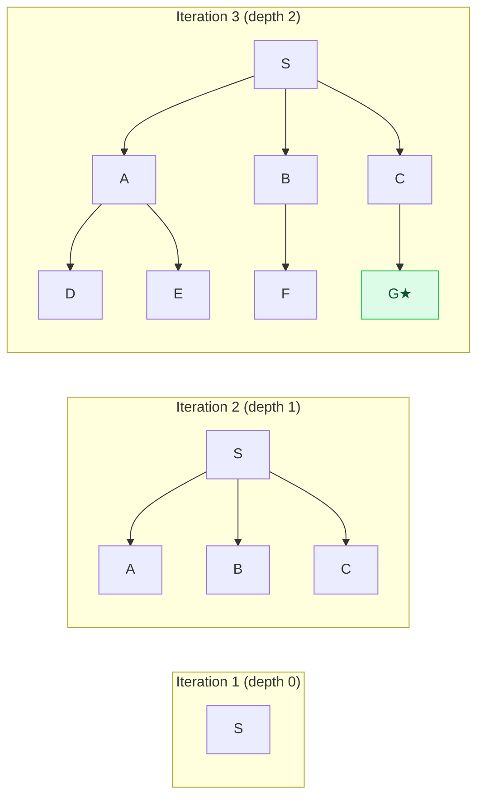

Last week was philosophy and history. This week, the algorithms begin. We define what state space search is, write our first general-purpose search algorithms, and study three of them in depth: Depth-First Search, Breadth-First Search, and Depth-First Iterative Deepening. These are called "blind" or "uninformed" search because they have no sense of where the goal is. They search mechanically, and the challenge is doing that efficiently against combinatorial explosion.

<LectureVideos
  videos={{
    "Lecture 1": "https://www.youtube.com/watch?v=nxeoZkr0k6U",
    "Lecture 2": "https://www.youtube.com/watch?v=fTPrAci0WWA",
    "Lecture 3": "https://www.youtube.com/watch?v=yRKqKdp-9ns",
    "Lecture 4": "https://www.youtube.com/watch?v=jgjiR4DMfSE",
    "Lecture 5": "https://www.youtube.com/watch?v=YEA3L8UThkQ",
    "Lecture 6": "https://www.youtube.com/watch?v=QuG7ooEPOFI",
    "Lecture 7": "https://www.youtube.com/watch?v=HyL-q5c4Bek",
  }}
/>

---

## State Space Search [Lecture 1]

Instead of writing a custom program for every problem, the goal of general search methods is to write search algorithms into which individual problems can be plugged in. There are two related approaches:

- **State space search**: describe the given state, devise an operator to choose an action in any state, and navigate the search space toward the goal state
- **Constraint processing**: define variables with domains, describe constraints between subsets of variables, and search for an assignment satisfying all constraints (covered later in the course)

### The Two Key Functions

State space search is modeled as graph search. A state is treated as a node in a search space, and two functions drive the entire process:

1. **MoveGen(n)**: takes a state `n` as input, returns its neighbors (the set of states reachable from `n` by one move). This function implicitly defines the graph.
2. **GoalTest(n)**: takes a state `n` as input, returns true if `n` is a goal state, false otherwise.

The state space is **implicit**. Nobody hands you the entire graph. You are only given the start state and a goal description, and you generate the state space on the fly using MoveGen.

### Example: The Water Jugs Problem

You have three jugs with capacities 8, 5, and 3 liters. The 8-liter jug starts full, the others are empty. The goal is to measure 4 liters of water.

The state can be represented as a triple, e.g. `(8, 0, 0)` for the start state. A move is pouring water from one jug to another until either the source jug is empty or the destination jug is full. The goal test could be "any jug contains exactly 4 liters," which matches multiple states like `(4, 4, 0)` or `(1, 4, 3)`.

Some moves are reversible (pouring 5 liters back and forth), others are not (you cannot measure 3 liters out of 5 to reverse a specific pour). This matters for the shape of the state space.

### Example: The Eight Puzzle

A 3x3 grid with tiles numbered 1-8 and one blank. You can slide a tile into the blank position. The goal is to arrange all tiles in order. From any state, there are 2-3 possible moves (up, down, left, right for the blank). This is a simpler 2D version of the Rubik's Cube.

The eight puzzle's state space is actually partitioned into **two disjoint sub-graphs**: you cannot reach every state from every other state. Swapping two tiles moves you to the other partition. The Rubik's Cube has 12 such partitions.

### Example: River Crossing (Man, Goat, Lion, Cabbage)

A man needs to transport a lion, a goat, and a cabbage across a river. If left alone, the lion eats the goat, or the goat eats the cabbage. The boat holds the man and at most one item.

There are different ways to represent the state. You can track what is on each bank, or just what is on the left bank, or just what is on the same side as the boat. Each representation leads to a different MoveGen and GoalTest, but they all describe the same problem. Choosing a good representation matters.

### Other Problems Mentioned

- **N-Queens**: place N queens on an NxN chessboard so no queen attacks another
- **Map Coloring**: assign colors to regions so adjacent regions differ
- **Traveling Salesman Problem (TSP)**: visit every city exactly once and return home at minimum cost. This is an optimization problem, not just a satisficing problem. The number of possible tours grows as $n!$.
- **Maze**: find a path from entrance to exit. The key insight: the search algorithm does not have a bird's-eye view. It only sees the current node and its neighbors.

---

## General Search Algorithms [Lecture 2]

The idea is to develop domain-independent algorithms. To solve a real-world problem, you write the domain-specific functions (MoveGen and GoalTest) and plug them into a general algorithm.

### The Open and Closed Lists

Two data structures are central to every search algorithm:

- **Open**: the list of candidate nodes that have been generated but not yet inspected. These are nodes we might want to visit.
- **Closed**: the list of nodes that have already been visited and tested for goal.

### The Search Loop

All search algorithms follow the same core loop: **generate and test**. Pick a candidate node from Open, test whether it is the goal, and if not, expand it by generating its neighbors and adding them to Open. Repeat until you find the goal or run out of candidates.

The key question that separates different algorithms: **which node do you pick from Open, and where do new nodes go?** That choice determines how quickly you find the solution, or whether you find it at all.

### Three Variants of Pruning

**No Closed list**: If you never track visited nodes, the algorithm can loop forever (S -> A -> S -> A -> ...). Open never empties.

**With Closed list**: Before adding neighbors to Open, remove any that are already in Closed. This prevents infinite loops and makes the search space smaller. But a node can still appear on Open multiple times if it was generated via different paths before being visited.

**Only new nodes**: Do not add a node to Open if it is already on Open **or** on Closed. Each node appears exactly once in the search tree, making it as small as possible. The tradeoff: if a shorter path to a node is discovered later, you have already closed off that option.

### Returning Paths, Not Just Nodes

The algorithms above return a node when the goal is found, but for planning problems we need the **path** from the start state to the goal state. To reconstruct paths, we store **node pairs** (node, parent) instead of just nodes. When the goal is found, we trace back through the Closed list using parent pointers to reconstruct the full path.

---

## Planning Problems vs Configuration Problems [Lecture 3]

There are two broad categories of search problems:

- **Configuration problems**: you want a state that satisfies a description. N-Queens, Sudoku, Map Coloring, SAT. The path does not matter, only the final state.
- **Planning problems**: the path matters. You want to know *how* to get from the start to the goal. River crossing, route finding, Rubik's Cube. You need to return the sequence of moves.

For planning problems, storing parent pointers (node pairs) in the Closed list lets us reconstruct the path from goal back to start.

### List Notation for Algorithms

The course uses a specific notation for writing algorithms:

- Empty list: `[]`
- Add element to head: `X : List` (colon operator, like Lisp's cons)
- Head of list: `head(List)` returns the first element
- Tail of list: `tail(List)` returns everything except the first element
- Append lists: `List1 ++ List2`

### Tuples for Node Pairs

Node pairs are represented as tuples: `(node, parent)`. Access elements with `first(pair)` and `second(pair)`. For triples (used later with depth), use `third(tuple)`. Underscore `_` is used for elements you don't care about.

---

## Depth-First Search and Breadth-First Search [Lecture 4]

The only difference between DFS and BFS is **where new nodes are added to the Open list**. The entire algorithm is identical except for one line.

### Depth-First Search (DFS)

DFS adds new nodes at the **head** of Open, making it behave like a **stack** (LIFO: last in, first out). The algorithm always picks the most recently generated node next. It **dives deep** into the search tree, following one branch as far as possible before backtracking.

The steps: start with Open = [(S, nil)] and Closed = []. While Open is not empty, pick the first element from Open (a node pair). If it passes GoalTest, reconstruct and return the path. Otherwise, add it to Closed, generate its new neighbors via MoveGen, filter out any already seen (using RemoveSeen), attach the current node as parent (using MakePairs), and prepend the new pairs to Open.

In this snapshot, DFS has visited S and A, then immediately dove into A's child D. The remaining nodes on the frontier (E, B, C) are waiting but DFS went deep first. It will only come back to them when D has no useful children.

### Breadth-First Search (BFS)

BFS adds new nodes at the **tail** of Open, making it behave like a **queue** (FIFO: first in, first out). The algorithm processes nodes in the order they were generated. It explores the search tree **level by level**: all nodes at distance 1 from start, then distance 2, then distance 3, and so on.

In this snapshot, BFS has visited S, then A and B (level 1). It is now processing the frontier at level 2 before going deeper. It stays close to the start node and expands outward systematically.

### Side by Side

DFS is **impetuous**: it sees a new node and rushes to it, going as deep as possible before backtracking. BFS is **conservative**: it finishes all nodes at the current distance before moving further out. Both generate the same search tree when using the same pruning rules, but they explore it in a completely different order.

---

## A Tiny Example [Lecture 5]

Consider a small state space: S is start, G is goal, with nodes A, B, C, D, E in between. The MoveGen function defines the neighbors.

When only new nodes (not on Open or Closed) are added, both DFS and BFS generate the **same search tree** but explore it in **different orders**. DFS picks the newest child first and dives deep; BFS processes nodes level by level.

When nodes on Open are allowed to be re-added (but not nodes on Closed), the search trees start to differ. DFS may add a node as a child of multiple parents if it is on Open but not yet Closed. BFS explores differently because of its queue order.

When all nodes are added without any pruning (not even checking Closed), DFS can go into **infinite loops** (S -> A -> C -> B -> S -> ...). BFS, however, still finds the goal because it processes nodes level by level and eventually reaches G at the correct depth. This is a key advantage of BFS: it is more robust against cycles even without the Closed list.

---

## Analysis of DFS and BFS [Lecture 6]

Assume a constant branching factor $b$ and the goal at depth $d$.

### Time Complexity

Both DFS and BFS inspect an exponential number of nodes in the worst case.

- **DFS best case** (goal at leftmost, depth $d$): inspects $O(d)$ nodes
- **DFS worst case** (goal at rightmost): inspects $O(b^d)$ nodes
- **DFS average**: approximately $O(b^{d/2})$
- **BFS best case**: inspects $O(b^{d-1})$ nodes (the entire tree up to level $d-1$)
- **BFS worst case**: $O(b^d)$
- **BFS average**: approximately $O(b^d)$ times a factor of $\frac{b+1}{2(b-1)}$

The ratio between their time complexities is roughly $\frac{b+1}{b-1}$. For $b=10$, BFS inspects about $\frac{11}{9}$ times as many nodes as DFS. So their time complexities are comparable: both are exponential, and the larger the branching factor, the closer they are.

### Space Complexity

This is where they differ dramatically.

- **DFS**: Open grows **linearly** with depth. At each level, DFS adds $b-1$ nodes to Open (generates $b$ children, picks one, the remaining $b-1$ go to Open). So Open size $= O(bd)$.
- **BFS**: Open grows **exponentially**. At each level, the number of Open nodes multiplies by $b$. So Open size $= O(b^d)$.

DFS keeps a thin frontier: it adds $b-1$ nodes per level and the frontier stays linear. BFS, on the other hand, has an exponentially growing frontier because it must hold every node at the current level before proceeding to the next.

DFS is the clear winner on space. For large problems, BFS can run out of memory long before it runs out of time.

### Quality of Solution

- **DFS**: no guarantee of finding the shortest path. It may find a longer path if it dives down the wrong branch first.
- **BFS**: **guarantees the shortest path**. Since it explores nodes level by level (increasing distance from start), the first time it finds a goal node, that path is the shortest.

### Completeness

Completeness means: if a path to the goal exists, will the algorithm find it?

- **DFS**: **not complete** for infinite search spaces. It can dive down an infinite branch and never backtrack. For finite spaces, it will eventually explore everything.
- **BFS**: **complete** for any search space where a finite-length path exists. Because it explores by increasing distance, it will eventually reach the goal.

### Summary

| Property | DFS | BFS |
|---|---|---|
| Time | $O(b^d)$ exponential | $O(b^d)$ exponential |
| Space | $O(bd)$ linear | $O(b^d)$ exponential |
| Shortest path | Not guaranteed | Guaranteed |
| Complete | Not for infinite spaces | Yes (finite path length) |

Both are exponential in time, which is the real enemy. But DFS has linear space while BFS guarantees the shortest path and is complete. Is there an algorithm that gets the best of both?

---

## Depth-First Iterative Deepening (DFID) [Lecture 7]

DFID combines the linear space of DFS with the shortest-path guarantee of BFS.

### The Idea

Run DFS repeatedly with increasing depth bounds: first search to depth 0, then depth 1, then depth 2, and so on. Each iteration is a depth-bounded DFS, which uses linear space. But by searching increasing depths, DFID mimics BFS behavior: it finds the goal at the shortest path length first.

Each iteration goes one level deeper. The goal G is found at depth 2, which is the shortest path. Space stays linear throughout because each iteration is just DFS.

### Depth-Bounded DFS

The algorithm is the same as regular DFS, but each node now carries a **depth value** as a third element in a triple (node, parent, depth). When generating children, their depth is set to parent depth + 1. If a node's depth equals the bound, its children are not generated.

A variation also tracks the **count** of nodes visited in each iteration. This matters for termination: if two consecutive iterations visit the same number of nodes, there are no new nodes to explore and the algorithm can report failure.

### Does DFID Always Return the Shortest Path?

There is a subtlety. Because DFS uses the Closed list to avoid revisiting nodes, it may close off a shorter path to a node. Example: node D might be reached via the path S->A->C->D first (depth 3). Later, when DFID tries the path S->B->D (depth 2), D is already on Closed and is not added again. This means the shortest path through D to G is lost.

The fix: **do not prune nodes using Closed in DFID**. You can still store node pairs in Closed for path reconstruction, but do not use Closed to filter out nodes when adding to Open. Instead, store the entire path in each node representation. When the goal is found, the path is already part of the representation and you simply return it.

For configuration problems (N-Queens, SAT, Map Coloring), the path does not matter, only the final state, so this issue is less critical.

### The Overhead of Re-Exploration

The obvious concern: DFID re-explores the entire tree from scratch in each iteration. Isn't that wasteful?

For a tree with branching factor $b$ and $L$ leaves at depth $d$, DFID visits $L + I$ nodes (leaves + internal nodes) compared to BFS's $L$ nodes. The ratio of extra work is:

$$\frac{\text{DFID nodes}}{\text{BFS nodes}} = \frac{b}{b - 1}$$

For $b = 10$, this is $\frac{10}{9}$, roughly 11% extra work. The reason is that in an exponentially growing tree, the leaves vastly outnumber the internal nodes. Revisiting the internal nodes costs very little relative to the leaves. This is a small price to pay for linear space.

### The Monster: Combinatorial Explosion

All three algorithms (DFS, BFS, DFID) are called **blind search** or **uninformed search** because they have no sense of where the goal is. DFS always behaves the same way regardless of where the goal is; so does BFS. They are oblivious to the goal.

The search tree grows exponentially (branching factor $b$ means level $d$ has $b^d$ nodes). This is the fundamental adversary of search, sometimes compared to the Hydra from Greek mythology: cut off one head and multiple new ones appear. Inspect one node and it generates $b$ children.

The solution: **heuristic search**, where the algorithm has a sense of direction. That is the topic of upcoming weeks.
