Last week we saw three blind search algorithms that plod through the state space with no sense of where the goal is. This week we give search a compass. The idea is simple: define a heuristic function that estimates how close any node is to the goal, then use it to guide the search. We start with Best First Search, strip it down to its local-search cousin Hill Climbing, and then try to fix Hill Climbing's fatal flaw (it gets stuck) using beam search, variable neighborhood descent, tabu search, and iterated hill climbing.

<LectureVideos
  videos={{
    "Lecture 1": "https://www.youtube.com/watch?v=9vjG9SoIqsI",
    "Lecture 2": "https://www.youtube.com/watch?v=N654Npk8K5A",
    "Lecture 3": "https://www.youtube.com/watch?v=0DERF40ejME",
    "Lecture 4": "https://www.youtube.com/watch?v=Qin5PJyBda8",
    "Lecture 5": "https://www.youtube.com/watch?v=0HuiDgXe9Y4",
  }}
/>

---

## Heuristic Search [Lecture 1]

DFS, BFS, and DFID are called **blind** or **uninformed** search because they behave identically no matter where the goal sits. They follow a fixed traversal order determined entirely by MoveGen. What we need is a search algorithm with a **sense of direction**: some awareness of which side the goal lies on, and a tendency to head that way.

### The Gradient Analogy

Imagine water flowing down a mountainside. It never needs a map. The slope of the terrain gives it a direction: always take the steepest descent path. A blindfolded agent standing in a valley can do the same thing: take a step in every direction, measure which way is steepest, and move there.

The question is: what defines the "terrain" for a search algorithm? The answer is a **heuristic function**.

### The Heuristic Function

A heuristic function $h(n)$ takes a node $n$ as input and returns an **estimate** of the distance from $n$ to the goal. If we could compute $h(n)$ for every node, the search algorithm could prefer nodes with lower heuristic values, since they appear closer to the goal. The goal itself has $h = 0$.

This is the third function the user must provide (alongside MoveGen and GoalTest). It is **domain-specific**: you design it based on the problem. A perfect heuristic (an oracle that always returns the exact shortest-path distance) would guide search straight to the goal, but perfect heuristics are rare in practice. We work with estimates.

A key property: heuristic functions are **static**. They look only at the current node and the goal, not ahead in the search tree. Computing $h(n)$ takes constant time for a given state size, so it does not add to the asymptotic complexity of search.

### Best First Search

Best First Search modifies our existing search algorithm in one small way: **Open is sorted by heuristic value** (lowest at the head). Instead of always picking the newest node (DFS) or the oldest (BFS), it picks the node that appears closest to the goal.

The algorithm picks from the head of Open as before, tests for goal, generates children, and inserts them into Open in sorted order. In practice, Open is maintained as a **priority queue** keyed on $h(n)$.

Node representations change from **pairs** (node, parent) to **triples** (node, parent, $h$) so that the heuristic value travels with every candidate.

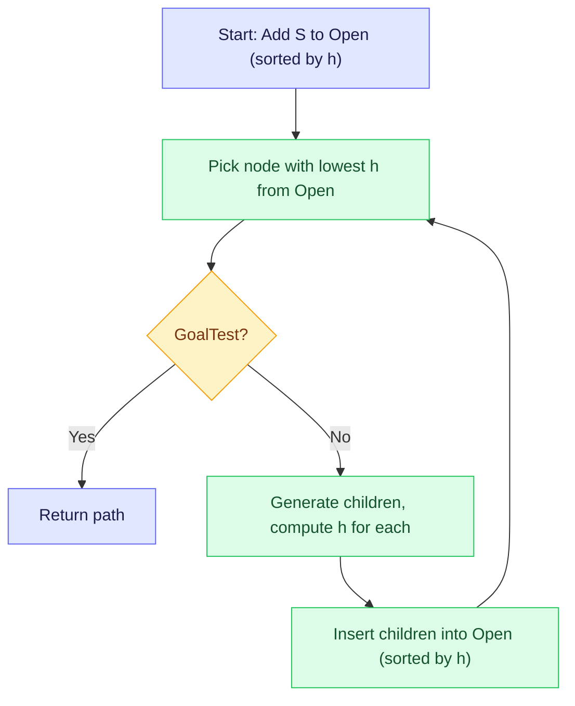

### Heuristic Functions for the Eight Puzzle

Two classic heuristics for the eight puzzle:

**$h_1$ (Hamming distance)**: count the number of tiles out of place. Simple but coarse. If only tiles 7 and 3 are wrong, $h_1 = 2$.

**$h_2$ (Manhattan distance)**: for each tile, sum the number of horizontal and vertical moves needed to reach its goal position. If tile 3 needs to move one step right and two steps up, its contribution is 3. The total $h_2$ for the same state might be 6 (3 for tile 3, plus contributions from other misplaced tiles).

Manhattan distance is more informed because it accounts for *how far* each tile is from its destination, not just whether it is wrong.

### Heuristics Are Not Perfect

Both successors of the eight puzzle's start state can have **higher** heuristic values than the start state itself. The start is a local minimum: every move takes you further from the goal by the heuristic's estimate, yet you must make a move. This is exactly the problem that pure gradient descent faces. The heuristic defines a landscape, and that landscape can have local minima.

### Heuristic Functions for Route Finding

For geographical route finding on a map:

- **Euclidean distance**: straight-line distance between the current node's coordinates and the goal's coordinates. Gives a real-valued estimate (e.g., 7.21 km).
- **Manhattan distance**: count the number of horizontal and vertical grid steps between current and goal positions. Gives an integer estimate (e.g., 10 steps). Named after Manhattan's grid layout.

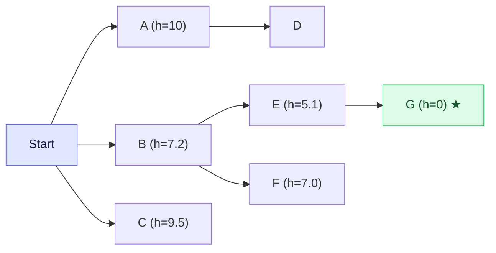

Best first search follows the heuristic downhill: from S it picks B ($h = 7.2$), then E ($h = 5.1$), then G ($h = 0$). But a river with no bridge might block that direct route, and the algorithm only discovers this when it arrives. The heuristic cannot see obstacles; it only measures distance.

### Properties of Best First Search

**Completeness**: since it is a systematic search (the only change from DFS is sorting Open), it will eventually explore the entire finite space if needed. If a path exists, it will find one.

**Quality of solution**: not guaranteed to find the shortest path. The heuristic estimates distance, but it ignores edge costs (so far we count only the number of hops). Best first may find a longer path than BFS would.

**Space**: like DFS and BFS, Open can grow exponentially in the worst case. The search frontier shape depends heavily on the heuristic quality.

---

## Hill Climbing [Lecture 2]

Best first search is complete but needs exponential space. What if we strip it down to its bare minimum: keep only the current node, look at its neighbors, and move to the best one?

### The Algorithm

Hill climbing generates the neighbors of the current node, picks the **best** neighbor (lowest $h$), and moves there **only if** it is better than the current node. If no neighbor is better, the algorithm terminates.

There is **no Open list**. There is **no Closed list**. You just need the current node and its neighbors. This makes hill climbing a **constant space** algorithm.

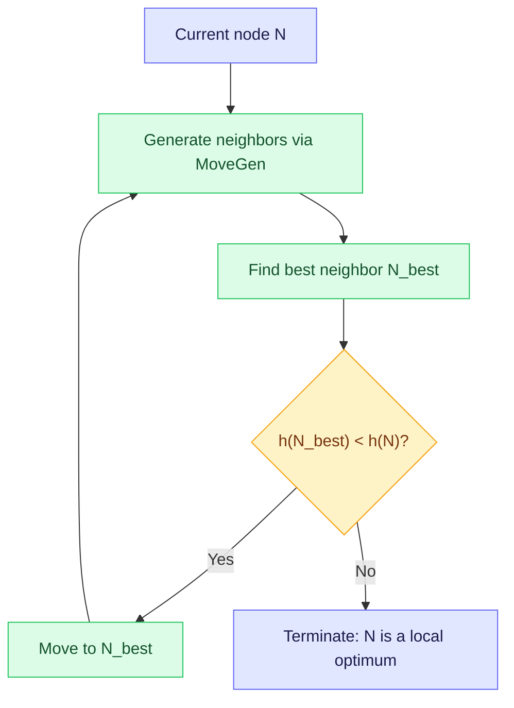

In practice, you do not even need to sort the neighbors. Just scan them once and pick the best. Sorting would be $O(n \log n)$ while scanning is $O(n)$.

### Properties

| Property | Hill Climbing | Best First Search |
|---|---|---|
| Space | $O(1)$ constant | $O(b^d)$ exponential |
| Time | $O(\text{path length})$ linear | $O(b^d)$ exponential |
| Complete | No | Yes |
| Finds optimal | No | Not guaranteed |

The termination criterion has changed. Hill climbing does **not** stop when it finds the goal. It stops when no neighbor is better. This means it treats the problem as an **optimization problem**: find the node with the lowest $h$ value, not necessarily the goal.

### The Local Optima Problem

Hill climbing is a **greedy** algorithm. It always moves to the steepest gradient. On a maximization landscape (like a hill), it climbs to the nearest peak and stops, even if a taller peak exists elsewhere. On a minimization landscape (like a valley), it sinks to the nearest trough.

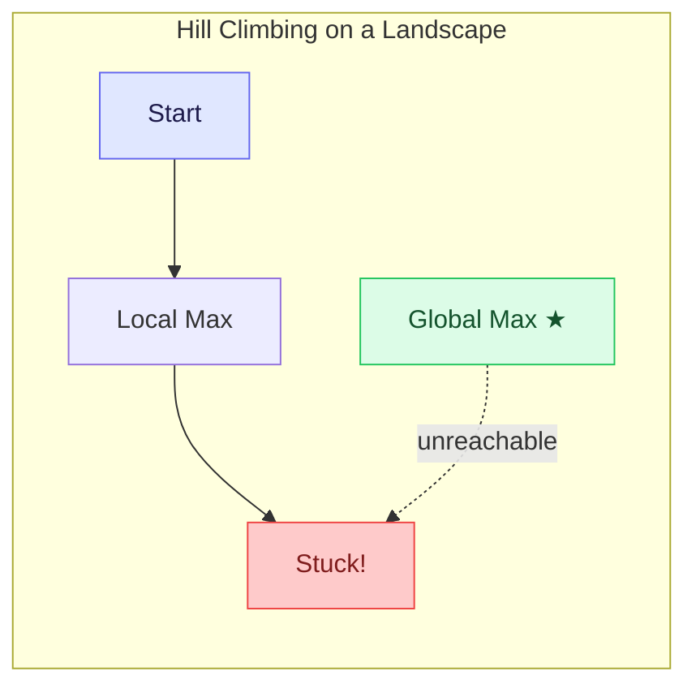

The algorithm has "burnt its bridges" by discarding the Open list. It cannot backtrack to try a different path.

### Heuristic Values Along a Solution Path

If someone gives you a solution to the eight puzzle and you plot $h$ along the path, the values do not decrease monotonically. They fluctuate: a move that places one tile correctly may displace another, causing $h$ to go up before eventually coming down to 0. This is why hill climbing fails on the eight puzzle. The path to the goal goes through states that look worse before they look better.

The same thing happens when solving a Rubik's Cube: solving one face often requires messing up a previously solved part.

### The Blocks World Problem

Blocks World is a planning problem studied extensively in AI. A table (unlimited space) holds a set of same-sized blocks. A robot arm can move the topmost block from any stack to another stack or to the table. Given a start configuration and a goal configuration, find the sequence of moves.

#### Two Heuristic Functions for Blocks World

**$h_1$**: add 1 for every block resting on the correct block or table, subtract 1 for every block in the wrong position. For a 6-block problem, the goal scores 6.

**$h_2$ (more informed)**: if a block sits on a correct sub-structure of $n$ blocks (including the table), add $n$; otherwise subtract $n$. This rewards not just individual correct placements but entire correct towers.

#### How $h_1$ Gets Stuck

Starting from the initial state ($h_1 = 2$), hill climbing with $h_1$ finds one move that improves the score (moving block A on top of E, $h_1 = 4$). But from that state, **every** possible move makes things worse. Hill climbing terminates at a local maximum, having never solved the problem.

#### How $h_2$ Succeeds

With $h_2$, the start state scores $-1$. The best move (moving A to the table) scores 6, which is dramatically better. From there, moving E on top of B scores 10. Finally, moving A on top of E gives the goal. Hill climbing sails through because $h_2$ defines a smooth, monotonically improving landscape.

The takeaway: **the heuristic function defines the terrain**. A well-chosen heuristic creates a surface where gradient descent works. A poorly chosen one creates ridges and local optima that trap the algorithm.

---

## Algorithm Demos [Lecture 3]

A demo platform developed in the AI/DB lab at IIT Madras lets us watch search algorithms run on randomly generated graphs. The visualizations show Open nodes in blue and Closed nodes in black, making the search frontier visible in real time.

### Depth First Search

DFS shows no awareness of where the goal is. It explores the graph in a fixed order determined by MoveGen, wandering far from the goal before eventually stumbling upon it. Changing the goal node does **not** change its behavior at all. It always traverses the same path through the state space.

### Breadth First Search

BFS also has no sense of direction, but its level-by-level exploration means it stays close to the start node and expands outward. It always finds the **shortest path** (in number of hops). The tradeoff is that it explores many more nodes than necessary, especially when the goal is far away.

### Best First Search

Best first search behaves noticeably differently. It drives search toward the goal, following the heuristic gradient. On sparse graphs, it often finds the goal with far fewer node visits than BFS. But it may not find the shortest path.

A striking demonstration: run best first search from the same start node with goal nodes in different directions. The algorithm heads off toward whichever goal is closest. Change the goal, and the search path changes completely. This is the opposite of DFS and BFS, whose behavior is identical regardless of goal placement.

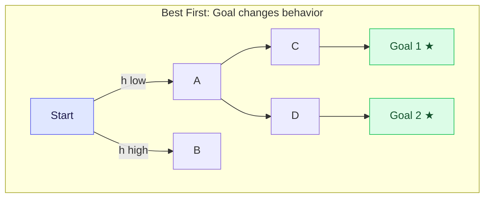

### Hill Climbing

Hill climbing also heads toward the goal, but being a local search algorithm, it can get trapped at a local optimum and fail to reach the goal. When it works, it does so very efficiently. When it fails, there is no recovery.

### Multiple Goal Nodes

With multiple goal nodes, best first search computes $h(n)$ as the minimum distance to **any** goal. It tends to head toward the closest one, and once it starts moving toward a particular goal, the heuristic reinforces that choice (the closer it gets, the lower $h$ becomes for that goal specifically). BFS, by contrast, simply finds whichever goal is reached first by the level-by-level expansion.

### A* Preview

The course also previews A*, an algorithm that combines the heuristic guidance of best first search with the path-cost awareness of BFS. A* finds the same shortest path as BFS but explores far fewer nodes. We will study it in detail later.

---

## Solution Space Search [Lecture 4]

So far, we have searched in the **state space**: start from the initial state, apply operators, and look for the goal state. There is another way to formulate the problem.

### Solution Space vs State Space

In **solution space search**, every node in the search space is itself a **candidate solution**. When we find a node that satisfies the goal description, we are done. We do not need to reconstruct a path. Configuration problems (N-Queens, SAT, Sudoku) fit this formulation naturally. Planning problems can also be solved this way; the AI planning community calls it **plan space planning**.

### Synthesis vs Perturbation

Two ways to navigate a solution space:

**Synthesis** (constructive): start from scratch and build the solution piece by piece. For N-Queens, place the first queen, then the second, and so on. This is what DFS/BFS do in the state space.

**Perturbation**: start with a complete (but possibly wrong) candidate solution and modify it to get closer to the goal. For N-Queens represented as a 1D array where the index is the row and the value is the column, any permutation of column numbers is a candidate solution. Swapping two values (a perturbation) generates a new candidate.

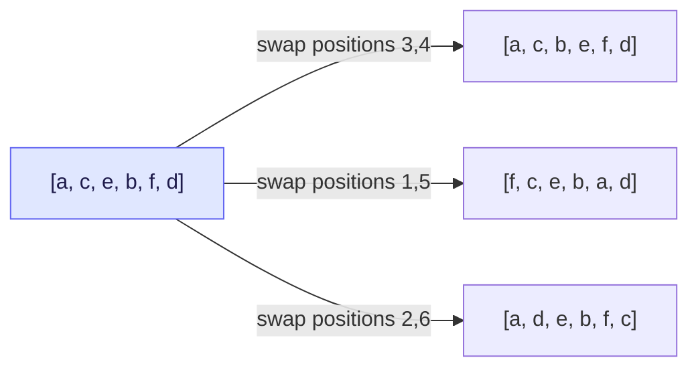

Each swap produces a neighbor in the solution space. A local search algorithm navigates from candidate to candidate via these perturbations.

### The SAT Problem

Given a boolean formula over $n$ propositional variables, find an assignment (true/false for each variable) that makes the formula evaluate to true.

The formula is often expressed in **Conjunctive Normal Form (CNF)**: a conjunction (AND) of clauses, where each clause is a disjunction (OR) of literals (variables or their negations). A satisfying assignment must make **every** clause true.

The solution space for SAT with $n$ variables has $2^n$ candidates (each variable is a bit). A natural neighborhood function: **flip one bit**. Each candidate has exactly $n$ neighbors.

### The Travelling Salesperson Problem (TSP)

Given $n$ cities and a distance between every pair, find a Hamiltonian cycle (visit each city exactly once and return) with the least total cost.

TSP is **NP-hard**, even harder than SAT in an important sense. Given a candidate SAT solution, you can verify it in polynomial time (just evaluate the formula). Given a candidate TSP tour, you can verify it is a valid tour, but you **cannot** easily verify it is the **optimal** tour.

#### Constructive Methods for TSP

**Nearest neighbor**: start at some city, always move to the closest unvisited city. Simple and greedy, but often produces poor tours with long return edges.

**Greedy heuristic** (like Kruskal's algorithm): sort all edges by cost, add the shortest edge that does not create a premature cycle or give any city more than two edges. Continue until a complete tour is formed.

**Savings heuristic**: start with $n-1$ tiny tours of length 2, all anchored on a base city. Repeatedly merge two tours by removing their edges to the base and connecting the hanging endpoints. Choose the merge that saves the most cost. This heuristic tends to produce better tours than nearest neighbor.

#### Perturbation Methods for TSP

**2-city exchange**: swap two cities in the tour sequence. The tour is represented as an ordered list; exchanging positions of two cities generates a new candidate. There are $\binom{n}{2}$ possible swaps.

**2-edge exchange**: remove two edges from the tour and reconnect the two resulting path fragments in the other possible way. This directly targets the cost-contributing elements (edges) rather than cities. Also $\binom{n}{2}$ possibilities.

**3-edge exchange**: remove three edges, breaking the tour into three fragments. These can be recombined in **4 different ways** to form a new tour. The three edges can be chosen in $\binom{n}{3}$ ways.

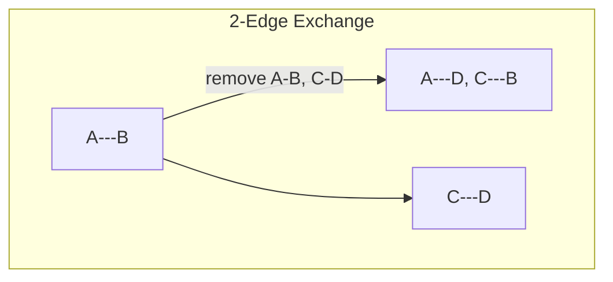

### The Scale of the Problem

| $n$ | SAT candidates ($2^n$) | TSP candidates ($n!$) | Ratio |
|---|---|---|---|
| 8 | 256 | 40,320 | 157 |
| 50 | $\approx 10^{15}$ | $\approx 10^{64}$ | $\approx 10^{49}$ |
| 100 | $\approx 10^{30}$ | $\approx 10^{157}$ | $\approx 10^{127}$ |

Factorial growth obliterates exponential growth. At $n = 100$, TSP has $10^{127}$ times more candidates than SAT. Even SAT at $n = 100$ has $\approx 10^{30}$ candidates. At a million nodes per second, brute-force SAT with 100 variables would take centuries.

This is why local search methods are essential. We cannot afford to look at every candidate. We need algorithms that explore neighborhoods and move toward better solutions without getting trapped.

---

## Deterministic Local Search [Lecture 5]

Hill climbing **exploits** the gradient: it always moves to the best neighbor. But exploitation alone leads to local optima. What we need is a balance between **exploitation** (following the gradient) and **exploration** (moving to new areas of the search space).

### Beam Search

The simplest extension of hill climbing: instead of keeping only one current node, keep the **$B$ best** candidates at each level, where $B$ is the **beam width**. Generate all neighbors of all $B$ candidates, evaluate them, and keep the best $B$ for the next round.

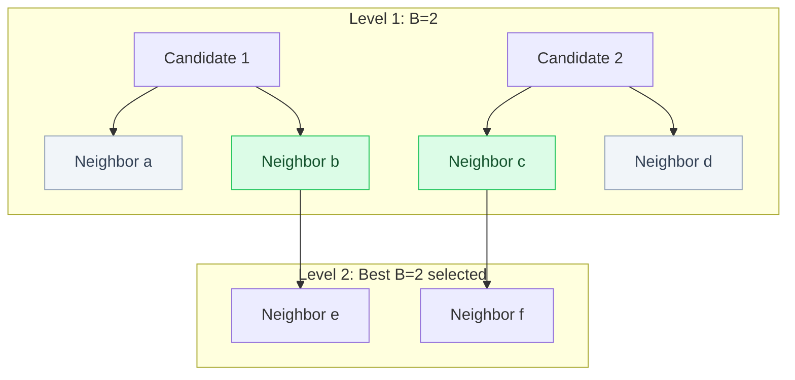

Beam search with $B = 2$ on a 5-variable SAT problem (6 clauses, heuristic = number of satisfied clauses): starting from (1,1,1,1,1) with $h = 3$, both of the two best neighbors have $h = 4$. In the next round, the best of their 10 children has $h = 5$. But in the round after that, no neighbor reaches $h = 6$. Beam search is **stuck at a local maximum**.

Larger beam widths give more chances to escape, but use more memory. With $B = 1$, beam search **is** hill climbing.

### Neighborhood Density and Variable Neighborhood Descent

The neighborhood function defines which candidates are connected. For SAT:

- $N_1$: flip 1 bit. A 5-variable problem has 5 neighbors per candidate.
- $N_2$: flip 2 bits. 10 neighbors.
- $N_{1,2}$: flip 1 or 2 bits. 15 neighbors.
- $N_{1..n}$: flip any number of bits. The entire state space ($2^n$ neighbors). This is brute force.

**Denser neighborhoods** make it more likely that a better neighbor exists (harder to get stuck), but each step requires inspecting more candidates. In the extreme, $N_{1..n}$ guarantees finding the global optimum but degenerates into exhaustive search.

**Variable Neighborhood Descent (VND)** exploits this tradeoff. It maintains an ordered list of neighborhood functions from sparse to dense. Start with the sparsest ($N_1$) and do hill climbing. When hill climbing gets stuck, switch to the next denser function ($N_2$) to escape. The hope is that most of the climbing is done with sparse (cheap) neighborhoods, and only a few steps need denser (expensive) ones.

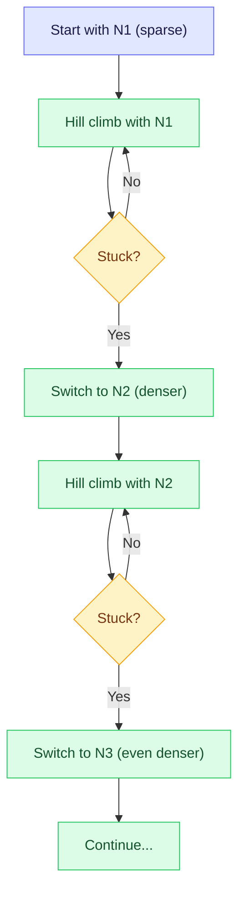

### Best Neighbor (Move Anyway)

A simpler variation: always move to the **best neighbor**, even if it is worse than the current node. This lets the algorithm step off a local maximum. But there is a problem: from the neighboring node, the best neighbor is often the local maximum you just left. The algorithm bounces right back.

To prevent this, we need a way to **remember where we have been**.

### Tabu Search

Tabu search moves to the best neighbor, but with a restriction: certain moves are **tabu** (forbidden) based on recent history.

The algorithm maintains a **memory array** $M$ with one entry per variable (or per bit, for SAT). When bit $i$ is flipped, $M[i]$ is set to the **tabu tenure** $T$, meaning bit $i$ cannot be flipped again for the next $T$ rounds. After each round, all non-zero entries in $M$ are decremented by 1.

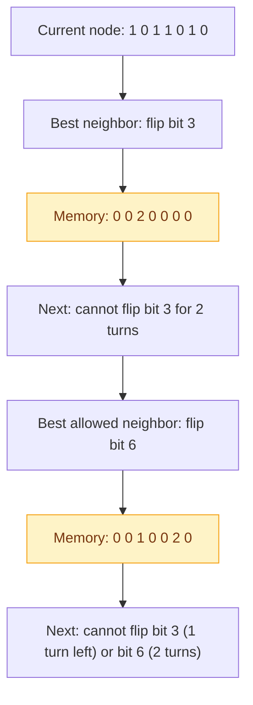

The tabu tenure $T$ is a design choice. Larger $T$ forces more exploration (you cannot revisit recent moves), but may prevent good moves. Smaller $T$ allows more exploitation but risks cycling.

**Aspiration criteria**: even if a move is tabu, allow it if the resulting node is better than the **best node seen so far**. This is an escape valve that prevents tabu search from missing clearly good moves.

**Frequency-based diversification**: maintain a **frequency array** $F$ that counts how many times each bit has been flipped. Penalize moves proportional to their frequency: instead of evaluating a candidate at $h(i)$, evaluate it at $h(i) - \alpha \cdot F[i]$. This drives search toward less-explored areas of the space.

### The SAT Landscape: A Visual Example

Consider a 4-variable SAT problem with 6 clauses. The heuristic (number of satisfied clauses) ranges from 3 to 6 across the 16-candidate space. Edges connect candidates that differ by one bit.

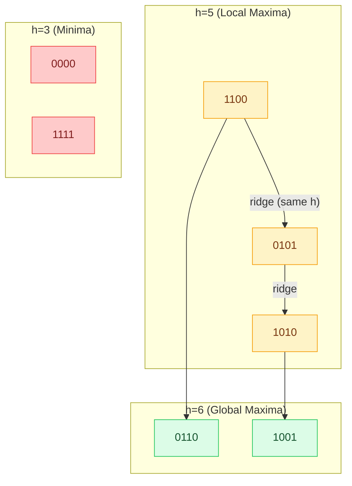

Three types of edges appear in this landscape:

- **Solid arrows**: unique best neighbor. Hill climbing follows these deterministically.
- **Dashed arrows**: multiple best neighbors. Hill climbing picks one arbitrarily.
- **Ridge edges**: both endpoints have the same $h$ value. Hill climbing never traverses these (no improvement).

Starting from a local maximum like 1100, hill climbing is stuck. Tabu search, however, can step along the ridge to another node with $h = 5$, then from there reach a global maximum with $h = 6$. The tabu constraint prevents it from immediately returning to 1100.

### Iterated Hill Climbing

For **configuration problems** (where the path does not matter, only the final state), there is nothing special about the starting point. Why not try multiple random starting points?

Iterated hill climbing runs hill climbing from a series of **randomly chosen initial states**. Each run is independent. If any run finds the global optimum, we are done.

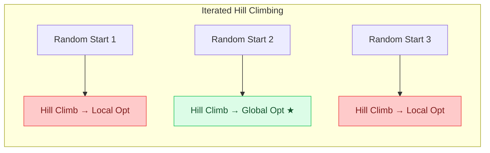

The probability of success depends on the landscape. If most starting points lead to the global optimum (many "basins of attraction"), iterated hill climbing works well. If the landscape is dominated by local optima with small basins leading to the global optimum, many restarts may be needed.

This is the simplest form of **randomized** local search. In upcoming sessions, we will study more sophisticated stochastic methods like simulated annealing that blend exploitation and exploration within a single run, rather than relying on multiple independent runs.
