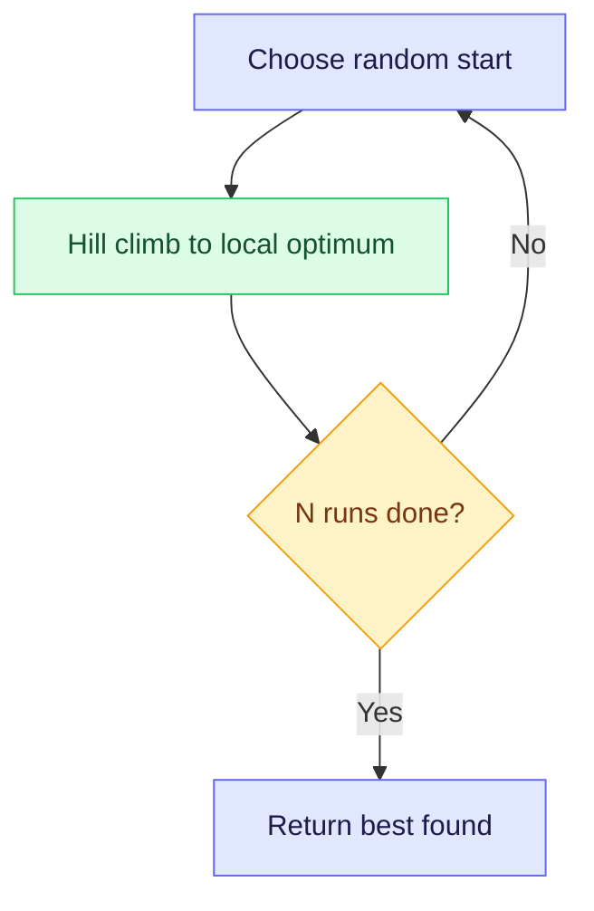
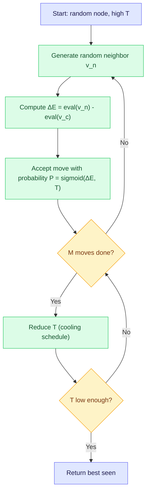
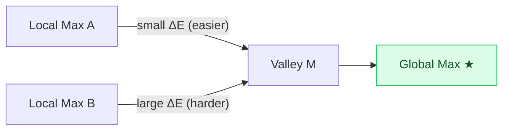
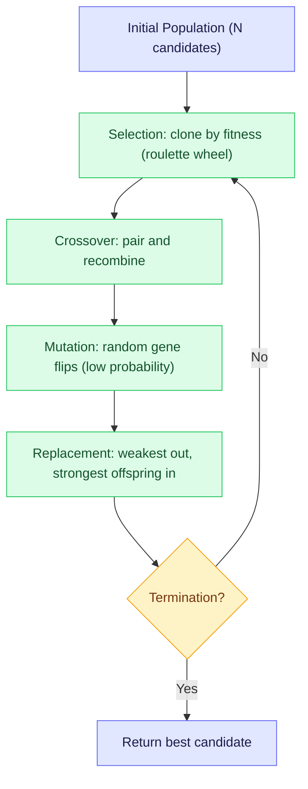
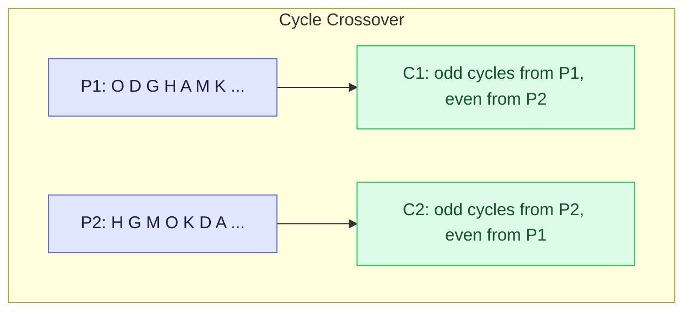
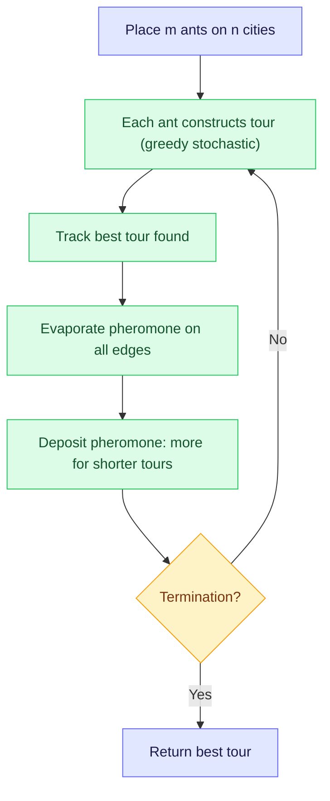

Last week we tried to fix hill climbing with deterministic tricks: beam search, tabu search, variable neighborhood descent. They help, but they feel mechanical. This week we introduce randomness. It starts simply: just pick different starting points. Then we let the algorithm make bad moves on purpose, with controlled probability. Then we scale up to populations of candidates that evolve like living things, and finally we watch ants solve problems by leaving chemical trails. The theme is the same: escape local optima by loosening the grip of pure exploitation.

<LectureVideos
  videos={{
    "Lecture 1": "https://www.youtube.com/watch?v=Q2v-792oFYs",
    "Lecture 2": "https://www.youtube.com/watch?v=UVUDOW9OQF0",
    "Lecture 3": "https://www.youtube.com/watch?v=4X0MZVMs4X8",
    "Lecture 4": "https://www.youtube.com/watch?v=jESJ6pG6oPU",
    "Lecture 5": "https://www.youtube.com/watch?v=KGC2uZKAPNQ",
  }}
/>

---

## Iterated Hill Climbing [Lecture 1]

Hill climbing is cheap and fast, but it gets stuck at the nearest local optimum. For configuration problems (SAT, N-Queens, Sudoku) the starting point is arbitrary anyway. There is nothing special about one particular initial state. So why not try many?

### The Algorithm

Pick a random candidate, do hill climbing from there, and record the result. Repeat $N$ times with a fresh random start each time. Return the best solution found across all runs.

### The Footprint of Iterated Hill Climbing

Each local optimum has a "basin of attraction": the set of starting points from which hill climbing converges to that optimum. If the global optimum has a large basin, iterated hill climbing succeeds often. If the landscape is dominated by local optima with small basins leading to the global one, many restarts may be needed.

### SAT Recap

For a SAT problem with $n$ variables in CNF form, the candidate space has $2^n$ candidates. Each candidate is an $n$-bit string. The heuristic function counts the number of satisfied clauses.

A useful distinction: **2-SAT** (at most 2 literals per clause) is solvable in polynomial time. **3-SAT** (at most 3 literals per clause) is NP-complete. Experimentally, the probability of a random 3-SAT formula being satisfiable drops sharply when the ratio of clauses to variables (m/n) reaches about 4.3. This phase transition is also where deterministic algorithms struggle the most.

---

## Stochastic Local Search [Lecture 2]

Iterated hill climbing uses randomness only at the start (choosing the initial point). The moves themselves are still deterministic: hill climbing always picks the best neighbor. What if we inject randomness into the move selection itself?

### From Exploitation to Exploration

Hill climbing is pure **exploitation**: it follows the gradient. A **random walk** is pure **exploration**: it picks a random neighbor and moves there, ignoring the gradient entirely, keeping only a record of the best node seen.

The sweet spot lies between these extremes: accept good moves with high probability, bad moves with low probability.

### Stochastic Hill Climbing

Instead of generating all neighbors and picking the best, generate **one random neighbor** $v_n$ and decide whether to move from current node $v_c$ to it.

Compute $\Delta E = \text{eval}(v_n) - \text{eval}(v_c)$. The probability of accepting the move is given by the **sigmoid function**:

$$P(\text{move}) = \frac{1}{1 + e^{-\Delta E / T}}$$

where $T$ is a temperature parameter (fixed for now).

When $\Delta E > 0$ (better neighbor): probability > 0.5, tending toward 1 for large improvements.

When $\Delta E < 0$ (worse neighbor): probability < 0.5, tending toward 0 for large degradations.

When $\Delta E = 0$ (equal): probability = 0.5.

The move is made by generating a random number in $[0, 1]$ and accepting if it falls below $P(\text{move})$. This is a simple mechanism for making probabilistic decisions.

### Simulated Annealing

The sigmoid function depends on both $\Delta E$ and $T$. So far $T$ was fixed. Simulated annealing **varies $T$ over time**, inspired by the physical process of annealing in metallurgy: heat a metal to a high temperature (atoms move freely), then cool it slowly (atoms settle into a low-energy crystalline structure).

### Effect of Temperature

The temperature $T$ controls the shape of the sigmoid curve:

- **High $T$** (e.g., $T \to \infty$): probability $\approx 0.5$ for any $\Delta E$. The algorithm behaves like a **random walk**. All moves are equally likely.
- **Low $T$** (e.g., $T \approx 0$): probability $\approx 1$ when $\Delta E > 0$ and $\approx 0$ when $\Delta E < 0$. The algorithm behaves like **hill climbing** (deterministic).
- **Intermediate $T$**: the sigmoid opens up. Good moves are preferred, bad moves are occasionally accepted.

As $T$ is reduced, the algorithm transitions smoothly from exploration (random walk) to exploitation (hill climbing).

### Concrete Example

Fix $\Delta E = 13$ (a better neighbor) and vary $T$:

| $T$ | $e^{-13/T}$ | $P(\text{accept})$ |
|---|---|---|
| 1 | $\approx 0$ | $\approx 1.00$ |
| 5 | 0.074 | 0.93 |
| 10 | 0.27 | 0.79 |
| 50 | 0.77 | 0.56 |
| 100 | 0.88 | 0.53 |

At low $T$, good moves are almost certainly accepted. At high $T$, even good moves are accepted only about half the time (because everything is, since $T$ is high).

Now fix $T = 10$ and vary $\Delta E$ (current node value = 107):

| Neighbor value | $\Delta E$ | $P(\text{accept})$ |
|---|---|---|
| 150 | +43 | 0.99 |
| 120 | +13 | 0.79 |
| 107 | 0 | 0.50 |
| 100 | -7 | 0.33 |
| 80 | -27 | 0.06 |

Better neighbors are accepted with high probability. Worse neighbors can still be accepted, but rarely. The worse the move, the lower the probability.

### Escaping Local Maxima

Consider two local maxima, A and B, with a valley between them. To go from A to B, the algorithm must first step down to the midpoint M. The "depth" of the descent from A to M is smaller than from B to M, so the probability of stepping from A toward M is higher. Simulated annealing is more likely to escape shallow local optima than deep ones, which matches intuition: a shallow local optimum is less "convincing" than a deep one.

Simulated annealing works well in practice. On landscapes where hill climbing has a tiny footprint (only a few starting points lead to the global optimum), simulated annealing manages to hop between local optima and converge toward increasingly better ones as the temperature drops.

---

## Genetic Algorithms [Lecture 3]

Simulated annealing works with one candidate at a time. Genetic algorithms work with a **population** of candidates, inspired by biological evolution. The idea: maintain a pool of diverse solutions, let the fittest reproduce, mix their features through crossover, occasionally mutate, and repeat.

### Nature's Design Process

Evolution is a design process. Species compete for limited resources. Within a species, the fittest individuals survive and reproduce more (Darwin's "survival of the fittest"). Richard Dawkins described this as a **ratchet mechanism**: once nature stumbles on a good design, it persists.

Sexual reproduction is the key mixing strategy. Offspring inherit features from two parents, making every child unique. The French poet Paul Valery captured it: "It takes two to invent anything. The one makes up combinations; the other chooses." Generate (recombine genes) and test (natural selection).

Two important distinctions from biology:

- **Genotype**: the genetic makeup (the chromosome, the bits)
- **Phenotype**: the physical expression (the body, the candidate solution)

Selection acts on the phenotype. Recombination acts on the genotype.

### The Genetic Algorithm

Devised by John Holland (1975) and popularized by David Goldberg. Start with a population of $N$ candidate solutions. Then repeat:

1. **Selection**: clone each candidate in proportion to its fitness. Fitter candidates get more copies; unfit ones may get none. This is implemented like a **roulette wheel**: each candidate occupies a sector proportional to its fitness. Spin the wheel $N$ times to create a new population.
2. **Crossover**: randomly pair the cloned population. For each pair, pick a random crossover point, swap the genes on one side of that point, and produce two children.
3. **Mutation**: with low probability, randomly flip a gene in some offspring. Most mutations are harmful, but occasionally they introduce a missing gene or a useful variation.
4. **Replacement**: replace the $K$ weakest members of the original population with the $K$ strongest offspring (or replace the entire population).
5. Repeat until a termination criterion is met. Return the best member of the population.

### Single Point Crossover Example

Two SAT candidates with 6 variables, heuristic = clauses satisfied:

- Parent 1: `0 1 0 1 1 0` ($h = 4$)
- Parent 2: `1 1 1 0 1 0` ($h = 4$)

Crossover at position 3:

- Child 1: `0 1 | 1 0 1 0` ($h = 6$, all clauses satisfied!)
- Child 2: `1 1 | 0 1 1 0` ($h = 4$)

The crossover mixed genes from both parents and produced a child that is better than either parent. This is the core hope of genetic algorithms.

### A Tiny Example (Goldberg's Book)

Five-bit chromosome. Fitness = square of the binary number. Population of 4.

| Candidate | Binary | Decimal | Fitness |
|---|---|---|---|
| 1 | 01101 | 13 | 169 |
| 2 | 11000 | 24 | 576 |
| 3 | 01000 | 8 | 64 |
| 4 | 10011 | 19 | 361 |

Total fitness = 1170, average = 293.

**Selection**: each candidate's probability is its fitness divided by total. Candidate 2 ($p = 0.49$) is most likely to be cloned multiple times. Candidate 3 ($p = 0.05$) may not survive. After spinning the roulette wheel, suppose we get: one copy of candidate 1, two copies of candidate 2, zero copies of candidate 3, one copy of candidate 4.

**Crossover**: pair the cloned candidates, pick random crossover points, produce offspring. After crossover, the new population might be (12, 25, 27, 16) with fitness values (144, 625, 729, 256). Average fitness rose from 293 to 433.

**Second cycle**: after selection and crossover again, the population converges toward fitter candidates. But notice: by cycle 2, only two unique candidates remain. The population has become **less diverse**.

### The Danger of Lost Diversity

In the example above, after two cycles, the gene at position 3 (the middle bit) is missing from all four candidates. No amount of crossover will ever produce that gene again. The optimal candidate (11111, fitness = 961) is unreachable.

This mirrors a real-world phenomenon: cheetahs became such specialized hunters that their gene pool became extremely narrow. They are well adapted to the African grasslands but struggle to adapt to changing environments. Similarly, a small or homogeneous population in a genetic algorithm can lose critical genes and get permanently stuck.

**A large, diverse population is essential** for genetic algorithms to work well.

---

## Solving TSP using GAs [Lecture 4]

Applying genetic algorithms to TSP is not straightforward. The single-point crossover that works for SAT does not work here, because swapping segments between two permutations can produce invalid tours (cities repeated or missing). We need new crossover operators, and even new representations.

### Path Representation

A tour is written as a permutation of cities, e.g., `C A B D` means start at C, go to A, then B, then D, then return to C. This is the most natural representation, but standard crossover breaks it.

### Crossover Operators for Path Representation

**Cycle Crossover (CX)**: Identify "cycles" between the two parents. A cycle is a set of positions where the cities in both parents form a closed loop. For example, if position 1 has city O in P1 and city A in P2, and position 3 has city A in P1 and city O in P2, then (O, A) form a cycle.

To construct child 1: take odd-numbered cycles from P1, even-numbered cycles from P2. Child 2 gets the opposite. This guarantees valid offspring because each city appears exactly once.

**Partially Mapped Crossover (PMX)**: Copy a subtour (a contiguous segment) from P1 into C1. For the remaining cities, use a partial mapping between the two parents to resolve conflicts. For example, if the subtour from P1 occupies positions that would have held cities from P2, follow the mapping (P1 city $\to$ P2 city $\to$ find an open position) until you find where each remaining city belongs. The remaining cities (those not involved in any conflict) are copied directly from P2.

**Order Crossover (OX)**: Copy a subtour from P1 into C1. Then fill the remaining positions with cities from P2, **in the order they appear in P2**, skipping any that are already present. This preserves the relative ordering of cities from P2.

### Adjacency Representation

Instead of listing the order of cities visited, store where you go **from** each city. Index the cities alphabetically, then the value at position $i$ is the city you visit after city $i$.

For example, if the tour goes A $\to$ H $\to$ K $\to$ ..., then position A stores H, position H stores K, and so on.

This representation makes it easy to look up the next city in the tour without scanning. However, not every permutation in adjacency representation is a valid tour (some may contain short cycles instead of one complete tour).

**Alternating edges crossover**: start at a city, take the next edge from P1, then the next from P2, alternating between parents. Can produce invalid tours (premature cycles or dead ends), so care is needed.

**Heuristic crossover**: for each city, choose the next city from whichever parent (P1 or P2) has the shorter edge. Biases offspring toward shorter tours.

### Ordinal Representation

This representation was invented specifically so that **standard single-point crossover produces valid offspring**.

The idea: maintain an index of remaining cities. As you traverse the tour, record the current index of each city (its position in the remaining list), then remove it from the list.

For a tour visiting cities in order O, D, G, L, A, ...:

1. Start with index [A, B, C, D, E, F, G, ...]. O is at position 15. Write 15, remove O.
2. Next is D. In the updated index, D is at position 4. Write 4, remove D.
3. Next is G. Updated index has G at position 6. Write 6, remove G.
4. Continue until one city remains (always writes 1).

The ordinal representation is a sequence of numbers that decrease toward 1. Any single-point crossover on two such sequences produces a valid ordinal representation, which can be decoded back into a valid tour.

The tradeoff: the encoding and decoding process is more complex, and the numbers in the ordinal representation do not directly correspond to cities, making it harder to reason about what crossover does to the tour structure.

---

## Emergent Systems and Ant Colony Optimization [Lecture 5]

Before we get to ants, a broader idea: complex behavior can arise from simple rules applied to simple elements. No central controller needed.

### Emergent Systems

Collections of simple entities that self-organize into something more complex. The behavior of the whole is a property that **emerges** from interactions among the parts, not programmed into any individual.

Examples are everywhere: ant colonies behave like a single organism despite each ant following simple rules. Flocks of birds move in synchrony with no leader. Termite mounds are elaborate structures built by individual termites responding to local chemical signals. Even the human brain: 100 billion relatively simple neurons, each connected to thousands of others, giving rise to consciousness.

### Conway's Game of Life

A classic illustration. An infinite grid of cells, each either alive or dead. Four rules determine the next state:

1. A live cell with fewer than 2 live neighbors dies (loneliness)
2. A live cell with 2 or 3 live neighbors stays alive (stability)
3. A live cell with more than 3 live neighbors dies (overcrowding)
4. A dead cell with exactly 3 live neighbors comes alive (reproduction)

From these trivial rules, remarkably stable and persistent patterns emerge: gliders that appear to move across the grid, oscillators that spin in place, and the famous "glider gun" that appears to shoot gliders into space. None of this is programmed. It all emerges.

### Fractals

Fractals are infinitely complex patterns that are self-similar across scales. Created by repeating a simple process recursively. The Sierpinski triangle: subdivide a triangle into four smaller triangles, remove the center one, and repeat on each remaining triangle. Zoom in and the same pattern appears at every level. Nature is full of fractals: trees, rivers, coastlines.

### The Human Brain and Artificial Neural Networks

The brain has roughly 100 billion neurons, each making thousands of connections. That is more neurons than stars in the Milky Way. The pattern and strength of connections is constantly changing. Artificial neural networks model this computationally: layers of simple units, weighted connections, and a learning algorithm (backpropagation) that adjusts weights from labeled data.

Karl Sims applied this idea to artificial life, evolving virtual creatures for locomotion using genetic algorithms. Each creature had a neural controller and an evolving body plan, producing surprisingly diverse and effective forms of movement.

### Ant Colony Optimization (ACO)

Ants find food through a remarkably simple mechanism: each ant deposits **pheromone** wherever it goes, and ants tend to follow existing pheromone trails. When an ant finds food, it returns along its own trail, reinforcing it. Other ants follow the stronger trail, deposit more pheromone, and the trail grows. Trails that lead nowhere get less traffic and their pheromone evaporates.

The key insight: shorter paths get reinforced faster because ants traverse them more quickly, making more round trips per unit time. If an obstacle blocks a path, ants initially explore both ways around it, but the shorter side accumulates pheromone faster and wins.

ACO, presented by Dorigo (1992), translates this into an optimization algorithm for graph-based problems like TSP.

### The ACO Algorithm for TSP

Randomly place $m$ ants on $n$ cities. Each ant constructs a complete tour in $n$ steps, choosing the next city probabilistically based on two factors:

- $\tau_{ij}$: the amount of pheromone on edge $(i, j)$
- $\eta_{ij}$: the **visibility**, defined as $1 / d_{ij}$ where $d_{ij}$ is the distance between cities $i$ and $j$

The probability that ant $k$ moves from city $i$ to city $j$ at time $t$:

$$P_{ij}^k(t) = \frac{[\tau_{ij}(t)]^\alpha \cdot [\eta_{ij}]^\beta}{\sum_{l \in \text{allowed}} [\tau_{il}(t)]^\alpha \cdot [\eta_{il}]^\beta}$$

where $\alpha$ and $\beta$ control the relative influence of pheromone versus visibility, and "allowed" excludes already-visited cities (no premature cycles).

This is a **greedy stochastic** construction: the ant prefers nearby cities (visibility) and well-traveled edges (pheromone), but does not commit deterministically.

### Pheromone Update

After all ants have constructed their tours, pheromone is updated in two steps:

**Evaporation** (mimicking real pheromone decay): $\tau_{ij}(t+n) = (1 - \rho) \cdot \tau_{ij}(t)$ where $\rho$ is the evaporation rate. This causes unused trails to fade over time.

**Deposition**: each ant $k$ deposits pheromone on every edge of its tour:

$$\Delta\tau_{ij}^k = \frac{Q}{L_k}$$

where $Q$ is a constant and $L_k$ is the length of the tour found by ant $k$. Shorter tours deposit more pheromone per edge (the reward is inversely proportional to cost).

The total pheromone update:

$$\tau_{ij}(t+n) = (1 - \rho) \cdot \tau_{ij}(t) + \sum_{k=1}^{m} \Delta\tau_{ij}^k$$

ACO is a **swarm intelligence** method. No single ant knows the best tour. The colony as a whole discovers good solutions through the interplay of individual exploration and collective pheromone reinforcement. It is related to other warm optimization methods and is applicable to any problem that can be framed as graph search.
