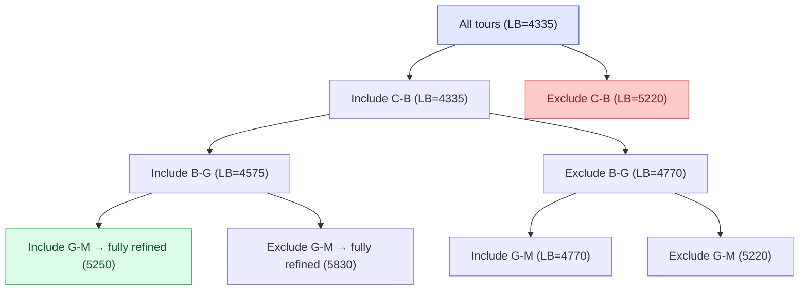
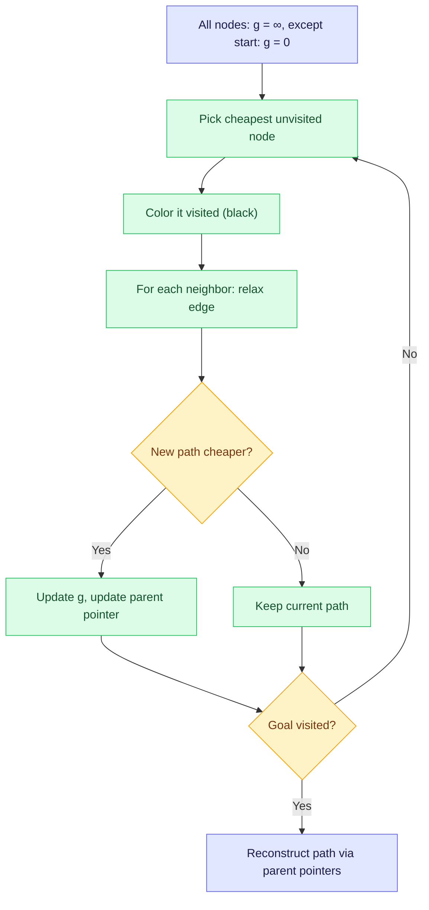
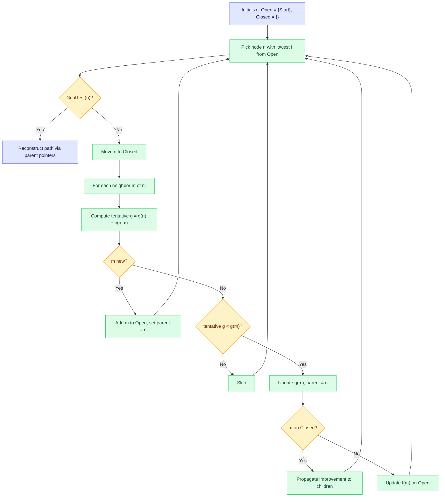
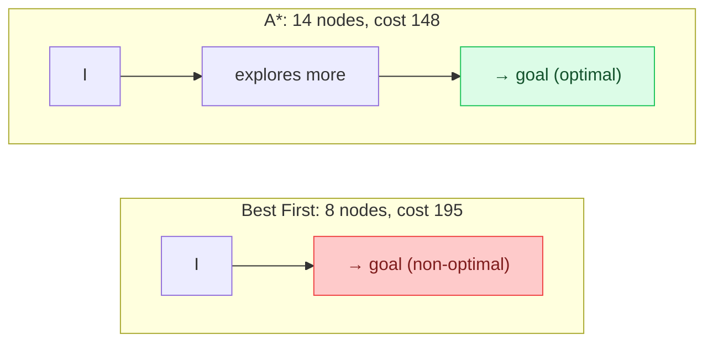
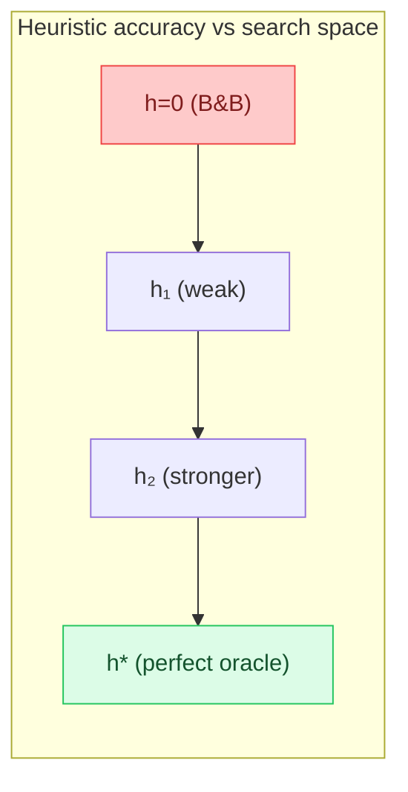

So far we have been happy finding *some* solution. This week we raise the bar: we want the **optimal** solution, the one with the lowest total cost. We start with brute force, refine it into Branch & Bound (which guarantees optimality but has no sense of direction), then add heuristics to create A*, the most important algorithm in the course. A* looks both backward (how much have we spent?) and forward (how much further to the goal?), and under the right conditions it is guaranteed to find the cheapest path.

<LectureVideos
  videos={{
    "Lecture 1": "https://www.youtube.com/watch?v=I0zyInS9j9E",
    "Lecture 2": "https://www.youtube.com/watch?v=VCTDloiucqs",
    "Lecture 3": "https://www.youtube.com/watch?v=_I8NJjG3qz0",
    "Lecture 4": "https://www.youtube.com/watch?v=M-RaclwVPyY",
    "Lecture 5": "https://www.youtube.com/watch?v=sQYhd6naHBQ",
    "Lecture 6": "https://www.youtube.com/watch?v=YeSnEox1Qgc",
  }}
/>

---

## Finding Optimal TSP Tours [Lecture 1]

Until now, our quality measure was the number of hops to the goal. But real problems have **edge costs**, and the shortest path in hops may not be the cheapest. Taking two buses to the station is cheaper than one taxi, even though it involves more moves. We need algorithms that account for edge costs and guarantee optimality.

### The British Museum Procedure

The simplest approach: explore the entire search space and return the best solution. Guaranteed to be optimal, but computationally mindless. Patrick Winston named it after the British Museum: the only way to find something there is to search the whole building.

### Branch and Bound

A more intelligent approach that still guarantees optimality. The idea: maintain a set of partial solutions, each tagged with an estimated cost. Always refine the cheapest partial solution. When a complete solution is found, and no partial solution on Open has a lower estimated cost, terminate.

The key requirement: **estimated costs must be lower bounds** on the actual cost. If a partial solution's estimate is a lower bound, and a complete solution is cheaper than that estimate, the partial solution can be safely pruned because its actual cost will be even higher.

The higher the lower-bound estimate, the more pruning occurs. An estimate of zero is always a valid lower bound but gives no pruning power.

### Applying Branch and Bound to TSP

Consider a 5-city TSP (Chennai, Goa, Mumbai, Delhi, Bangalore) with a distance matrix. The search space is a **refinement space**: the root node represents *all possible tours*. Each refinement partitions the set by including or excluding a specific edge.

#### Computing Lower Bound Estimates

For the root node (all tours), compute the absolute lower bound: for each city, sum the two smallest edge costs from its row in the distance matrix. Then divide by 2 (because each tour has $n$ edges but the row-sums give $2n$ edges). This gives a lower bound that no tour can beat.

For Chennai: the two closest cities are Bangalore (360) and Goa (800), contributing 1160. Do this for every city, sum, and halve.

#### Refinement and Pruning

Each node in the search tree is a set of tours constrained by included/excluded edges. To refine: pick the cheapest node, add an edge (e.g., "include Chennai-Bangalore"), creating two children (include vs. exclude that edge).

When an edge is included, revise the lower bound: the included edge's cost replaces any cheaper alternative in the row computations, raising the estimate. When sub-tours form (e.g., Chennai-Bangalore-Chennai is a cycle of 3 cities, not a valid tour), the edges involved must be excluded and replaced with the next cheapest, further raising the estimate.

The algorithm terminates when a fully refined tour (a complete solution) has a cost lower than the estimated cost of every partial solution remaining on Open. In the example, the optimal tour (Chennai-Bangalore-Goa-Mumbai-Delhi-Chennai, cost 5250) is found, and all other candidates have estimates of 5220 or higher, so they are refined further until their actual costs exceed 5250.

The tradeoff: more accurate estimates require more computation per node but lead to more pruning. Simpler estimates are faster per node but explore more of the tree.

---

## Shortest Path with Branch & Bound [Lecture 2]

Now we bring Branch & Bound back to the original problem: finding the shortest path from a start node to a goal node in a state space with edge costs.

### Branch & Bound in State Space Search

Branch & Bound extends the cheapest partial path at every step. The estimated cost of a partial path is simply the **actual cost incurred so far** ($g$). There is no lookahead. The algorithm behaves like BFS but weighted by cost instead of hops: it stays as close to the start as possible in terms of accumulated cost.

Like BFS, Branch & Bound guarantees the optimal path. Unlike BFS, it accounts for edge costs. But like BFS, it has **no sense of direction**. If you are at IIT Madras and want to reach Mahabalipuram (south), Branch & Bound will first explore all of Chennai before heading south.

A simple improvement: **loop checking**. If a path visits the same node twice, discard it. This prevents the algorithm from following cycles like S-B-S-B-... that only increase cost.

### Dijkstra's Algorithm

Dijkstra's algorithm (1959) is a more elegant version of the same idea. Instead of maintaining separate partial paths as distinct nodes in the search tree (which Branch & Bound does), Dijkstra maintains a single graph and keeps only **one copy** of each node, adjusting the parent pointer whenever a cheaper path is found.

The algorithm assigns an initial cost of $\infty$ to every node except the start ($g = 0$). It then repeatedly picks the cheapest unvisited (white) node, colors it visited (black), and "relaxes" all its neighbors: if the new path through the current node is cheaper, update the cost and the parent pointer.

In Dijkstra's algorithm, once a node is colored black, the shortest path to it has been found. This is because all edge costs are positive, so any future path through other nodes will be at least as expensive. A* will inherit this single-graph, parent-pointer structure from Dijkstra, but with a crucial addition: a heuristic function.

### The Need for A*

Branch & Bound and Dijkstra guarantee optimality but explore blindly. Best First Search has a sense of direction (using $h$) but only looks ahead and may not find the optimal path. We need an algorithm that does both: looks backward (actual cost so far) and forward (estimated cost to goal). That algorithm is A*.

---

## Algorithm A* [Lecture 3]

A* (Hart, Nilsson, and Raphael, 1968) extends Dijkstra's algorithm with a heuristic function. It is the best-known algorithm in this course and one of the most important in all of AI.

### The Evaluation Function

For every node $n$, A* computes:

$$f(n) = g(n) + h(n)$$

- $g(n)$: the **actual cost** of the path found from the start node to $n$ (from Branch & Bound / Dijkstra)
- $h(n)$: the **estimated cost** from $n$ to the goal (from Best First Search)
- $f(n)$: the estimated cost of a complete solution **passing through** $n$

A* maintains a priority queue (Open) sorted on $f$ values. At each step, it picks the node with the lowest $f$, checks if it is the goal, and if not, generates its neighbors and computes their $f$ values.

### The Algorithm

Like Dijkstra, A* maintains only **one copy** of each node and updates parent pointers when a cheaper path is found. But unlike Dijkstra, A* can find a cheaper path to a node that is **already on Closed**, because the heuristic estimate means the first path found is not necessarily the best. This leads to a third case not present in Dijkstra.

**Case 1**: the neighbor $m$ is new (not on Open or Closed). Add it to Open with $g(m) = g(n) + c(n, m)$, parent $= n$, and $f(m) = g(m) + h(m)$.

**Case 2**: the neighbor $m$ is already on Open, and the new path via $n$ is cheaper. Update $g(m)$, change parent pointer to $n$, recompute $f(m)$.

**Case 3**: the neighbor $m$ is already on Closed, and the new path via $n$ is cheaper. Update $g(m)$, change parent pointer to $n$, recompute $f(m)$, and **propagate the improvement** to all of $m$'s children (since their $g$ values depend on the path through $m$).

### Propagation of Improvement

When A* finds a cheaper path to a node on Closed, it must update the $g$ values and parent pointers of all descendants of that node. For each child $x$ of $m$: if $g(m) + c(m, x) < g(x)$, update $g(x)$, change parent to $m$, and if $x$ is also on Closed, recursively propagate to its children.

This propagation step is what makes A* correct even when the heuristic is imperfect. Without it, a suboptimal path could be locked in for a node and its descendants.

---

## A* in Action [Lecture 4]

Consider a grid-based graph where nodes sit on intersections, each grid cell is 10 units, and an imaginary river blocks most paths except at three bridges. Start is node I (top-left), goal is node W (bottom-right). The heuristic is Manhattan distance.

### Best First Search (Recap)

Best first search picks the node with the lowest $h$ value. It races toward the goal, ignoring edge costs entirely. In this example, it inspected only 8 nodes and found a path of cost 195. But that path is not optimal: it crossed an expensive bridge because the heuristic could not "see" the edge costs.

### A* on the Same Problem

A* computes $f = g + h$ for every node. At the start node, $f = 0 + 100 = 100$. After expanding the start, the cheapest neighbor might have $f = 101$ (e.g., $g = 21$, $h = 80$). A* picks this node.

Unlike best first search (which would have picked the node with $h = 70$), A* accounts for the 21-unit edge cost and prefers a slightly more expensive-in-heuristic but cheaper-in-total node. This is the key difference: A* balances the cost already incurred against the estimated cost remaining.

As A* expands nodes, it sometimes appears to "go in the wrong direction" (expanding a node with $f = 142$ that seems to move away from the goal). This happens because the $g$ component of the cheaper-looking nodes has become too large. But A* always returns to the most promising direction because $f$ eventually favors nodes closer to the goal.

In this example, A* inspected 14 nodes (more than best first's 8) but found the **optimal** path of cost 148. The extra exploration was the price of guaranteeing optimality.

### A* vs Dijkstra

On the same problem, Dijkstra's algorithm would find the same optimal path as A*. But Dijkstra would explore even more nodes, because it has no heuristic guidance at all. A* prunes the same branches Dijkstra would, plus additional ones that the heuristic identifies as unpromising.

---

## Admissibility of A* [Lecture 5]

A* found the optimal path in the example, but will it always? The answer depends on the heuristic function.

### Why A* Might Fail

In Dijkstra's algorithm, once a node is colored black (placed on Closed), the shortest path to it has been found. This is guaranteed because all edge costs are positive, so no future path can be cheaper.

A* is different. Because it uses an estimated $h(n)$ instead of the true distance, it may pick a node from Open and place it on Closed **before** finding the shortest path to it. This is why Case 3 (finding a cheaper path to a node on Closed) exists in A* but not in Dijkstra.

The question: under what conditions does A* guarantee the optimal path?

### Notation for Analysis

- $g^*(n)$: the optimal cost from start to $n$
- $h^*(n)$: the optimal cost from $n$ to the goal
- $f^*(n) = g^*(n) + h^*(n)$: the optimal cost from start to goal passing through $n$

These are the true (unknown) values, used only for analysis. The algorithm works with $g(n)$ (the best cost found so far), $h(n)$ (the heuristic estimate), and $f(n) = g(n) + h(n)$.

Note that $g^*(n) \leq g(n)$ always: the optimal cost is at most what the algorithm has found so far.

### Should We Overestimate or Underestimate?

Consider a simple example: A* is one step from the goal and must choose between expanding node P (actual cost to goal = 30) or node Q (actual cost to goal = 40). Both have $g = 100$. The optimal path goes through P (total cost 130).

**Overestimating heuristic** $h_1$: let $h_1(P) = 60$ and $h_1(Q) = 50$. The algorithm computes $f(P) = 160$ and $f(Q) = 150$. It picks Q, finds the goal at cost 140, and terminates with a **suboptimal** path.

**Underestimating heuristic** $h_2$: let $h_2(P) = 20$ and $h_2(Q) = 15$. The algorithm computes $f(P) = 120$ and $f(Q) = 115$. It picks Q, finds the goal at cost 140, but $f(P) = 120 < 140$, so it **does not terminate**. It expands P next and finds the optimal path at cost 130.

The crucial difference: the underestimating heuristic left P on Open with an $f$ value lower than the current best solution, forcing the algorithm to explore it. The overestimating heuristic made P look so expensive that the algorithm never checked it.

### The Admissibility Conditions

A* is **admissible** (guaranteed to find the optimal solution) if and only if:

1. **Finite branching factor**: each node has a finite number of neighbors.
2. **Edge costs bounded below by some $\epsilon > 0$**: every edge costs at least $\epsilon$. (Merely requiring positive costs is not enough: a path with costs $1 + \frac{1}{2} + \frac{1}{4} + \ldots$ has infinite edges but finite total cost, trapping the algorithm forever.)
3. **The heuristic never overestimates**: $h(n) \leq h^*(n)$ for all $n$. The heuristic is an **admissible heuristic**.

When $h = 0$ everywhere, A* degenerates into Branch & Bound (Dijkstra), which is admissible. When $h = h^*$ everywhere (a perfect oracle), A* goes straight to the goal. In between, any heuristic that underestimates preserves admissibility.

---

## Proof of Admissibility [Lecture 6]

### Lemma 1: A* Terminates for Finite Graphs

In every cycle, A* picks one node from Open and places it on Closed. A* keeps only one copy of each node. For a finite graph, it must terminate.

### Lemma 2: Open Always Contains a Node from the Optimal Path

Let the optimal path be $S = n_0, n_1, n_2, \ldots, n_k = G$. Initially, $S$ is on Open. Whenever a node $n_i$ is removed from Open, its successor $n_{i+1}$ on the optimal path is added. So Open always contains at least one node $n'$ from this path.

Moreover, $f(n') = g(n') + h(n') \leq g^*(n') + h^*(n') = f^*(n') = f^*(S)$. The inequality holds because $g(n') = g^*(n')$ (the path to $n'$ along the optimal path is optimal) and $h(n') \leq h^*(n')$ (admissibility). So $f(n') \leq f^*(S)$: there is always a node on Open whose $f$ value does not exceed the optimal cost.

### Lemma 3: A* Finds a Path Even for Infinite Graphs

Every time A* extends a partial path, $g$ increases by at least $\epsilon$. So there are only finitely many partial paths with $f < f^*(S)$. Eventually all such paths are explored, and the goal is reached.

### Lemma 4: A* Finds the Optimal Path (Proof by Contradiction)

Assume A* terminates with a goal node $G'$ such that $g(G') > f^*(S)$ (a suboptimal solution). By Lemma 2, at the moment A* was about to pick $G'$, there existed a node $n'$ on Open with $f(n') \leq f^*(S) < g(G')$. So $f(n') < g(G')$, meaning A* should have picked $n'$ instead of $G'$. Contradiction.

### Lemma 5: Every Node Picked by A* Has $f(n) \leq f^*(S)$

A* picks $n$ only if $f(n) \leq f(n')$ for all $n'$ on Open. By Lemma 2, $f(n') \leq f^*(S)$. So $f(n) \leq f^*(S)$.

### More Informed Heuristics Do Less Search

Let $h_1$ and $h_2$ be two admissible heuristics such that $h_1(n) \leq h_2(n) \leq h^*(n)$ for all $n$. We say $h_2$ is **more informed** than $h_1$. Then every node expanded by A* using $h_2$ will also be expanded by A* using $h_1$. In other words, the search space of the more informed version is a subset of the less informed one.

The proof is by induction on depth, with the key step being a contradiction: if A* with $h_2$ expands a node $L$ that A* with $h_1$ does not, then $h_2(L) \leq h_1(L)$, which contradicts $h_2(L) \geq h_1(L)$.

The closer $h$ is to $h^*$, the fewer nodes A* explores. But even a weak admissible heuristic is better than none. The challenge in practice is designing heuristics that are as informative as possible while still being admissible (never overestimating).
