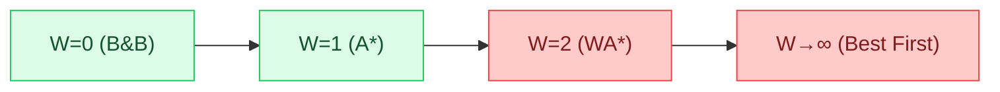
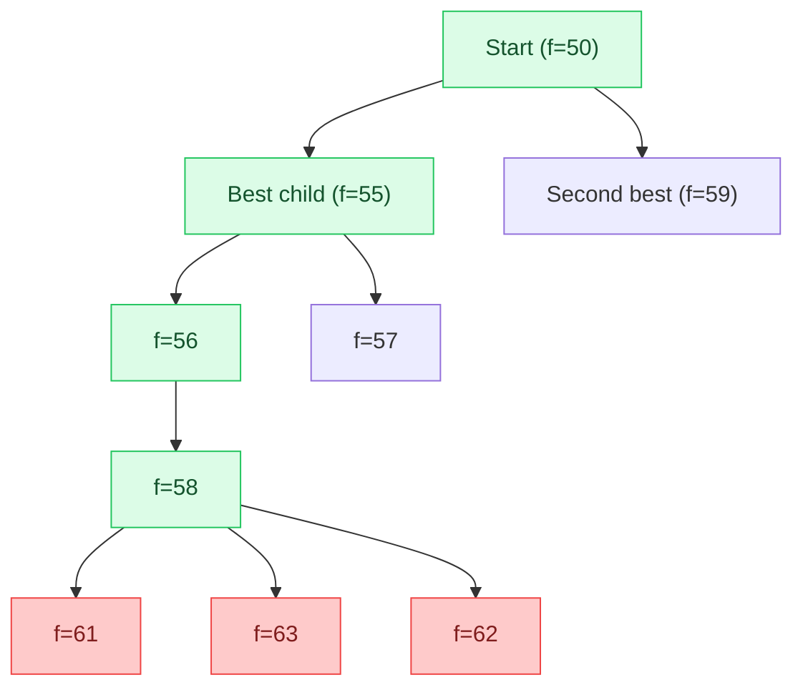
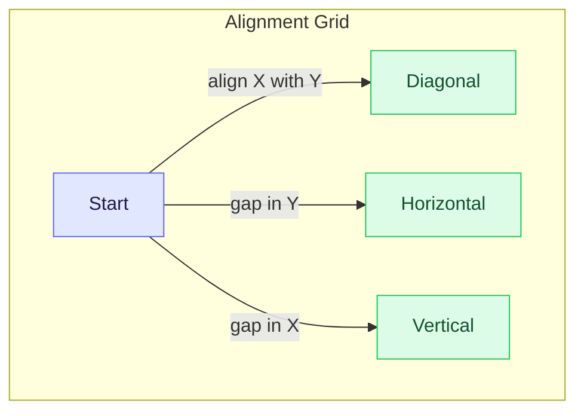
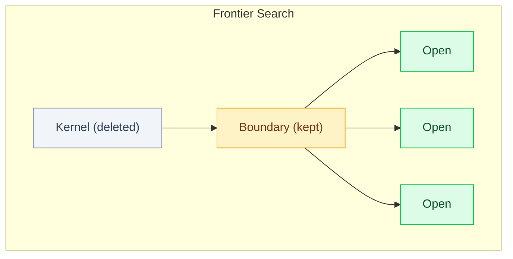
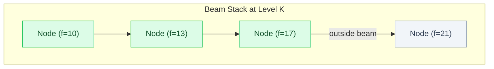

A* is admissible, but it uses exponential space. This week is about bending A* in different directions: making it faster (by weighting the heuristic), making it use less space (IDA*, RBFS), and understanding when the heuristic is well-behaved enough to simplify the algorithm (the monotone condition). Then we tackle the space problem head-on: if Closed grows quadratically, can we prune it? If Open grows exponentially, can we prune that too? The answers lead to frontier search, beam stack search, and ultimately constant-space algorithms that sacrifice optimality for practicality.

<LectureVideos
  videos={{
    "Lecture 1": "https://www.youtube.com/watch?v=x0GSO9kkSyk",
    "Lecture 2": "https://www.youtube.com/watch?v=5iDqEo3u4Gk",
    "Lecture 3": "https://www.youtube.com/watch?v=mQ5ORcDZ4n4",
    "Lecture 4": "https://www.youtube.com/watch?v=9Qxlp67wWLw",
    "Lecture 5": "https://www.youtube.com/watch?v=QyhmsUIfHgM",
    "Lecture 6": "https://www.youtube.com/watch?v=S5IwP0k-gfs",
    "Lecture 7": "https://www.youtube.com/watch?v=dkHK_tXct-E",
  }}
/>

---

## Weighted A* [Lecture 1]

A* balances $g(n)$ (cost so far) and $h(n)$ (estimated cost to go). Weighted A* tilts that balance by introducing a weight $W$:

$$f(n) = g(n) + W \cdot h(n)$$

### The Weight Spectrum

- **$W = 0$**: $f(n) = g(n)$. The algorithm becomes Branch & Bound (Dijkstra). Explores the most space, guarantees optimality.
- **$W = 1$**: Standard A*. Explores less space, still optimal.
- **$W > 1$**: Biases search toward the goal. Explores even less space, but **may not find the optimal path** because $W \cdot h(n)$ can exceed $h^*(n)$, violating the admissibility condition.
- **$W \to \infty$**: $g(n)$ becomes negligible. The algorithm behaves like Best First Search. Fastest, but least likely to find the optimal path.

### Concrete Comparison

On the same grid-graph problem (Manhattan distance heuristic, river with bridges):

| Algorithm | Nodes inspected | Path cost | Optimal? |
|---|---|---|---|
| Branch & Bound ($W = 0$) | 23 | 148 | Yes |
| A* ($W = 1$) | 14 | 148 | Yes |
| Weighted A* ($W = 2$) | 9 | 153 | No |
| Best First ($W \to \infty$) | 8 | 195 | No |

As $W$ increases, the algorithm explores less space but risks missing the optimal path. Weighted A* with $W = 2$ inspected only 9 nodes (vs. A*'s 14) but found a path of cost 153 instead of the optimal 148.

### F Values Along the Solution Path

With A* ($W = 1$) and an admissible heuristic, $f$ values **increase** as you move toward the goal. This is because $g$ increases (you spend more) while $h$ decreases (less distance remains), but the underestimating $h$ means the increase in $g$ outweighs the decrease in $h$.

With Weighted A* ($W > 1$), the inflated heuristic causes $f$ values to **decrease** as you approach the goal, because $W \cdot h$ drops rapidly. This is why Weighted A* races toward the goal but can miss cheaper paths.

---

## Space Saving Versions of A* [Lecture 2]

A* uses exponential space in the worst case. Can we reduce it while staying admissible? The answer takes inspiration from DFID: use depth-first search, which has linear space, but iterate with increasing thresholds.

### Iterative Deepening A* (IDA*)

IDA* (Richard Korf, 1985) applies the DFID idea to A*. Instead of increasing the depth bound by 1 each iteration, IDA* increases the **$f$-value cutoff** to the smallest $f$ value that exceeded the previous cutoff.

1. Set the initial cutoff to $f(\text{start}) = h(\text{start})$.
2. Do a depth-first search, pruning any node with $f(n) > \text{cutoff}$.
3. If the goal is found, return it. Otherwise, set the cutoff to the minimum $f$ value that was pruned.
4. Repeat.

Each iteration is a DFS with an $f$-value bound, so it uses **linear space**. The algorithm is admissible (it finds the optimal path) because it only terminates when the cutoff is high enough to reach the goal through the cheapest path.

The downside: repeated search. Each iteration re-explores the entire tree up to the cutoff. For search spaces that grow quadratically (like city maps or sequence alignment grids), this can be very expensive, especially when many nodes have similar $f$ values and the cutoff increases by tiny amounts each iteration.

A compromise: instead of extending the cutoff to the next unexpanded $f$ value, extend it by a fixed $\Delta$. This limits the number of iterations but may sacrifice strict optimality (the found path cost may exceed the true optimum by at most $\Delta$ times the number of iterations).

### Recursive Best First Search (RBFS)

Also by Korf (1991), RBFS is another linear-space algorithm that, unlike IDA*, has a sense of direction. It explores nodes in best-first order but can backtrack.

RBFS works like hill climbing with backtracking. It follows the best successor, but also remembers the **second-best** $f$ value at each decision point. When all successors of the current node have $f$ values exceeding the second-best value from the parent, RBFS **rolls back** to that second-best option.

When all children of node 58 have $f > 59$ (the second-best at the root), RBFS rolls back. As it rolls back, it **backs up** the best $f$ value from the children to the parent. Node 58 becomes 61 (its best child), then 57 becomes 60 (its best child), then 56 becomes 60, then 55 becomes 60. Now the algorithm switches to the other branch.

The problem with RBFS: **thrashing**. When the two branches have similar $f$ values, the algorithm can oscillate between them, rolling back and forth repeatedly. This is especially bad in search spaces where paths are similar in cost.

---

## Demo: A*, IDA*, RBFS [Lecture 3]

Running these algorithms on the demo platform reveals their behavior visually.

### Hill Climbing vs Best First vs A*

On a sparse graph where the start node is not directly connected to the goal direction, hill climbing gets stuck immediately (no neighbor improves the heuristic). Best first search backs away from the goal briefly, then finds a path around the obstacle. A* explores a bit more than best first but finds the optimal path.

### IDA* and Repeated Search

IDA* does a series of depth-first searches, each with a slightly higher $f$ cutoff. Each iteration is shown as a separate wave of exploration. The yellow nodes mark where one iteration ends and the next begins. IDA* eventually finds the same path as A*, but the repeated traversal of the same nodes is visible and costly.

### RBFS and Thrashing

RBFS behaves like hill climbing with backtracking. It follows the best direction, but when it hits a dead end, it rolls back and tries the next best. In some implementations, thrashing is visible: the algorithm bounces between similar-valued branches. On larger graphs, RBFS explores almost the same space as A*, negating its theoretical space advantage with time overhead.

### Key Observation

A* and IDA* found the same path on most test graphs, confirming IDA*'s admissibility. Best first search found a different (usually longer) path. Hill climbing often failed entirely. The tradeoff is clear: more space usage yields faster, more reliable search.

---

## The Monotone Condition [Lecture 4]

We saw that A* can find a cheaper path to a node already on Closed (Case 3), requiring propagation. But if the heuristic satisfies an additional property, Case 3 never arises.

### The Consistency (Monotone) Property

A heuristic $h$ satisfies the monotone condition if for every edge from node $m$ to node $n$:

$$h(m) - h(n) \leq c(m, n)$$

The drop in heuristic value across any edge is at most the cost of that edge. Equivalently: the heuristic never overestimates the cost of any single edge.

This is stronger than admissibility. If the monotone condition holds, then admissibility is guaranteed (by chaining the inequality along the optimal path from $n$ to the goal).

### Example: Manhattan Distance on a Grid

In our grid-graph example, each grid cell is 10 units and Manhattan distance is used. The actual edge costs are always greater than or equal to the difference in Manhattan distances between the connected nodes. So the monotone condition is satisfied.

### Consequence 1: Non-Decreasing F Values

If $n$ is a successor of $m$, then:

$$h(m) \leq h(n) + c(m, n)$$

Adding $g(m)$ to both sides:

$$g(m) + h(m) \leq g(m) + c(m, n) + h(n) = g(n) + h(n)$$

So $f(m) \leq f(n)$. F values never decrease along any path A* explores. This matches what we observed: A*'s $f$ values increase toward the goal.

### Consequence 2: Optimal Path to Every Node

When A* picks a node $n$ from Open, $g(n) = g^*(n)$. The first path found to any node is already optimal. This is proved by contradiction: if $g(n) > g^*(n)$, there must be a node on the optimal path to $n$ still on Open with $f \leq g^*(n) + h(n) \leq f(n)$, but A* chose $n$, so $g(n) = g^*(n)$.

This means **Case 3 never arises**. A* never needs to update a node on Closed, and no propagation is needed. The algorithm simplifies to Dijkstra's behavior: once a node is closed, it stays closed.

This property has profound implications for pruning the Closed list, which we explore next.

---

## Sequence Alignment in Biology [Lecture 5]

Before we get to pruning Closed, we need a problem where Closed is the bottleneck. Sequence alignment from bioinformatics provides exactly that.

### The Problem

DNA and RNA are sequences of nucleotides represented by letters (A, C, G, T for DNA). Given two such sequences, the task is to align them by placing them side by side with the option of inserting **gaps** in either sequence. The goal is to minimize the total alignment cost:

- **Mismatch cost**: when different characters are aligned (e.g., A aligned with C)
- **Indel cost**: when a gap is inserted in one sequence

The best alignment depends on the relative costs. If the indel penalty is 3 and the mismatch penalty is 7, it is cheaper to insert two gaps (cost 6) than to accept one mismatch (cost 7). But if the mismatch penalty drops to 5, accepting the mismatch becomes cheaper.

### Alignment as Graph Search

Model the alignment as a grid where the horizontal axis is one sequence and the vertical axis is the other. Each cell represents a partial alignment. Three moves are possible from each cell:

- **Diagonal**: align the next characters of both sequences (mismatch or match cost)
- **Horizontal**: insert a gap in the vertical sequence (indel cost)
- **Vertical**: insert a gap in the horizontal sequence (indel cost)

The start node is the top-left corner. The goal is the bottom-right corner. Each path through the grid corresponds to one possible alignment.

### The Scale Problem

For two strings of length $n$ and $m$, the grid is $(n+1) \times (m+1)$. With only horizontal and vertical moves, the number of paths is $\binom{m+n}{n}$. Adding diagonal moves makes it combinatorially larger. For real biological sequences (hundreds of thousands of characters), the search space is enormous.

### Open vs Closed Growth

In the alignment grid, **Open grows linearly** with the width of the frontier (at most twice the grid width). But **Closed grows quadratically** (roughly the area of the explored region). For large sequences, Closed dominates memory usage.

This is the motivation for pruning Closed: if we can throw away Closed nodes while still being able to reconstruct the path, we can solve much larger problems.

---

## Pruning CLOSED in A* [Lecture 6]

The Closed list serves two purposes: (1) preventing infinite loops by avoiding revisited nodes, and (2) reconstructing the path when the goal is found. If we can handle both without storing all of Closed, we can prune it.

### Frontier Search (Korf and Zhang, 2000)

The key idea: we only need the **boundary** between Open and Closed, not all of Closed. When a node is moved from Open to Closed, we add it to a **taboo list** associated with its neighbors still on Open. Those neighbors are forbidden from generating the closed node as a successor. This prevents the search from "leaking back" into Closed territory.

Kernel nodes (all neighbors in Closed) are deleted. Boundary nodes (at least one neighbor in Open) are kept to prevent leaking. Open nodes carry their taboo lists.

### Relay Nodes and Path Reconstruction

Without Closed, how do we reconstruct the path? The solution: maintain a **relay layer** of nodes roughly halfway between start and goal (where $g(n) \approx h(n)$). Each Open node stores a pointer to its relay node.

When the goal is found, we know which relay node leads to it. We then recursively solve two subproblems: start to relay, and relay to goal. This **divide-and-conquer** approach reconstructs the full path without storing the entire Closed list.

The time cost: if $T(d)$ is the time to find the goal at depth $d$, the total time including path reconstruction is $O(d \cdot T(d))$. We pay a factor of $d$ in extra time to save on space.

### Smart Memory Graph Search (Zhou and Hansen, 2003)

An improvement: instead of always creating a relay layer at the midpoint, **monitor available memory**. Only create a relay layer when memory is running low. If the problem fits in memory, just use A* directly. If not, create relay layers as needed.

This algorithm maintains three types of nodes:
- **Open**: the search frontier (kept)
- **Boundary**: Closed nodes with at least one Open neighbor (kept, to prevent leaking)
- **Kernel**: Closed nodes with no Open neighbors (deleted)

When memory runs low, the current boundary layer is converted to a relay layer, and all kernel nodes are deleted. Search continues from there. Multiple relay layers may be created depending on problem size.

---

## Pruning OPEN in A* [Lecture 7]

For tree-shaped search spaces, Open grows much faster than Closed (exponentially vs. linearly). Pruning Open is even more impactful.

### Beam Search with F Values

Maintain only the $W$ best nodes at each level (sorted by $f$ values). Unlike the earlier beam search (which used $h$ values and required nodes to be better than the current node), this version keeps the $W$ best regardless, because $f$ values increase with depth and the "only if better" criterion would fail.

Space: $O(W \cdot d)$ (linear). Not admissible, but often finds good solutions quickly.

### Upper Bound Pruning

Run beam search first to find *some* path to the goal. Let its cost be $U$. This is an **upper bound** on the optimal cost. Now any node with $f(n) > U$ can be pruned: no path through it can improve on the best solution already found.

### Breadth First Heuristic Search (BFHS)

Do breadth-first search (level by level), but only expand nodes with $f(n) \leq U$. The upper bound $U$ constrains the search to a small region around the optimal path. BFHS finds the optimal path with less space than A* because its frontier is bounded by $U$. Empirically, BFHS explores a smaller frontier than A* on many problems.

### Beam Stack Search

Combines beam search with backtracking. Maintains a **beam stack** at each level, storing two values:

- $f_{\min}$: the lowest $f$ value in the current beam
- $f_{\max}$: the lowest $f$ value **outside** the beam (the next candidate to try on backtrack)

When beam search reaches a dead end (all nodes in the beam have $f > U$), it backtracks using the beam stack: pops the stack, slides the beam to include the next-best nodes, and continues. This way, beam stack search systematically explores the entire region within the upper bound $U$.

### Divide and Conquer Beam Stack Search

The ultimate space-saving algorithm. Maintains only **three layers** of constant width $W$: Open, Boundary, and Relay. Deletes everything else. When backtracking is needed, it **regenerates** nodes from the start using the beam stack as a guide (the beam stack tells it which nodes to select at each level).

Space: $O(W)$ (constant, ignoring the beam stack of depth $d$). Not admissible, but can solve problems far too large for A*.

### Summary: The Space-Optimality Tradeoff

| Algorithm | Space | Admissible? |
|---|---|---|
| A* | Exponential | Yes |
| IDA* | Linear | Yes |
| RBFS | Linear | Yes |
| Frontier Search | Reduced Closed | Yes (with reconstruction cost) |
| SMGS | Adaptive | Yes (with reconstruction cost) |
| BFHS | Bounded by $U$ | Yes |
| Beam Search | $O(W \cdot d)$ | No |
| Beam Stack Search | $O(W \cdot d)$ + stack | No (but explores more than beam) |
| D&C Beam Stack | $O(W)$ | No |

The progression: from exponential space with optimality, to linear space with optimality but time overhead, to constant space without optimality. Each step trades one resource for another.
