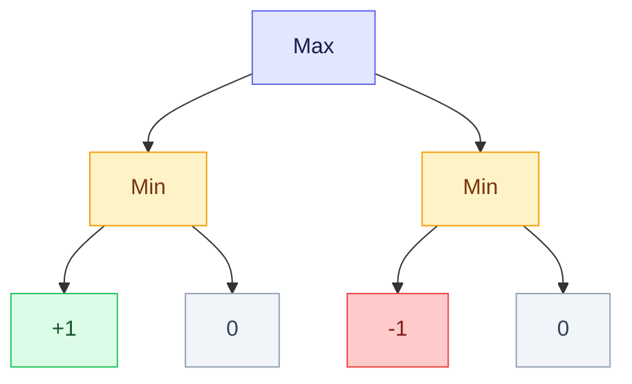
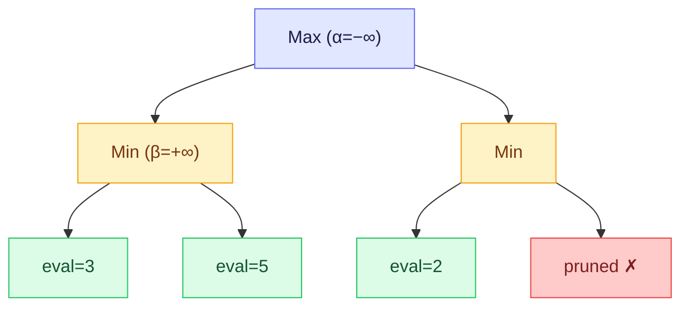
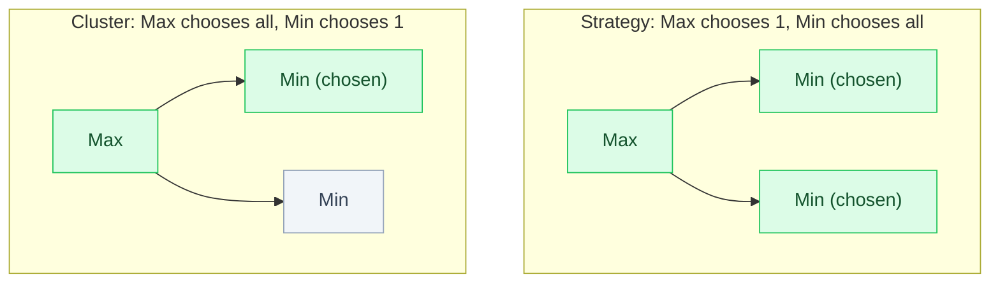
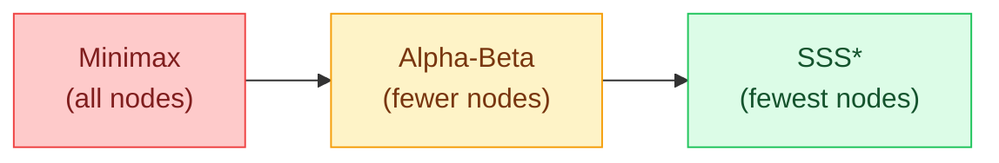

Until now we had one agent searching alone. This week we add an opponent. The search space is no longer a graph you traverse freely; it is a **game tree** where you and an adversary take turns, each trying to maximize their own outcome. The central question: if both players are perfectly rational, what is the outcome? The answer is the Minimax value, and the algorithms to compute it (Minimax, Alpha-Beta, SSS*) are the focus of this week.

<LectureVideos
  videos={{
    "Lecture 1": "https://www.youtube.com/watch?v=QaaxxErejWk",
    "Lecture 2": "https://www.youtube.com/watch?v=5g0LUAPMUyk",
    "Lecture 3": "https://www.youtube.com/watch?v=XQBRvYc0woc",
    "Lecture 4": "https://www.youtube.com/watch?v=rMliVVTlLwY",
    "Lecture 5": "https://www.youtube.com/watch?v=XLX9X4oXalw",
    "Lecture 6": "https://www.youtube.com/watch?v=EK7hzSNJQmg",
    "Lecture 7": "https://www.youtube.com/watch?v=Ai3oxSnnzeI",
    "Lecture 8": "https://www.youtube.com/watch?v=h5Up_zTkvEo",
    "Lecture 9": "https://www.youtube.com/watch?v=HdmCC3z9pPE",
    "Lecture 10": "https://www.youtube.com/watch?v=3KwywZrB7ug",
    "Lecture 11": "https://www.youtube.com/watch?v=dkHK_tXct-E",
  }}
/>

---

## Game Theory [Lecture 1]

Game theory models situations where multiple rational agents interact, each pursuing their own self-interest. Pioneered by John von Neumann and Oskar Morgenstern, with key contributions from John Nash.

The core idea: a player's payoff depends not just on their own decisions, but on the decisions of all other players. A **Nash equilibrium** is a state where no player can improve their payoff by unilaterally changing their strategy. Most games have one; when reached, every player has "no regrets."

A striking result: rational self-interest does not always lead to the best collective outcome. The **Prisoner's Dilemma** shows that two rational players, each acting in their own interest, can both end up worse off than if they had cooperated. The outcome is "intended by none of the agents."

---

## Types of Games [Lecture 2]

Games can be classified along several dimensions:

| Dimension | Type A | Type B |
|---|---|---|
| Players | Two-player | Multi-player |
| Sum | Zero-sum (one wins, other loses) | Non-zero-sum |
| Information | Complete (both see everything) | Incomplete (hidden cards, etc.) |
| Moves | Sequential (alternate turns) | Simultaneous |
| Chance | Deterministic (no dice) | Stochastic (dice, card draws) |

We focus on **two-player, zero-sum, complete-information, deterministic, sequential-move** games. This class includes chess, Go, Othello, and Tic-Tac-Toe. The zero-sum property means one player's gain is exactly the other's loss: we can label outcomes as $+1$ (Max wins), $-1$ (Min wins), or $0$ (draw).

---

## Popular Recreational Games [Lecture 3]

Chess originated in India as *chaturanga* (6th century, Gupta Empire), meaning "four divisions" of the military: infantry, cavalry, elephants, and chariotry, which evolved into pawn, knight, bishop, and rook. It spread to Persia as *shatranj*, then to Europe. The words "check" (from Persian *shah*, king) and "checkmate" (from *shah mat*, the king is finished) come from this history.

Go, an ancient Chinese game played on intersections (not squares), has a far larger search space than chess. Checkers was the first game to be "solved" by computer (2007): perfect play by both sides leads to a draw.

Arthur Samuel wrote the first checkers-playing program in 1952 on IBM's 701, pioneering machine learning. Claude Shannon proposed a framework for chess programming in 1950, separating the evaluation function from the search algorithm. IBM's Deep Blue defeated Kasparov in 1997, and Google's AlphaGo defeated Lee Sedol in 2016.

---

## Board Games and Game Trees [Lecture 4]

Board games are modeled as **game trees**. The two players are called **Max** (drawn as squares) and **Min** (drawn as circles). They move alternately. Max aims to maximize the outcome; Min aims to minimize it.

### The Game Tree

- The root is a Max node. Max chooses one of its children.
- The next level is a Min node. Min chooses one of its children.
- This alternates until a **leaf node** (terminal position) is reached.
- Each leaf is labeled with the outcome from Max's perspective: $+1$ (win), $-1$ (loss), or $0$ (draw).

Every path from root to leaf represents one possible game. The game tree captures all possible games.

### The Minimax Backup Rule

The value of an internal node is determined bottom-up:

- **Max node**: value = maximum of children's values
- **Min node**: value = minimum of children's values

In this tree, Min backs up $\min(+1, 0) = 0$ from the left and $\min(-1, 0) = -1$ from the right. Max then backs up $\max(0, -1) = 0$. The Minimax value of this game is 0 (a draw with perfect play).

The Minimax value is the game's Nash equilibrium: if both players play optimally, this is the guaranteed outcome.

---

## The Evaluation Function [Lecture 5]

For simple games like Tic-Tac-Toe, we can search the entire tree. For chess, the tree is far too large. The solution: search only $k$ moves ahead (a **$k$-ply search**), evaluate the leaf positions with a static **evaluation function**, and back up the values using Minimax.

### Properties of the Evaluation Function

Like a heuristic function, the evaluation function $e(n)$ is static: it looks at the board position and returns a value. Instead of three discrete outcomes ($+1, 0, -1$), it returns a continuous value in the range $[-1, +1]$. Positive values favor Max; negative values favor Min.

The evaluation function typically has two components:

1. **Material strength**: how many pieces each side has, weighted by piece value (queen = 9, rook = 5, etc. in chess)
2. **Positional strength**: are pieces in good positions? (control of center, pawn structure, king safety, etc.)

### Tic-Tac-Toe Example

A simple evaluation function for Tic-Tac-Toe: count the number of open rows, columns, and diagonals for Max, subtract the number open for Min. After one move each (Max in corner, Min in center), Max has 4 open lines and Min has 5, giving $e = 4 - 5 = -1$. The actual Minimax value of Tic-Tac-Toe is 0 (a draw with perfect play), but the evaluation function is only an estimate.

### Shannon's Evaluation Function for Chess

Claude Shannon (1950) proposed: $e(n) = f(\text{material}) + f(\text{positional})$, where material is the weighted sum of piece values and positional factors include pawn structure, mobility, king safety, and control of key squares. This basic framework underlies all chess programs.

---

## Algorithms: Minimax and Alpha-Beta [Lecture 6]

### Minimax Algorithm

Minimax is a depth-first search that backs up values from the leaves. If $n$ is a terminal node, return $e(n)$. If $n$ is a Max node, return the maximum of Minimax values of its children. If $n$ is a Min node, return the minimum.

Initialize a Max node's value to $-\infty$ and update upward; initialize a Min node's value to $+\infty$ and update downward. The algorithm is simple but examines **every** node in the tree.

### Alpha-Beta Pruning

The key insight: if Max has already found a move guaranteeing a value of, say, $+1$, it does not need to explore other branches that cannot possibly yield a higher value. Similarly, if Min has found a move yielding $-1$, it will never choose a branch that could give Max $+1$.

**Alpha** ($\alpha$): the best value that Max can guarantee so far (a lower bound). Max will never accept a value below $\alpha$.

**Beta** ($\beta$): the best value that Min can guarantee so far (an upper bound). Min will never accept a value above $\beta$.

**Alpha cutoff**: at a Min node, if the current value drops to $\alpha$ or below, Min will never choose this branch (Max already has a better option elsewhere). Prune all remaining children.

**Beta cutoff**: at a Max node, if the current value rises to $\beta$ or above, Max will never choose this branch (Min already has a better option elsewhere). Prune all remaining children.

In this tree, Min's left child yields 3, setting $\beta = 3$. Min's right child yields 5, but Min already has $\beta = 3$ and will choose 3. Now at Max, $\alpha = 3$. In the right subtree, the first leaf gives 2. Since $2 < \alpha = 3$, Max will never choose this branch, and the remaining children are pruned.

The amount of pruning depends on **move ordering**. If the best moves are searched first, Alpha-Beta prunes aggressively. In the worst case (moves ordered worst-first), it degenerates into full Minimax. In the best case, Alpha-Beta examines only $O(b^{d/2})$ nodes instead of $O(b^d)$.

---

## Strategies and Clusters [Lecture 7]

### What Is a Strategy?

A **strategy** for Max is a subtree of the game tree that specifies Max's choices completely. To construct one: at every Max level, choose **one** branch; at every Min level, choose **all** branches (because Max cannot control Min's choice).

An **optimal strategy** is one that guarantees the Minimax value regardless of what Min does.

### Clusters (for SSS*)

A **cluster** is a different kind of subtree: at every Max level, choose **all** branches; at every Min level, choose **one** branch (the leftmost, without loss of generality). A cluster covers a set of strategies and provides an **upper bound** on their value (since Min might choose differently than the leftmost child).

Every cluster's leaf value is an upper bound on the value of the strategies it contains. The SSS* algorithm starts with all clusters, then refines the best one (the cluster with the highest upper bound) by exploring Min's other children, gradually narrowing the bound until the optimal strategy is found.

---

## SSS*: Refining the Best Cluster [Lecture 8]

SSS* (Stockman, 1979) is a **best-first** search algorithm for game trees. Unlike Alpha-Beta (which searches depth-first, left-to-right), SSS* always refines the most promising cluster first.

### The Refinement Process

1. Start with all initial clusters (at Max: all children; at Min: leftmost child). Each cluster's value is the evaluation of its leaf node.
2. Pick the cluster with the **highest** value (best for Max).
3. **Refine** it: at the Min node above the cluster's leaf, add the next sibling. This lowers the cluster's value (Min would choose the minimum).
4. If the refined cluster's value drops below another cluster's value, switch attention to the new best cluster.
5. When a Min node is fully solved (all children evaluated), back up its value to the parent Max node. If this Max node's value exceeds a sibling's, the sibling's entire cluster is pruned (like an alpha cutoff).
6. Continue until the root is solved.

SSS* explores **fewer nodes** than Alpha-Beta in most cases because it always works on the most promising part of the tree. However, its priority queue can require more memory.

---

## Algorithm SSS* [Lecture 9]

SSS* maintains a **priority queue** (Open) of nodes, each represented as a triple: $(n, \text{status}, h)$ where $n$ is the node, status is LIVE or SOLVED, and $h$ is the current estimate.

### Initialization

Add the root node as (root, LIVE, $+\infty$) to the priority queue (sorted by $h$, highest first).

### Main Loop

Pop the highest-$h$ node from the queue.

**If status is LIVE:**
- If $n$ is a terminal node: replace with (n, SOLVED, $\min(h, e(n))$). The evaluation function caps the optimistic upper bound.
- If $n$ is a Max node: add all children as (child, LIVE, $h$). This builds the clusters.
- If $n$ is a Min node: add only the **first** child as (child, LIVE, $h$). This chooses one branch for the cluster.

**If status is SOLVED:**
- If $n$ is the root: terminate and return $h$. This is the Minimax value.
- Identify parent $p$ of $n$:
  - If $p$ is a Max node and $n$ is the last child: add (p, SOLVED, $h$) and remove all siblings of $n$ from Open.
  - If $p$ is a Max node and $n$ is not the last child: add the next sibling of $n$ as (sibling, LIVE, $h$). The bound $h$ is passed down as the new upper limit.
  - If $p$ is a Min node: add (p, SOLVED, $h$) and **purge** all siblings of $n$ from Open (Min has found its minimum, other branches are irrelevant).

### Forward and Backward Phases

The algorithm alternates between a **forward phase** (expanding LIVE nodes, building clusters downward to the horizon) and a **backward phase** (processing SOLVED nodes, backing up values, and pruning). When a solved node's value propagates upward and causes a cutoff, entire subtrees can be removed from Open.

---

## SSS*: An Example [Lecture 10]

Consider a game tree with 6 initial clusters, each reaching a leaf with evaluation values ranging from 20 to 60.

1. All 6 leaves enter the priority queue as (LIVE, $+\infty$). Since they are terminal, they are immediately converted to (SOLVED, eval-value). The queue now has 6 solved nodes.
2. Pop the best: value 60. It is a solved Min node's child. Refine by adding its sibling (value 57). The parent Min node is now solved with value $\min(60, 57) = 57$.
3. Pop the next best (value 57 from another cluster). Add its sibling, getting value 25. The parent Min node is solved with value 25.
4. At the Max level: the left subtree gives 57, the right gives 25. Max will choose 57. The cluster with value 25 is pruned (alpha cutoff).
5. Continue refining until the root is solved.

The order in which nodes are inspected follows a "best-first" pattern: always the cluster with the highest remaining upper bound. The algorithm naturally prunes unpromising branches without needing explicit alpha/beta thresholds.

---

## Game Programs Demo [Lecture 11]

Running Minimax, Alpha-Beta, and SSS* on randomly generated game trees reveals their behavior clearly.

### Minimax

Minimax does a complete depth-first sweep from left to right. Every node in the tree is visited. No pruning occurs. The algorithm is correct but slow.

### Alpha-Beta

Alpha-Beta also searches depth-first, left-to-right, but skips subtrees that cannot affect the Minimax value. On well-ordered trees, it prunes a large fraction of nodes. On poorly ordered trees, it approaches full Minimax. In all cases, it finds the same Minimax value.

### SSS*

SSS* builds clusters first, then refines the best one. It explores a **smaller** portion of the tree than Alpha-Beta in most cases, because it always focuses on the most promising region. In the demo, the nodes SSS* explored were a subset of those explored by Alpha-Beta, which were a subset of those explored by Minimax.

All three algorithms always find the same Minimax value. The difference is efficiency: SSS* prunes the most, Alpha-Beta prunes some, Minimax prunes none. The more nodes an algorithm can prune, the deeper it can search in the same amount of time, which translates directly to stronger play.

The tradeoff: SSS* uses more memory (priority queue) than Alpha-Beta (which uses stack-like depth-first memory). In practice, Alpha-Beta with good move ordering is the most commonly used algorithm, while SSS* is theoretically interesting for its best-first property.

