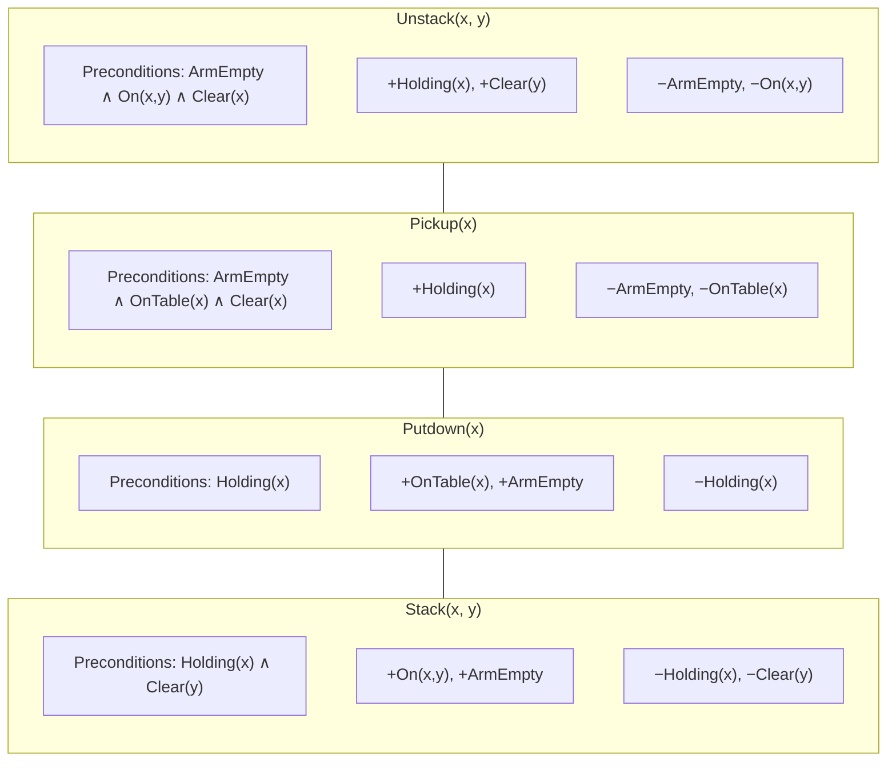
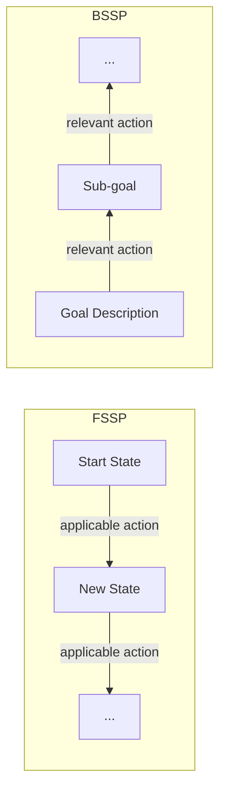
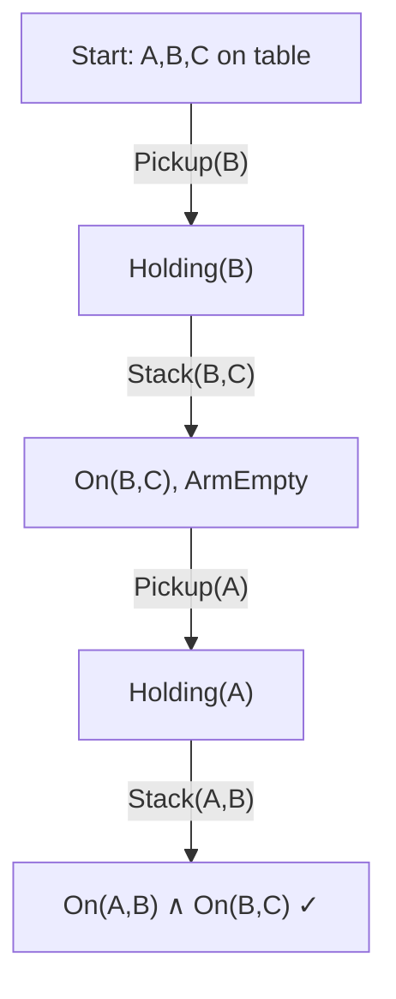
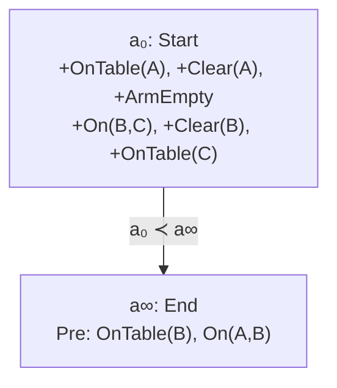
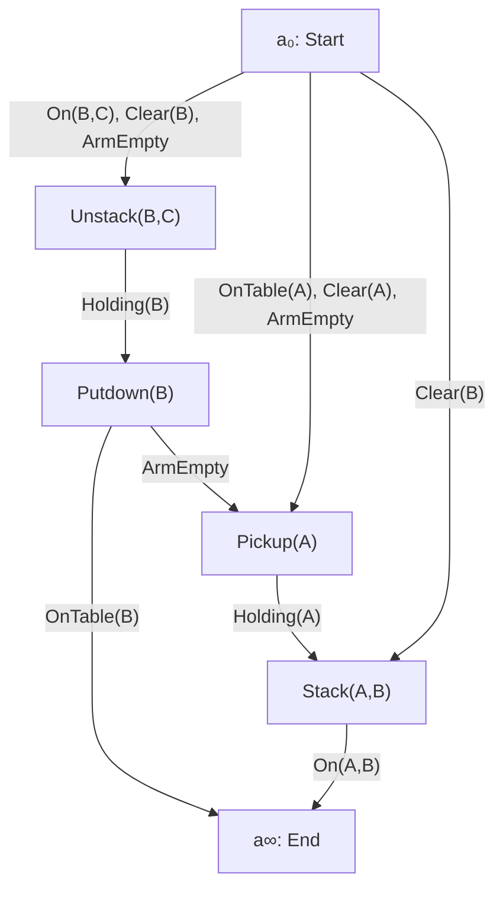

Search gave us paths through state spaces. Planning shifts the lens from *states* to *actions*. Instead of asking "which node do I visit next?" we ask "which action should I apply, and under what conditions?" This week covers the full arc: from the STRIPS formalism and Blocks World, through forward and backward state-space planning, to goal-stack planning and its failure on non-serializable subgoals, and finally plan-space (partial-order) planning that resolves those failures by reasoning about causal links and threats.

<LectureVideos
  videos={{
    "Lecture 1": "https://www.youtube.com/watch?v=JSOe94_RiVw",
    "Lecture 2": "https://www.youtube.com/watch?v=1OSVEmM7pwc",
    "Lecture 3": "https://www.youtube.com/watch?v=kcbqjD10cJI",
    "Lecture 4": "https://www.youtube.com/watch?v=dKPjKU9bJ7U",
    "Lecture 5": "https://www.youtube.com/watch?v=8EUc-Nmd2FU",
    "Lecture 6": "https://www.youtube.com/watch?v=42rOLmNETEQ",
    "Lecture 7": "https://www.youtube.com/watch?v=j6w69F5t25k",
    "Lecture 8": "https://www.youtube.com/watch?v=sA2VdTzOmKE",
  }}
/>

---

## Automated Domain-Independent Planning [Lecture 1]

So far our view of problem solving has been **state-centered**: the state space is the arena, solutions are sequences of states. The planning community takes an **action-centric** view. Actions have names, preconditions, and effects. Even when we do state-space planning, solutions are expressed as sequences of *actions*.

Planning = "the reasoning side of acting." An autonomous agent senses its environment, deliberates to find a plan, and acts by executing planned actions.

### Dimensions of planning domains

| Dimension | Simple end | Complex end |
|---|---|---|
| Perception | Complete information | Partial information |
| Goals | Satisfaction (hard constraints on end state) | Soft constraints, trajectory constraints |
| Actions | Deterministic, instantaneous | Stochastic, durative |
| Agents | Single agent | Multi-agent (collaborative / adversarial / competing) |
| Cost | No cost model | Action costs, plan optimization |

### STRIPS domains

The simplest planning domains follow the **STRIPS** assumption (Stanford Research Institute Planning System):

- Finite, static, fully observable environments
- Only the agent changes the world
- Goals are hard constraints on the final state only
- Actions are deterministic and instantaneous
- No explicit notion of time

A STRIPS domain can be modeled as a **state transition system** $\Sigma = \langle S, A, \gamma \rangle$ where:

- $S$ = finite set of states
- $A$ = finite set of actions
- $\gamma(s, a) = s'$ = state transition function (if $a$ is applicable in $s$)

### Planning Domain Description Languages (PDDL)

Since the mid-1990s, a series of standardized languages with increasing expressivity has been defined. PDDL lets researchers describe domains uniformly and compete on the same test problems. The simplest is **PDDL 1.0**, which matches the STRIPS assumptions. More expressive variants add durative actions, numeric fluents, derived predicates, and more.

Even in the simplest domains, planning is **PSPACE-complete** (polynomial space, exponential time).

---

## The Blocks World Domain [Lecture 2]

Blocks World is the classic toy domain for planning. A one-armed robot manipulates blocks on an infinitely large table.

### State predicates

| Predicate | Meaning |
|---|---|
| $\text{On}(x, y)$ | Block $x$ is on block $y$ |
| $\text{OnTable}(x)$ | Block $x$ is on the table |
| $\text{Clear}(x)$ | Nothing is on top of $x$ |
| $\text{Holding}(x)$ | Robot arm holds $x$ |
| $\text{ArmEmpty}$ | Robot arm is empty |

A state is the **set of all predicates that are true**. Everything not in the set is false (closed-world / negation-by-failure).

### STRIPS operators

Each operator has a **name with arguments**, **preconditions**, **positive effects** (add list), and **negative effects** (delete list).



**Unstack** and **Pickup** are the two ways to acquire a block (from another block or from the table). **Stack** and **Putdown** are their inverses (placing onto another block or onto the table).

### Key observations

- The start state is **completely described** (every predicate is known to be true or false)
- The goal state is **partially described** (we only care about certain predicates)
- Applying an action: delete negative-effect predicates from the state, add positive-effect predicates

---

## State Space Planning [Lecture 3]

### Forward state-space planning (FSSP)

Start from the start state, apply applicable actions, search toward the goal.

**Applicability**: Action $a$ is applicable in state $s$ if $\text{Pre}(a) \subseteq s$.

**Progression**: When applicable action $a$ is applied in $s$:

$$s' = (s \cup \text{Eff}^{+}(a)) \setminus \text{Eff}^{-}(a)$$

This is always **sound**: $s'$ is always a valid state.

**Plan validity**: A plan $\pi = \langle a_1, a_2, \ldots, a_n \rangle$ is valid in $s_0$ if, after progressing through all actions, the goal $G \subseteq s_n$.

**Drawback**: High branching factor. Since the full state is known, many actions are applicable in every state, and most are irrelevant to the goal.

### Backward state-space planning (BSSP)

Start from the goal description, search backward toward the start state.

**Relevance**: Action $a$ is relevant to goal $G$ if:
- $\text{Eff}^{+}(a) \cap G \neq \emptyset$ (it achieves at least one goal literal)
- $\text{Eff}^{-}(a) \cap G = \emptyset$ (it deletes nothing from the goal)

**Regression**: When relevant action $a$ is used to regress goal $G$:

$$G' = (G \setminus \text{Eff}^{+}(a)) \cup \text{Pre}(a)$$

Remove what the action will achieve anyway; add what must be true for the action to be applicable.

**Termination**: Regress until $G' \subseteq s_0$ (the start state).

**Critical drawback**: Regression is **not closed** over the state space. The resulting sub-goal $G'$ may describe an infeasible state. For example, both $\text{Holding}(A)$ and $\text{Holding}(B)$ could appear in $G'$, which is impossible with a one-armed robot. This means every plan found by BSSP must be **validated** by forward-simulating it from the start state.

---

## Forward vs Backward State Space Planning [Lecture 4]



### Side-by-side comparison

| Aspect | Forward (FSSP) | Backward (BSSP) |
|---|---|---|
| Search direction | Start → Goal | Goal → Start |
| Action criterion | **Applicable** in current state ($\text{Pre}(a) \subseteq s$) | **Relevant** to current goal ($\text{Eff}^{+}(a) \cap G \neq \emptyset$, $\text{Eff}^{-}(a) \cap G = \emptyset$) |
| Transition | Progression: $s' = (s \cup \text{Eff}^{+}) \setminus \text{Eff}^{-}$ | Regression: $G' = (G \setminus \text{Eff}^{+}) \cup \text{Pre}$ |
| Resulting description | Always a valid state | May be infeasible |
| Branching factor | **High** (many applicable actions) | **Low** (few relevant actions) |
| Plan validity | Guaranteed (sound) | Must be checked by forward simulation |
| Plan construction | First action found = first in plan | First action found = last in plan |

The fundamental asymmetry: planning operators are **designed for progression**. They specify what becomes true and what becomes false when an action is applied *forward*. When used in reverse for regression, the semantics break down. The preconditions and effects do not constrain the backward direction the same way.

This motivates an algorithm that combines the best of both worlds: **goal-stack planning**.

---

## Goal Stack Planning [Lecture 5]

Goal-stack planning strives to combine the low branching of BSSP with the soundness of FSSP. It works in a **goal-directed, backward manner** (low branching) but constructs plans **forward** (always valid states).

### Linear planning

Goal-stack planning is a form of **linear planning**: decompose the compound goal into individual sub-goals and solve them one at a time in sequence.

### The push-set operation

For a goal set $G = \{g_1, g_2, \ldots, g_n\}$, `PushSet(G)`:
1. Push the **compound goal** $\{g_1 \wedge g_2 \wedge \ldots \wedge g_n\}$
2. Push each individual goal $g_i$ (in some order)

The compound goal serves as a **check**: after solving each sub-goal independently, verify the conjunction is still satisfied. If not, push it back and resolve.

### The algorithm

```
Input: Planning problem (s₀, G, O)
Stack ← ∅, Plan ← ∅, State ← s₀
PushSet(G)

while Stack ≠ ∅:
    x ← Pop(Stack)
    if x is an action a:
        Plan ← Plan ∘ a
        State ← Progress(State, a)
    else if x is a compound goal G' and G' ⊄ State:
        PushSet(G')
    else if x is an individual goal g and g ∉ State:
        Choose a relevant action a that achieves g
        Push a onto Stack
        PushSet(Pre(a))

return Plan
```

Key property: actions are only added to the plan when their preconditions have been satisfied, so the plan is always valid (no spurious states).

### Worked example: stack A on B, B on C

Starting state: A, B, C all on the table. Goal: $\{\text{On}(A,B), \text{On}(B,C)\}$.

With the correct goal order (solve $\text{On}(B,C)$ first, then $\text{On}(A,B)$):



Four-step optimal plan: Pickup(B) → Stack(B,C) → Pickup(A) → Stack(A,B).

---

## Non-serializable Subgoals [Lecture 6]

### Goal ordering matters

With the **wrong** order (solve $\text{On}(A,B)$ first, then $\text{On}(B,C)$):

1. Pickup(A) → Stack(A,B) → achieves $\text{On}(A,B)$ ✓
2. Unstack(A,B) → Putdown(A) → Pickup(B) → Stack(B,C) → achieves $\text{On}(B,C)$ but undid $\text{On}(A,B)$
3. Must re-achieve $\text{On}(A,B)$: Pickup(A) → Stack(A,B)

Six-step plan instead of four. The compound goal catches the violation and forces re-planning.

### The Sussman Anomaly

Some problems have **no correct goal order**. The classic example:

**Start**: C on A, B on table. **Goal**: $\{\text{On}(A,B), \text{On}(B,C)\}$.

Try $\text{On}(B,C)$ first:
1. Pickup(B) → Stack(B,C) → $\text{On}(B,C)$ ✓
2. Unstack(B,C)? No. Unstack requires B to be on C (true) and clear (true) and arm empty. But A must go on B, which requires clearing C from A first.
3. End up with $\text{On}(A,B)$ but $\text{On}(B,C)$ is undone.

Try $\text{On}(A,B)$ first:
1. Unstack(C,A) → Putdown(C) → Pickup(A) → Stack(A,B) → $\text{On}(A,B)$ ✓
2. Unstack(A,B) → Putdown(A) → Pickup(B) → Stack(B,C) → $\text{On}(B,C)$ ✓ but $\text{On}(A,B)$ is undone.

**Neither order gives the optimal plan.** The optimal 6-step plan requires interleaving: first clear the table (unstack C from A, put down C), then stack B on C, then stack A on B. This means **shifting focus mid-stream**, something linear planning cannot do.

### Non-serializable subgoals

Sub-goals $g_1, g_2$ are **non-serializable** when there is no order in which solving them sequentially produces the optimal plan. Solving one may undo the other, regardless of order. This appears in:

- Blocks World (Sussman anomaly)
- 8-puzzle (moving one tile can displace others)
- Rubik's Cube (solving one layer disrupts the previous)

Linear planners like goal-stack planning cannot handle these problems optimally. We need a more flexible approach: **plan-space planning**.

---

## Plan Space Planning [Lecture 7]

Instead of searching through states, search through the **space of partial plans**. The plan is the primary object; states are a byproduct.

### Partial plan definition

A partial plan is a 4-tuple $\Pi = \langle A, O, L, B \rangle$:

| Component | Meaning |
|---|---|
| $A$ | Set of **partially instantiated operators** (actions) in the plan |
| $O$ | Set of **ordering links** of the form $a_i \prec a_j$ (action $a_i$ must come before $a_j$) |
| $L$ | Set of **causal links** of the form $a_i \xrightarrow{p} a_j$ (action $a_i$ produces proposition $p$, consumed by $a_j$) |
| $B$ | Set of **binding constraints** on variables (e.g., $x = y$, $x \neq y$, $x = A$) |

Variables are prefixed with `?` (e.g., `?x`) to distinguish them from constants.

### The initial plan $\Pi_0$

Every plan-space search begins with exactly two actions:

- $a_0$ (the **start action**): no preconditions, positive effects = the start state predicates
- $a_\infty$ (the **end action**): preconditions = the goal predicates, no effects
- One ordering link: $a_0 \prec a_\infty$

This "empty plan" represents **all possible plans** for the given problem.

### Flaws

A partial plan is a solution only if it has **no flaws**. There are two kinds:

**1. Open goals**: A precondition $p$ of some action $a_j$ in the plan that is not supported by any causal link.

**2. Threats**: An action $a_t$ in the plan that **potentially deletes** a proposition $p$ protected by a causal link $a_i \xrightarrow{p} a_j$ (i.e., $a_t$ has $p$ in its negative effects, and $a_t$ could be ordered between $a_i$ and $a_j$).

### Resolving flaws

**Open goals** are resolved in two ways:
1. An **existing action** $a_e$ in the plan produces $p$ → add causal link $a_e \xrightarrow{p} a_j$ and ordering link $a_e \prec a_j$
2. No existing action produces $p$ → **insert a new action** $a_{new}$ that produces $p$, add causal and ordering links

**Threats** are resolved by:
1. **Promotion**: Add ordering link $a_t \prec a_i$ (move the threatening action before the producer)
2. **Demotion**: Add ordering link $a_j \prec a_t$ (move the threatening action after the consumer)
3. **Separation**: Add binding constraint so the threatened variable cannot equal the threatening variable (only when variables are present)

### Algorithm sketch

```
Π ← Π₀
while Π has flaws:
    Choose a flaw f
    if f is an open goal p for action aⱼ:
        Find or insert action aᵢ that produces p
        Add causal link aᵢ → aⱼ and ordering link aᵢ ≺ aⱼ
    else if f is a threat by aₜ on causal link aᵢ → aⱼ:
        Resolve by promotion, demotion, or separation
if Π has no flaws: return Π (a solution plan)
else: backtrack
```

---

## Partial Order Planning: An Example [Lecture 8]

### Problem setup

**Start state**: B on C, C on table, A on table, Clear(A), Clear(B), ArmEmpty.

**Goal**: $\{\text{OnTable}(B), \text{On}(A,B)\}$.

### Step 1: Initial plan



Two open goals: $\text{OnTable}(B)$ and $\text{On}(A,B)$.

### Step 2: Resolve On(A,B)

No existing action produces $\text{On}(A,B)$. Insert **Stack(A,B)**:

- Causal link: $\text{Stack(A,B)} \xrightarrow{\text{On}(A,B)} a_\infty$
- Open goals created: $\text{Holding}(A)$, $\text{Clear}(B)$

### Step 3: Resolve Clear(B)

$\text{Clear}(B)$ is true in the start state → establish causal link from $a_0$:
- $a_0 \xrightarrow{\text{Clear}(B)} \text{Stack(A,B)}$

### Step 4: Resolve Holding(A)

Insert **Pickup(A)** (simpler than unstack, since A is on the table):
- Causal link: $\text{Pickup(A)} \xrightarrow{\text{Holding}(A)} \text{Stack(A,B)}$
- Open goals created: $\text{OnTable}(A)$, $\text{Clear}(A)$, $\text{ArmEmpty}$

### Step 5: Resolve Pickup(A)'s preconditions

All three ($\text{OnTable}(A)$, $\text{Clear}(A)$, $\text{ArmEmpty}$) are true in the start state → causal links from $a_0$.

### Step 6: Resolve OnTable(B)

B is on C, not on the table. Insert **Putdown(B)**:
- Causal link: $\text{Putdown(B)} \xrightarrow{\text{OnTable}(B)} a_\infty$
- Open goal: $\text{Holding}(B)$

### Step 7: Resolve Holding(B)

Insert **Unstack(B,C)** (B is on C in the start state):
- Causal link: $\text{Unstack(B,C)} \xrightarrow{\text{Holding}(B)} \text{Putdown(B)}$
- Open goals: $\text{ArmEmpty}$, $\text{On(B,C)}$, $\text{Clear}(B)$ - all true in start state → causal links from $a_0$.

### Step 8: All open goals resolved. Now check threats.

Three threats identified:

| Threat | Threatening action | Causal link threatened | Reason |
|---|---|---|---|
| $T_1$ | Stack(A,B) | $a_0 \xrightarrow{\text{Clear}(B)}$ Unstack(B,C) | Stack(A,B) deletes Clear(B) |
| $T_2$ | Pickup(A) | $a_0 \xrightarrow{\text{ArmEmpty}}$ Unstack(B,C) | Pickup(A) deletes ArmEmpty |
| $T_3$ | Putdown(B) | $a_0 \xrightarrow{\text{ArmEmpty}}$ Pickup(A) | Putdown(B) deletes ArmEmpty |

### Step 9: Resolve threats by promotion

All three resolved by adding ordering links that move the threatening action **after** the consumer:

1. Unstack(B,C) $\prec$ Stack(A,B)
2. Unstack(B,C) $\prec$ Pickup(A)
3. Putdown(B) $\prec$ Pickup(A)

These ordering links produce the linear sequence:



**Final plan** (4 steps): Unstack(B,C) → Putdown(B) → Pickup(A) → Stack(A,B).

### Key insight

Plan-space planning found the correct plan without committing to a linear goal order. The threats naturally forced an ordering that avoids the Sussman anomaly. Unlike goal-stack planning, POP does not require sub-goals to be serializable. It resolves conflicts through causal links and ordering constraints, only linearizing when threats force it to.

---

## Week 8 Summary

| Algorithm | Direction | Branching | Sound? | Handles non-serializable goals? |
|---|---|---|---|---|
| FSSP | Forward | High | Yes | Yes (but slow) |
| BSSP | Backward | Low | Must validate | Yes (but may produce spurious sub-goals) |
| Goal-Stack | Backward goals, forward actions | Low | Yes | No (linear, Sussman anomaly) |
| Plan-Space (POP) | Refines partial plans | Variable | Yes | Yes (threat resolution interleaves sub-goals) |

The progression this week: from state-centric search to action-centric planning, from linear to non-linear reasoning, from committing to a fixed goal order to letting causal links and threat resolution determine the plan structure organically.
