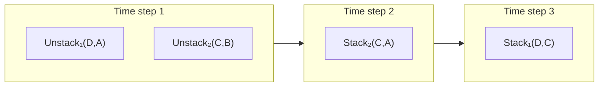
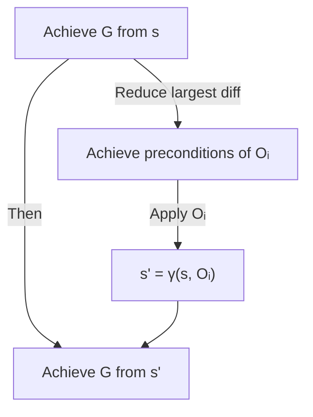
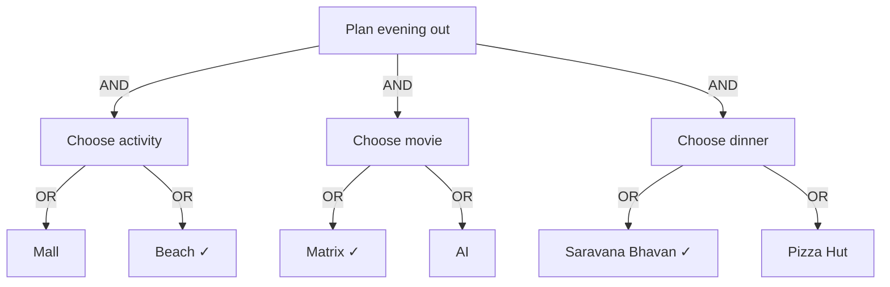
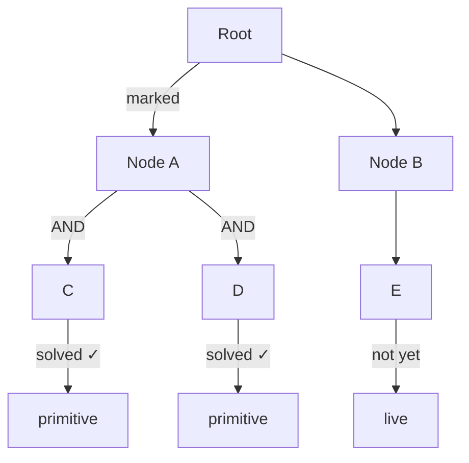
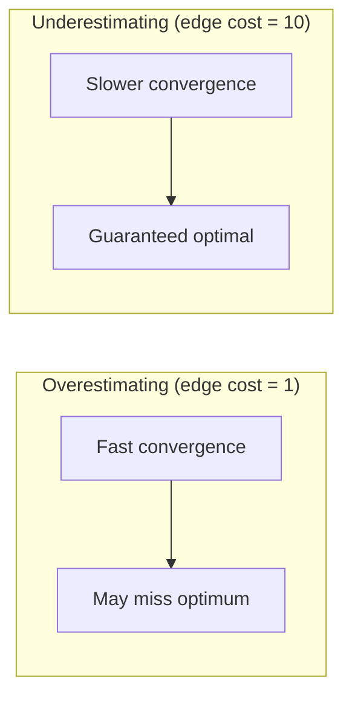
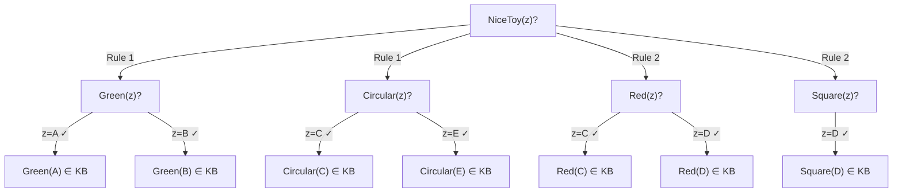

Last week's planners assumed one robot arm, producing strictly sequential plans. This week opens three new directions. First, multi-armed robots that can act in parallel, shrinking plan makespan. Second, Graphplan, which constructs a planning graph capturing all possible solutions before searching inside it. Third, problem decomposition via AND-OR trees and the AO\* algorithm, which breaks goals into sub-goals and solves them optimally. The thread connecting all three: moving from linear to non-linear, from state-space to graph-structured, from sequential to decomposed reasoning.

<LectureVideos
  videos={{
    "Lecture 1": "https://www.youtube.com/watch?v=MYt2lBWRpns",
    "Lecture 2": "https://www.youtube.com/watch?v=5d_UXtJj5go",
    "Lecture 3": "https://www.youtube.com/watch?v=VimNjEgN7J0",
    "Lecture 4": "https://www.youtube.com/watch?v=MvIBgdaDfT4",
    "Lecture 5": "https://www.youtube.com/watch?v=_0dUcpwEpWg",
    "Lecture 6": "https://www.youtube.com/watch?v=pLWlKVtjUoE",
    "Lecture 7": "https://www.youtube.com/watch?v=hhnq6sCyeGg",
  }}
/>

---

## Multi-armed Robots [Lecture 1]

A one-armed robot can only do one thing at a time, forcing linear plans. With two (or more) arms, actions can happen in parallel, reducing the **makespan** (number of time steps) of a plan.

### Modifying STRIPS operators for two arms

Each arm gets its own predicates: $\text{Holding}_1(x)$, $\text{Holding}_2(x)$, $\text{AE}_1$, $\text{AE}_2$ (arm empty). Each original operator is duplicated per arm:

| One-arm version | Two-arm versions |
|---|---|
| Unstack(x, y) | Unstack$_1$(x, y), Unstack$_2$(x, y) |
| Pickup(x) | Pickup$_1$(x), Pickup$_2$(x) |
| Putdown(x) | Putdown$_1$(x), Putdown$_2$(x) |
| Stack(x, y) | Stack$_1$(x, y), Stack$_2$(x, y) |

The generic arm number $n$ can parameterize the operators: $\text{Holding}(n, x)$, $\text{AE}(n)$.

### To delete or not to delete Clear(x)?

In the one-arm domain, when you pickup or unstack block $x$, should you delete $\text{Clear}(x)$ from the state?

- **One-arm robot**: It doesn't matter. After picking up $x$, the only options are putdown or stack, both of which make $\text{Clear}(x)$ true again.
- **Multi-arm robot**: It matters. If arm 1 unstacks $D$ from $A$ and arm 2 unstacks $C$ from $B$ in parallel, the question is: after unstacking, is $\text{Clear}(D)$ true? If we **delete** $\text{Clear}(D)$ on unstack, then $\text{Clear}(D)$ is only restored when another action adds it (e.g., stacking $C$ onto $A$ makes $\text{Clear}(C)$ true). This creates a **causal dependency** that forces ordering constraints.

### Worked example: two arms

**Start**: D on A, C on B. **Goal**: $\text{On}(C, A)$, $\text{On}(D, C)$.

With one arm: 6 steps (unstack D, putdown D, unstack C, stack C on A, pickup D, stack D on C).

With two arms (deleting Clear):

**Makespan = 3** instead of 6. The two unstack actions happen in parallel. Stack(D,C) must wait for Stack(C,A) because Clear(C) is only true after C is placed on A. This causal link is only captured when we **delete** Clear on unstack.

If we **don't delete** Clear, both unstacked blocks remain "clear," allowing Stack(D,C) and Stack(C,A) in parallel, potentially yielding a makespan of 2. But this is incorrect for the domain: after unstacking C from B, C cannot have something stacked onto it until it is placed somewhere. The delete-Clear version correctly captures the constraint.

---

## Means-Ends Analysis [Lecture 2]

Proposed by Newell and Simon in their **General Problem Solver (GPS)**, means-ends analysis is a heuristic strategy for problem solving that mirrors how humans plan.

### The strategy

1. Compare the current state $s$ with the desired goal $G$
2. List the **differences** between them
3. Evaluate differences by magnitude
4. **Reduce the largest difference first** using the operator-difference table
5. Recursively achieve the preconditions of the chosen operator
6. Apply the operator, then recursively achieve the remaining goal from the new state

### The AND structure

Means-ends analysis produces an **AND-OR tree**:

Both branches must succeed (AND node): first reduce the largest difference, then achieve the rest of the goal from the new state. This is different from OR trees (where any one branch suffices).

### Operator-difference table (travel example)

| Distance | Operators |
|---|---|
| > 5000 km | Airplane |
| 100-5000 km | Airplane, Train, Car |
| 1-100 km | Train, Car, Taxi, Bus |
| < 2 km | Walk, Bus, Taxi |

To get from IIT Madras to Parashar Lake (Himachal Pradesh):
1. Largest difference: ~2500 km → take a flight (Chennai → Delhi)
2. Remaining: IIT → Chennai airport (taxi), Delhi airport → Mandi (bus)
3. Smallest: Mandi → Parashar Lake (walk/taxi)

The key insight: means-ends analysis selects an **action in the middle of the plan first** (the flight), then recursively fills in the prefix and suffix. This is fundamentally different from forward or backward state-space planning, which commit to an ordering direction.

### Hierarchical planning (brief mention)

A related approach: define high-level operators (e.g., "plan a holiday") with abstract preconditions, then refine them into detailed plans. This is hierarchical planning, and we don't cover it in detail here.

---

## Algorithm Graphplan [Lecture 3]

Graphplan (Blum & Furst, 1995) takes a radically different approach: **two-stage planning**. First, construct a **planning graph** that compactly represents all possible plans. Then, search inside that graph for a valid solution.

This paradigm shift increased the plan lengths that could be found from ~15 steps to ~200 steps.

### Related two-stage planners

| Planner | Stage 1 | Stage 2 |
|---|---|---|
| Graphplan | Build planning graph | Extract solution from graph |
| SATplan | Convert to SAT problem | Use SAT solver |
| CPlan | Convert to CSP | Use CSP solver |
| HSP / FF | Compute domain-independent heuristic | Heuristic state-space search |

### Planning graph structure

A planning graph is a **layered graph** with alternating layers:

$$P_0 \rightarrow A_1 \rightarrow P_1 \rightarrow A_2 \rightarrow P_2 \rightarrow \ldots$$

- $P_0$ = the start state (set of propositions)
- $A_i$ = all applicable actions in $P_{i-1}$
- $P_i$ = union of all effects of actions in $A_i$

### No-op actions

Every proposition $p$ in layer $P_i$ has a corresponding **no-op** action: precondition = $p$, positive effect = $p$. This ensures all propositions carry forward to subsequent layers. No-op actions are always assumed present but not drawn in diagrams.

### Edges in the planning graph

Three kinds of edges from action layers to proposition layers:
- **Precondition links**: action → propositions in the previous layer it depends on
- **Positive effect links**: action → propositions it adds in the next layer
- **Negative effect links** (red, with circle): action → propositions it deletes in the next layer

### Mutual exclusion (mutex)

Two actions in the same layer are **mutex** if any of these hold:

| Condition | Meaning |
|---|---|
| Competing needs | They have precondition propositions that are mutex |
| Inconsistent effects | One adds $p$, the other deletes $p$ |
| Interference | One deletes a precondition of the other |
| Consuming same resource | Both need and delete the same proposition (e.g., both need ArmEmpty) |

Two propositions in the same layer are **mutex** if **all** pairs of actions that produce them are mutex.

### Monotonicity and leveling off

- Proposition layers grow monotonically (new propositions are only added, never removed)
- Action layers grow monotonically
- Mutex relations first **increase**, then gradually **decrease** as more actions become available in later layers
- If two consecutive layers have the same propositions and the same mutex relations, the graph has **leveled off**. No further changes are possible. If goal propositions are absent, the problem has no solution.

### Termination and solution extraction

Grow the graph until:
1. All goal propositions appear in $P_i$ and **none are mutex** with each other → attempt to extract a solution
2. The graph levels off without the goal being present → **no solution exists**

Solution extraction searches **backward** from the goal propositions in $P_i$, selecting non-mutex actions whose preconditions are present and non-mutex in earlier layers. If extraction fails, grow the graph by one more layer and try again. The first successful extraction yields the **minimum makespan** plan.

---

## Problem Decomposition and AND-OR Trees [Lecture 4]

### Motivation: planning an evening out

Suppose you need to choose: an activity, a movie, and a restaurant. With depth-first search, you fix Activity, then Movie, then Restaurant, and backtrack chronologically if the combination fails.

The problem: if "visit mall" is the culprit (no plan with mall is accepted), depth-first search wastes effort trying all movie/restaurant combinations with mall before finally switching to "beach." **Dependency-directed backtracking** would jump straight to the culprit, but ordinary DFS can't do this.

### AND-OR trees

The alternative representation: break the goal into **independent sub-goals**. The solution is a **subtree**, not a path.

- **AND arc**: all children must be solved (activity AND movie AND dinner)
- **OR arc**: any one child suffices (beach OR mall)

### Solution = subtree

For OR trees (standard search), the solution is a **path**. For AND-OR trees, the solution is a **subtree** whose leaves are all **solved** (primitive problems needing no further refinement). Internal nodes labeled **live** need further refinement.

### Symbolic integration example

AND-OR trees arise naturally in symbolic integration:

1. Transform the integral by substitution ($x = \sin y$)
2. Decompose the transformed integral into simpler parts (integration by parts, sum rule)
3. Each part either reduces to a **primitive** (known integral = solved node) or needs further decomposition

The process can cycle (e.g., converting $\tan$ to $\cot$ and back), so the algorithm must detect and avoid loops.

---

## Solving Goal Trees with AO\* [Lecture 5]

AO\* (Martelli & Montanari, 1978) is the AND-OR tree analog of A\*. The star denotes admissibility: under certain conditions, it finds the **least-cost solution subtree**.

### Comparison: A\* vs AO\*

| Aspect | A\* | AO\* |
|---|---|
| Graph type | OR graph | AND-OR graph |
| Solution | Path from start to goal | Subtree rooted at start |
| Node expansion | Expand the lowest $f$-cost open node | Follow marked paths, expand a live node |
| Cost backup | $f(n) = g(n) + h(n)$ | Cost = sum of best child costs + edge costs |
| Termination | Goal dequeued from OPEN | Root labeled **solved** |

### The AO\* algorithm

**Forward phase:**
1. Start at the root. Trace the **marked** (best-looking) paths down to a set of **live** (unsolved, unexpanded) nodes $U$.
2. Pick a node $n$ from $U$ and **refine** it (generate its successors).
3. Check for loops and remove any child that would create one.

**Backward phase:**
1. Let $M$ = set of newly modified nodes.
2. For each node $d$ in $M$ (deepest first):
   - Compute the **best cost** from $d$'s children
   - **Mark** the best option at $d$
   - If **all** AND-successors along the marked path are labeled **solved**, label $d$ as **solved**
   - If $d$'s cost or solved label changed, add all parents of $d$ to $M$

3. Continue until the root is labeled **solved** (success) or no solution exists.

### Admissibility

AO\* is admissible (finds the optimal solution) when the heuristic function **underestimates** the true cost, just like A\*. The reasoning is analogous: as long as underestimates hold, no unexplored partial solution can be cheaper than the one being refined, so the algorithm won't miss the optimum.

### Key insight: backed-up cost, not heuristic value

When choosing which node to expand next, the decision is based on the **backed-up cost** of the entire solution path, not the heuristic value of the individual node. A node with low $h$-value may be part of an expensive solution branch.

---

## AO\*: An Example [Lecture 6]

Consider an AND-OR graph with heuristic values assigned to unexpanded nodes. Solved nodes (double boxes) have cost 0.

### Case 1: Edge cost = 1 (heuristic values are overestimates)

With unit edge costs, the heuristic values (e.g., 10 for a node whose actual cost is 1) tend to **overestimate**.

**Step 1**: Expand root. Two options: left branch (cost 6 + 7 + 2 = 15) vs right branch (cost 4 + 5 + 2 = 11). Mark right branch.

**Step 2**: Expand node with $h = 5$. It has one AND-choice leading to two solved nodes (cost 0 each). Its real cost = 0 + 0 + 1 + 1 = 2. Root cost drops from 11 → 8.

**Step 3**: Expand node with $h = 4$. Two options: AND-choice (cost 3 + 4 + 2 = 9) vs OR-choice (cost 7 + 1 = 8). Mark OR-choice. Cost goes up from 4 → 8.

**Step 4**: The right branch cost has risen, but it's still cheaper than the left. Continue refining.

**Characteristic of overestimation**: costs keep **coming down** as nodes are refined. The first promising branch always stays the best, so the algorithm never switches. It terminates quickly but may not find the optimal solution.

### Case 2: Edge cost = 10 (heuristic values are underestimates)

With edge cost 10, the same heuristic values now **underestimate** the true cost.

**Step 1**: Right branch: 4 + 5 + 20 = 29. Left branch: 6 + 7 + 20 = 33. Mark right.

**Step 2**: Expand $h = 5$ node. Its real cost = 0 + 0 + 10 + 10 = 20. Right branch cost jumps from 29 → 44. Left branch is now cheaper (33). **Marker switches to left.**

**Step 3**: Expand $h = 7$ node. It has an AND-choice with cost 3 + 4 + 20 = 27. Left branch cost becomes 27 + 6 + 20 = 53. Right branch (44) is now cheaper again. **Marker switches back.**

**Characteristic of underestimation**: costs tend to **go up** as nodes are refined. The algorithm keeps switching between branches as better estimates emerge, exploring more thoroughly. It is slower but **guaranteed to find the optimal solution**.

This directly parallels weighted A\*: overestimating is like using a large weight $w$ (faster but suboptimal), while underestimating is like $w = 1$ (slower but admissible).

---

## Goal Trees and Deduction in Logic [Lecture 7]

AND-OR trees appear not just in planning but in **logical deduction**. The connection: searching for a proof is searching for a solution in an AND-OR graph.

### Entailment and proof

Given a **knowledge base** $KB$ (a set of sentences assumed true) and a query sentence $\alpha$, we ask: is $\alpha$ **entailed** by $KB$? That is, if everything in $KB$ is true, must $\alpha$ also be true?

- **Entailment** ($KB \models \alpha$) is a semantic notion about truth
- **Provability** ($KB \vdash \alpha$) is a syntactic notion about deriving $\alpha$ via inference rules
- **Soundness**: if $KB \vdash \alpha$ then $KB \models \alpha$ (every provable statement is true)
- **Completeness**: if $KB \models \alpha$ then $KB \vdash \alpha$ (every true statement is provable)

### The Socratic syllogism

1. All men are mortal: $\forall x. \text{Man}(x) \Rightarrow \text{Mortal}(x)$
2. Socrates is a man: $\text{Man}(\text{Socrates})$
3. Therefore: $\text{Mortal}(\text{Socrates})$

The form is valid regardless of content (replace Man with City, Mortal with Congested, Socrates with Chennai).

### Forward chaining vs backward chaining

**Forward chaining** (natural deduction): start from $KB$, apply inference rules (e.g., **modus ponens**: from $\alpha$ and $\alpha \Rightarrow \beta$, derive $\beta$), add new sentences, repeat until $\alpha$ is derived or no new sentences can be added.

**Backward chaining** (deductive retrieval): start from the goal $\alpha$, look for rules whose consequent matches $\alpha$, reduce to proving the antecedents. This produces an AND-OR tree.

### Backward chaining with variables

The goal can contain **variables** (existential quantifier): "Is there someone who is mortal?" → $\exists z. \text{Mortal}(z)$.

The process:
1. Match goal $\text{Mortal}(z)$ against the rule $\text{Man}(x) \Rightarrow \text{Mortal}(x)$
2. **Unify**: substitute $x = z$, producing sub-goal $\text{Man}(z)$
3. Match $\text{Man}(z)$ against facts in $KB$: try $z = \text{Socrates}$, $z = \text{Plato}$, etc.
4. Each successful substitution gives a **witness** for the existential query

### Conjunctive antecedents: AND nodes

Consider the rule: $\text{Green}(x) \land \text{Circular}(x) \Rightarrow \text{NiceToy}(x)$.

To prove $\text{NiceToy}(z)$, you must prove **both** $\text{Green}(z)$ **and** $\text{Circular}(z)$. This is an AND node. When multiple rules can prove the same consequent (e.g., "red with square base" also makes a nice toy), those are OR alternatives.

### Nice toy example

Rules:
- Rule 1: $\text{Green}(x) \land \text{Circular}(x) \Rightarrow \text{NiceToy}(x)$
- Rule 2: $\text{Red}(x) \land \text{Square}(x) \Rightarrow \text{NiceToy}(x)$

Facts: Green(A), Green(B), Circular(C), Red(C), Red(D), Square(D), Circular(E)

Backward chaining from $\text{NiceToy}(z)$:

- Via Rule 1: $z = A$ needs Green(A) ✓ and Circular(A)? No fact. $z = C$ needs Green(C)? No fact. No solution via Rule 1 with current KB.
- Via Rule 2: $z = D$ needs Red(D) ✓ and Square(D) ✓. **Solution found: D is a nice toy.**

The search through this AND-OR tree is exactly what AO\* does: it explores the marked (cheapest-looking) branches, refines live nodes, and backs up revised cost estimates.

---

## Week 9 Summary

| Topic | Key idea | Planning paradigm |
|---|---|---|
| Multi-arm robots | Parallel actions, makespan, delete-Clear choice | Plan-space with parallel actions |
| Means-ends analysis | Reduce largest difference first, operator-difference table | Recursive AND-OR decomposition |
| Graphplan | Build planning graph, then extract solution | Two-stage: graph construction + search |
| AND-OR trees | Solution is a subtree, not a path | Goal decomposition |
| AO\* | Follow marked paths, expand live node, back up costs | Best-first AND-OR search |
| Under/overestimation | Underestimate → optimal but slow; overestimate → fast but maybe suboptimal | Directly parallels weighted A\* |
| Logic & deduction | Backward chaining through rules = AND-OR search | Unification + modus ponens as search |

The grand arc of this week: from extending STRIPS to parallel agents, to a two-stage planning architecture, to treating planning as search in AND-OR graphs. Each step generalizes the notion of what a "plan" is, from a linear sequence to a partially ordered set to a decomposed subgraph.
