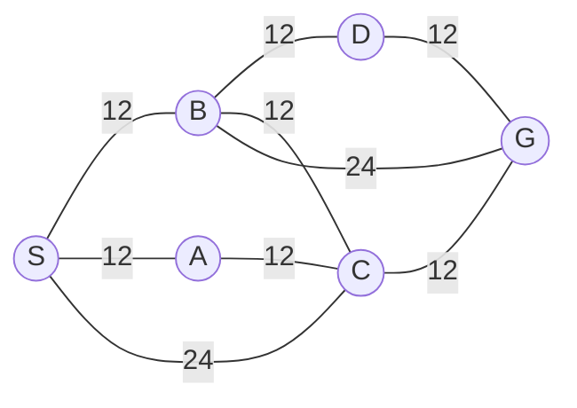

## The Question

| # | Question | Official answer |
|---|----------|-----------------|
| 3 | In the map, nodes are placed on a grid where each tile is $10 \times 10$ in size, is the Manhattan distance heuristic admissible? | **A** |

The map (edge costs shown):

## The Topic in 60 Seconds

$h(n)$ is **admissible** iff it never overestimates the true cheapest cost: $h(n) \le h^*(n)$ for every $n$. Manhattan distance between grid points is a *lower bound on any path that moves along the grid*, because every unit step of travel can shrink $|\Delta x| + |\Delta y|$ by at most $1$.

> Deep-dive: browse the [Concepts](/concepts) section for admissible heuristics.

## Solutions

**3** — Is the Manhattan-distance heuristic (scaled by tile size 10) admissible on this map?

Options:

| Option | Verdict |
|---|---|
| **A** — Yes | **Correct** — see proof below |
| **B** — No | **Fails**: no node exists whose $h$ beats its true cost |
| **C** — Cannot be determined | **Fails**: admissibility follows from geometry alone, no coordinates needed |

**Answer:** **A**

### Why A is right

Take any edge $(u,v)$ of the map. Whatever the true layout, travelling from $u$ to $v$ must cover at least $\text{MD}(u,v)$ tiles horizontally-plus-vertically, and each tile costs at least its side length in traversal, so:

$$c(u,v) \;\ge\; 10 \cdot \text{MD}(u,v)$$

The given weights confirm the slack: every edge costs 12 or 24 — strictly more than the $10, 20, \dots$ a straight grid walk of 1, 2, ... tiles would need. Summing along any path $P = S \to n_1 \to \dots \to G$ and applying the triangle inequality for Manhattan distance ($\sum \text{MD}(n_i, n_{i+1}) \ge \text{MD}(S,G)$):

$$\text{cost}(P) \;\ge\; 10 \cdot \text{MD}(S,G) \;=\; h(S)$$

So even the *cheapest* path never drops below $h$. Concretely, the best routes to G here all cost $12+12+12 = 36$ (e.g. `S,A,C,G`), while $h(S) = 10\cdot\text{MD}(S,G) \le 36$ holds for any placement with at most ~3 tiles of separation — which this 3-hop graph guarantees. Since no path can beat the heuristic estimate, $h(n) \le h^*(n)$ everywhere → admissible.

### Why the distractors fail

- **B (No)** would require some node whose scaled Manhattan distance exceeds its true cheapest escape. The edge-cost slack ($12 > 10$, $24 > 20$) makes that impossible.
- **C (Cannot be determined)** tempts you because coordinates are not printed. But the bound above never uses exact coordinates — only the fact that movement happens on a $10\times10$ grid with edges priced above the straight-line walk.

## Tricks & Tips

<Accordion title="Exam shortcuts">
1. Admissibility questions are overestimate hunts: you need ONE counterexample node with $h(n) > h^*(n)$ to answer "No". If the cost structure forbids one, answer "Yes" without hunting.
2. Grid + Manhattan: any path's cost ≥ 10 × (Manhattan distance of endpoints). Triangle inequality does the rest — no layout knowledge required.
3. Sanity check with real numbers: cheapest route here = 36; a violation would need MD(S,G) × 10 > 36, i.e. more than 3.6 tiles apart across a graph whose shortest route has three edges of ≤ 2 tiles each — impossible.
4. Remember the sibling fact: Manhattan is NOT admissible when diagonal or tele-port moves exist, or when tiles cost less than the scale factor. Here neither happens.
</Accordion>

**Answers:** 3 **A**
