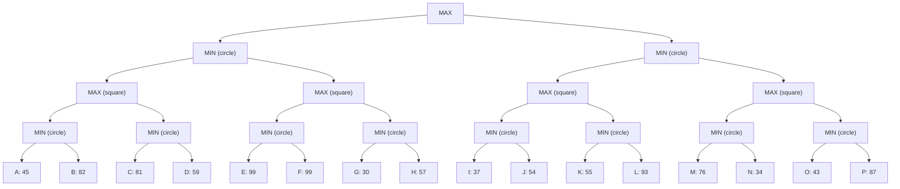

## The Question

The figure shows a 4-ply game tree with evaluation function values at the horizon. The nodes in the horizon are assigned labels A, B, C, ..., P. Use these labels when asked to enter a horizon node or a list of horizon nodes.

**Tie-breaker**: when several nodes qualify then select the left most node, if tie persists then select the deepest node among the left most nodes.

| # | Question | Official answer |
|---|----------|-----------------|
| 7.1 | Which of the following are strategies for MAX? | **A**, **B** |
| 7.2 | List the horizon nodes in the best strategy for MAX. Enter the nodes in the ascending order of node labels. | `C,D,E,F` |
| 7.3 | List the first five horizon nodes pruned by Alpha-Beta. | `G,H,J,L,M` |

## The Topic in 60 Seconds

| Layer | Nodes | Rule |
|---|---|---|
| Ply 3 (horizon parents) | $L3_1 \dots L3_8$ | MIN takes the smaller child value |
| Ply 2 | $L2_1 \dots L2_4$ | MAX takes the larger child value |
| Ply 1 | $L1_1, L1_2$ | MIN takes the smaller child value |
| Root | MAX | takes the larger child value |

Alpha-Beta = minimax plus two windows: $\alpha$ (best MAX can already force) and $\beta$ (best MIN can already force). Prune the moment $\beta \le \alpha$ at a node — remaining children there can never influence the root decision.

> Deep-dive: browse the [Concepts](/concepts) section for minimax and alpha-beta.

## Solutions

### Static minimax values (bottom-up)

| Node | Type | Computation | Value |
|---|---|---|---|
| $L3_1$ | MIN | $\min(45, 82)$ | 45 |
| $L3_2$ | MIN | $\min(81, 59)$ | 59 |
| $L3_3$ | MIN | $\min(99, 99)$ | 99 |
| $L3_4$ | MIN | $\min(30, 57)$ | 30 |
| $L3_5$ | MIN | $\min(37, 54)$ | 37 |
| $L3_6$ | MIN | $\min(55, 93)$ | 55 |
| $L3_7$ | MIN | $\min(76, 34)$ | 34 |
| $L3_8$ | MIN | $\min(43, 87)$ | 43 |
| $L2_1$ | MAX | $\max(45, 59)$ | 59 |
| $L2_2$ | MAX | $\max(99, 30)$ | 99 |
| $L2_3$ | MAX | $\max(37, 55)$ | 55 |
| $L2_4$ | MAX | $\max(34, 43)$ | 43 |
| $L1_1$ | MIN | $\min(59, 99)$ | 59 |
| $L1_2$ | MIN | $\min(55, 43)$ | 43 |
| Root | MAX | $\max(59, 43)$ | **59** |

**7.1** — Which of the following are strategies for MAX?

A strategy must commit to ONE child at the root and cover both of MAX's later choices with complete sibling pairs:

| Option | Leaves | Spans root child | Verdict |
|---|---|---|---|
| **A** — A,B,E,F | both pairs of $L1_1$ ($L3_1$, $L3_3$) | left only ($L1_1$) | **Valid strategy**, guarantees $\min(45, 99) = 45$ |
| **B** — C,D,G,H | both pairs of $L1_1$ ($L3_2$, $L3_4$) | left only ($L1_1$) | **Valid strategy**, guarantees $\min(59, 30) = 30$ |
| **C** — A,C,I,J | A,C both sit under $L2_1$ (MAX cannot take both), I,J under $L1_2$ | both sides | Invalid — MAX would need to choose left AND right at the root |
| **D** — B,D,J,L | B,D both under $L2_1$; J,L both under $L2_3$ | both sides | Invalid for the same reason |

**Answer:** **A**, **B**

**7.2** — Horizon nodes of the BEST strategy → `C,D,E,F`

Enumerate the four legal left-subtree strategies: $\{A,B\}$+$\{E,F\}$ gives 45, $\{A,B\}$+$\{G,H\}$ gives $\min(45,30)=30$, $\{C,D\}$+$\{E,F\}$ gives $\min(59,99)=59$, $\{C,D\}$+$\{G,H\}$ gives 30. No right-subtree strategy beats 43 ($L1_2 = 43 < 59$). Best guarantee = **59** via $L2_1 \to L3_2$ (leaves C, D) and $L2_2 \to L3_3$ (leaves E, F):

$$\text{value} = \min\big(\max(\underbrace{\min(81,59)}_{59}, \underbrace{\min(99,99)}_{99})\big)\text{-branch} = 59$$

**Answer:** `C,D,E,F`

**7.3** — First five horizon nodes pruned by Alpha-Beta → `G,H,J,L,M`

Left-to-right DFS, passing $\alpha, \beta$ down:

| Event | Node visited | Window $(\alpha, \beta)$ | What happens |
|---|---|---|---|
| 1 | A = 45 | $(-\infty, +\infty)$ at $L3_1$ | $\beta_{L3_1} = 45$ |
| 2 | B = 82 | same | $L3_1$ returns $\min(45,82) = 45$; $\alpha_{L2_1} = 45$ |
| 3 | C = 81 | $(45, +\infty)$ at $L3_2$ | $\beta_{L3_2} = 81 > \alpha$, continue |
| 4 | D = 59 | same | $L3_2$ returns 59; $L2_1 = \max(45,59) = 59$; $\beta_{L1_1} = 59$ |
| 5 | E = 99, F = 99 | $(-\infty, 59)$ at $L3_3$ | $L3_3$ returns 99; $\alpha_{L2_2} = 99 \ge \beta_{L1_1} = 59$ → **CUT**: subtree of $L3_4$ skipped → **G, H pruned** |
| 6 | — | $L1_1$ completes at 59 | Root updates $\alpha = 59$ |
| 7 | I = 37 | $(59, +\infty)$ at $L3_5$ | $\beta_{L3_5} = 37 \le \alpha = 59$ → **CUT**: **J pruned**; $L3_5$ returns 37 |
| 8 | K = 55 | $(59, +\infty)$ at $L3_6$ | $\beta_{L3_6} = 55 \le 59$ → **CUT**: **L pruned**; $L3_6$ returns 55; $L2_3 = \max(37,55) = 55$ |
| 9 | — | $\beta_{L1_2} = 55 \le \alpha_{root} = 59$ → CUT | entire $L2_4$ skipped → **M, N, O, P pruned** |

Pruning order of horizon nodes: G, H, then J, then L, then M, N, O, P — the first five are **`G,H,J,L,M`**.

**Answer:** `G,H,J,L,M`

## Interactive alpha-beta trace

Each step shows the window state, exact min/max arithmetic, and what got pruned.

<StepGraph
  height={480}
  nodeWidth={52}
  nodeHeight={36}
  nodeFontSize={10}
  legend={[
    { color: "#b45309", label: "evaluating now" },
    { color: "#0369a1", label: "backed up" },
    { color: "#4b5563", label: "not yet reached" },
    { color: "#7f1d1d", label: "pruned (never examined)" },
    { color: "#15803d", label: "best strategy / root value" },
  ]}
  steps={[
    {
      label: "A,B: L3_1=45",
      note: "MIN(L3_1): min(A=45, B=82) = 45\nalpha(L2_1) = 45. Waiting for second child.",
      elements: [
        { data: { id: "R", label: "MAX", type: "max" }, position: { x: 512, y: 40 } },
        { data: { id: "n11", label: "MIN", type: "min" }, position: { x: 256, y: 130 } },
        { data: { id: "n12", label: "MIN", type: "min" }, position: { x: 768, y: 130 } },
        { data: { id: "n21", label: "MAX", type: "max" }, position: { x: 128, y: 230 } },
        { data: { id: "n22", label: "MAX", type: "max" }, position: { x: 384, y: 230 } },
        { data: { id: "n23", label: "MAX", type: "max" }, position: { x: 640, y: 230 } },
        { data: { id: "n24", label: "MAX", type: "max" }, position: { x: 896, y: 230 } },
        { data: { id: "n31", label: "MIN 45", type: "current" }, position: { x: 64, y: 330 } },
        { data: { id: "n32", label: "MIN", type: "min" }, position: { x: 192, y: 330 } },
        { data: { id: "n33", label: "MIN", type: "min" }, position: { x: 320, y: 330 } },
        { data: { id: "n34", label: "MIN", type: "min" }, position: { x: 448, y: 330 } },
        { data: { id: "n35", label: "MIN", type: "min" }, position: { x: 576, y: 330 } },
        { data: { id: "n36", label: "MIN", type: "min" }, position: { x: 704, y: 330 } },
        { data: { id: "n37", label: "MIN", type: "min" }, position: { x: 832, y: 330 } },
        { data: { id: "n38", label: "MIN", type: "min" }, position: { x: 960, y: 330 } },
        { data: { id: "A", label: "A 45", type: "current" }, position: { x: 32, y: 430 } },
        { data: { id: "B", label: "B 82", type: "current" }, position: { x: 96, y: 430 } },
        { data: { id: "C", label: "C 81", type: "terminal" }, position: { x: 160, y: 430 } },
        { data: { id: "D", label: "D 59", type: "terminal" }, position: { x: 224, y: 430 } },
        { data: { id: "E", label: "E 99", type: "terminal" }, position: { x: 288, y: 430 } },
        { data: { id: "F", label: "F 99", type: "terminal" }, position: { x: 352, y: 430 } },
        { data: { id: "G", label: "G 30", type: "terminal" }, position: { x: 416, y: 430 } },
        { data: { id: "H", label: "H 57", type: "terminal" }, position: { x: 480, y: 430 } },
        { data: { id: "I", label: "I 37", type: "terminal" }, position: { x: 544, y: 430 } },
        { data: { id: "J", label: "J 54", type: "terminal" }, position: { x: 608, y: 430 } },
        { data: { id: "K", label: "K 55", type: "terminal" }, position: { x: 672, y: 430 } },
        { data: { id: "L", label: "L 93", type: "terminal" }, position: { x: 736, y: 430 } },
        { data: { id: "M", label: "M 76", type: "terminal" }, position: { x: 800, y: 430 } },
        { data: { id: "N", label: "N 34", type: "terminal" }, position: { x: 864, y: 430 } },
        { data: { id: "O", label: "O 43", type: "terminal" }, position: { x: 928, y: 430 } },
        { data: { id: "P", label: "P 87", type: "terminal" }, position: { x: 992, y: 430 } },
        { data: { id: "eR11", source: "R", target: "n11" } },
        { data: { id: "eR12", source: "R", target: "n12" } },
        { data: { id: "e1121", source: "n11", target: "n21" } },
        { data: { id: "e1122", source: "n11", target: "n22" } },
        { data: { id: "e1223", source: "n12", target: "n23" } },
        { data: { id: "e1224", source: "n12", target: "n24" } },
        { data: { id: "e2131", source: "n21", target: "n31" } },
        { data: { id: "e2132", source: "n21", target: "n32" } },
        { data: { id: "e2233", source: "n22", target: "n33" } },
        { data: { id: "e2234", source: "n22", target: "n34" } },
        { data: { id: "e2335", source: "n23", target: "n35" } },
        { data: { id: "e2336", source: "n23", target: "n36" } },
        { data: { id: "e2437", source: "n24", target: "n37" } },
        { data: { id: "e2438", source: "n24", target: "n38" } },
        { data: { id: "ea", source: "n31", target: "A" } },
        { data: { id: "eb", source: "n31", target: "B" } },
        { data: { id: "ec", source: "n32", target: "C" } },
        { data: { id: "ed", source: "n32", target: "D" } },
        { data: { id: "ee", source: "n33", target: "E" } },
        { data: { id: "ef", source: "n33", target: "F" } },
        { data: { id: "eg", source: "n34", target: "G" } },
        { data: { id: "eh", source: "n34", target: "H" } },
        { data: { id: "ei", source: "n35", target: "I" } },
        { data: { id: "ej", source: "n35", target: "J" } },
        { data: { id: "ek", source: "n36", target: "K" } },
        { data: { id: "el", source: "n36", target: "L" } },
        { data: { id: "em", source: "n37", target: "M" } },
        { data: { id: "en", source: "n37", target: "N" } },
        { data: { id: "eo", source: "n38", target: "O" } },
        { data: { id: "ep", source: "n38", target: "P" } },
      ],
    },
    {
      label: "L2_1 = 59",
      note: "MIN(L3_2): min(C=81, D=59) = 59\nMAX(L2_1): max(45, 59) = 59\nbeta(L1_1) drops to 59.",
      elements: [
        { data: { id: "R", label: "MAX", type: "max" }, position: { x: 512, y: 40 } },
        { data: { id: "n11", label: "MIN 59", type: "current" }, position: { x: 256, y: 130 } },
        { data: { id: "n12", label: "MIN", type: "min" }, position: { x: 768, y: 130 } },
        { data: { id: "n21", label: "MAX 59", type: "current" }, position: { x: 128, y: 230 } },
        { data: { id: "n22", label: "MAX", type: "max" }, position: { x: 384, y: 230 } },
        { data: { id: "n23", label: "MAX", type: "max" }, position: { x: 640, y: 230 } },
        { data: { id: "n24", label: "MAX", type: "max" }, position: { x: 896, y: 230 } },
        { data: { id: "n31", label: "MIN 45", type: "explored" }, position: { x: 64, y: 330 } },
        { data: { id: "n32", label: "MIN 59", type: "current" }, position: { x: 192, y: 330 } },
        { data: { id: "n33", label: "MIN", type: "min" }, position: { x: 320, y: 330 } },
        { data: { id: "n34", label: "MIN", type: "min" }, position: { x: 448, y: 330 } },
        { data: { id: "n35", label: "MIN", type: "min" }, position: { x: 576, y: 330 } },
        { data: { id: "n36", label: "MIN", type: "min" }, position: { x: 704, y: 330 } },
        { data: { id: "n37", label: "MIN", type: "min" }, position: { x: 832, y: 330 } },
        { data: { id: "n38", label: "MIN", type: "min" }, position: { x: 960, y: 330 } },
        { data: { id: "A", label: "A 45", type: "explored" }, position: { x: 32, y: 430 } },
        { data: { id: "B", label: "B 82", type: "explored" }, position: { x: 96, y: 430 } },
        { data: { id: "C", label: "C 81", type: "current" }, position: { x: 160, y: 430 } },
        { data: { id: "D", label: "D 59", type: "current" }, position: { x: 224, y: 430 } },
        { data: { id: "E", label: "E 99", type: "terminal" }, position: { x: 288, y: 430 } },
        { data: { id: "F", label: "F 99", type: "terminal" }, position: { x: 352, y: 430 } },
        { data: { id: "G", label: "G 30", type: "terminal" }, position: { x: 416, y: 430 } },
        { data: { id: "H", label: "H 57", type: "terminal" }, position: { x: 480, y: 430 } },
        { data: { id: "I", label: "I 37", type: "terminal" }, position: { x: 544, y: 430 } },
        { data: { id: "J", label: "J 54", type: "terminal" }, position: { x: 608, y: 430 } },
        { data: { id: "K", label: "K 55", type: "terminal" }, position: { x: 672, y: 430 } },
        { data: { id: "L", label: "L 93", type: "terminal" }, position: { x: 736, y: 430 } },
        { data: { id: "M", label: "M 76", type: "terminal" }, position: { x: 800, y: 430 } },
        { data: { id: "N", label: "N 34", type: "terminal" }, position: { x: 864, y: 430 } },
        { data: { id: "O", label: "O 43", type: "terminal" }, position: { x: 928, y: 430 } },
        { data: { id: "P", label: "P 87", type: "terminal" }, position: { x: 992, y: 430 } },
        { data: { id: "eR11", source: "R", target: "n11" } },
        { data: { id: "eR12", source: "R", target: "n12" } },
        { data: { id: "e1121", source: "n11", target: "n21" } },
        { data: { id: "e1122", source: "n11", target: "n22" } },
        { data: { id: "e1223", source: "n12", target: "n23" } },
        { data: { id: "e1224", source: "n12", target: "n24" } },
        { data: { id: "e2131", source: "n21", target: "n31" } },
        { data: { id: "e2132", source: "n21", target: "n32" } },
        { data: { id: "e2233", source: "n22", target: "n33" } },
        { data: { id: "e2234", source: "n22", target: "n34" } },
        { data: { id: "e2335", source: "n23", target: "n35" } },
        { data: { id: "e2336", source: "n23", target: "n36" } },
        { data: { id: "e2437", source: "n24", target: "n37" } },
        { data: { id: "e2438", source: "n24", target: "n38" } },
        { data: { id: "ea", source: "n31", target: "A" } },
        { data: { id: "eb", source: "n31", target: "B" } },
        { data: { id: "ec", source: "n32", target: "C" } },
        { data: { id: "ed", source: "n32", target: "D" } },
        { data: { id: "ee", source: "n33", target: "E" } },
        { data: { id: "ef", source: "n33", target: "F" } },
        { data: { id: "eg", source: "n34", target: "G" } },
        { data: { id: "eh", source: "n34", target: "H" } },
        { data: { id: "ei", source: "n35", target: "I" } },
        { data: { id: "ej", source: "n35", target: "J" } },
        { data: { id: "ek", source: "n36", target: "K" } },
        { data: { id: "el", source: "n36", target: "L" } },
        { data: { id: "em", source: "n37", target: "M" } },
        { data: { id: "en", source: "n37", target: "N" } },
        { data: { id: "eo", source: "n38", target: "O" } },
        { data: { id: "ep", source: "n38", target: "P" } },
      ],
    },
    {
      label: "PRUNE G,H",
      note: "MIN(L3_3): min(E=99, F=99) = 99\nalpha(L2_2) = 99 >= beta(L1_1) = 59 -> CUTOFF\nL3_4 never examined: G and H pruned.\nL1_1 returns 59. Root alpha = 59.",
      elements: [
        { data: { id: "R", label: "MAX", type: "max" }, position: { x: 512, y: 40 } },
        { data: { id: "n11", label: "MIN 59", type: "explored" }, position: { x: 256, y: 130 } },
        { data: { id: "n12", label: "MIN", type: "min" }, position: { x: 768, y: 130 } },
        { data: { id: "n21", label: "MAX 59", type: "explored" }, position: { x: 128, y: 230 } },
        { data: { id: "n22", label: "MAX 99", type: "current" }, position: { x: 384, y: 230 } },
        { data: { id: "n23", label: "MAX", type: "max" }, position: { x: 640, y: 230 } },
        { data: { id: "n24", label: "MAX", type: "max" }, position: { x: 896, y: 230 } },
        { data: { id: "n31", label: "MIN 45", type: "explored" }, position: { x: 64, y: 330 } },
        { data: { id: "n32", label: "MIN 59", type: "explored" }, position: { x: 192, y: 330 } },
        { data: { id: "n33", label: "MIN 99", type: "current" }, position: { x: 320, y: 330 } },
        { data: { id: "n34", label: "MIN", type: "pruned" }, position: { x: 448, y: 330 } },
        { data: { id: "n35", label: "MIN", type: "min" }, position: { x: 576, y: 330 } },
        { data: { id: "n36", label: "MIN", type: "min" }, position: { x: 704, y: 330 } },
        { data: { id: "n37", label: "MIN", type: "min" }, position: { x: 832, y: 330 } },
        { data: { id: "n38", label: "MIN", type: "min" }, position: { x: 960, y: 330 } },
        { data: { id: "A", label: "A 45", type: "explored" }, position: { x: 32, y: 430 } },
        { data: { id: "B", label: "B 82", type: "explored" }, position: { x: 96, y: 430 } },
        { data: { id: "C", label: "C 81", type: "explored" }, position: { x: 160, y: 430 } },
        { data: { id: "D", label: "D 59", type: "explored" }, position: { x: 224, y: 430 } },
        { data: { id: "E", label: "E 99", type: "explored" }, position: { x: 288, y: 430 } },
        { data: { id: "F", label: "F 99", type: "explored" }, position: { x: 352, y: 430 } },
        { data: { id: "G", label: "G 30", type: "pruned" }, position: { x: 416, y: 430 } },
        { data: { id: "H", label: "H 57", type: "pruned" }, position: { x: 480, y: 430 } },
        { data: { id: "I", label: "I 37", type: "terminal" }, position: { x: 544, y: 430 } },
        { data: { id: "J", label: "J 54", type: "terminal" }, position: { x: 608, y: 430 } },
        { data: { id: "K", label: "K 55", type: "terminal" }, position: { x: 672, y: 430 } },
        { data: { id: "L", label: "L 93", type: "terminal" }, position: { x: 736, y: 430 } },
        { data: { id: "M", label: "M 76", type: "terminal" }, position: { x: 800, y: 430 } },
        { data: { id: "N", label: "N 34", type: "terminal" }, position: { x: 864, y: 430 } },
        { data: { id: "O", label: "O 43", type: "terminal" }, position: { x: 928, y: 430 } },
        { data: { id: "P", label: "P 87", type: "terminal" }, position: { x: 992, y: 430 } },
        { data: { id: "eR11", source: "R", target: "n11" } },
        { data: { id: "eR12", source: "R", target: "n12" } },
        { data: { id: "e1121", source: "n11", target: "n21" } },
        { data: { id: "e1122", source: "n11", target: "n22" } },
        { data: { id: "e1223", source: "n12", target: "n23" } },
        { data: { id: "e1224", source: "n12", target: "n24" } },
        { data: { id: "e2131", source: "n21", target: "n31" } },
        { data: { id: "e2132", source: "n21", target: "n32" } },
        { data: { id: "e2233", source: "n22", target: "n33" } },
        { data: { id: "e2234", source: "n22", target: "n34", type: "pruned" } },
        { data: { id: "e2335", source: "n23", target: "n35" } },
        { data: { id: "e2336", source: "n23", target: "n36" } },
        { data: { id: "e2437", source: "n24", target: "n37" } },
        { data: { id: "e2438", source: "n24", target: "n38" } },
        { data: { id: "ea", source: "n31", target: "A" } },
        { data: { id: "eb", source: "n31", target: "B" } },
        { data: { id: "ec", source: "n32", target: "C" } },
        { data: { id: "ed", source: "n32", target: "D" } },
        { data: { id: "ee", source: "n33", target: "E" } },
        { data: { id: "ef", source: "n33", target: "F" } },
        { data: { id: "eg", source: "n34", target: "G", type: "pruned" } },
        { data: { id: "eh", source: "n34", target: "H", type: "pruned" } },
        { data: { id: "ei", source: "n35", target: "I" } },
        { data: { id: "ej", source: "n35", target: "J" } },
        { data: { id: "ek", source: "n36", target: "K" } },
        { data: { id: "el", source: "n36", target: "L" } },
        { data: { id: "em", source: "n37", target: "M" } },
        { data: { id: "en", source: "n37", target: "N" } },
        { data: { id: "eo", source: "n38", target: "O" } },
        { data: { id: "ep", source: "n38", target: "P" } },
      ],
    },
    {
      label: "PRUNE J",
      note: "Right half starts with inherited alpha = 59.\nMIN(L3_5): after I=37, beta = 37 <= alpha = 59 -> CUTOFF\nJ never examined. L3_5 returns 37.\nMAX(L2_3) keeps alpha = 59 (37 adds nothing).",
      elements: [
        { data: { id: "R", label: "MAX", type: "max" }, position: { x: 512, y: 40 } },
        { data: { id: "n11", label: "MIN 59", type: "explored" }, position: { x: 256, y: 130 } },
        { data: { id: "n12", label: "MIN", type: "min" }, position: { x: 768, y: 130 } },
        { data: { id: "n21", label: "MAX 59", type: "explored" }, position: { x: 128, y: 230 } },
        { data: { id: "n22", label: "MAX 99", type: "explored" }, position: { x: 384, y: 230 } },
        { data: { id: "n23", label: "MAX", type: "max" }, position: { x: 640, y: 230 } },
        { data: { id: "n24", label: "MAX", type: "max" }, position: { x: 896, y: 230 } },
        { data: { id: "n31", label: "MIN 45", type: "explored" }, position: { x: 64, y: 330 } },
        { data: { id: "n32", label: "MIN 59", type: "explored" }, position: { x: 192, y: 330 } },
        { data: { id: "n33", label: "MIN 99", type: "explored" }, position: { x: 320, y: 330 } },
        { data: { id: "n34", label: "MIN", type: "pruned" }, position: { x: 448, y: 330 } },
        { data: { id: "n35", label: "MIN 37", type: "current" }, position: { x: 576, y: 330 } },
        { data: { id: "n36", label: "MIN", type: "min" }, position: { x: 704, y: 330 } },
        { data: { id: "n37", label: "MIN", type: "min" }, position: { x: 832, y: 330 } },
        { data: { id: "n38", label: "MIN", type: "min" }, position: { x: 960, y: 330 } },
        { data: { id: "A", label: "A 45", type: "explored" }, position: { x: 32, y: 430 } },
        { data: { id: "B", label: "B 82", type: "explored" }, position: { x: 96, y: 430 } },
        { data: { id: "C", label: "C 81", type: "explored" }, position: { x: 160, y: 430 } },
        { data: { id: "D", label: "D 59", type: "explored" }, position: { x: 224, y: 430 } },
        { data: { id: "E", label: "E 99", type: "explored" }, position: { x: 288, y: 430 } },
        { data: { id: "F", label: "F 99", type: "explored" }, position: { x: 352, y: 430 } },
        { data: { id: "G", label: "G 30", type: "pruned" }, position: { x: 416, y: 430 } },
        { data: { id: "H", label: "H 57", type: "pruned" }, position: { x: 480, y: 430 } },
        { data: { id: "I", label: "I 37", type: "current" }, position: { x: 544, y: 430 } },
        { data: { id: "J", label: "J 54", type: "pruned" }, position: { x: 608, y: 430 } },
        { data: { id: "K", label: "K 55", type: "terminal" }, position: { x: 672, y: 430 } },
        { data: { id: "L", label: "L 93", type: "terminal" }, position: { x: 736, y: 430 } },
        { data: { id: "M", label: "M 76", type: "terminal" }, position: { x: 800, y: 430 } },
        { data: { id: "N", label: "N 34", type: "terminal" }, position: { x: 864, y: 430 } },
        { data: { id: "O", label: "O 43", type: "terminal" }, position: { x: 928, y: 430 } },
        { data: { id: "P", label: "P 87", type: "terminal" }, position: { x: 992, y: 430 } },
        { data: { id: "eR11", source: "R", target: "n11" } },
        { data: { id: "eR12", source: "R", target: "n12" } },
        { data: { id: "e1121", source: "n11", target: "n21" } },
        { data: { id: "e1122", source: "n11", target: "n22" } },
        { data: { id: "e1223", source: "n12", target: "n23" } },
        { data: { id: "e1224", source: "n12", target: "n24" } },
        { data: { id: "e2131", source: "n21", target: "n31" } },
        { data: { id: "e2132", source: "n21", target: "n32" } },
        { data: { id: "e2233", source: "n22", target: "n33" } },
        { data: { id: "e2234", source: "n22", target: "n34", type: "pruned" } },
        { data: { id: "e2335", source: "n23", target: "n35" } },
        { data: { id: "e2336", source: "n23", target: "n36" } },
        { data: { id: "e2437", source: "n24", target: "n37" } },
        { data: { id: "e2438", source: "n24", target: "n38" } },
        { data: { id: "ea", source: "n31", target: "A" } },
        { data: { id: "eb", source: "n31", target: "B" } },
        { data: { id: "ec", source: "n32", target: "C" } },
        { data: { id: "ed", source: "n32", target: "D" } },
        { data: { id: "ee", source: "n33", target: "E" } },
        { data: { id: "ef", source: "n33", target: "F" } },
        { data: { id: "eg", source: "n34", target: "G", type: "pruned" } },
        { data: { id: "eh", source: "n34", target: "H", type: "pruned" } },
        { data: { id: "ei", source: "n35", target: "I" } },
        { data: { id: "ej", source: "n35", target: "J", type: "pruned" } },
        { data: { id: "ek", source: "n36", target: "K" } },
        { data: { id: "el", source: "n36", target: "L" } },
        { data: { id: "em", source: "n37", target: "M" } },
        { data: { id: "en", source: "n37", target: "N" } },
        { data: { id: "eo", source: "n38", target: "O" } },
        { data: { id: "ep", source: "n38", target: "P" } },
      ],
    },
    {
      label: "PRUNE L: L2_3=55",
      note: "MIN(L3_6): after K=55, beta = 55 <= alpha = 59 -> CUTOFF, L skipped.\nMAX(L2_3) = max(37, 55) = 55\nbeta(L1_2) = 55 <= alpha(root) = 59 -> the rest of the right half is doomed.",
      elements: [
        { data: { id: "R", label: "MAX", type: "max" }, position: { x: 512, y: 40 } },
        { data: { id: "n11", label: "MIN 59", type: "explored" }, position: { x: 256, y: 130 } },
        { data: { id: "n12", label: "MIN 55", type: "current" }, position: { x: 768, y: 130 } },
        { data: { id: "n21", label: "MAX 59", type: "explored" }, position: { x: 128, y: 230 } },
        { data: { id: "n22", label: "MAX 99", type: "explored" }, position: { x: 384, y: 230 } },
        { data: { id: "n23", label: "MAX 55", type: "explored" }, position: { x: 640, y: 230 } },
        { data: { id: "n24", label: "MAX", type: "max" }, position: { x: 896, y: 230 } },
        { data: { id: "n31", label: "MIN 45", type: "explored" }, position: { x: 64, y: 330 } },
        { data: { id: "n32", label: "MIN 59", type: "explored" }, position: { x: 192, y: 330 } },
        { data: { id: "n33", label: "MIN 99", type: "explored" }, position: { x: 320, y: 330 } },
        { data: { id: "n34", label: "MIN", type: "pruned" }, position: { x: 448, y: 330 } },
        { data: { id: "n35", label: "MIN 37", type: "explored" }, position: { x: 576, y: 330 } },
        { data: { id: "n36", label: "MIN 55", type: "current" }, position: { x: 704, y: 330 } },
        { data: { id: "n37", label: "MIN", type: "min" }, position: { x: 832, y: 330 } },
        { data: { id: "n38", label: "MIN", type: "min" }, position: { x: 960, y: 330 } },
        { data: { id: "A", label: "A 45", type: "explored" }, position: { x: 32, y: 430 } },
        { data: { id: "B", label: "B 82", type: "explored" }, position: { x: 96, y: 430 } },
        { data: { id: "C", label: "C 81", type: "explored" }, position: { x: 160, y: 430 } },
        { data: { id: "D", label: "D 59", type: "explored" }, position: { x: 224, y: 430 } },
        { data: { id: "E", label: "E 99", type: "explored" }, position: { x: 288, y: 430 } },
        { data: { id: "F", label: "F 99", type: "explored" }, position: { x: 352, y: 430 } },
        { data: { id: "G", label: "G 30", type: "pruned" }, position: { x: 416, y: 430 } },
        { data: { id: "H", label: "H 57", type: "pruned" }, position: { x: 480, y: 430 } },
        { data: { id: "I", label: "I 37", type: "explored" }, position: { x: 544, y: 430 } },
        { data: { id: "J", label: "J 54", type: "pruned" }, position: { x: 608, y: 430 } },
        { data: { id: "K", label: "K 55", type: "current" }, position: { x: 672, y: 430 } },
        { data: { id: "L", label: "L 93", type: "pruned" }, position: { x: 736, y: 430 } },
        { data: { id: "M", label: "M 76", type: "terminal" }, position: { x: 800, y: 430 } },
        { data: { id: "N", label: "N 34", type: "terminal" }, position: { x: 864, y: 430 } },
        { data: { id: "O", label: "O 43", type: "terminal" }, position: { x: 928, y: 430 } },
        { data: { id: "P", label: "P 87", type: "terminal" }, position: { x: 992, y: 430 } },
        { data: { id: "eR11", source: "R", target: "n11" } },
        { data: { id: "eR12", source: "R", target: "n12" } },
        { data: { id: "e1121", source: "n11", target: "n21" } },
        { data: { id: "e1122", source: "n11", target: "n22" } },
        { data: { id: "e1223", source: "n12", target: "n23" } },
        { data: { id: "e1224", source: "n12", target: "n24" } },
        { data: { id: "e2131", source: "n21", target: "n31" } },
        { data: { id: "e2132", source: "n21", target: "n32" } },
        { data: { id: "e2233", source: "n22", target: "n33" } },
        { data: { id: "e2234", source: "n22", target: "n34", type: "pruned" } },
        { data: { id: "e2335", source: "n23", target: "n35" } },
        { data: { id: "e2336", source: "n23", target: "n36" } },
        { data: { id: "e2437", source: "n24", target: "n37" } },
        { data: { id: "e2438", source: "n24", target: "n38" } },
        { data: { id: "ea", source: "n31", target: "A" } },
        { data: { id: "eb", source: "n31", target: "B" } },
        { data: { id: "ec", source: "n32", target: "C" } },
        { data: { id: "ed", source: "n32", target: "D" } },
        { data: { id: "ee", source: "n33", target: "E" } },
        { data: { id: "ef", source: "n33", target: "F" } },
        { data: { id: "eg", source: "n34", target: "G", type: "pruned" } },
        { data: { id: "eh", source: "n34", target: "H", type: "pruned" } },
        { data: { id: "ei", source: "n35", target: "I" } },
        { data: { id: "ej", source: "n35", target: "J", type: "pruned" } },
        { data: { id: "ek", source: "n36", target: "K" } },
        { data: { id: "el", source: "n36", target: "L", type: "pruned" } },
        { data: { id: "em", source: "n37", target: "M" } },
        { data: { id: "en", source: "n37", target: "N" } },
        { data: { id: "eo", source: "n38", target: "O" } },
        { data: { id: "ep", source: "n38", target: "P" } },
      ],
    },
    {
      label: "PRUNE M,N,O,P",
      note: "beta(L1_2) = 55 <= alpha(root) = 59 -> L2_4 cut entirely:\nM, N, O, P never examined.\nValue(Root) = max(59, 55) = 59\nBest strategy horizon: C, D, E, F\nFirst five pruned horizon nodes: G, H, J, L, M",
      elements: [
        { data: { id: "R", label: "MAX 59", type: "goal" }, position: { x: 512, y: 40 } },
        { data: { id: "n11", label: "MIN 59", type: "path" }, position: { x: 256, y: 130 } },
        { data: { id: "n12", label: "MIN 55", type: "explored" }, position: { x: 768, y: 130 } },
        { data: { id: "n21", label: "MAX 59", type: "path" }, position: { x: 128, y: 230 } },
        { data: { id: "n22", label: "MAX 99", type: "path" }, position: { x: 384, y: 230 } },
        { data: { id: "n23", label: "MAX 55", type: "explored" }, position: { x: 640, y: 230 } },
        { data: { id: "n24", label: "MAX", type: "pruned" }, position: { x: 896, y: 230 } },
        { data: { id: "n31", label: "MIN 45", type: "explored" }, position: { x: 64, y: 330 } },
        { data: { id: "n32", label: "MIN 59", type: "path" }, position: { x: 192, y: 330 } },
        { data: { id: "n33", label: "MIN 99", type: "path" }, position: { x: 320, y: 330 } },
        { data: { id: "n34", label: "MIN", type: "pruned" }, position: { x: 448, y: 330 } },
        { data: { id: "n35", label: "MIN 37", type: "explored" }, position: { x: 576, y: 330 } },
        { data: { id: "n36", label: "MIN 55", type: "explored" }, position: { x: 704, y: 330 } },
        { data: { id: "n37", label: "MIN", type: "pruned" }, position: { x: 832, y: 330 } },
        { data: { id: "n38", label: "MIN", type: "pruned" }, position: { x: 960, y: 330 } },
        { data: { id: "A", label: "A 45", type: "explored" }, position: { x: 32, y: 430 } },
        { data: { id: "B", label: "B 82", type: "explored" }, position: { x: 96, y: 430 } },
        { data: { id: "C", label: "C 81", type: "path" }, position: { x: 160, y: 430 } },
        { data: { id: "D", label: "D 59", type: "path" }, position: { x: 224, y: 430 } },
        { data: { id: "E", label: "E 99", type: "path" }, position: { x: 288, y: 430 } },
        { data: { id: "F", label: "F 99", type: "path" }, position: { x: 352, y: 430 } },
        { data: { id: "G", label: "G 30", type: "pruned" }, position: { x: 416, y: 430 } },
        { data: { id: "H", label: "H 57", type: "pruned" }, position: { x: 480, y: 430 } },
        { data: { id: "I", label: "I 37", type: "explored" }, position: { x: 544, y: 430 } },
        { data: { id: "J", label: "J 54", type: "pruned" }, position: { x: 608, y: 430 } },
        { data: { id: "K", label: "K 55", type: "explored" }, position: { x: 672, y: 430 } },
        { data: { id: "L", label: "L 93", type: "pruned" }, position: { x: 736, y: 430 } },
        { data: { id: "M", label: "M 76", type: "pruned" }, position: { x: 800, y: 430 } },
        { data: { id: "N", label: "N 34", type: "pruned" }, position: { x: 864, y: 430 } },
        { data: { id: "O", label: "O 43", type: "pruned" }, position: { x: 928, y: 430 } },
        { data: { id: "P", label: "P 87", type: "pruned" }, position: { x: 992, y: 430 } },
        { data: { id: "eR11", source: "R", target: "n11", type: "path" } },
        { data: { id: "eR12", source: "R", target: "n12" } },
        { data: { id: "e1121", source: "n11", target: "n21", type: "path" } },
        { data: { id: "e1122", source: "n11", target: "n22", type: "path" } },
        { data: { id: "e1223", source: "n12", target: "n23" } },
        { data: { id: "e1224", source: "n12", target: "n24", type: "pruned" } },
        { data: { id: "e2131", source: "n21", target: "n31" } },
        { data: { id: "e2132", source: "n21", target: "n32", type: "path" } },
        { data: { id: "e2233", source: "n22", target: "n33", type: "path" } },
        { data: { id: "e2234", source: "n22", target: "n34", type: "pruned" } },
        { data: { id: "e2335", source: "n23", target: "n35" } },
        { data: { id: "e2336", source: "n23", target: "n36" } },
        { data: { id: "e2437", source: "n24", target: "n37", type: "pruned" } },
        { data: { id: "e2438", source: "n24", target: "n38", type: "pruned" } },
        { data: { id: "ea", source: "n31", target: "A" } },
        { data: { id: "eb", source: "n31", target: "B" } },
        { data: { id: "ec", source: "n32", target: "C" } },
        { data: { id: "ed", source: "n32", target: "D" } },
        { data: { id: "ee", source: "n33", target: "E" } },
        { data: { id: "ef", source: "n33", target: "F" } },
        { data: { id: "eg", source: "n34", target: "G", type: "pruned" } },
        { data: { id: "eh", source: "n34", target: "H", type: "pruned" } },
        { data: { id: "ei", source: "n35", target: "I" } },
        { data: { id: "ej", source: "n35", target: "J", type: "pruned" } },
        { data: { id: "ek", source: "n36", target: "K" } },
        { data: { id: "el", source: "n36", target: "L", type: "pruned" } },
        { data: { id: "em", source: "n37", target: "M", type: "pruned" } },
        { data: { id: "en", source: "n37", target: "N", type: "pruned" } },
        { data: { id: "eo", source: "n38", target: "O", type: "pruned" } },
        { data: { id: "ep", source: "n38", target: "P", type: "pruned" } },
      ],
    },
  ]}
/>

## Tricks & Tips

<Accordion title="Exam shortcuts">
1. Compute ALL static minimax values first (one min/max per node) — 7.1 and 7.2 become bookkeeping instead of thinking.
2. Strategy validity test: the leaf set must cover ONE root child completely, with siblings kept together. Options mixing subtrees of different MAX ancestors (C, D here) are instant rejects.
3. Best strategy = maximise the GUARANTEED value: min over MIN responses of your chosen pairs. \{C,D\}+\{E,F\} guarantees min(59,99)=59 — the root value itself.
4. Alpha-beta drill: carry (alpha,beta) down unchanged except by updates from completed children; prune the instant beta ≤  alpha. Track the ROOT alpha (59 after the left half) — it is what kills J, L and then the whole L2_4 subtree.
5. Counting pruned horizon nodes: a single cutoff event can prune many leaves at once (M,N,O,P died together); list them in DFS encounter order.
</Accordion>

**Answers:** 7.1 **A, B** · 7.2 `C,D,E,F` · 7.3 `G,H,J,L,M`
