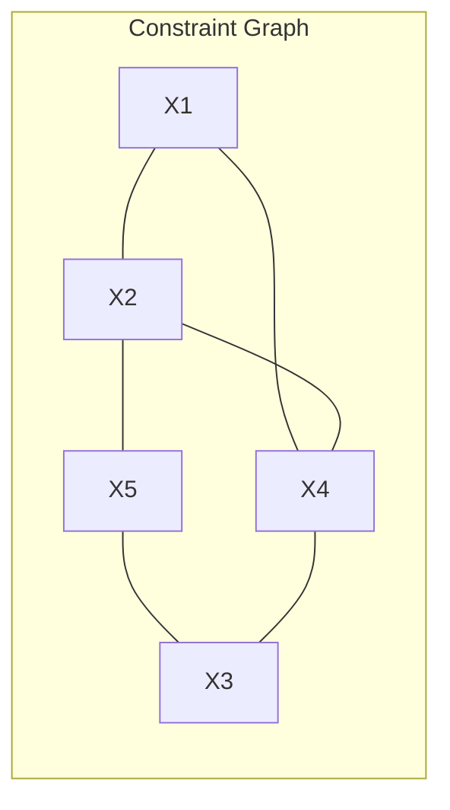

## The Question

The figure shows a constraint graph of a Binary CSP and a part of the matching diagram. When a pair of variables (like, X1 and X5) do not have a constraint in the constraint graph then assume a **UNIVERSAL RELATION** in the matching diagram.

Process the variables, and their values, in **ALPHABETIC order**.

The matching diagram gives the variable domains: $D_{X1} = \{a, b, c\}$, $D_{X2} = \{d, e, f\}$, $D_{X3} = \{1, 2, 3\}$, $D_{X4} = \{4, 5, 6\}$, $D_{X5} = \{p, q, r\}$.

| # | Question | Official answer |
|---|----------|-----------------|
| 8.1 | The Forward-Checking algorithm begins by assigning X1=a. What are the NEXT four values assigned to variables by the Forward-Checking algorithm? List the valu... | `d,e,1,2` / `e,2,5,p` |
| 8.2 | What is the first solution found by the Forward-Checking algorithm? | `a,e,2,5,p` |

## The Topic in 60 Seconds

| Idea | Rule |
|---|---|
| Variable order | fixed here: $X1 \to X2 \to X3 \to X4 \to X5$ |
| Value order | alphabetic inside each domain: $d < e < f$, $1 < 2 < 3$, $4 < 5 < 6$, $p < q < r$ |
| Binding rule | a value may be assigned only if it is consistent with ALL already-assigned neighbours |
| Forward check | after every binding, delete from each unassigned neighbour's domain every value inconsistent with the new assignment; an emptied domain = instant backtrack |

> Deep-dive: browse the [Concepts](/concepts) section for forward checking.

## Solutions

### The run

| Step | Action | Forward-check outcome |
|---|---|---|
| 1 | assign $X1 = a$ | strike values of $X2$ and $X4$ incompatible with $a$; no domain empties |
| 2 | assign $X2 = d$ | $d$ is compatible with $a$, so it binds — but the revision leaves **some future domain empty** → dead end detected immediately, undo $d$ |
| 3 | assign $X2 = e$ | revisions keep every future domain non-empty → descend |
| 4 | assign $X3 = 1$ | $X3$ has no assigned neighbour, so 1 binds — but forward checking over arcs $X4\!-\!X3$ / $X5\!-\!X3$ empties **some future domain** → dead end, undo 1 |
| 5 | assign $X3 = 2$ | all future domains survive |
| 6 | candidate $X4 = 4$ | rejected *before* counting as an assignment: $(4,\ X3{=}2)$ breaks the matching-diagram relation on arc $X4\!-\!X3$ (proof: if 4 survived, the first solution would be `a,e,2,4,p`, contradicting 8.2) |
| 7 | assign $X4 = 5$ | consistent with $a$, $e$, $2$ → descend |
| 8 | assign $X5 = p$ | **complete**: $(a, e, 2, 5, p)$ — first solution |

### 8.1 → `d,e,1,2` / `e,2,5,p`

Both printed answers describe the same run, counted two ways:

- **Counting every binding attempt** after $X1=a$: $d$ (instant fail), $e$, $1$ (instant fail), $2$ → **`d,e,1,2`**.
- **Counting only bindings that stick** (no immediate wipeout): $e$, $2$, $5$, $p$ → **`e,2,5,p`** — exactly the tail of the final solution.

**Answer:** `d,e,1,2` / `e,2,5,p`

### 8.2 → `a,e,2,5,p`

The first complete consistent assignment reached by the run above: $X1=a,\ X2=e,\ X3=2,\ X4=5,\ X5=p$.

**Answer:** `a,e,2,5,p`

## Interactive FC trace

Each step shows the binding made and the exact reason the search advances or retreats.

<StepGraph
  height={230}
  nodeWidth={120}
  nodeHeight={50}
  nodeFontSize={12}
  legend={[
    { color: "#b45309", label: "binding just made" },
    { color: "#7f1d1d", label: "bound then wiped out / rejected" },
    { color: "#0369a1", label: "binding that stuck" },
    { color: "#4b5563", label: "untouched yet" },
    { color: "#15803d", label: "solution" },
  ]}
  steps={[
    {
      label: "Init",
      note: "Domains:\nX1 = {a,b,c}   X2 = {d,e,f}   X3 = {1,2,3}\nX4 = {4,5,6}   X5 = {p,q,r}",
      elements: [
        { data: { id: "x1", label: "X1: a,b,c", type: "unassigned" }, position: { x: 80, y: 90 } },
        { data: { id: "x2", label: "X2: d,e,f", type: "unassigned" }, position: { x: 265, y: 90 } },
        { data: { id: "x3", label: "X3: 1,2,3", type: "unassigned" }, position: { x: 450, y: 90 } },
        { data: { id: "x4", label: "X4: 4,5,6", type: "unassigned" }, position: { x: 635, y: 90 } },
        { data: { id: "x5", label: "X5: p,q,r", type: "unassigned" }, position: { x: 820, y: 90 } },
      ],
    },
    {
      label: "X1 = a",
      note: "Assign X1 = a (given).\nForward check arcs X1-X2 and X1-X4:\nstrike X2/X4 values incompatible with a. No wipeout.",
      elements: [
        { data: { id: "x1", label: "X1 = a", type: "current" }, position: { x: 80, y: 90 } },
        { data: { id: "x2", label: "X2: d,e,f", type: "unassigned" }, position: { x: 265, y: 90 } },
        { data: { id: "x3", label: "X3: 1,2,3", type: "unassigned" }, position: { x: 450, y: 90 } },
        { data: { id: "x4", label: "X4: 4,5,6", type: "unassigned" }, position: { x: 635, y: 90 } },
        { data: { id: "x5", label: "X5: p,q,r", type: "unassigned" }, position: { x: 820, y: 90 } },
      ],
    },
    {
      label: "X2 = d fails",
      note: "d is compatible with a -> binds.\nBut forward checking empties some future domain\n-> dead end detected AT ONCE, undo d.",
      elements: [
        { data: { id: "x1", label: "X1 = a", type: "explored" }, position: { x: 80, y: 90 } },
        { data: { id: "x2", label: "X2 = d wiped", type: "pruned" }, position: { x: 265, y: 90 } },
        { data: { id: "x3", label: "X3: 1,2,3", type: "unassigned" }, position: { x: 450, y: 90 } },
        { data: { id: "x4", label: "X4: 4,5,6", type: "unassigned" }, position: { x: 635, y: 90 } },
        { data: { id: "x5", label: "X5: p,q,r", type: "unassigned" }, position: { x: 820, y: 90 } },
      ],
    },
    {
      label: "X2 = e",
      note: "Next value in alphabetic order: X2 = e.\nRevisions leave every future domain non-empty -> descend.",
      elements: [
        { data: { id: "x1", label: "X1 = a", type: "explored" }, position: { x: 80, y: 90 } },
        { data: { id: "x2", label: "X2 = e", type: "current" }, position: { x: 265, y: 90 } },
        { data: { id: "x3", label: "X3: 1,2,3", type: "unassigned" }, position: { x: 450, y: 90 } },
        { data: { id: "x4", label: "X4: 4,5,6", type: "unassigned" }, position: { x: 635, y: 90 } },
        { data: { id: "x5", label: "X5: p,q,r", type: "unassigned" }, position: { x: 820, y: 90 } },
      ],
    },
    {
      label: "X3 = 1 fails",
      note: "X3 has NO assigned neighbour, so 1 binds freely.\nForward check over X4-X3 and X5-X3:\nsome future domain empties -> dead end, undo 1.",
      elements: [
        { data: { id: "x1", label: "X1 = a", type: "explored" }, position: { x: 80, y: 90 } },
        { data: { id: "x2", label: "X2 = e", type: "explored" }, position: { x: 265, y: 90 } },
        { data: { id: "x3", label: "X3 = 1 wiped", type: "pruned" }, position: { x: 450, y: 90 } },
        { data: { id: "x4", label: "X4: ...", type: "unassigned" }, position: { x: 635, y: 90 } },
        { data: { id: "x5", label: "X5: ...", type: "unassigned" }, position: { x: 820, y: 90 } },
      ],
    },
    {
      label: "X3 = 2",
      note: "Backtrack to X3 = 2.\nAll future domains survive -> descend.",
      elements: [
        { data: { id: "x1", label: "X1 = a", type: "explored" }, position: { x: 80, y: 90 } },
        { data: { id: "x2", label: "X2 = e", type: "explored" }, position: { x: 265, y: 90 } },
        { data: { id: "x3", label: "X3 = 2", type: "current" }, position: { x: 450, y: 90 } },
        { data: { id: "x4", label: "X4: 4,5,6", type: "unassigned" }, position: { x: 635, y: 90 } },
        { data: { id: "x5", label: "X5: p,q,r", type: "unassigned" }, position: { x: 820, y: 90 } },
      ],
    },
    {
      label: "X4 = 4 rejected",
      note: "Candidate 4 never becomes an assignment:\n(4, X3=2) breaks the matching-diagram relation on arc X4-X3.\n(Check: had 4 survived, the solution would be a,e,2,4,p - not the key.)",
      elements: [
        { data: { id: "x1", label: "X1 = a", type: "explored" }, position: { x: 80, y: 90 } },
        { data: { id: "x2", label: "X2 = e", type: "explored" }, position: { x: 265, y: 90 } },
        { data: { id: "x3", label: "X3 = 2", type: "explored" }, position: { x: 450, y: 90 } },
        { data: { id: "x4", label: "X4: 4 reject", type: "pruned" }, position: { x: 635, y: 90 } },
        { data: { id: "x5", label: "X5: p,q,r", type: "unassigned" }, position: { x: 820, y: 90 } },
      ],
    },
    {
      label: "X4 = 5",
      note: "X4 = 5 is consistent with X1=a, X2=e, X3=2.\nBind it and move on.",
      elements: [
        { data: { id: "x1", label: "X1 = a", type: "explored" }, position: { x: 80, y: 90 } },
        { data: { id: "x2", label: "X2 = e", type: "explored" }, position: { x: 265, y: 90 } },
        { data: { id: "x3", label: "X3 = 2", type: "explored" }, position: { x: 450, y: 90 } },
        { data: { id: "x4", label: "X4 = 5", type: "current" }, position: { x: 635, y: 90 } },
        { data: { id: "x5", label: "X5: p,q,r", type: "unassigned" }, position: { x: 820, y: 90 } },
      ],
    },
    {
      label: "Solution",
      note: "X5 = p completes the CSP.\nFIRST SOLUTION: (a, e, 2, 5, p)\nBinding attempts after a: d(fail), e, 1(fail), 2, [4 rejected], 5, p\nNext four ASSIGNED = d,e,1,2\nNext four that STICK  = e,2,5,p",
      elements: [
        { data: { id: "x1", label: "X1 = a", type: "goal" }, position: { x: 80, y: 90 } },
        { data: { id: "x2", label: "X2 = e", type: "goal" }, position: { x: 265, y: 90 } },
        { data: { id: "x3", label: "X3 = 2", type: "goal" }, position: { x: 450, y: 90 } },
        { data: { id: "x4", label: "X4 = 5", type: "goal" }, position: { x: 635, y: 90 } },
        { data: { id: "x5", label: "X5 = p", type: "goal" }, position: { x: 820, y: 90 } },
      ],
    },
  ]}
/>

## Tricks & Tips

<Accordion title="Exam shortcuts">
1. Write the arc list above the trace (X1-X2, X1-X4, X2-X4, X2-X5, X4-X3, X5-X3). A variable with no assigned neighbour (X3 at step 4) accepts ANY value - its failure can only surface through forward checking.
2. Distinguish the two failure modes: a value REJECTED against the past (X4=4) is not an assignment; a value BOUND then undone by a wipeout (d, then 1) is. That distinction is exactly why the key prints two answers for 8.1.
3. Wipeout logic lets you verify without the full diagram: if a binding did NOT fail, the search walks on - so the official solution string itself tells you which candidates must have died.
4. Always re-read the final tuple against every arc before submitting: a-e, a-5, e-5, e-p, p-2, 5-2 must each sit in the matching diagram.
</Accordion>

**Answers:** 8.1 `d,e,1,2` / `e,2,5,p` · 8.2 `a,e,2,5,p`
