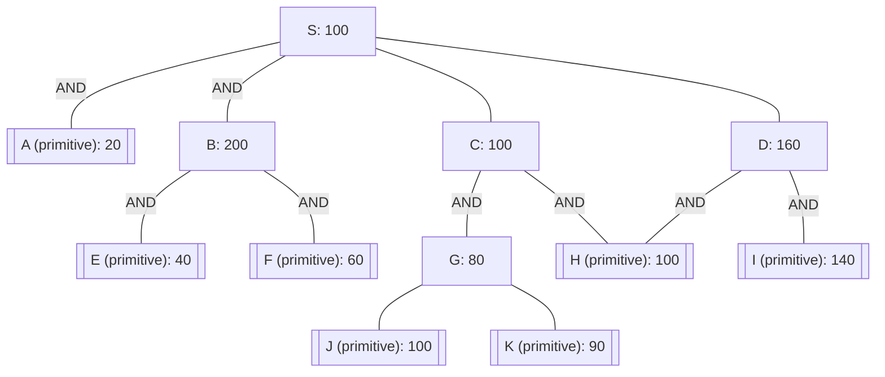

## The Question

The figure shows an AND-OR graph that depicts how a problem $S$ can be decomposed and transformed into one or more simpler problems. Nodes are uniquely identified by labels ($S, A, B, \dots$). The number in each node is the heuristic estimate of the cost of solving that node.

Nodes with double lines are primitive nodes and their values are actual costs. Observe that a primitive node is added to the graph by its parent when the parent is expanded, and the primitive node is labeled as **SOLVED** and it will not be expanded subsequently.

- **Tie-breaker 1**: For nodes with the same cost, expand in the ascending order of node labels.
- **Tie-breaker 2**: For AND nodes, expand the unsolved branch with the highest cost.
- Each edge has a unit cost. Solve for $S$.

| # | Question | Official answer |
|---|----------|-----------------|
| 9.1 | List the first three nodes (including S) expanded by AO* algorithm. List the nodes in the order they are expanded. Observe that primitive nodes are not expan... | `S,C,D` / `S,C,D,G` |
| 9.2 | Determine the value of the start node S after each node expansion. List the first three values of S that correspond to the first three node expansions. | `101,161,183` / `101,161,183,194` |
| 9.3 | What is the final value of the start node S? | `194` |
| 9.4 | In the given AND-OR graph, is the heuristic admissible? | **A** |

## The Topic in 60 Seconds

AO* maintains one cost per node and always expands the cheapest unsolved non-primitive leaf lying on S's current best partial solution graph:

$$\text{cost}(n) = \begin{cases} \text{actual given value} & n \text{ primitive (leaf)} \\ h(n) & n \text{ non-primitive leaf} \\ \min_{c}\big(1 + \text{cost}(c)\big) & n \text{ OR node} \\ \sum_{c}\big(1 + \text{cost}(c)\big) & n \text{ AND node} \end{cases}$$

After expanding a leaf, back the new costs up to S and re-pick. Terminate when the best solution graph contains only solved/primitive nodes.

> Deep-dive: browse the [Concepts](/concepts) section for AO* search.

## Solutions

### The run, expansion by expansion

**Expansion 1 — S.** Price S's three options from leaf estimates:

| Option | Arithmetic | Cost |
|---|---|---|
| AND branch $(A, B)$ | $(1+20) + (1+200)$ | 222 |
| OR via C | $1 + 100$ | **101** ← best |
| OR via D | $1 + 160$ | 161 |

$\text{value}(S) = 101$, best child C.

**Expansion 2 — C** (cheapest leaf on S's best graph). C is AND of $G$ (still a leaf: $h=80$) and $H$ (primitive 100):

$$\text{cost}(C) = (1+80) + (1+100) = 81 + 101 = 182$$

Back-up: $S = \min(\underbrace{222}_{\text{AND}},\ \underbrace{1+182}_{183},\ \underbrace{161}_{\text{OR }D}) = 161$ → best flips to **D**.

**Expansion 3 — D.** D is AND of primitives $I$ (140) and $H$ (100):

$$\text{cost}(D) = (1+140) + (1+100) = 141 + 101 = 242$$

Back-up: $S = \min(222,\ 183,\ 242) = 183$ → best returns to **C**.

**Expansion 4 — G** (the only expandable leaf left on S's best graph; H, I are primitive). G is OR of leaves $J$ (100), $K$ (90), plus its own estimate 80:

$$\text{cost}(G) = \min(80,\ 1+100,\ 1+90) = \min(80, 101, 91) = 91 \ \text{via } K$$

Back-up: $\text{cost}(C) = (1+91) + (1+100) = 92 + 101 = 193$, so $S = 1 + 193 = 194$. The chain $K \Rightarrow G \Rightarrow C \Rightarrow S$ is now entirely solved/primitive → **terminate**.

### Answers

**9.1** — Expansion order: **`S, C, D`** (continuing: `S, C, D, G`). No ties ever arose, so both tie-breakers stay idle. Primitives A, E, F, H, I are never expanded by rule.

**Answer:** `S,C,D` / `S,C,D,G`

**9.2** — Value of S after each of the first three expansions: **`101, 161, 183`** (fourth gives 194).

**Answer:** `101,161,183` / `101,161,183,194`

**9.3** — Final value of S: **`194`**

True cost check along the returned solution: $1_{(S,C)} + \big[(1 + (1 + 90))_{G \text{ via } K} + (1 + 100)_{H}\big] = 1 + 92 + 101 = 194$ ✓

**Answer:** `194`

**9.4** — Is the heuristic admissible? → **A (No)**

Admissibility requires $h(n) \le h^*(n)$ for every non-primitive node. Test B: its true solve cost is

$$h^*(B) = (1 + 40)_{E} + (1 + 60)_{F} = 41 + 61 = 102 \;<\; h(B) = 200$$

A 98-unit overestimate → the heuristic is **not admissible**. (The other estimates behave: $h^*(G) = 91 \ge 80$, $h^*(C) = 193 \ge 100$, $h^*(D) = 242 \ge 160$, $h^*(S) = 194 \ge 100$.)

**Answer:** **A**

## Interactive AO* trace

Each step shows the expansion, exact arithmetic, and how S's backed-up value moves: 101 → 161 → 183 → 194.

<StepGraph
  height={480}
  nodeWidth={110}
  nodeHeight={52}
  nodeFontSize={12}
  legend={[
    { color: "#b45309", label: "expanding now" },
    { color: "#0369a1", label: "on current best path" },
    { color: "#4b5563", label: "expanded / settled" },
    { color: "#7f1d1d", label: "primitive (never expanded)" },
    { color: "#15803d", label: "solved solution graph" },
  ]}
  steps={[
    {
      label: "Init",
      note: "Options for S (edge cost 1 each):\nAND(A,B): (1+20) + (1+200) = 222\nOR  C   : 1 + 100 = 101  <- best\nOR  D   : 1 + 160 = 161",
      elements: [
        { data: { id: "S", label: "S 100", type: "frontier" }, position: { x: 340, y: 30 } },
        { data: { id: "A", label: "A 20", type: "primitive" }, position: { x: 70, y: 155 } },
        { data: { id: "B", label: "B 200", type: "unassigned" }, position: { x: 215, y: 155 } },
        { data: { id: "C", label: "C 100", type: "unassigned" }, position: { x: 420, y: 155 } },
        { data: { id: "D", label: "D 160", type: "unassigned" }, position: { x: 640, y: 155 } },
        { data: { id: "E", label: "E 40", type: "primitive" }, position: { x: 115, y: 285 } },
        { data: { id: "F", label: "F 60", type: "primitive" }, position: { x: 255, y: 285 } },
        { data: { id: "G", label: "G 80", type: "unassigned" }, position: { x: 380, y: 285 } },
        { data: { id: "H", label: "H 100", type: "primitive" }, position: { x: 530, y: 285 } },
        { data: { id: "I", label: "I 140", type: "primitive" }, position: { x: 700, y: 285 } },
        { data: { id: "J", label: "J 100", type: "primitive" }, position: { x: 315, y: 415 } },
        { data: { id: "K", label: "K 90", type: "primitive" }, position: { x: 450, y: 415 } },
        { data: { id: "eSA", source: "S", target: "A", label: "AND" } },
        { data: { id: "eSB", source: "S", target: "B", label: "AND" } },
        { data: { id: "eSC", source: "S", target: "C" } },
        { data: { id: "eSD", source: "S", target: "D" } },
        { data: { id: "eBE", source: "B", target: "E", label: "AND" } },
        { data: { id: "eBF", source: "B", target: "F", label: "AND" } },
        { data: { id: "eCG", source: "C", target: "G", label: "AND" } },
        { data: { id: "eCH", source: "C", target: "H", label: "AND" } },
        { data: { id: "eDI", source: "D", target: "I", label: "AND" } },
        { data: { id: "eDH", source: "D", target: "H", label: "AND" } },
        { data: { id: "eGJ", source: "G", target: "J" } },
        { data: { id: "eGK", source: "G", target: "K" } },
      ],
    },
    {
      label: "Expand S: 101",
      note: "Expand S -> back up:\nvalue(S) = min(222, 101, 161) = 101 via C\nNext target: leaf C (estimate 100).",
      elements: [
        { data: { id: "S", label: "S 101", type: "explored" }, position: { x: 340, y: 30 } },
        { data: { id: "A", label: "A 20", type: "primitive" }, position: { x: 70, y: 155 } },
        { data: { id: "B", label: "B 200", type: "unassigned" }, position: { x: 215, y: 155 } },
        { data: { id: "C", label: "C 100", type: "current" }, position: { x: 420, y: 155 } },
        { data: { id: "D", label: "D 160", type: "unassigned" }, position: { x: 640, y: 155 } },
        { data: { id: "E", label: "E 40", type: "primitive" }, position: { x: 115, y: 285 } },
        { data: { id: "F", label: "F 60", type: "primitive" }, position: { x: 255, y: 285 } },
        { data: { id: "G", label: "G 80", type: "unassigned" }, position: { x: 380, y: 285 } },
        { data: { id: "H", label: "H 100", type: "primitive" }, position: { x: 530, y: 285 } },
        { data: { id: "I", label: "I 140", type: "primitive" }, position: { x: 700, y: 285 } },
        { data: { id: "J", label: "J 100", type: "primitive" }, position: { x: 315, y: 415 } },
        { data: { id: "K", label: "K 90", type: "primitive" }, position: { x: 450, y: 415 } },
        { data: { id: "eSA", source: "S", target: "A", label: "AND" } },
        { data: { id: "eSB", source: "S", target: "B", label: "AND" } },
        { data: { id: "eSC", source: "S", target: "C", type: "active" } },
        { data: { id: "eSD", source: "S", target: "D" } },
        { data: { id: "eBE", source: "B", target: "E", label: "AND" } },
        { data: { id: "eBF", source: "B", target: "F", label: "AND" } },
        { data: { id: "eCG", source: "C", target: "G", label: "AND" } },
        { data: { id: "eCH", source: "C", target: "H", label: "AND" } },
        { data: { id: "eDI", source: "D", target: "I", label: "AND" } },
        { data: { id: "eDH", source: "D", target: "H", label: "AND" } },
        { data: { id: "eGJ", source: "G", target: "J" } },
        { data: { id: "eGK", source: "G", target: "K" } },
      ],
    },
    {
      label: "Expand C: S=161",
      note: "C is AND(G,H): (1+80) + (1+100) = 81 + 101 = 182\nBack up: S = min(222, 1+182=183, 161) = 161\nBest route flips to D.",
      elements: [
        { data: { id: "S", label: "S 161", type: "explored" }, position: { x: 340, y: 30 } },
        { data: { id: "A", label: "A 20", type: "primitive" }, position: { x: 70, y: 155 } },
        { data: { id: "B", label: "B 200", type: "unassigned" }, position: { x: 215, y: 155 } },
        { data: { id: "C", label: "C 182", type: "explored" }, position: { x: 420, y: 155 } },
        { data: { id: "D", label: "D 160", type: "current" }, position: { x: 640, y: 155 } },
        { data: { id: "E", label: "E 40", type: "primitive" }, position: { x: 115, y: 285 } },
        { data: { id: "F", label: "F 60", type: "primitive" }, position: { x: 255, y: 285 } },
        { data: { id: "G", label: "G 80", type: "unassigned" }, position: { x: 380, y: 285 } },
        { data: { id: "H", label: "H 100", type: "primitive" }, position: { x: 530, y: 285 } },
        { data: { id: "I", label: "I 140", type: "primitive" }, position: { x: 700, y: 285 } },
        { data: { id: "J", label: "J 100", type: "primitive" }, position: { x: 315, y: 415 } },
        { data: { id: "K", label: "K 90", type: "primitive" }, position: { x: 450, y: 415 } },
        { data: { id: "eSA", source: "S", target: "A", label: "AND" } },
        { data: { id: "eSB", source: "S", target: "B", label: "AND" } },
        { data: { id: "eSC", source: "S", target: "C" } },
        { data: { id: "eSD", source: "S", target: "D", type: "active" } },
        { data: { id: "eBE", source: "B", target: "E", label: "AND" } },
        { data: { id: "eBF", source: "B", target: "F", label: "AND" } },
        { data: { id: "eCG", source: "C", target: "G", label: "AND" } },
        { data: { id: "eCH", source: "C", target: "H", label: "AND" } },
        { data: { id: "eDI", source: "D", target: "I", label: "AND" } },
        { data: { id: "eDH", source: "D", target: "H", label: "AND" } },
        { data: { id: "eGJ", source: "G", target: "J" } },
        { data: { id: "eGK", source: "G", target: "K" } },
      ],
    },
    {
      label: "Expand D: S=183",
      note: "D is AND(I,H): (1+140) + (1+100) = 141 + 101 = 242\nBack up: S = min(222, 183, 242) = 183\nBest route returns to C -> next leaf to expand: G.",
      elements: [
        { data: { id: "S", label: "S 183", type: "explored" }, position: { x: 340, y: 30 } },
        { data: { id: "A", label: "A 20", type: "primitive" }, position: { x: 70, y: 155 } },
        { data: { id: "B", label: "B 200", type: "unassigned" }, position: { x: 215, y: 155 } },
        { data: { id: "C", label: "C 182", type: "unassigned" }, position: { x: 420, y: 155 } },
        { data: { id: "D", label: "D 242", type: "explored" }, position: { x: 640, y: 155 } },
        { data: { id: "E", label: "E 40", type: "primitive" }, position: { x: 115, y: 285 } },
        { data: { id: "F", label: "F 60", type: "primitive" }, position: { x: 255, y: 285 } },
        { data: { id: "G", label: "G 80", type: "current" }, position: { x: 380, y: 285 } },
        { data: { id: "H", label: "H 100", type: "primitive" }, position: { x: 530, y: 285 } },
        { data: { id: "I", label: "I 140", type: "primitive" }, position: { x: 700, y: 285 } },
        { data: { id: "J", label: "J 100", type: "primitive" }, position: { x: 315, y: 415 } },
        { data: { id: "K", label: "K 90", type: "primitive" }, position: { x: 450, y: 415 } },
        { data: { id: "eSA", source: "S", target: "A", label: "AND" } },
        { data: { id: "eSB", source: "S", target: "B", label: "AND" } },
        { data: { id: "eSC", source: "S", target: "C", type: "active" } },
        { data: { id: "eSD", source: "S", target: "D" } },
        { data: { id: "eBE", source: "B", target: "E", label: "AND" } },
        { data: { id: "eBF", source: "B", target: "F", label: "AND" } },
        { data: { id: "eCG", source: "C", target: "G", label: "AND", type: "active" } },
        { data: { id: "eCH", source: "C", target: "H", label: "AND", type: "active" } },
        { data: { id: "eDI", source: "D", target: "I", label: "AND" } },
        { data: { id: "eDH", source: "D", target: "H", label: "AND" } },
        { data: { id: "eGJ", source: "G", target: "J" } },
        { data: { id: "eGK", source: "G", target: "K" } },
      ],
    },
    {
      label: "Expand G: S=194",
      note: "G is OR: min(h=80, 1+J=101, 1+K=91) = 91 via K\nBack up: C = (1+91) + (1+100) = 92 + 101 = 193\nS = 1 + 193 = 194. K solved -> G, C, S solved. STOP.",
      elements: [
        { data: { id: "S", label: "S 194", type: "explored" }, position: { x: 340, y: 30 } },
        { data: { id: "A", label: "A 20", type: "primitive" }, position: { x: 70, y: 155 } },
        { data: { id: "B", label: "B 200", type: "pruned" }, position: { x: 215, y: 155 } },
        { data: { id: "C", label: "C 193", type: "explored" }, position: { x: 420, y: 155 } },
        { data: { id: "D", label: "D 242", type: "pruned" }, position: { x: 640, y: 155 } },
        { data: { id: "E", label: "E 40", type: "primitive" }, position: { x: 115, y: 285 } },
        { data: { id: "F", label: "F 60", type: "primitive" }, position: { x: 255, y: 285 } },
        { data: { id: "G", label: "G 91", type: "explored" }, position: { x: 380, y: 285 } },
        { data: { id: "H", label: "H 100", type: "primitive" }, position: { x: 530, y: 285 } },
        { data: { id: "I", label: "I 140", type: "primitive" }, position: { x: 700, y: 285 } },
        { data: { id: "J", label: "J 100", type: "primitive" }, position: { x: 315, y: 415 } },
        { data: { id: "K", label: "K 90", type: "current" }, position: { x: 450, y: 415 } },
        { data: { id: "eSA", source: "S", target: "A", label: "AND" } },
        { data: { id: "eSB", source: "S", target: "B", label: "AND" } },
        { data: { id: "eSC", source: "S", target: "C", type: "active" } },
        { data: { id: "eSD", source: "S", target: "D" } },
        { data: { id: "eBE", source: "B", target: "E", label: "AND" } },
        { data: { id: "eBF", source: "B", target: "F", label: "AND" } },
        { data: { id: "eCG", source: "C", target: "G", label: "AND", type: "active" } },
        { data: { id: "eCH", source: "C", target: "H", label: "AND", type: "active" } },
        { data: { id: "eDI", source: "D", target: "I", label: "AND" } },
        { data: { id: "eDH", source: "D", target: "H", label: "AND" } },
        { data: { id: "eGJ", source: "G", target: "J" } },
        { data: { id: "eGK", source: "G", target: "K", type: "active" } },
      ],
    },
    {
      label: "Solved: 194",
      note: "Solution graph: S -> C -> { G -> K , H }\nTrue cost: 1 + [(1 + 1 + 90) + (1 + 100)] = 1 + 92 + 101 = 194\nAdmissibility: h*(B) = (1+40) + (1+60) = 102 < h(B) = 200\n-> heuristic NOT admissible (answer A).",
      elements: [
        { data: { id: "S", label: "S 194", type: "solved" }, position: { x: 340, y: 30 } },
        { data: { id: "A", label: "A 20", type: "primitive" }, position: { x: 70, y: 155 } },
        { data: { id: "B", label: "B 200", type: "pruned" }, position: { x: 215, y: 155 } },
        { data: { id: "C", label: "C 193", type: "solved" }, position: { x: 420, y: 155 } },
        { data: { id: "D", label: "D 242", type: "pruned" }, position: { x: 640, y: 155 } },
        { data: { id: "E", label: "E 40", type: "primitive" }, position: { x: 115, y: 285 } },
        { data: { id: "F", label: "F 60", type: "primitive" }, position: { x: 255, y: 285 } },
        { data: { id: "G", label: "G 91", type: "solved" }, position: { x: 380, y: 285 } },
        { data: { id: "H", label: "H 100", type: "primitive" }, position: { x: 530, y: 285 } },
        { data: { id: "I", label: "I 140", type: "primitive" }, position: { x: 700, y: 285 } },
        { data: { id: "J", label: "J 100", type: "primitive" }, position: { x: 315, y: 415 } },
        { data: { id: "K", label: "K 90", type: "solved" }, position: { x: 450, y: 415 } },
        { data: { id: "eSA", source: "S", target: "A", label: "AND" } },
        { data: { id: "eSB", source: "S", target: "B", label: "AND" } },
        { data: { id: "eSC", source: "S", target: "C", type: "path" } },
        { data: { id: "eSD", source: "S", target: "D" } },
        { data: { id: "eBE", source: "B", target: "E", label: "AND" } },
        { data: { id: "eBF", source: "B", target: "F", label: "AND" } },
        { data: { id: "eCG", source: "C", target: "G", label: "AND", type: "path" } },
        { data: { id: "eCH", source: "C", target: "H", label: "AND", type: "path" } },
        { data: { id: "eDI", source: "D", target: "I", label: "AND" } },
        { data: { id: "eDH", source: "D", target: "H", label: "AND" } },
        { data: { id: "eGJ", source: "G", target: "J" } },
        { data: { id: "eGK", source: "G", target: "K", type: "path" } },
      ],
    },
  ]}
/>

## Tricks & Tips

<Accordion title="Exam shortcuts">
1. Price EVERY child of the root before expanding anything: 222 vs 101 vs 161 takes thirty seconds and fixes the whole trace.
2. Expansion rule: cheapest NON-PRIMITIVE leaf on S's current best graph. H sitting beside G at cost 100 is never touched - it is primitive.
3. Backups can flip the route: expanding C pushed S UP to 161 and handed control to D; expanding D pushed it to 183 and handed it back to C. Expect oscillation, not monotone descent.
4. AND-node arithmetic: sum of (1 + child); OR-node: min of (1 + child). Mixing these two is the single most common exam slip.
5. For admissibility, hunt the most OVERESTIMATED node: B looks expensive (200) but dissolves into two cheap primitives (102). One counterexample settles "No".
</Accordion>

**Answers:** 9.1 `S,C,D` / `S,C,D,G` · 9.2 `101,161,183` / `101,161,183,194` · 9.3 `194` · 9.4 **A**
