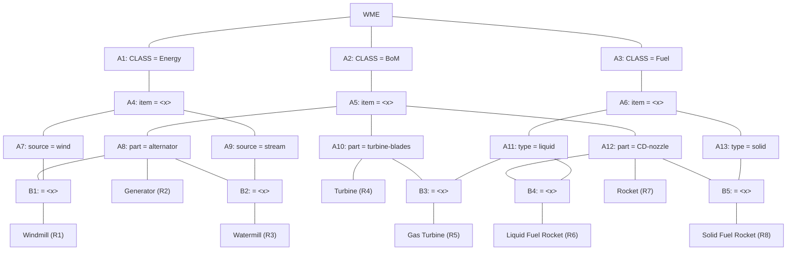

## The Question

A Rete Net for classification of machines is given. The labels A1, A2, A3, ..., A13, B1, ..., B5, R1, ..., R8 uniquely identify the nodes in the network. When required, use label ordering to break ties.

Run the Rete algorithm for the Working Memory shown below, where the WMEs are in timestamp order:
- `101.` (Fuel ^item machine5 ^type solid)
- `102.` (Fuel ^item machine2 ^type liquid)
- `103.` (Fuel ^item machine3)
- `104.` (BoM ^item machine4 ^part alternator)
- `105.` (Energy ^item machine4 ^source wind)
- `106.` (BoM ^item machine3 ^part alternator)
- `107.` (BoM ^item machine1 ^part CD-nozzle)

| # | Question | Official answer |
|---|----------|-----------------|
| 10.1 | Which of the following rule-data tuples are in the conflict-set? | **A**, **B**, **C**, **D** |
| 10.2 | If the Inference Engine uses Specificity as the conflict resolution strategy then identify the rule-data tuples that will be ready to fire. If multiple rule-... | `R1,104,105` / `R1,105,104` |
| 10.3 | If the Inference Engine uses Recency as the conflict resolution strategy then identify the rule-data tuples that will be ready to fire. If multiple rule-data... | `R7,107` |

## The Topic in 60 Seconds

> Deep-dive: browse the [Concepts](/concepts) section for the relevant topic page.

## Solutions

**10.1** — Which of the following rule-data tuples are in the conflict-set?

Options:

| Option | |
|---|---|
| **A** | R1,104,105 |
| **B** | R2,104 |
| **C** | R2,106 |
| **D** | R7,107 |
| **E** | R1,104,106 |
| **F** | R3,104,106 |
| **G** | R6,102,107 |

**Answer:** **A**, **B**, **C**, **D**

**10.2** — If the Inference Engine uses Specificity as the conflict resolution strategy then identify the rule-data tuples that will be ready to fire. If multiple rule-data tuples qualify then choose one.

**Answer:** `R1,104,105` / `R1,105,104`

**10.3** — If the Inference Engine uses Recency as the conflict resolution strategy then identify the rule-data tuples that will be ready to fire. If multiple rule-data tuples qualify then choose one.

**Answer:** `R7,107`

## Tricks & Tips

<Accordion title="Exam method">
1. Read the question carefully — identify the algorithm or technique.
2. Trace step by step, showing your working.
3. Verify your answer against the question constraints.
</Accordion>
