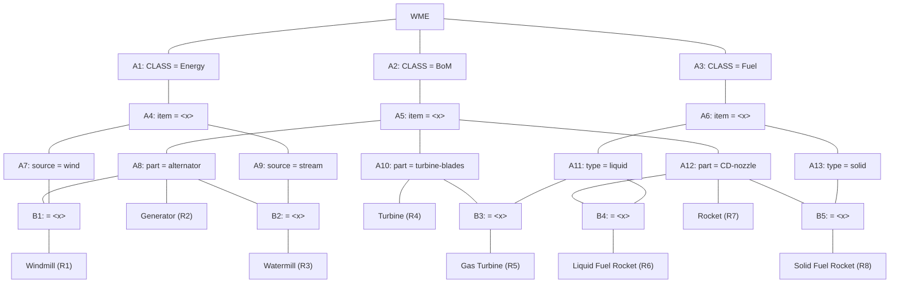

## The Question

A Rete Net for classification of machines is given. The labels A1, A2, A3, ..., A13, B1, ..., B5, R1, ..., R8 uniquely identify the nodes in the network. When required, use label ordering to break ties.

Run the Rete algorithm for the Working Memory shown below, where the WMEs are in timestamp order:
- `101.` (Fuel ^item machine5 ^type solid)
- `102.` (Fuel ^item machine2 ^type liquid)
- `103.` (Fuel ^item machine3)
- `104.` (BoM ^item machine4 ^part alternator)
- `105.` (Energy ^item machine4 ^source wind)
- `106.` (BoM ^item machine3 ^part alternator)
- `107.` (BoM ^item machine1 ^part CD-nozzle)

| # | Question | Official answer |
|---|----------|-----------------|
| 10.1 | Which of the following rule-data tuples are in the conflict-set? | **A**, **B**, **C**, **D** |
| 10.2 | If the Inference Engine uses Specificity as the conflict resolution strategy then identify the rule-data tuples that will be ready to fire. If multiple rule-... | `R1,104,105` / `R1,105,104` |
| 10.3 | If the Inference Engine uses Recency as the conflict resolution strategy then identify the rule-data tuples that will be ready to fire. If multiple rule-data... | `R7,107` |

## The Topic in 60 Seconds

Rete pushes every WME through two halves of the network:

| Half | Nodes | What they store |
|---|---|---|
| **Alpha net** | A1…A13 | Single-WME constant tests. Each node holds every WME that passed its filter |
| **Beta net** | B1…B5 | Joins between two token streams, matching on shared variables ($\text{item} = \langle x\rangle$) |

A production $R$ fires a **rule-data tuple** $(R, w_1, w_2, \dots)$ when a token reaches it through every one of its conditions. The set of all live tuples = the **conflict set**.

> Deep-dive: browse the [Concepts](/concepts) section for Rule-Based Expert Systems / Rete.

## Step 0 — Alpha net contents after all 7 WMEs

| Alpha node | Test | Tokens held (WME : binding) |
|---|---|---|
| A1 | CLASS = Energy | 105 : $x$ = machine4 |
| A2 | CLASS = BoM | 104, 106, 107 |
| A3 | CLASS = Fuel | 101, 102, 103 |
| A4 | item = $\langle x\rangle$ (under A1) | 105 : $x$ = machine4 |
| A5 | item = $\langle x\rangle$ (under A2) | 104 : $x$ = m4 · 106 : $x$ = m3 · 107 : $x$ = m1 |
| A6 | item = $\langle x\rangle$ (under A3) | 101 : $x$ = m5 · 102 : $x$ = m2 · 103 (no ^type) |
| A7 | source = wind | 105 : $x$ = machine4 |
| A8 | part = alternator | 104 : $x$ = machine4 · 106 : $x$ = machine3 |
| A11 | type = liquid | 102 : $x$ = machine2 |
| A12 | part = CD-nozzle | 107 : $x$ = machine1 |
| A13 | type = solid | 101 : $x$ = machine5 |

Dead branches: **A9** (source = stream) and **A10** (part = turbine-blades) hold *nothing* — so everything downstream of them (B2/B3, R3/R4/R5) can never activate this run.

## Step 1 — Beta joins and rule activations

| Beta / Rule | Join tested | Result |
|---|---|---|
| **B1** (A7 ⋈ A8 on $x$) | A7 has $x$ = m4; A8 has $\{m4, m3\}$ | match at $x$ = m4 → tuple (**R1**, 104, 105) |
| **R2** (A8 alone) | single-condition rule | every A8 token activates it → (**R2**, 104) and (**R2**, 106) |
| **B2** (A9 ⋈ A8) | A9 empty | nothing |
| **B3** (A11 ⋈ A10 on $x$) | A10 empty | nothing |
| **B4** (A11 ⋈ A12 on $x$) | A11: $x$ = m2; A12: $x$ = m1 | **no overlap** → nothing |
| **B5** (A13 ⋈ A12 on $x$) | A13: $x$ = m5; A12: $x$ = m1 | no overlap → nothing |
| **R7** (A12 alone) | single-condition rule | (**R7**, 107) |

### 10.1 — Conflict set → **A, B, C, D**

$$\text{Conflict set} = \{(R1,104,105),\ (R2,104),\ (R2,106),\ (R7,107)\}$$

| Option | Tuple | In conflict set? |
|---|---|---|
| **A** | R1,104,105 | **Yes** — B1 join succeeds at $x$ = machine4 |
| **B** | R2,104 | **Yes** — 104 is an alternator BoM |
| **C** | R2,106 | **Yes** — 106 also passes A8 |
| **D** | R7,107 | **Yes** — 107 is the only CD-nozzle BoM |
| E | R1,104,106 | No — B1 needs Energy+wind for the SAME $x$: machine3 has no Energy WME |
| F | R3,104,106 | No — R3 hangs off A9 (stream), which never fired |
| G | R6,102,107 | No — B4 fails: liquid is machine2, CD-nozzle is machine1 |

### 10.2 — Specificity → `R1,104,105`

Specificity = number of WME patterns (conditions) in the rule; most specific wins.

| Tuple | Rule's conditions | Count |
|---|---|---|
| **R1,104,105** | Energy + source=wind + BoM + part=alternator (+ join) | **4** ← wins |
| R2,104 | BoM + part=alternator | 2 |
| R2,106 | BoM + part=alternator | 2 |
| R7,107 | BoM + part=CD-nozzle | 2 |

### 10.3 — Recency → `R7,107`

Recency compares the sorted timestamp lists of the tuples' WMEs (lexicographic, newest element dominates):

| Tuple | Timestamps | Most recent |
|---|---|---|
| R1,104,105 | 104, 105 | 105 |
| R2,104 | 104 | 104 |
| R2,106 | 106 | 106 |
| **R7,107** | **107** | **107** ← newest overall |

## Interactive trace — WMEs flowing through the net

<PaperTrace
  height={520}
  nodeWidth={110}
  nodeHeight={44}
  nodeFontSize={11}
  legend={[
    { color: "#0f766e", label: "alpha node (constant test)" },
    { color: "#b45309", label: "just activated" },
    { color: "#0369a1", label: "holding tokens" },
    { color: "#15803d", label: "rule in conflict set" },
    { color: "#4b5563", label: "empty" },
  ]}
  nodes={[
    { id: "WME", label: "WM", x: 30, y: 260 },
    { id: "A1", label: "A1 CLASS=Energy", x: 190, y: 100 },
    { id: "A2", label: "A2 CLASS=BoM", x: 190, y: 270 },
    { id: "A3", label: "A3 CLASS=Fuel", x: 190, y: 450 },
    { id: "A4", label: "A4 item=<x>", x: 370, y: 80 },
    { id: "A5", label: "A5 item=<x>", x: 370, y: 250 },
    { id: "A6", label: "A6 item=<x>", x: 370, y: 450 },
    { id: "A7", label: "A7 src=wind", x: 550, y: 30 },
    { id: "A8", label: "A8 part=alternator", x: 550, y: 210 },
    { id: "A11", label: "A11 type=liquid", x: 550, y: 400 },
    { id: "A12", label: "A12 part=CD-nozzle", x: 550, y: 320 },
    { id: "A13", label: "A13 type=solid", x: 550, y: 500 },
    { id: "B1", label: "B1 x=x", x: 720, y: 120 },
    { id: "R1", label: "R1 Windmill", x: 890, y: 120 },
    { id: "R2", label: "R2 Generator", x: 890, y: 230 },
    { id: "R7", label: "R7 Rocket", x: 890, y: 340 },
  ]}
  edges={[
    { id: "w1", from: "WME", to: "A1" },
    { id: "w2", from: "WME", to: "A2" },
    { id: "w3", from: "WME", to: "A3" },
    { id: "e14", from: "A1", to: "A4" },
    { id: "e25", from: "A2", to: "A5" },
    { id: "e36", from: "A3", to: "A6" },
    { id: "e47", from: "A4", to: "A7" },
    { id: "e58", from: "A5", to: "A8" },
    { id: "e5c", from: "A5", to: "A12" },
    { id: "e6l", from: "A6", to: "A11" },
    { id: "e6s", from: "A6", to: "A13" },
    { id: "j1a", from: "A7", to: "B1" },
    { id: "j1b", from: "A8", to: "B1" },
    { id: "r1", from: "B1", to: "R1" },
    { id: "r2", from: "A8", to: "R2" },
    { id: "r7", from: "A12", to: "R7" },
  ]}
  steps={[
    {
      label: "WM empty",
      note: "Working memory starts empty.\nAll alpha nodes and betas hold nothing.",
      nodes: {}, edges: {},
    },
    {
      label: "+101 Fuel solid",
      note: "101 (Fuel item=machine5 type=solid)\nA3 passes (Fuel). A13 passes (type=solid, x=machine5).\nNo rule complete yet.",
      nodes: { WME: "start", A3: "current", A13: "current" }, edges: { w3: "active" },
    },
    {
      label: "+102 Fuel liquid",
      note: "102 (Fuel item=machine2 type=liquid)\nA3 keeps growing; A11 takes it (type=liquid, x=machine2).\nStill no complete rule.",
      nodes: { WME: "start", A3: "frontier", A13: "frontier", A11: "current" }, edges: { w3: "active" },
    },
    {
      label: "+103 Fuel (no type)",
      note: "103 (Fuel item=machine3) - no ^type field.\nOnly A3 accepts it; A11/A13 reject (missing attribute).\nNote: A6 holds it with NO x-type binding.",
      nodes: { WME: "start", A3: "frontier", A13: "explored", A11: "explored" }, edges: {},
    },
    {
      label: "+104 BoM alt m4",
      note: "104 (BoM item=machine4 part=alternator)\nA2 -> A5 (x=machine4) -> A8 (x=machine4).\nR2 is single-condition on A8: tuple (R2,104) enters the conflict set!",
      nodes: { WME: "start", A3: "frontier", A2: "frontier", A5: "current", A8: "current", R2: "path", A11: "explored", A13: "explored" }, edges: { r2: "path" },
    },
    {
      label: "+105 Energy wind",
      note: "105 (Energy item=machine4 source=wind)\nA1 -> A4 (x=machine4) -> A7.\nB1 joins A7(x=m4) with A8(x={m4,m3}): MATCH at x=m4.\nTuple (R1,104,105) enters the conflict set!",
      nodes: { WME: "start", A3: "frontier", A2: "frontier", A5: "frontier", A8: "frontier", A1: "current", A4: "current", A7: "current", B1: "current", R1: "path", R2: "path" }, edges: { r2: "path", r1: "path" },
    },
    {
      label: "+106 BoM alt m3",
      note: "106 (BoM item=machine3 part=alternator)\nA8 gains a SECOND token (x=machine3).\nR2 fires again: (R2,106) joins the conflict set.\nB1 re-check: A7 still only has x=m4 -> no new R1.",
      nodes: { WME: "start", A2: "frontier", A5: "frontier", A8: "current", A1: "frontier", A4: "frontier", A7: "frontier", B1: "frontier", R1: "path", R2: "path" }, edges: { r1: "path", r2: "path" },
    },
    {
      label: "+107 BoM cdnoz m1",
      note: "107 (BoM item=machine1 part=CD-nozzle)\nA5 -> A12 (x=machine1). R7 is single-condition on A12:\n(R7,107) enters the conflict set.\nB4 would need A11(x=m2) vs A12(x=m1) - no match. B5: m5 vs m1 - no match.",
      nodes: { WME: "start", A5: "frontier", A8: "frontier", A7: "frontier", B1: "frontier", A12: "current", R7: "path", R1: "path", R2: "path" }, edges: { r1: "path", r2: "path", r7: "path" },
    },
    {
      label: "Conflict set",
      note: "CONFLICT SET = {(R1,104,105), (R2,104), (R2,106), (R7,107)}\nSpecificity: R1 has 4 conditions > 2 -> R1,104,105 fires.\nRecency: newest timestamp 107 -> R7,107 fires.",
      nodes: { WME: "start", A8: "frontier", A12: "frontier", B1: "frontier", R1: "path", R2: "path", R7: "path" }, edges: { r1: "path", r2: "path", r7: "path" },
    },
  ]}
/>

## Tricks & Tips

<Accordion title="Exam shortcuts">
1. Fill the alpha net first as a table (node → WMEs held). Every beta question is then a tiny set-intersection on $x$-bindings — never re-scan raw WMEs mid-join.
2. Missing attributes kill silently: 103 (Fuel, no ^type) passes A3/A6 but is rejected by BOTH type filters. Options built on 103 + liquid/solid are auto-wrong.
3. Single-condition rules (R2 on A8, R7 on A12) fire once PER TOKEN in their alpha node — that is why R2 contributes TWO tuples while R1 contributes one.
4. Specificity counts conditions; recency compares timestamp LISTS newest-element-first. When both strategies are asked back-to-back, pre-compute both columns in one pass.
5. Dead branches are free eliminations: A9/A10 empty ⇒ instantly strike out R3, R4, R5 and any tuple containing them (options F-style distractors).
</Accordion>

**Answers:** 10.1 **A, B, C, D** · 10.2 `R1,104,105` / `R1,105,104` · 10.3 `R7,107`
