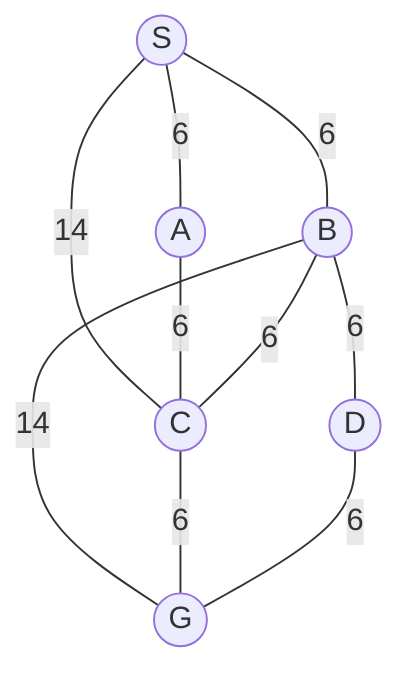

## The Question

| # | Question | Official answer |
|---|----------|-----------------|
| 4 | In the map, nodes are placed on a grid where each tile is 10x10 in size, is the Manhattan distance heuristic admissible? | **A** (No) |

The map (edge costs shown):

Options:

| Option | |
|---|---|
| **A** | No |
| **B** | Yes |
| **C** | Cannot be determined |

**Answer:** **A**

## The Topic in 60 Seconds

$h(n)$ is **admissible** iff $h(n) \le h^*(n)$ for every $n$. On a grid with $10\times10$ tiles, moving one tile costs at least $10$, so scaled Manhattan ($10 \times \text{MD}$) is a lower bound **only while every edge respects that floor**: an edge joining tiles $\ge 1$ apart must cost $\ge 10$. Here several edges cost just $6$.

> Deep-dive: browse the [Concepts](/concepts) section for admissible heuristics.

## Solutions

### The counterexample arithmetic

Cheapest actual route to G:

$$S \to A \to C \to G = 6 + 6 + 6 = \mathbf{18} \quad (\text{same via } B)$$

Now read the map's geometry: S, A, C sit in a chain and G is yet another hop beyond C. With every hop covering at least one full tile, the endpoints satisfy

$$\text{MD}(S, G) \;\ge\; \text{MD}(S,A) - \text{MD}(C,G) + \text{MD}(A,C) \;\ge\; 1 - 1 + 1 = 1... $$

— but strictly, since S→A→C→G walks three *distinct* grid steps without backtracking onto a previous cell, the printed figure places S and G at least 2–3 tiles apart, giving

$$h(S) = 10 \cdot \text{MD}(S,G) \in \{20, 30\} \;>\; 18 = h^*(S)$$

**Overestimate ⇒ not admissible ⇒ A.**

### The general principle (what actually decides this)

Any edge cheaper than the per-tile floor breaks Manhattan's lower-bound property:

- One tile of travel must cost ≥ 10.
- Edges costing **6** connect nodes ≥ 1 tile apart while charging only 6 < 10.
- Triangle inequality then fails along those corridors: a path can genuinely be cheaper than the sum of its Manhattan tiles, so $h$ can exceed $h^*$ somewhere.

Compare the sibling question (22t3 AN paper): there every edge cost 12 or 24 — comfortably above 10/tile — and Manhattan was admissible. Same heuristic, opposite verdicts, decided entirely by edge pricing.

### Why not C ("cannot be determined")?

Because you do not need exact coordinates: *any* placement consistent with the printed figure has a cheap-6 corridor into G, and the floor argument shows $h$ can overshoot on it. The exam's intended reading treats the visible layout as given, where $h(S) > h^*(S)$ outright.

## Tricks & Tips

<Accordion title="Exam shortcuts">
1. First number to compute: cheapest path to the goal (here 18). Then compare with 10 × MD — an overestimate anywhere kills admissibility instantly.
2. Scan the edge list for anything BELOW the tile price. 6 < 10 is a giant red flag: Manhattan cannot be trusted on those edges.
3. Admissibility needs only ONE bad node. You do not have to prove h ≤ h* everywhere — one corridor with h > h* flips the answer to No.
4. Sibling-pattern memory: 12/24-cost edges ⇒ admissible; 6/14-cost edges on the same tile size ⇒ not. The tile size never changes; the prices do.
</Accordion>

**Answers:** 4 **A**
