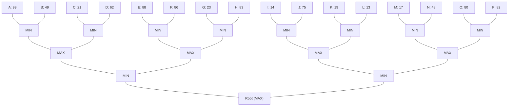

## The Question

The figure shows a 4-ply game tree with evaluation function values at the horizon. The nodes in the horizon are assigned labels A,B,C,...,P. Use these labels when asked to enter a horizon node or a list of horizon nodes.

**Tie-breaker**: when several nodes qualify then select the left most node, if tie persists then select the deepest node among the left most nodes.

Based on the above data, answer the given subquestions.

| # | Question | Official answer |
|---|----------|-----------------|
| 7.1 | Which of the following are strategies for MAX? | **A**, **B** |
| 7.2 | List the horizon nodes in the best strategy for MAX. Enter the nodes in the ascending order of node labels. | `A,B,E,F` |
| 7.3 | List the first five horizon nodes pruned by Alpha-Beta. | `D,G,H,J,L` |

## The Topic in 60 Seconds

| Ply | Nodes | Rule |
|---|---|---|
| 3 (horizon parents) | C1…C8 | MIN picks the smaller leaf |
| 2 | M1…M4 | MAX picks the larger MIN |
| 1 | N1, N2 | MIN picks the smaller MAX |
| 0 | R | MAX picks the larger MIN |

A **strategy** for MAX = one committed choice at *every* MAX node, covering all opponent replies — so its leaves may span siblings but never cross the root's two subtrees.

> Deep-dive: browse the [Concepts](/concepts) section for Minimax and Alpha-Beta.

## Step 0 — Full minimax backup (no pruning)

| Node | Children (values) | Backed-up value |
|---|---|---|
| C1 | A 99, B 49 | $\min = 49$ |
| C2 | C 21, D 62 | $\min = 21$ |
| C3 | E 88, F 86 | $\min = 86$ |
| C4 | G 23, H 83 | $\min = 23$ |
| C5 | I 14, J 75 | $\min = 14$ |
| C6 | K 19, L 13 | $\min = 13$ |
| C7 | M 17, N 48 | $\min = 17$ |
| C8 | O 80, P 82 | $\min = 80$ |
| M1 | C1, C2 | $\max(49,21) = 49$ |
| M2 | C3, C4 | $\max(86,23) = 86$ |
| M3 | C5, C6 | $\max(14,13) = 14$ |
| M4 | C7, C8 | $\max(17,80) = 80$ |
| N1 | M1, M2 | $\min(49,86) = 49$ |
| N2 | M3, M4 | $\min(14,80) = 14$ |
| **R** | N1, N2 | $\max(49,14) = \mathbf{49}$ |

## 7.1 — Strategies for MAX → **A, B**

A strategy fixes ONE move per MAX node (R, M1…M4) and must answer every opponent reply:

| Option | Leaves | Reads as | Verdict |
|---|---|---|---|
| **A** | C,D,E,F | R→N1 · M1→C2 · M2→C3 | **Valid** (value 21) |
| **B** | C,D,G,H | R→N1 · M1→C2 · M2→C4 | **Valid** (value 21) |
| C | A,C,I,J | spans C1/C2 under N1 **and** C5 under N2 → two different root moves | Not one strategy |
| D | B,D,J,L | B lives under N1 while J,L live under N2 | Not one strategy |

Options C and D mix leaves from **both** sides of the root — impossible after MAX commits to his first move.

## 7.2 — Best strategy's horizon nodes → `A,B,E,F`

The optimal play is worth **49** through the left subtree: R→N1. Opponent may then pick M1 or M2:

- vs M1: MAX answers C1 (49 beats C2's 21); opponent takes $\min(99,49) = 49$ → leaves **A, B**
- vs M2: MAX answers C3 (86 beats C4's 23); opponent takes $\min(88,86) = 86$ → leaves **E, F**

Union, ascending: **A,B,E,F** — exactly the leaves reachable when both sides play optimally inside MAX's best strategy.

## 7.3 — First five prunes → `D,G,H,J,L`

Alpha-Beta, left-to-right DFS with the window passed down:

| # | Event | Window logic | Pruned |
|---|---|---|---|
| 1 | C1 = min(99,49) = 49 | — | — |
| 2 | C2 sees C = 21 | $21 \le \alpha_{M1}=49$ → stop | **D** |
| 3 | M1 = 49 → N1 explores M2; C3 = min(88,86) = 86 | $86 \ge \beta_{M2}=49$ → MAX cutoff | **G, H** |
| 4 | N1 = min(49,86) = 49 → root α = 49 | — | — |
| 5 | C5 sees I = 14 | $14 \le \alpha=49$ → stop | **J** |
| 6 | C6 sees K = 19 | $19 \le 49$ → stop | **L** |
| 7 | M3 = 19 → N2 holds 19 | $19 \le \alpha_R=49$ → cutoff | O, P (sixth+) |

First five horizon prunes, in order: **D, G, H, J, L**.

## Interactive traces

### Minimax backup

<PaperTrace
  height={520}
  nodeWidth={92}
  nodeHeight={44}
  nodeFontSize={11}
  legend={[
    { color: "#b45309", label: "node being backed up" },
    { color: "#0369a1", label: "children known" },
    { color: "#4b5563", label: "evaluated" },
    { color: "#15803d", label: "principal variation" },
  ]}
  nodes={[
    { id: "R", label: "R (MAX)", x: 475, y: 30 },
    { id: "N1", label: "N1 (MIN)", x: 243, y: 130 },
    { id: "N2", label: "N2 (MIN)", x: 707, y: 130 },
    { id: "M1", label: "M1 (MAX)", x: 127, y: 230 },
    { id: "M2", label: "M2 (MAX)", x: 359, y: 230 },
    { id: "M3", label: "M3 (MAX)", x: 591, y: 230 },
    { id: "M4", label: "M4 (MAX)", x: 823, y: 230 },
    { id: "C1", label: "C1 (MIN)", x: 69, y: 330 },
    { id: "C2", label: "C2 (MIN)", x: 185, y: 330 },
    { id: "C3", label: "C3 (MIN)", x: 301, y: 330 },
    { id: "C4", label: "C4 (MIN)", x: 417, y: 330 },
    { id: "C5", label: "C5 (MIN)", x: 533, y: 330 },
    { id: "C6", label: "C6 (MIN)", x: 649, y: 330 },
    { id: "C7", label: "C7 (MIN)", x: 765, y: 330 },
    { id: "C8", label: "C8 (MIN)", x: 881, y: 330 },
    { id: "lA", label: "A 99", x: 40, y: 450 },
    { id: "lB", label: "B 49", x: 98, y: 450 },
    { id: "lC", label: "C 21", x: 156, y: 450 },
    { id: "lD", label: "D 62", x: 214, y: 450 },
    { id: "lE", label: "E 88", x: 272, y: 450 },
    { id: "lF", label: "F 86", x: 330, y: 450 },
    { id: "lG", label: "G 23", x: 388, y: 450 },
    { id: "lH", label: "H 83", x: 446, y: 450 },
    { id: "lI", label: "I 14", x: 504, y: 450 },
    { id: "lJ", label: "J 75", x: 562, y: 450 },
    { id: "lK", label: "K 19", x: 620, y: 450 },
    { id: "lL", label: "L 13", x: 678, y: 450 },
    { id: "lM", label: "M 17", x: 736, y: 450 },
    { id: "lN", label: "N 48", x: 794, y: 450 },
    { id: "lO", label: "O 80", x: 852, y: 450 },
    { id: "lP", label: "P 82", x: 910, y: 450 },
  ]}
  edges={[
    { id: "rN1", from: "R", to: "N1" }, { id: "rN2", from: "R", to: "N2" },
    { id: "n1a", from: "N1", to: "M1" }, { id: "n1b", from: "N1", to: "M2" },
    { id: "n2a", from: "N2", to: "M3" }, { id: "n2b", from: "N2", to: "M4" },
    { id: "m1a", from: "M1", to: "C1" }, { id: "m1b", from: "M1", to: "C2" },
    { id: "m2a", from: "M2", to: "C3" }, { id: "m2b", from: "M2", to: "C4" },
    { id: "m3a", from: "M3", to: "C5" }, { id: "m3b", from: "M3", to: "C6" },
    { id: "m4a", from: "M4", to: "C7" }, { id: "m4b", from: "M4", to: "C8" },
    { id: "c1a", from: "C1", to: "lA" }, { id: "c1b", from: "C1", to: "lB" },
    { id: "c2a", from: "C2", to: "lC" }, { id: "c2b", from: "C2", to: "lD" },
    { id: "c3a", from: "C3", to: "lE" }, { id: "c3b", from: "C3", to: "lF" },
    { id: "c4a", from: "C4", to: "lG" }, { id: "c4b", from: "C4", to: "lH" },
    { id: "c5a", from: "C5", to: "lI" }, { id: "c5b", from: "C5", to: "lJ" },
    { id: "c6a", from: "C6", to: "lK" }, { id: "c6b", from: "C6", to: "lL" },
    { id: "c7a", from: "C7", to: "lM" }, { id: "c7b", from: "C7", to: "lN" },
    { id: "c8a", from: "C8", to: "lO" }, { id: "c8b", from: "C8", to: "lP" },
  ]}
  steps={[
    {
      label: "Horizon",
      note: "Static evaluation of all 16 horizon leaves.\nBackup bottom-up, MIN rows first.",
      nodes: {}, edges: {},
    },
    {
      label: "C-row",
      note: "C1=min(99,49)=49  C2=min(21,62)=21\nC3=min(88,86)=86  C4=min(23,83)=23\nC5=min(14,75)=14  C6=min(19,13)=13\nC7=min(17,48)=17  C8=min(80,82)=80",
      nodes: {
        C1: "current", C2: "current", C3: "current", C4: "current",
        C5: "current", C6: "current", C7: "current", C8: "current",
        lA: "explored", lB: "explored", lC: "explored", lD: "explored",
        lE: "explored", lF: "explored", lG: "explored", lH: "explored",
        lI: "explored", lJ: "explored", lK: "explored", lL: "explored",
        lM: "explored", lN: "explored", lO: "explored", lP: "explored",
      }, edges: {},
    },
    {
      label: "M-row",
      note: "M1=max(49,21)=49   M2=max(86,23)=86\nM3=max(14,13)=14   M4=max(17,80)=80",
      nodes: {
        M1: "current", M2: "current", M3: "current", M4: "current",
        C1: "frontier", C2: "frontier", C3: "frontier", C4: "frontier",
        C5: "frontier", C6: "frontier", C7: "frontier", C8: "frontier",
      }, edges: {},
    },
    {
      label: "N + root",
      note: "N1=min(49,86)=49   N2=min(14,80)=14\nR = max(49,14) = 49\nPrincipal variation: R -> N1 -> M1 -> C1 -> B.",
      nodes: {
        R: "path", N1: "path", M1: "path", C1: "path", lB: "path",
        N2: "frontier", M2: "frontier", M3: "frontier", M4: "frontier",
        C2: "explored", C3: "explored", C4: "explored",
        C5: "explored", C6: "explored", C7: "explored", C8: "explored",
      }, edges: { rN1: "path", n1a: "path", m1a: "path", c1b: "path" },
    },
  ]}
/>

### Alpha-Beta with pruning

<PaperTrace
  height={520}
  nodeWidth={92}
  nodeHeight={44}
  nodeFontSize={11}
  legend={[
    { color: "#b45309", label: "currently evaluating" },
    { color: "#be123c", label: "pruned" },
    { color: "#15803d", label: "final value / PV" },
    { color: "#4b5563", label: "done" },
  ]}
  nodes={[
    { id: "R", label: "R (MAX)", x: 475, y: 30 },
    { id: "N1", label: "N1 (MIN)", x: 243, y: 130 },
    { id: "N2", label: "N2 (MIN)", x: 707, y: 130 },
    { id: "M1", label: "M1 (MAX)", x: 127, y: 230 },
    { id: "M2", label: "M2 (MAX)", x: 359, y: 230 },
    { id: "M3", label: "M3 (MAX)", x: 591, y: 230 },
    { id: "M4", label: "M4 (MAX)", x: 823, y: 230 },
    { id: "C1", label: "C1 (MIN)", x: 69, y: 330 },
    { id: "C2", label: "C2 (MIN)", x: 185, y: 330 },
    { id: "C3", label: "C3 (MIN)", x: 301, y: 330 },
    { id: "C4", label: "C4 (MIN)", x: 417, y: 330 },
    { id: "C5", label: "C5 (MIN)", x: 533, y: 330 },
    { id: "C6", label: "C6 (MIN)", x: 649, y: 330 },
    { id: "C7", label: "C7 (MIN)", x: 765, y: 330 },
    { id: "C8", label: "C8 (MIN)", x: 881, y: 330 },
    { id: "lA", label: "A 99", x: 40, y: 450 },
    { id: "lB", label: "B 49", x: 98, y: 450 },
    { id: "lC", label: "C 21", x: 156, y: 450 },
    { id: "lD", label: "D 62", x: 214, y: 450 },
    { id: "lE", label: "E 88", x: 272, y: 450 },
    { id: "lF", label: "F 86", x: 330, y: 450 },
    { id: "lG", label: "G 23", x: 388, y: 450 },
    { id: "lH", label: "H 83", x: 446, y: 450 },
    { id: "lI", label: "I 14", x: 504, y: 450 },
    { id: "lJ", label: "J 75", x: 562, y: 450 },
    { id: "lK", label: "K 19", x: 620, y: 450 },
    { id: "lL", label: "L 13", x: 678, y: 450 },
    { id: "lM", label: "M 17", x: 736, y: 450 },
    { id: "lN", label: "N 48", x: 794, y: 450 },
    { id: "lO", label: "O 80", x: 852, y: 450 },
    { id: "lP", label: "P 82", x: 910, y: 450 },
  ]}
  edges={[
    { id: "rN1", from: "R", to: "N1" }, { id: "rN2", from: "R", to: "N2" },
    { id: "n1a", from: "N1", to: "M1" }, { id: "n1b", from: "N1", to: "M2" },
    { id: "n2a", from: "N2", to: "M3" }, { id: "n2b", from: "N2", to: "M4" },
    { id: "m1a", from: "M1", to: "C1" }, { id: "m1b", from: "M1", to: "C2" },
    { id: "m2a", from: "M2", to: "C3" }, { id: "m2b", from: "M2", to: "C4" },
    { id: "m3a", from: "M3", to: "C5" }, { id: "m3b", from: "M3", to: "C6" },
    { id: "m4a", from: "M4", to: "C7" }, { id: "m4b", from: "M4", to: "C8" },
    { id: "c1a", from: "C1", to: "lA" }, { id: "c1b", from: "C1", to: "lB" },
    { id: "c2a", from: "C2", to: "lC" }, { id: "c2b", from: "C2", to: "lD" },
    { id: "c3a", from: "C3", to: "lE" }, { id: "c3b", from: "C3", to: "lF" },
    { id: "c4a", from: "C4", to: "lG" }, { id: "c4b", from: "C4", to: "lH" },
    { id: "c5a", from: "C5", to: "lI" }, { id: "c5b", from: "C5", to: "lJ" },
    { id: "c6a", from: "C6", to: "lK" }, { id: "c6b", from: "C6", to: "lL" },
    { id: "c7a", from: "C7", to: "lM" }, { id: "c7b", from: "C7", to: "lN" },
    { id: "c8a", from: "C8", to: "lO" }, { id: "c8b", from: "C8", to: "lP" },
  ]}
  steps={[
    {
      label: "C1 done",
      note: "Left-to-right DFS.\nC1: A=99, B=49 -> C1 = 49.",
      nodes: { C1: "current", lA: "explored", lB: "explored" }, edges: { c1a: "active", c1b: "active" },
    },
    {
      label: "Prune D",
      note: "C2 (MIN) with alpha=49 from M1:\nC=21 <= 49 -> cutoff. D never evaluated. PRUNE #1: D.",
      nodes: { C1: "explored", C2: "current", lC: "explored", lD: "pruned" }, edges: { c2b: "pruned" },
    },
    {
      label: "Prune G,H",
      note: "M1 = 49. N1 (beta=49) calls M2 (window -inf..49).\nC3 = min(88,86) = 86 >= 49 -> MAX cutoff at M2.\nC4 never opened. PRUNES #2,#3: G, H.",
      nodes: { C2: "explored", M1: "explored", C3: "current", C4: "pruned", lE: "explored", lF: "explored", lG: "pruned", lH: "pruned" }, edges: { c4a: "pruned", c4b: "pruned" },
    },
    {
      label: "Root alpha=49",
      note: "N1 = min(49, 86) = 49.\nRoot updates alpha = 49, explores N2 with it.\nEverything below must now beat 49 to matter.",
      nodes: { N1: "current", M2: "explored", C3: "explored" }, edges: { rN1: "active", n1b: "active" },
    },
    {
      label: "Prune J",
      note: "C5 (MIN) with alpha=49:\nI=14 <= 49 -> cutoff. J never evaluated. PRUNE #4: J.",
      nodes: { N2: "current", M3: "frontier", C5: "current", lI: "explored", lJ: "pruned" }, edges: { n2a: "active", c5b: "pruned" },
    },
    {
      label: "Prune L",
      note: "C6 (MIN) with alpha=49:\nK=19 <= 49 -> cutoff. L dies unseen. PRUNE #5: L.",
      nodes: { C5: "explored", C6: "current", lK: "explored", lL: "pruned" }, edges: { c6b: "pruned" },
    },
    {
      label: "Kill M4",
      note: "M3 = max(14,19) = 19.\nN2 holds 19 <= alpha 49 -> beta-cutoff:\nM4 (C7,C8,O,P) never opened. Prunes #6+: O,P,...\nFIRST FIVE = D, G, H, J, L.",
      nodes: { C6: "explored", M3: "explored", N2: "explored", M4: "pruned", C7: "pruned", C8: "pruned", lM: "pruned", lN: "pruned", lO: "pruned", lP: "pruned" }, edges: { n2b: "pruned", m4a: "pruned", m4b: "pruned" },
    },
    {
      label: "Result",
      note: "R = max(49, 19) = 49 - same answer as full minimax.\nPV: R -> N1 -> M1 -> C1 -> B.\nAlpha-beta proved it while skipping D,G,H,J,L,O,P(+).",
      nodes: { R: "path", N1: "path", M1: "path", C1: "path", lB: "path" }, edges: { rN1: "path", n1a: "path", m1a: "path", c1b: "path" },
    },
  ]}
/>

## Tricks & Tips

<Accordion title="Exam shortcuts">
1. Strategy check in one glance: do all listed leaves sit UNDER ONE child of the root? If they straddle both, it cannot be a strategy (options C/D here).
2. Backup values row by row, writing min/max alternately - the whole table takes 90 seconds and answers 7.1 AND 7.2.
3. Best-strategy leaves = follow the PV, then add, for each sibling MAX node under the same MIN, the leaves of ITS best reply: PV gives B; M2's best gives E,F; C1's other leaf A completes it.
4. Alpha-beta prune rule of thumb: MIN node cuts when a partial value drops to alpha; MAX node cuts when it rises to beta. Alpha here starts at 49 after the left subtree - that single number does all the killing.
5. Count prunes chronologically along the DFS, not by subtree size: exam asks for the FIRST five (here D, then the G/H pair, then J, then L).
</Accordion>

**Answers:** 7.1 **A, B** · 7.2 `A,B,E,F` · 7.3 `D,G,H,J,L`
