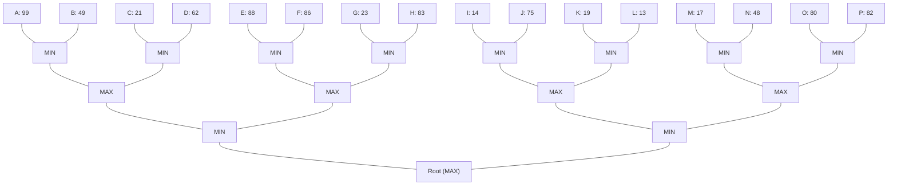

## The Question

The figure shows a 4-ply game tree with evaluation function values at the horizon. The nodes in the horizon are assigned labels A,B,C,...,P. Use these labels when asked to enter a horizon node or a list of horizon nodes.

**Tie-breaker**: when several nodes qualify then select the left most node, if tie persists then select the deepest node among the left most nodes.

Based on the above data, answer the given subquestions.

| # | Question | Official answer |
|---|----------|-----------------|
| 7.1 | Which of the following are strategies for MAX? | **A**, **B** |
| 7.2 | List the horizon nodes in the best strategy for MAX. Enter the nodes in the ascending order of node labels. | `A,B,E,F` |
| 7.3 | List the first five horizon nodes pruned by Alpha-Beta. | `D,G,H,J,L` |

## The Topic in 60 Seconds

> Deep-dive: browse the [Concepts](/concepts) section for the relevant topic page.

## Solutions

**7.1** — Which of the following are strategies for MAX?

Options:

| Option | |
|---|---|
| **A** | C,D,E,F |
| **B** | C,D,G,H |
| **C** | A,C,I,J |
| **D** | B,D,J,L |

**Answer:** **A**, **B**

**7.2** — List the horizon nodes in the best strategy for MAX. Enter the nodes in the ascending order of node labels.

**Answer:** `A,B,E,F`

**7.3** — List the first five horizon nodes pruned by Alpha-Beta.

**Answer:** `D,G,H,J,L`

## Tricks & Tips

<Accordion title="Exam method">
1. Read the question carefully — identify the algorithm or technique.
2. Trace step by step, showing your working.
3. Verify your answer against the question constraints.
</Accordion>
