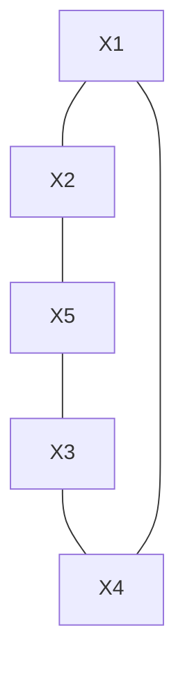

## The Question

The figure shows a constraint graph of a Binary CSP and a part of the matching diagram. When a pair of variables (like, X1 and X5) do not have a constraint in the constraint graph then assume a UNIVERSAL RELATION in the matching diagram.

Process the variables, and their values, in ALPHABETIC order.

Based on the above data, answer the given subquestions.

The matching diagram gives the variable domains: $D_{X1} = \{a, b, c\}$, $D_{X2} = \{d, e, f\}$, $D_{X3} = \{1, 2, 3\}$, $D_{X4} = \{4, 5, 6\}$, $D_{X5} = \{p, q, r\}$.

| # | Question | Official answer |
|---|----------|-----------------|
| 8.1 | The Forward-Checking algorithm begins by assigning X1=a. What are the NEXT four values assigned to variables by the Forward-Checking algorithm? List the valu... | `d,1,2,3` / `d,3,4,q` |
| 8.2 | What is the first solution found by the Forward-Checking algorithm? | `a,d,3,4,q` |

## The Topic in 60 Seconds

> Deep-dive: browse the [Concepts](/concepts) section for the relevant topic page.

## Solutions

**8.1** — The Forward-Checking algorithm begins by assigning X1=a. What are the NEXT four values assigned to variables by the Forward-Checking algorithm? List the values as a comma separated list in the order they are assigned.

**Answer:** `d,1,2,3` / `d,3,4,q`

**8.2** — What is the first solution found by the Forward-Checking algorithm?

**Answer:** `a,d,3,4,q`

## Tricks & Tips

<Accordion title="Exam method">
1. Read the question carefully — identify the algorithm or technique.
2. Trace step by step, showing your working.
3. Verify your answer against the question constraints.
</Accordion>
