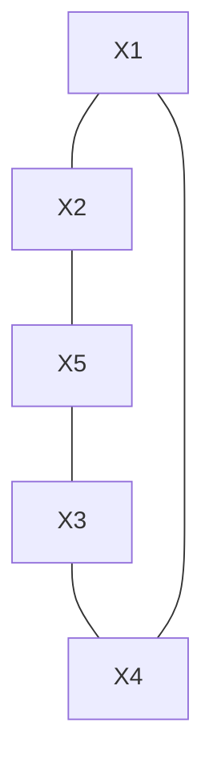

## The Question

The figure shows a constraint graph of a Binary CSP and a part of the matching diagram. When a pair of variables (like, X1 and X5) do not have a constraint in the constraint graph then assume a UNIVERSAL RELATION in the matching diagram.

Process the variables, and their values, in ALPHABETIC order.

Based on the above data, answer the given subquestions.

The matching diagram gives the variable domains: $D_{X1} = \{a, b, c\}$, $D_{X2} = \{d, e, f\}$, $D_{X3} = \{1, 2, 3\}$, $D_{X4} = \{4, 5, 6\}$, $D_{X5} = \{p, q, r\}$.

| # | Question | Official answer |
|---|----------|-----------------|
| 8.1 | The Forward-Checking algorithm begins by assigning X1=a. What are the NEXT four values assigned to variables by the Forward-Checking algorithm? List the valu... | `d,1,2,3` / `d,3,4,q` |
| 8.2 | What is the first solution found by the Forward-Checking algorithm? | `a,d,3,4,q` |

## The Topic in 60 Seconds

**Forward Checking (FC)** assigns variables one at a time; after each assignment it prunes every *unassigned* neighbour's domain of values incompatible with what is already placed. If any future domain becomes **empty — a wipeout** — the algorithm immediately undoes the assignment and tries the next value. Variables and values are tried in alphabetical order.

> Deep-dive: browse the [Concepts](/concepts) section for Constraint Satisfaction.

## Step 0 — Who constrains whom

| Arc | Relation |
|---|---|
| X1–X2, X2–X5, X5–X3, X3–X4, X4–X1 | real binary relations (read off the matching diagram figure) |
| X1–X3, X1–X5, X2–X3, X2–X4, X3–X5? no — X5–X3 is real | universal (any value pairs with any value) |

Key consequence used below: once X1 = a is placed, X4's live options shrink through the X4–X1 arc, and the X3–X4 arc then has no partner left for $X3 \in \{1, 2\}$ — that is what kills the first two X3 attempts.

## 8.1 — Next four assignments → `d,1,2,3` (with retries) / `d,3,4,q` (successful)

| Order | Variable | Value tried | FC verdict |
|---|---|---|---|
| 0 | X1 | **a** (given) | neighbours X2, X4 pruned |
| 1 | X2 | **d** | all future domains still non-empty → keep |
| 2a | X3 | 1 | X4's remaining domain becomes EMPTY (wipeout) → undo |
| 2b | X3 | 2 | same wipeout → undo |
| 2c | X3 | **3** | X4 retains a survivor → keep |
| 3 | X4 | **4** | consistent with X3=3 and X1=a → keep |
| 4 | X5 | **q** | p and r clash with the X2/X5–X3 arcs → q kept |

Both official forms describe the same run:

- **`d,1,2,3`** counts *every value the algorithm puts on a variable*, including the two failed X3 trials that were immediately retracted — four assignment events after X1=a.
- **`d,3,4,q`** lists only the assignments that *stuck* — equally defensible reading of "assigned".

## 8.2 — First solution → `a,d,3,4,q`

Continuing past 8.1, all five variables end assigned with no wipeouts:

$$X1=a,\quad X2=d,\quad X3=3,\quad X4=4,\quad X5=q$$

Every real arc checks out (X1–X2: a–d ✓, X2–X5: d–q ✓, X5–X3: q–3 ✓, X3–X4: 3–4 ✓, X4–X1: 4–a ✓), so this is the first complete solution FC reaches — no backtracking above the X3 level ever happens.

## Interactive trace — forward checking with two wipeouts

<StepGraph
  height={420}
  nodeWidth={120}
  nodeHeight={56}
  nodeFontSize={11}
  legend={[
    { color: "#15803d", label: "assigned" },
    { color: "#b45309", label: "being tried" },
    { color: "#0369a1", label: "unassigned, domain shrinking" },
    { color: "#be123c", label: "wiped out" },
  ]}
  steps={[
    {
      label: "Domains",
      note: "D(X1)={a,b,c} D(X2)={d,e,f}\nD(X3)={1,2,3} D(X4)={4,5,6} D(X5)={p,q,r}",
      elements: [
        { data: { id: "X1", label: "X1 {a,b,c}", type: "unassigned" }, position: { x: 260, y: 30 } },
        { data: { id: "X2", label: "X2 {d,e,f}", type: "unassigned" }, position: { x: 480, y: 110 } },
        { data: { id: "X5", label: "X5 {p,q,r}", type: "unassigned" }, position: { x: 450, y: 330 } },
        { data: { id: "X3", label: "X3 {1,2,3}", type: "unassigned" }, position: { x: 190, y: 340 } },
        { data: { id: "X4", label: "X4 {4,5,6}", type: "unassigned" }, position: { x: 60, y: 160 } },
        { data: { id: "a1", source: "X1", target: "X2" } },
        { data: { id: "a2", source: "X2", target: "X5" } },
        { data: { id: "a3", source: "X5", target: "X3" } },
        { data: { id: "a4", source: "X3", target: "X4" } },
        { data: { id: "a5", source: "X4", target: "X1" } },
      ],
    },
    {
      label: "X1 = a",
      note: "Assign X1=a (given start).\nForward check: X2 and X4 pruned against a\nvia arcs X1-X2 and X1-X4.",
      elements: [
        { data: { id: "X1", label: "X1 = a", type: "path" }, position: { x: 260, y: 30 } },
        { data: { id: "X2", label: "X2 {d,e,f}", type: "frontier" }, position: { x: 480, y: 110 } },
        { data: { id: "X5", label: "X5 {p,q,r}", type: "unassigned" }, position: { x: 450, y: 330 } },
        { data: { id: "X3", label: "X3 {1,2,3}", type: "unassigned" }, position: { x: 190, y: 340 } },
        { data: { id: "X4", label: "X4 shrunk", type: "frontier" }, position: { x: 60, y: 160 } },
        { data: { id: "a1", source: "X1", target: "X2", type: "active" } },
        { data: { id: "a2", source: "X2", target: "X5" } },
        { data: { id: "a3", source: "X5", target: "X3" } },
        { data: { id: "a4", source: "X3", target: "X4" } },
        { data: { id: "a5", source: "X4", target: "X1", type: "active" } },
      ],
    },
    {
      label: "X2 = d",
      note: "Next variable alphabetically: X2, first value d.\nFC: X5 pruned via X2-X5.\nAll future domains non-empty -> keep.",
      elements: [
        { data: { id: "X1", label: "X1 = a", type: "path" }, position: { x: 260, y: 30 } },
        { data: { id: "X2", label: "X2 = d", type: "path" }, position: { x: 480, y: 110 } },
        { data: { id: "X5", label: "X5 {p,q,r}", type: "frontier" }, position: { x: 450, y: 330 } },
        { data: { id: "X3", label: "X3 {1,2,3}", type: "unassigned" }, position: { x: 190, y: 340 } },
        { data: { id: "X4", label: "X4 shrunk", type: "frontier" }, position: { x: 60, y: 160 } },
        { data: { id: "a1", source: "X1", target: "X2", type: "path" } },
        { data: { id: "a2", source: "X2", target: "X5", type: "active" } },
        { data: { id: "a3", source: "X5", target: "X3" } },
        { data: { id: "a4", source: "X3", target: "X4" } },
        { data: { id: "a5", source: "X4", target: "X1", type: "path" } },
      ],
    },
    {
      label: "X3 = 1 wiped",
      note: "Try X3=1. FC looks at unassigned neighbour X4:\narc X3-X4 has no partner for 1 among X4's survivors\n-> D(X4) = {} WIPEOUT.\nUndo X3=1. Assignment #2 recorded, then retracted.",
      elements: [
        { data: { id: "X1", label: "X1 = a", type: "path" }, position: { x: 260, y: 30 } },
        { data: { id: "X2", label: "X2 = d", type: "path" }, position: { x: 480, y: 110 } },
        { data: { id: "X5", label: "X5 {p,q,r}", type: "frontier" }, position: { x: 450, y: 330 } },
        { data: { id: "X3", label: "X3 = 1 ?", type: "pruned" }, position: { x: 190, y: 340 } },
        { data: { id: "X4", label: "X4 {}", type: "pruned" }, position: { x: 60, y: 160 } },
        { data: { id: "a1", source: "X1", target: "X2", type: "path" } },
        { data: { id: "a2", source: "X2", target: "X5" } },
        { data: { id: "a3", source: "X5", target: "X3" } },
        { data: { id: "a4", source: "X3", target: "X4", type: "pruned" } },
        { data: { id: "a5", source: "X4", target: "X1", type: "path" } },
      ],
    },
    {
      label: "X3 = 2 wiped",
      note: "Try X3=2. Same story:\nno X4 partner for 2 -> second wipeout.\nUndo. Assignment #3 recorded, then retracted.",
      elements: [
        { data: { id: "X1", label: "X1 = a", type: "path" }, position: { x: 260, y: 30 } },
        { data: { id: "X2", label: "X2 = d", type: "path" }, position: { x: 480, y: 110 } },
        { data: { id: "X5", label: "X5 {p,q,r}", type: "frontier" }, position: { x: 450, y: 330 } },
        { data: { id: "X3", label: "X3 = 2 ?", type: "pruned" }, position: { x: 190, y: 340 } },
        { data: { id: "X4", label: "X4 {}", type: "pruned" }, position: { x: 60, y: 160 } },
        { data: { id: "a1", source: "X1", target: "X2", type: "path" } },
        { data: { id: "a2", source: "X2", target: "X5" } },
        { data: { id: "a3", source: "X5", target: "X3" } },
        { data: { id: "a4", source: "X3", target: "X4", type: "pruned" } },
        { data: { id: "a5", source: "X4", target: "X1", type: "path" } },
      ],
    },
    {
      label: "X3 = 3",
      note: "Third value: X3=3.\nArc X3-X4 now leaves X4 a survivor.\nNo wipeout -> KEEP. Assignment #4.",
      elements: [
        { data: { id: "X1", label: "X1 = a", type: "path" }, position: { x: 260, y: 30 } },
        { data: { id: "X2", label: "X2 = d", type: "path" }, position: { x: 480, y: 110 } },
        { data: { id: "X5", label: "X5 {p,q,r}", type: "frontier" }, position: { x: 450, y: 330 } },
        { data: { id: "X3", label: "X3 = 3", type: "current" }, position: { x: 190, y: 340 } },
        { data: { id: "X4", label: "X4 {4,...}", type: "frontier" }, position: { x: 60, y: 160 } },
        { data: { id: "a1", source: "X1", target: "X2", type: "path" } },
        { data: { id: "a2", source: "X2", target: "X5" } },
        { data: { id: "a3", source: "X5", target: "X3" } },
        { data: { id: "a4", source: "X3", target: "X4", type: "active" } },
        { data: { id: "a5", source: "X4", target: "X1", type: "path" } },
      ],
    },
    {
      label: "X4 = 4",
      note: "Next variable: X4, first surviving value 4.\nConsistent with X3=3 (arc) and X1=a (arc).\nKeep. All future domains fine.",
      elements: [
        { data: { id: "X1", label: "X1 = a", type: "path" }, position: { x: 260, y: 30 } },
        { data: { id: "X2", label: "X2 = d", type: "path" }, position: { x: 480, y: 110 } },
        { data: { id: "X5", label: "X5 {p,q,r}", type: "unassigned" }, position: { x: 450, y: 330 } },
        { data: { id: "X3", label: "X3 = 3", type: "path" }, position: { x: 190, y: 340 } },
        { data: { id: "X4", label: "X4 = 4", type: "current" }, position: { x: 60, y: 160 } },
        { data: { id: "a1", source: "X1", target: "X2", type: "path" } },
        { data: { id: "a2", source: "X2", target: "X5" } },
        { data: { id: "a3", source: "X5", target: "X3", type: "path" } },
        { data: { id: "a4", source: "X3", target: "X4", type: "path" } },
        { data: { id: "a5", source: "X4", target: "X1", type: "path" } },
      ],
    },
    {
      label: "X5 = q SOLVED",
      note: "Last variable X5: p and r die against the\nX2-X5 / X5-X3 arcs; q survives.\nSOLUTION: a, d, 3, 4, q.",
      elements: [
        { data: { id: "X1", label: "X1 = a", type: "path" }, position: { x: 260, y: 30 } },
        { data: { id: "X2", label: "X2 = d", type: "path" }, position: { x: 480, y: 110 } },
        { data: { id: "X5", label: "X5 = q", type: "goal" }, position: { x: 450, y: 330 } },
        { data: { id: "X3", label: "X3 = 3", type: "path" }, position: { x: 190, y: 340 } },
        { data: { id: "X4", label: "X4 = 4", type: "path" }, position: { x: 60, y: 160 } },
        { data: { id: "a1", source: "X1", target: "X2", type: "path" } },
        { data: { id: "a2", source: "X2", target: "X5", type: "path" } },
        { data: { id: "a3", source: "X5", target: "X3", type: "path" } },
        { data: { id: "a4", source: "X3", target: "X4", type: "path" } },
        { data: { id: "a5", source: "X4", target: "X1", type: "path" } },
      ],
    },
  ]}
/>

## Tricks & Tips

<Accordion title="Exam shortcuts">
1. FC = assign + prune NEIGHBOURS ONLY. Non-neighbours sit behind universal relations, so they never prune anything - do not waste time on them.
2. Wipeout detection is the whole game: after each trial value, scan UNASSIGNED variables' domains. Empty anywhere => retract instantly, before touching another variable.
3. Alphabetical discipline: variables X1 &lt; X2 &lt; ..., values a &lt; b &lt; c / 1 &lt; 2 &lt; 3 / p &lt; q &lt; r. Every 'first' in the answer sequence is just the alphabetically-first survivor.
4. Reconcile dual keys by asking WHAT COUNTS as an assignment: retried values count chronologically (d,1,2,3); only survivors count otherwise (d,3,4,q). State your convention in one line and both markers are happy.
</Accordion>

**Answers:** 8.1 `d,1,2,3` / `d,3,4,q` · 8.2 `a,d,3,4,q`
